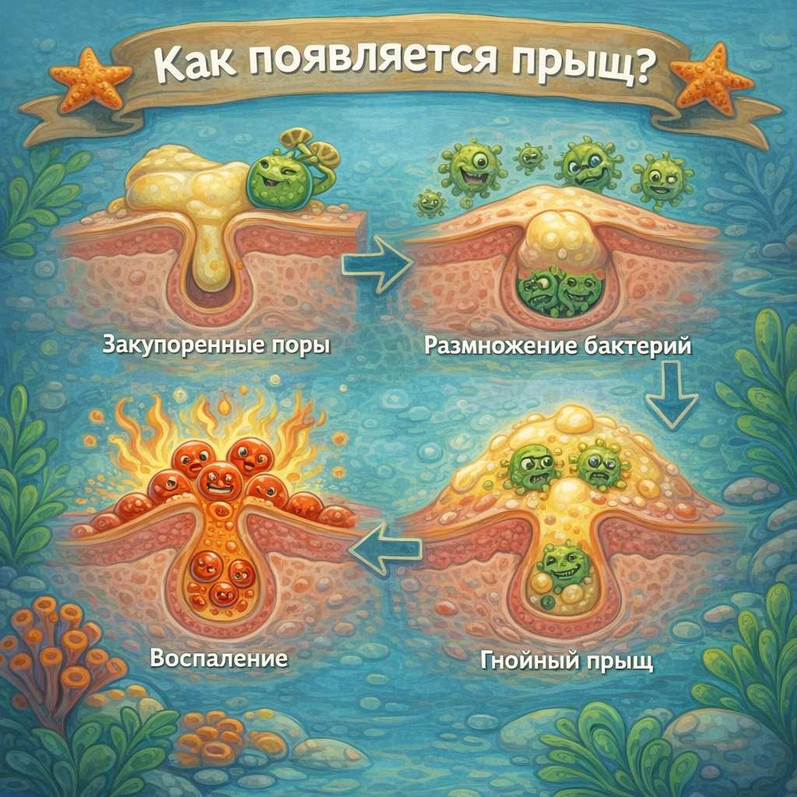

# [Прыщи и акне](./acne.md)

**ID:** `acne`  
**WikiData:** [Q79928](https://www.wikidata.org/wiki/Q79928)  
**Раздел:** 3.1. [Здоровый образ жизни](../../vrednye_privychki/articles/profilaktika.md)

> 💡 **Коротко:** Акне — это воспаление кожи из‑за того, что поры забиваются кожным салом и отмершими клетками, а [бактерии](../../../6.1_Independent_living_and_daily_living_skills/Simple_and_safe_cooking/articles/hand_hygiene.md) усиливают воспаление. Это очень распространено у подростков и лечится — главное делать всё безопасно.

---

## Введение
Если у тебя появились прыщи — ты не один. В 8–10 классе это встречается у большинства: [организм](../../../1.2_natural_sciences/neurobiology_for_teens/articles/03_nervous_system_map.md) перестраивается, гормоны заставляют **сальные железы** работать активнее, а кожа иногда не успевает «справляться» с таким режимом.

Важно понимать: **акне — не признак грязи** и не означает, что ты «плохо умываешься». Да, гигиена помогает, но [причина](../../../2.1_society/cause_and_effect_relationships/articles/causality_base.md) обычно глубже: сочетание жирности кожи, закупорки пор и воспаления. Разберёмся, как это работает и что реально помогает, а что — только ухудшает.

---

## Как это работает: почему появляются прыщи
На коже есть поры — это «выходы» волосяных фолликулов и сальных желез. Упрощённо [процесс](../../../5.1_technology_and_digital_literacy/operating system/articles/process.md) такой:

1. **Сальные железы выделяют кожное сало (себум)** — оно нужно, чтобы кожа не пересыхала.
2. **Клетки кожи обновляются** — отмершие клетки должны спокойно уходить.
3. Иногда **себум + отмершие клетки** образуют пробку в поре → появляется **комедон**:
   * **черные точки** — открытые комедоны (темнеет верхушка, это не «грязь», а [окисление](../../../1.2_natural_sciences/physics_in_everyday_life/Q629.md));
   * **белые бугорки** — закрытые комедоны.
4. Если внутри пробки активно размножаются бактерии и [иммунитет](../../../3.1. healthy lifestyle/Sleep, nutrition, and adolescent energy/articles/chronic_sleep_deprivation.md) реагирует, начинается **воспаление**:
   * красный болезненный прыщ (папула),
   * прыщ с «головкой» (пустула),
   * глубокие болезненные узлы (тяжелее и опаснее рубцами).

Что чаще всего усиливает акне:
* **гормональные изменения** ([подростковый возраст](../../../1.2_natural_sciences/neurobiology_for_teens/articles/05_teen_brain.md));
* **[стресс](../../../3.1. healthy lifestyle/Sleep, nutrition, and adolescent energy/articles/chronic_sleep_deprivation.md) и [недосып](../../../3.1. healthy lifestyle/Sleep, nutrition, and adolescent energy/articles/chronic_sleep_deprivation.md)** (да, реально влияет) — см. [сон](./sleep.md);
* **[трение](../../../1.2_natural_sciences/physics_in_everyday_life/Q11382.md) и пот** (маска, воротник, шлем, спортивная [форма](../../../7.1_art/modern_technological_art/articles/4.5_algorithmic_craft.md));
* **комедогенная косметика** (жирные тональные кремы/масла «забивают» поры);
* **[привычка](../../../7.2 Media, leisure and hobbies /useful_and_interesting_leisure/articles/how_not_to_quit_hobby.md) трогать лицо руками** — тут помогает [мытье рук](./handwashing.md).

 

## Что делать каждый день: базовый [план](../../../7.2 Media, leisure and hobbies/Computer games/articles/genres_and_worlds/strategy.md) (без фанатизма)
### 1) [Умывание](handwashing.md) 1–2 раза в день
* Утром и вечером — мягким средством (гель/пенка), без «скраба до скрипа».
* Очень частое умывание и спиртовые лосьоны могут пересушить кожу → она начнет выделять **ещё больше** сала.

См. также: [умывание лица](./facewash.md).

### 2) Увлажнение — да, даже если кожа жирная
Лёгкий крем/гель «non-comedogenic» (не забивает поры) помогает коже восстановить барьер. Когда кожа пересушена, воспаления часто становятся хуже.

### 3) Точечно и аккуратно: лечение, а не «выдавливание»
* Выдавливание повышает [риск](../../../1.2_natural_sciences/neurobiology_for_teens/articles/05_teen_brain.md) **рубцов**, **пятен** и занесения инфекции.
* Если очень хочется «снять» прыщ — лучше **гидроколлоидный [пластырь](../../../3.1_healthy_lifestyle/pervaya_pomoshch/ushibi_porezy_ozhogi/17_aptechka.md)** (прыщ-патч): защищает от рук и ускоряет заживление.

### 4) Смена наволочки и чистые вещи
Пот и жир остаются на ткани. Чистая наволочка — реальный лайфхак (см. [постельное белье](./bedding.md)). После спорта лучше принять [душ](./shower.md) и переодеться.

### 5) [Дезодорант](shower.md) — не на лицо
Иногда [подростки](../../../3.1. healthy lifestyle/Sleep, nutrition, and adolescent energy/articles/biology_of_night_owls_teens.md) пытаются «подсушить» прыщи чем попало. Не надо использовать на лице средства не для кожи лица (включая [дезодорант](./deodorant.md), антисептики и духи).

---

## Примеры из жизни школьника
1. **Физкультура + рюкзак**: [спина](../../../7.2 Media, leisure and hobbies/Computer games/articles/useful_tips/eyes_and_back.md) и плечи могут покрываться прыщами из-за пота и трения лямок. Помогает [душ](sleep.md) после [тренировки](../../../3.1. healthy lifestyle/Sleep, nutrition, and adolescent energy/articles/sport_and_energy.md) и чистая футболка.
2. **Контрольные и стресс**: перед важными днями высыпания часто усиливаются. Это не «магия» — стресс влияет на воспаление. Нормальный [сон](../../../3.1. healthy lifestyle/Sleep, nutrition, and adolescent energy/articles/evening_rituals_sleep_fast.md) и [режим](../../../4.1_rules_of_study/how_to_learn_effectively/articles/breaks_and_rest.md) иногда дают заметный эффект.
3. **Телефон и подбородок**: [экран](../../../3.1. healthy lifestyle/Sleep, nutrition, and adolescent energy/articles/gadgets_blue_light_sleep.md) собирает жир и бактерии. Если часто прижимаешь телефон к лицу — протирай его и старайся говорить через наушники.

---

## Частые [ошибки](../../../3.1_healthy_lifestyle/pervaya_pomoshch/ushibi_porezy_ozhogi/07_ushib_chego_nelzya.md) (которые делают хуже)
* **Скрабы с крупными частицами** и жесткие щетки: царапают воспаления.
* **[Спирт](../../vrednye_privychki/articles/alcohol.md)/перекись/йод на всё лицо**: пересушивают и раздражают.
* **Выдавливание**: повышает риск рубцов и «пятен после прыщей».
* **Слишком много средств сразу**: кожа раздражается, и ты не понимаешь, что именно помогает.
* **«Загар лечит акне»**: иногда кажется, что стало лучше (покраснение маскируется), но ультрафиолет может усилить воспаление и пятна. Лучше использовать [защиту от солнца](./sunscreen.md).

---

## Когда точно стоит идти к дерматологу
Обратись к [дерматологу](./dermatologist.md), если:
* прыщи **болезненные, глубокие**, появляются узлы;
* остаются **рубцы** или темные пятна;
* высыпания на груди/спине сильно мешают;
* стало заметно хуже за 1–2 месяца;
* есть ощущение, что «ничего не помогает» (и это нормально — [врач](../../../3.1_healthy_lifestyle/pervaya_pomoshch/ushibi_porezy_ozhogi/06_ushib_kogda_vrach.md) подберет схему).

Иногда для лечения нужны аптечные средства (например, ретиноиды/бензоилпероксид/азелаиновая [кислота](../../../1.1_structure_of_the_world/matter/articles/12_chemical_properties.md)) или рецептурные препараты — это должен подбирать специалист, чтобы было безопасно.

---

## Интересные [факты](../../../1.2_natural_sciences/physics_in_everyday_life/Q17737.md)
* **Черная точка — не грязь**: темный [цвет](../../../1.2_natural_sciences/physics_in_everyday_life/Q1075.md) появляется из-за окисления содержимого поры на воздухе.
* **Прыщи ≠ аллергия**: чаще это именно акне, а не «что-то съел не то».
* **[Вода](../../../3.1. healthy lifestyle/Sleep, nutrition, and adolescent energy/articles/drinking_regime.md) не “вылечит” акне**, но нормальный [водный баланс](./water.md) помогает коже и общему самочувствию.

---

## [Заключение](../../../1.2_natural_sciences/physics_in_everyday_life/Q2225.md)
[Прыщи и акне](./acne.md) — это обычная часть подросткового периода, и с этим можно справляться спокойно и грамотно. Твоя [цель](../../../1.2_natural_sciences/why_science_help_understand_world/research_work.md) — не «стереть кожу до идеала за ночь», а мягко уменьшить воспаление и не делать того, что оставляет следы на годы: не выдавливать, не сушить агрессивно и не лечиться случайными советами.

Если высыпания мешают жить — это не повод стесняться, это повод обратиться к дерматологу и подобрать план.

---

*[Автор](../../../4.2_thinking_and_working_information/how_to_search_information/articles/copypaste.md): Королев Иван • Сгенерировано с помощью [ChatGPT](../../../7.1_art/modern_technological_art/articles/6.1_prompt_art.md) 5-2 • Слов: 694 • 2026-03-10*