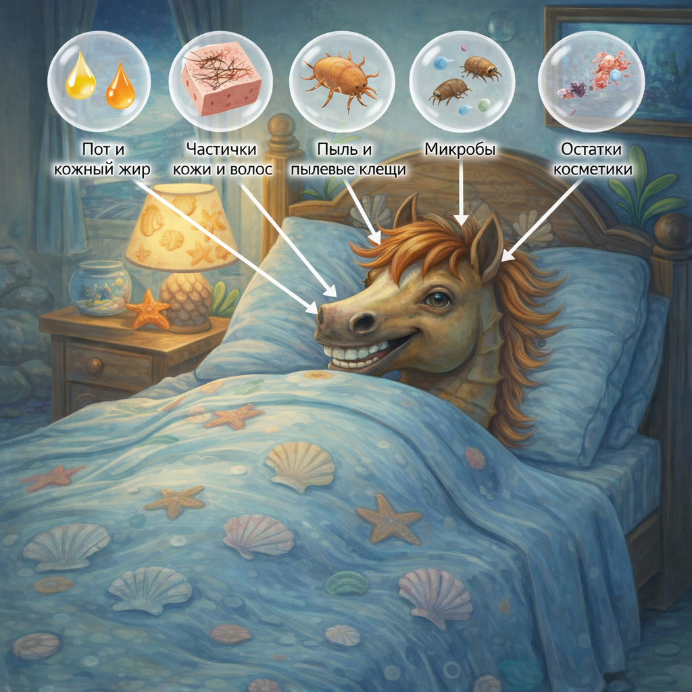

# [Постельное белье](./bedding.md)

**ID:** `bedding`  
**WikiData:** [Q1762457](https://www.wikidata.org/wiki/Q1762457)  
**Раздел:** 3.1. [Здоровый образ жизни](../../vrednye_privychki/articles/profilaktika.md)

> 💡 **Коротко:** Чистая наволочка и простыня — это меньше бактерий и пыли, спокойнее [сон](../../../3.1. healthy lifestyle/Sleep, nutrition, and adolescent energy/articles/evening_rituals_sleep_fast.md) и заметно меньше раздражений кожи (особенно на лице).

---

## Введение
Ты проводишь в кровати примерно треть жизни. И всё это [время](../../../1.2_natural_sciences/physics_in_everyday_life/Q20702.md) твоя кожа, волосы и [дыхание](../../../1.2_natural_sciences/physics_in_everyday_life/Q163214.md) «контактируют» с тканью: ты потеешь, на кожу выделяется немного жира, остаются частички крема или укладочных средств, а ещё скапливается пыль. Поэтому [постельное белье](./bedding.md) — это не просто «чтобы было красиво», а важная часть гигиены.

Особенно это важно в подростковом возрасте: кожа может быть чувствительнее, чаще появляются [прыщи и акне](./acne.md), а [недосып](../../../3.1. healthy lifestyle/Sleep, nutrition, and adolescent energy/articles/chronic_sleep_deprivation.md) моментально отражается на самочувствии и учёбе (см. [сон](./sleep.md)).

---

## Как это работает: что накапливается в постели
За несколько дней даже чистая на вид постель постепенно «собирает» на себе:

* **пот и кожный жир** — особенно на наволочке и в зоне плеч;
* **частички кожи и волос** — это нормально, кожа обновляется постоянно;
* **пыль и пылевые клещи** (они не кусают, но могут усиливать аллергию);
* **микробы** ([бактерии](../../../6.1_Independent_living_and_daily_living_skills/Simple_and_safe_cooking/articles/hand_hygiene.md) и грибки) — их становится больше во влажной и тёплой среде;
* **остатки косметики** (кремы, SPF, тон, средства для волос).

Чем это может мешать:
* коже лица — больше раздражений и воспалений (особенно если ты спишь «лицом в подушку»);
* дыханию — пыль может провоцировать насморк/чихание у чувствительных людей;
* качеству сна — на грязной постели чаще жарко, неприятно и сложнее расслабиться.

 

## Как часто менять: простые [правила](../../../2.1_society/cause_and_effect_relationships/articles/why_rules_work.md)
Ориентиры (для обычной ситуации):
* **Наволочка**: раз в **3–7 дней** (если есть акне — лучше ближе к 3).
* **Простыня и пододеяльник**: раз в **7–14 дней**.
* **После болезни** (простуда, ангина): **сразу** поменяй белье, а также личное [полотенце](./towel.md).
* **Если сильно потеешь / [спорт](../../../3.1. healthy lifestyle/Sleep, nutrition, and adolescent energy/articles/sport_and_energy.md) вечером / жарко**: меняй чаще.

Важно: если ты ложишься [спать](../../../4.1_rules_of_study/how_to_memorize/articles/son.md) без душа после [тренировки](../../../3.1. healthy lifestyle/Sleep, nutrition, and adolescent energy/articles/sport_and_energy.md) — белье «загрязняется» быстрее. Лучше принять [душ](./shower.md) и надеть чистую домашнюю одежду.

---

## Как стирать правильно (без лишней сложности)
1. **Смотри ярлычок** на ткани ([температура](../../../1.1_structure_of_the_world/matter/articles/07_gases.md) и [режим](../../../4.1_rules_of_study/how_to_learn_effectively/articles/breaks_and_rest.md)).
2. Часто подходит:
   * [хлопок](../../../7.1_art/musical_instruments/articles/castanets.md)/сатин — **40–60°[C](../../../2.1_society/how_and_where_find_friends/articles/sora_drug.md)** (60°C лучше, если нужно «посильнее» против микробов);
   * деликатные ткани — **30–40°C**.
3. **Порошок/гель** — обычный, без необходимости лить «пол-колпачка лишнего» (остатки средства могут раздражать кожу).
4. **Сушка**: полностью высушивай белье. Влажная ткань — рай для неприятного запаха.
5. **Глажка** (по желанию): полезна, если кожа очень чувствительная или хочется дополнительной «аккуратности», но не обязательна всегда.

---

## Лайфхаки для школьника
1. **Два комплекта белья**: пока один в стирке — второй уже готов. Это делает смену белья легкой, а не «событием века».
2. **[Правило](../../../1.2_natural_sciences/why_science_help_understand_world/patterns.md) воскресенья**: выбери один день недели, когда ты меняешь постель — как [привычка](../../../7.2 Media, leisure and hobbies /useful_and_interesting_leisure/articles/how_not_to_quit_hobby.md).
3. **Чистая наволочка = чистое лицо**: если есть [прыщи](./acne.md), начни с наволочки. Это один из самых дешевых и рабочих шагов.
4. **Не ешь в кровати**: крошки — это не только неприятно, но и грязь + запах.
5. **Пижама тоже считается**: если спишь в той же футболке, в которой ходил дома весь день, белье пачкается быстрее.

---

## Частые [вопросы](../../../4.1_rules_of_study/how_to_learn_effectively/articles/curiosity.md)
### «Если постель выглядит чистой, зачем менять?»
Большая часть того, что накапливается, **не видна**: жир, пот, микрочастицы кожи и пыль.

### «Можно просто проветривать и не стирать?»
Проветривание полезно, но оно не убирает жир и не смывает загрязнения. Это как с [чисткой зубов](./toothbrush.md): свежий [воздух](../../../1.2_natural_sciences/physics_in_everyday_life/Q487005.md) не заменяет щетку.

### «От постели реально бывают прыщи?»
Постель не «создаёт» акне из ничего, но грязная наволочка может **усиливать воспаления** и раздражение кожи, особенно если ты спишь лицом на подушке.

---

## Интересные [факты](../../../1.2_natural_sciences/physics_in_everyday_life/Q17737.md)
* За ночь [человек](../../../1.2_natural_sciences/physics_in_everyday_life/Q45003.md) может потерять заметное количество влаги через кожу и дыхание — поэтому утром постель часто чуть влажнее, даже если ты этого не чувствуешь.
* Натуральные ткани (хлопок) обычно лучше «дышат», а значит спать комфортнее и меньше потеешь.
* Хороший сон + чистая постель = проще соблюдать режим и легче вставать (см. [сон](./sleep.md)).

---

## [Заключение](../../../1.2_natural_sciences/physics_in_everyday_life/Q2225.md)
[Постельное белье](./bedding.md) — это твоя «[база](../../../1.2_natural_sciences/physics_in_everyday_life/Q5339.md)» для отдыха. Чистая наволочка помогает коже, чистая простыня — телу, а чистый пододеяльник — комфорту и сну. Начни с простого: меняй наволочку раз в неделю (или чаще при акне), а комплект — раз в 1–2 недели. Это маленькая привычка, которая заметно улучшает самочувствие.

---

*[Автор](../../../4.2_thinking_and_working_information/how_to_search_information/articles/copypaste.md): Королев Иван • Сгенерировано с помощью [ChatGPT](../../../7.1_art/modern_technological_art/articles/6.1_prompt_art.md) 5-2 • Слов: 623 • 2026-03-10*