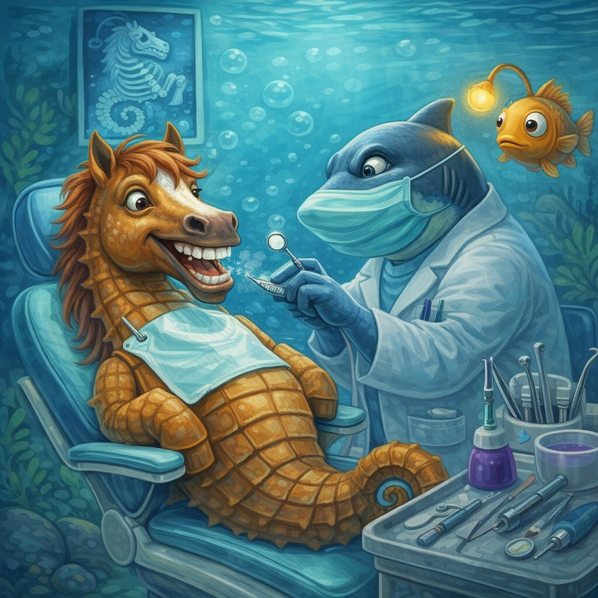

# [Стоматолог](./dentist.md)

**ID:** `dentist`  
**WikiData:** [Q27349](https://www.wikidata.org/wiki/Q27349)
**Раздел:** 3.1. [Здоровый образ жизни](../../vrednye_privychki/articles/profilaktika.md)

> 💡 **Коротко:** [Стоматолог](toothbrush.md) — это не "злой дядька со сверлом", а твой главный союзник в борьбе за здоровые зубы. Если ходить к нему регулярно (раз в полгода), можно вообще забыть о зубной боли и сложном лечении.

---

## Введение
Многие боятся стоматологов с детства. Эти страхи тянутся из прошлого, когда лечили без нормальной анестезии, бормашины были страшными, а сидеть в кресле приходилось часами. Сейчас всё иначе.

Современная стоматология — это почти всегда безболезненно, быстро и с заботой о твоих нервах. А главное: визиты к стоматологу нужны не только когда "прижало", а для того, чтобы зубная [боль](../../../1.2_natural_sciences/neurobiology_for_teens/articles/16_love_chemistry.md) вообще никогда не появлялась.

В подростковом возрасте зубы и дёсны переживают серьёзные изменения: меняется прикус, могут резаться зубы мудрости, гормоны влияют на состояние дёсен. Поэтому [дружба](../../../1.2_natural_sciences/neurobiology_for_teens/articles/17_hugs_oxytocin.md) со стоматологом сейчас — это инвестиция в красивую улыбку на всю [жизнь](../../../1.2_natural_sciences/physics_in_everyday_life/Q1751973.md).

---

## Как это работает: зачем ходить к стоматологу

### Два типа визитов
Есть огромная разница между тем, чтобы прийти к стоматологу, когда уже болит, и приходить просто провериться.

| [Тип](../../../5.2_cybersecurity/cpp_fundamentals/13_struct.md) визита | Когда идти | Что будет | Сколько стоит/длится |
|------------|------------|-----------|----------------------|
| **Профилактический** | Каждые 6 месяцев | Осмотр, чистка, [советы](../../../7.2 Media, leisure and hobbies /useful_and_interesting_leisure/articles/mistakes_in_choosing_hobby.md) | 20–30 минут, недорого или бесплатно (по страховке/в школе) |
| **Лечебный** | Когда уже болит или есть проблема | Лечение, пломбы, удаление | Может быть долго и дорого |

### Что делает стоматолог на профилактике
1. **Осматривает зубы** — ищет ранний кариес (тёмные точки, которые ты сам можешь не заметить).
2. **Проверяет дёсны** — нет ли воспаления, кровоточивости.
3. **Делает профессиональную чистку** — снимает зубной камень и налёт в местах, куда щётка не достаёт.
4. **Оценивает прикус** — не нужны ли брекеты или пластинки.
5. **Рассказывает, как правильно чистить зубы** — да, даже взрослым это бывает полезно.

 

---

## Основные причины идти к стоматологу (помимо боли)

### 1. Кровоточивость дёсен
Если при чистке зубов ты видишь кровь — это не норма. Это признак воспаления дёсен (гингивита). Если не лечить, может перейти в пародонтит — тогда зубы начнут расшатываться.

### 2. Чувствительность
Когда зубы реагируют на холодное, горячее, [сладкое](../../../1.2_natural_sciences/neurobiology_for_teens/articles/10_sweet_tooth.md) — это может быть:
* истончение эмали,
* кариес,
* оголение шейки зуба.
Стоматолог найдёт причину и скажет, что делать.

### 3. Неприятный запах изо рта
Если ты регулярно чистишь зубы, пользуешься [зубной нитью](./floss.md), а запах остаётся — возможно, проблема в зубах или дёснах (кариес, налёт, воспаление). Стоматолог поможет это проверить.

### 4. Изменение [цвета](../../../1.2_natural_sciences/physics_in_everyday_life/Q11652.md) зубов
Если зуб потемнел — это может быть признак проблем внутри зуба (пульпит, отмирание нерва). Нужно лечить, пока не начался абсцесс.

### 5. Травма
Ударился зубом, откололся кусочек — даже если не больно, надо показать стоматологу. Трещины могут быть не видны глазу, но потом приведут к потере зуба.

### 6. Подготовка к брекетам
Если врач-ортодонт (он занимается прикусом) сказал, что нужны брекеты, сначала надо вылечить все зубы у обычного стоматолога.

---

## Как проходит лечение (чтобы не бояться)

### [Шаг](../../../1.2_natural_sciences/physics_in_everyday_life/Q36253.md) 1: Анестезия
Сейчас почти любое лечение делают с обезболиванием. Тебе сделают укол в десну — это неприятно, но терпимо (чуть щиплет). Через пару минут зуб и всё вокруг "заморозится" — ты ничего не будешь чувствовать, кроме вибрации и прикосновений.

**Важно:** если во [время](../../../1.2_natural_sciences/physics_in_everyday_life/Q20702.md) лечения тебе больно — сразу скажи врачу. Он добавит анестезию или подождёт, пока подействует. Терпеть боль [нельзя](../../../3.1_healthy_lifestyle/pervaya_pomoshch/ushibi_porezy_ozhogi/07_ushib_chego_nelzya.md) и не нужно.

### Шаг 2: Удаление повреждённых тканей
[Врач](../../../3.1_healthy_lifestyle/pervaya_pomoshch/ushibi_porezy_ozhogi/06_ushib_kogda_vrach.md) убирает всё, что испорчено кариесом, специальной бормашиной. Это не больно, но может быть непривычно ([звук](../../../1.2_natural_sciences/physics_in_everyday_life/Q124003.md), [вибрация](../../../7.2 Media, leisure and hobbies/Computer games/articles/technologies_inside/management_history.md)).

### Шаг 3: Чистка и [обработка](../../../3.1_healthy_lifestyle/pervaya_pomoshch/ushibi_porezy_ozhogi/09_pervaya_pomoshch_pri_poreze.md)
Полость очищают, обрабатывают антисептиком, просушивают.

### Шаг 4: Пломба
Врач ставит пломбу — специальный [материал](../../../1.2_natural_sciences/physics_in_everyday_life/Q25358.md), который засвечивают лампой (он твердеет). Потом подгоняют по форме, чтобы зуб не мешал прикусу.

### Шаг 5: Полировка
Пломбу шлифуют, чтобы она была гладкой и не царапала [язык](../../../5.2_cybersecurity/cpp_fundamentals/1_introduction.md) или щёку.

Всё. Если кариес был глубокий и затронул нерв, лечение может быть сложнее (удаление нерва, чистка каналов), но принцип тот же — под анестезией и без боли.

---

## Примеры из жизни школьника

### 1. [Профилактика](../../../3.1_healthy_lifestyle/pervaya_pomoshch/ushibi_porezy_ozhogi/18_mify_i_7_pravil.md) перед летом
Перед каникулами (особенно если едешь в лагерь или к бабушке в деревню) хорошо бы проверить зубы. Потому что если зуб разболится в поездке — найти хорошего стоматолога будет сложно, а терпеть боль — ещё сложнее.

### 2. Спортивная травма
Если ты занимаешься контактным спортом (бокс, борьба, хоккей) — стоит обсудить со стоматологом защитную капу. Она спасёт зубы от выбивания при ударе.

### 3. Брекеты в 13–14 лет
Многим в этом возрасте ставят брекеты. Это:
* сначала неудобно,
* надо тщательнее чистить зубы,
* чаще ходить к стоматологу для коррекции.
Но [результат](../../../1.2_natural_sciences/why_science_help_understand_world/experimental_science.md) (ровные зубы) остаётся на всю жизнь.

### 4. "А вдруг больно будет?"
Самый частый [страх](../../../1.2_natural_sciences/neurobiology_for_teens/articles/14_amygdala_fear.md). Современные стоматологи это понимают. Можно договориться:
* прийти просто познакомиться, посидеть в кресле,
* попросить врача комментировать всё, что он делает,
* договориться о сигнале (поднять руку), если станет больно или страшно.

---

## Частые [вопросы](../../../4.1_rules_of_study/how_to_learn_effectively/articles/curiosity.md) и [мифы](../../../1.2_natural_sciences/physics_in_everyday_life/Q140028.md)

### «Если зубы не болят, к стоматологу можно не ходить?»
Можно, но рискованно. Кариес на ранней стадии **не болит**. Он болит, когда уже глубоко и нужно сложное лечение. Приходить раз в полгода — дешевле и проще, чем лечить запущенный кариес.

### «Чистить зубы достаточно, чтобы не было проблем?»
Нет. Щётка не достаёт в межзубные промежутки, не убирает зубной камень (он твёрдый, как цемент). Только стоматолог может полностью очистить зубы и увидеть проблемы на ранней стадии.

### «Можно ли лечить зубы без бормашины?»
На ранних стадиях кариеса — да, есть [методы](../../../4.1_rules_of_study/how_to_learn_effectively/articles/note_taking.md): обработка специальными составами, лазером, озонирование. Но если кариес уже проник глубоко, без бормашины не обойтись.

### «А если я очень боюсь?»
Скажи об этом врачу. Есть специальные методы для тревожных пациентов:
* седация (лёгкий "сонный" [газ](../../../1.1_structure_of_the_world/matter/articles/07_gases.md), ты в сознании, но расслаблен),
* общий наркоз (лечат, пока ты спишь — но это серьёзнее и дороже),
* просто бережный подход и паузы по твоей просьбе.

### «Почему стоматолог отправляет на снимок?»
Чтобы увидеть то, что не видно глазом:
* кариес между зубами,
* состояние корней и нервов,
* зачатки зубов мудрости,
* кисты и воспаления.

Современные снимки (визиограф) дают очень маленькую дозу облучения — безопасно.

---

## Как подготовиться к визиту

1. **Записаться заранее** — лучше утром, когда ты ещё не [устал](../../../4.1_rules_of_study/how_to_memorize/articles/ustalost.md).
2. **Почистить зубы** перед походом (это вежливость по отношению к врачу).
3. **Взять сменную обувь** или бахилы (в некоторых клиниках выдают на месте).
4. **Составить [список](../../../5.2_cybersecurity/cpp_fundamentals/10_arrays.md) вопросов**, которые хочешь задать (например, "почему у меня кровоточат дёсны?" или "нужно ли мне удалять зубы мудрости?").
5. **Поесть за 2 часа до визита** (после лечения с анестезией есть нельзя, пока не пройдёт заморозка — можно прикусить щёку и не почувствовать).

---

## Интересные [факты](../../../1.2_natural_sciences/physics_in_everyday_life/Q17737.md)

* **Самый древний стоматолог** жил 9000 лет назад в Пакистане — археологи нашли зубы с идеально просверленными дырочками.
* **Зубная эмаль** — самая твёрдая ткань в организме человека, твёрже кости.
* **Щётку придумали в Китае** в 1498 году — щетину брали из шеи свиньи и крепили к бамбуковой палочке.
* **Сладкое само по себе не вызывает кариес**. Кариес вызывают [бактерии](../../../6.1_Independent_living_and_daily_living_skills/Simple_and_safe_cooking/articles/hand_hygiene.md), которые питаются сахаром и выделяют кислоту, разрушающую эмаль. Если чистить зубы после сладкого — риска меньше.
* **Улыбка заразительна**, но кариес — нет. Хотя бактерии, вызывающие кариес, могут передаваться через поцелуй или общую посуду.

---

## [Связь](../../../1.2_natural_sciences/physics_in_everyday_life/Q12969754.md) с другими правилами гигиены

[Здоровье](../../../3.1. healthy lifestyle/Sleep, nutrition, and adolescent energy/articles/chronic_sleep_deprivation.md) зубов зависит от целого комплекса привычек:
* [Чистка зубов](./toothbrush.md) два раза в день — основа основ.
* [Зубная нить](./floss.md) — удаляет налёт между зубами, куда щётка не достаёт.
* Правильное [питание](../../../3.1. healthy lifestyle/Sleep, nutrition, and adolescent energy/articles/breakfast_for_the_brain.md) — меньше сахара, больше твёрдой пищи (яблоки, морковка).
* [Водный баланс](./water.md) — [вода](../../../3.1. healthy lifestyle/Sleep, nutrition, and adolescent energy/articles/drinking_regime.md) смывает остатки еды и поддерживает нормальную слюну (она защищает зубы).
* [Отказ](../../../2.1_society/how_and_where_find_friends/articles/otkaz_ne_konets.md) от курения (если куришь) — оно убивает дёсны и портит зубы.
* [Защита](../../../5.1_technology_and_digital_literacy/how_internet_works/articles/dns/cdn.md) зубов во время спорта — капа, если нужно.

---

## [Заключение](../../../1.2_natural_sciences/physics_in_everyday_life/Q2225.md)
[Стоматолог](./dentist.md) — это не [враг](../../../7.2 Media, leisure and hobbies/Computer games/articles/heroes_and_villains/main_villains.md), а друг твоих зубов. Регулярные визиты (раз в полгода) позволяют:
* избежать зубной боли,
* сохранить зубы здоровыми и красивыми,
* сэкономить кучу [денег](../../../8.2_future/choosing_a_career_path/articles/salary.md) и времени на сложном лечении,
* избавиться от страха перед стоматологами (чем чаще ходишь, тем меньше боишься).

Самые важные [правила](../../../2.1_society/cause_and_effect_relationships/articles/why_rules_work.md):
1. Ходи к стоматологу раз в 6 месяцев, даже если ничего не болит.
2. Не терпи боль — если зуб дал о себе знать, иди сразу.
3. Чисти зубы правильно и пользуйся [нитью](./floss.md).
4. Не бойся задавать вопросы врачу и говорить о своих страхах.

Здоровая улыбка — это красиво, и она того стоит.

---

*[Автор](../../../4.2_thinking_and_working_information/how_to_search_information/articles/copypaste.md): Рожков Иван • Сгенерировано с помощью [ChatGPT](../../../7.1_art/modern_technological_art/articles/6.1_prompt_art.md) 5-2 • Слов: 780 • 2026-03-10*