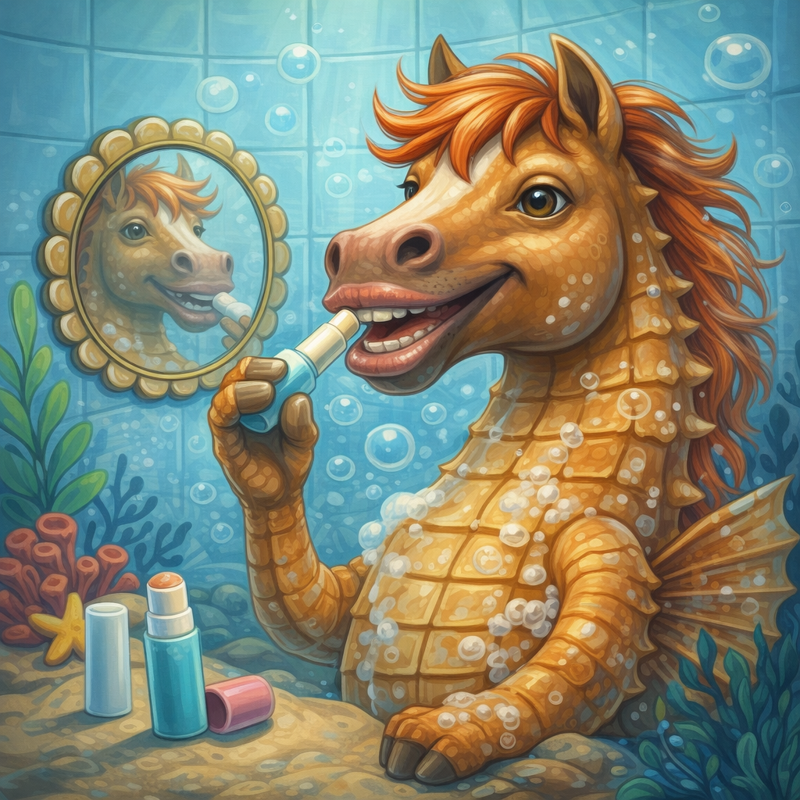
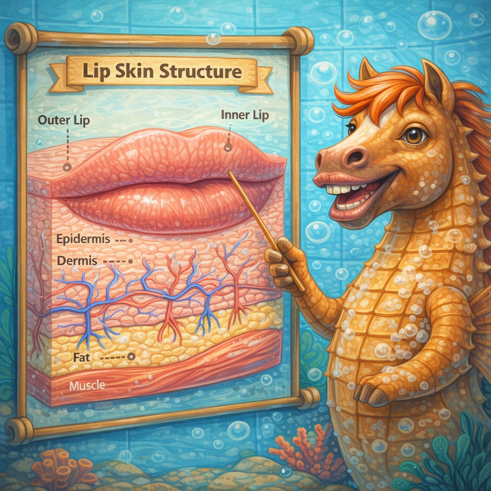

# [Уход за губами](./lip_care.md)

**ID:** `lip_care`  
**WikiData:** [Q15173](https://www.wikidata.org/wiki/Q15173)  
**Раздел:** 3.1. Здоровый образ жизни

> 💡 **Коротко:** Здоровые губы — это не «волшебный бальзам», а простые привычки: не облизывать, не обкусывать, вовремя увлажнять и защищать от мороза и солнца, чтобы кожа губ не трескалась и не болела.

## Введение

Губы — одно из самых заметных мест на лице: когда они потрескавшиеся, покрыты корочками или шелушатся, это сразу бросается в глаза и мешает нормально разговаривать, есть и просто чувствовать себя комфортно. В 8 классе многие впервые сталкиваются с тем, что губы начинают **сохнуть сильнее**, чем раньше: зимой — от мороза и ветра, летом — от солнца, а круглый год — от привычки их облизывать или покусывать.

[Уход за губами](./lip_care.md) — это несколько понятных правил, которые занимают минуту в день, но избавляют от болезненных трещин и неопрятного вида.

---

## Как это работает: почему губы сохнут быстрее всего

Кожа губ принципиально отличается от кожи на остальном лице:

* **Нет сальных желёз** — губы не могут сами себя «смазать» кожным жиром, как это делает кожа лба или носа.
* **Очень тонкий роговой слой** (верхний защитный слой кожи) — поэтому влага испаряется быстрее.
* **Нет меланина** (или почти нет) — губы практически не защищены от ультрафиолета.
* **Много нервных окончаний** — поэтому трещины на губах так ощутимо болят.

Что сушит и повреждает губы:

* **облизывание** — слюна испаряется и уносит с собой ещё больше влаги (замкнутый круг);
* **покусывание и сдирание корочек** — микротравмы → воспаление → ещё больше корочек;
* **мороз + ветер** — холодный воздух вытягивает влагу из незащищённой кожи;
* **солнце** — ультрафиолет повреждает тонкую кожу (да, губы тоже «обгорают»);
* **дыхание ртом** — постоянный поток воздуха сушит (особенно ночью при заложенном носе);
* **острая/кислая еда** — раздражает и без того чувствительную кожу, если на ней уже есть микротрещины.

 

## База ухода: что делать регулярно

### 1) Увлажняющий бальзам для губ — главный инструмент

Правило простое: **наноси бальзам, когда чувствуешь сухость, а не когда губы уже потрескались**.

* Выбирай бальзам без отдушек, ментола и камфоры (они могут ещё больше сушить).
* Хорошие компоненты в составе: пчелиный воск, масло ши, вазелин, пантенол, витамин E.
* Формат — стик, тюбик или баночка — не важен; важно, чтобы он был **с собой** (в кармане куртки, в рюкзаке).

Миф: «Бальзам вызывает привыкание — губы перестают увлажняться сами».  
На самом деле губы **никогда** не увлажнялись сами (у них нет сальных желёз). Бальзам просто компенсирует то, чего природа не предусмотрела.

### 2) Не облизывай и не кусай

Это самая частая причина хронической сухости губ у подростков. Облизывание кажется «увлажнением», но работает наоборот:

1. Слюна на секунду смачивает кожу.
2. Испаряясь, она забирает влагу из верхнего слоя.
3. Губы сохнут сильнее → хочется облизать снова.

Если это привычка на автомате — помогает нанести бальзам: губы перестают ощущаться сухими, и рефлекс облизывания срабатывает реже.

### 3) Защита от погоды

* **Зимой** перед выходом на улицу — слой бальзама (желательно с воском: он создаёт барьер от ветра). Можно прикрывать губы шарфом/баффом, но следи, чтобы ткань не была постоянно влажной от дыхания.
* **Летом** — бальзам с SPF 15–30 (да, такой существует). Губы обгорают на солнце так же, как нос или плечи, просто это менее очевидно.

### 4) Питьевой режим

Когда организму не хватает воды, губы сохнут одними из первых (потому что у них нет собственной защиты). Достаточное количество [воды](./water.md) в течение дня — базовое условие.

---

## Если губы уже потрескались: план действий

### Лёгкое шелушение

* Нанеси толстый слой бальзама или вазелина.
* **Не сдирай** кожу — она отойдёт сама, когда под ней сформируется новый слой.
* Можно мягко убрать шелушение влажным полотенцем (без усилия) и сразу нанести бальзам.

### Трещины и корочки

* Нанеси на ночь толстый слой вазелина или заживляющей мази с пантенолом — за 7–8 часов сна кожа восстановится быстрее.
* Не ешь очень солёное, кислое и острое, пока трещины не заживут (лимон, чипсы, кетчуп — всё это будет щипать и замедлять заживление).
* Если трещина глубокая и кровит — промой чистой водой и нанеси заживляющее средство (пантенол, Бепантен).

### Когда к врачу

* Трещины не заживают дольше 2 недель.
* Появились «заеды» — болезненные трещинки в уголках рта (могут быть от грибка, бактерий или нехватки витаминов группы B).
* Губы отекли, покрылись пузырьками или сильно покраснели — это может быть аллергия или герпес (к [дерматологу](./dermatologist.md) или терапевту).

---

## Примеры из жизни школьника

1. **Зимняя дорога в школу**: 15–20 минут на морозе без бальзама — и к первому уроку губы уже стянуты и шелушатся. Спасает привычка наносить бальзам **до** выхода из дома, а не после того, как губы «заболели».

2. **Подготовка к контрольной / стресс**: многие начинают покусывать губы, когда нервничают — это классический стресс-жест. Если заметил за собой — положи бальзам рядом с тетрадкой; нанесёшь его — и кусать станет менее «интересно».

3. **Занятия спортом на улице**: физкультура осенью/зимой + дыхание через рот = сухие губы к концу урока. Помогает стик-бальзам в кармане спортивной куртки.

4. **Каникулы на море / в горах**: солнце + ветер + солёная вода — тройной удар. Бальзам с SPF наносится так же, как [солнцезащитный крем](./sunscreen.md) — каждые 2 часа и после купания.

---

## Частые ошибки

* **Облизывать губы «для увлажнения»** — самый популярный и самый вредный рефлекс.
* **Сдирать корочки и шелушения** — открываешь рану → заживление начинается заново.
* **Использовать бальзам с ментолом/камфорой постоянно** — разовое ощущение «свежести» обманчиво, при частом применении эти компоненты сушат.
* **Наносить на потрескавшиеся губы матовую помаду или стойкий блеск** — стойкие формулы часто содержат спирт и подсушивающие компоненты; сначала вылечи трещины.
* **Терпеть сухость, потому что «бальзам — это не для парней»** — бальзам для губ — это гигиеническое средство, такое же, как зубная паста или мыло. Пол не имеет значения.
* **Использовать чужой бальзам или гигиеническую помаду** — через слизистую губ легко передаются инфекции (в т.ч. герпес). Бальзам — **личная** вещь.

---

## Выбор бальзама: простая шпаргалка

| Что искать в составе | Что лучше избегать |
|---|---|
| Вазелин (петролатум) | Ментол, камфора (при постоянном использовании) |
| Пчелиный воск | Фенол |
| Масло ши / какао / жожоба | Ароматизаторы (если кожа чувствительная) |
| Пантенол (провитамин B5) | Салициловая кислота (сушит) |
| Витамин E | Спирт (alcohol denat.) |
| SPF-фильтры (для лета/гор) | — |

Не обязательно покупать дорогой бальзам. Обычный вазелин или аптечное средство с пантенолом работает не хуже «люксовых» стиков.

---

## Интересные факты

* Кожа губ обновляется быстрее, чем кожа на остальном лице: полный цикл — около **3–5 дней** (на лице — около 28). Поэтому трещины заживают относительно быстро, если им не мешать.
* Привычка облизывать губы в медицине имеет название — **эксфолиативный хейлит от облизывания** (lip-licking dermatitis). Выглядит как красный «контур» вокруг губ.
* Красный цвет губ — это просвечивающие капилляры через тонкую кожу. Именно поэтому на холоде губы синеют раньше всего: сосуды сужаются.
* Достаточное количество витаминов группы B (из мяса, яиц, круп, зелёных овощей) помогает предотвратить заеды в уголках рта.

---

## Связанные привычки

* [Питьевой режим](./water.md) — обезвоживание = сухие губы.
* [Защита от солнца](./sunscreen.md) — губы обгорают не хуже носа.
* [Здоровый сон](./sleep.md) — ночь с толстым слоем бальзама = утро без трещин.

---

## Заключение

[Уход за губами](./lip_care.md) — это не про «красоту из рекламы», а про элементарный комфорт: не больно есть, разговаривать и выходить на мороз. Всё, что нужно — бальзам без агрессивных добавок, привычка не облизывать и не сдирать корочки, и защита от погоды. Если трещины или заеды не проходят больше двух недель — это не «ерунда», а повод спокойно сходить к дерматологу и решить проблему за несколько дней.

---

*Автор: Тремель Дмитрий • Сгенерировано с помощью Claude Opus 4.6 • Слов: 1 087 • 2026-03-11*