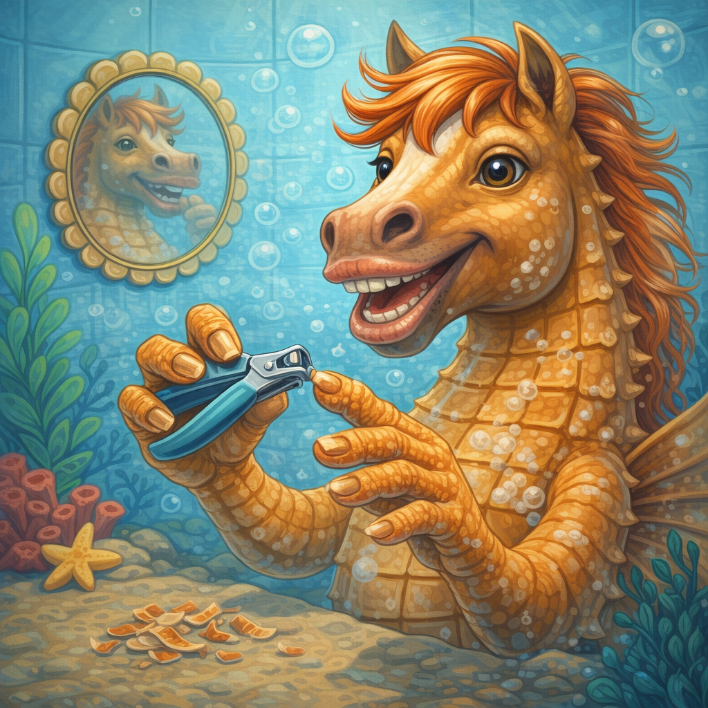
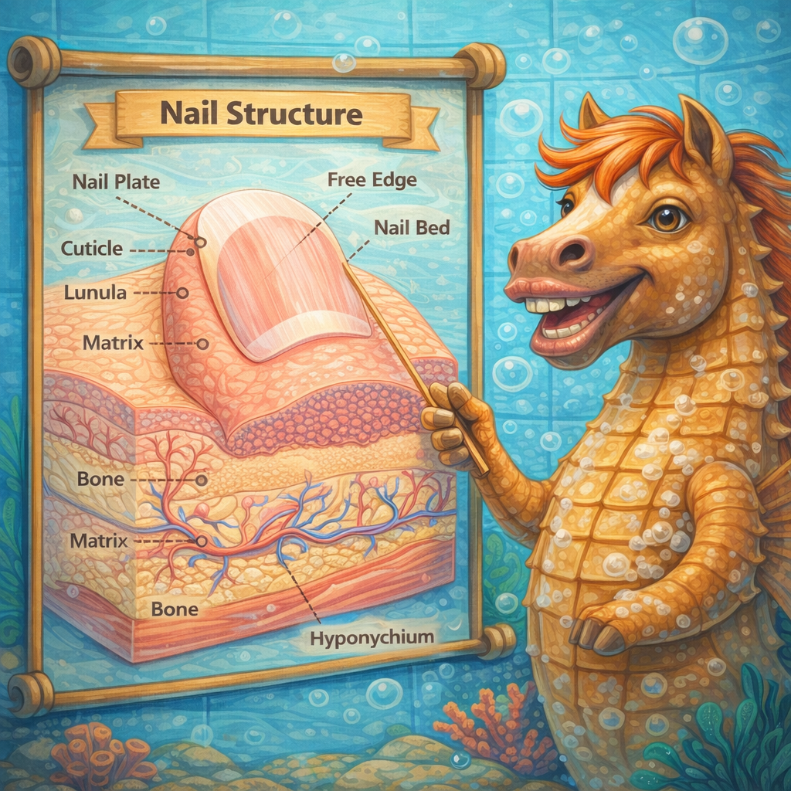

# [Стрижка ногтей](./nails.md)

**ID:** `nails`  
**WikiData:** [Q3778909](https://www.wikidata.org/wiki/Q3778909)  
**Раздел:** 3.1. Здоровый образ жизни

> 💡 **Коротко:** Аккуратные ногти — это не маникюрный салон, а регулярная стрижка раз в 1–2 недели, чистота под ногтями и привычка не грызть их, чтобы руки выглядели опрятно и не было заусенцев и вросших ногтей.

---

## Введение

Ногти — мелочь, которую замечают чаще, чем кажется: грязные, обгрызенные или слишком длинные ногти сразу бросаются в глаза при рукопожатии, на уроке, в столовой. В 8 классе многие либо вообще забывают про ногти, либо грызут их на автомате — и то, и другое приводит к неопрятному виду и мелким проблемам со здоровьем.

[Стрижка ногтей](./nails.md) — это простая привычка на 5 минут раз в неделю-две, которая решает сразу несколько задач: руки выглядят чисто, под ногтями не скапливается грязь, а пальцы не болят от заусенцев.

---

## Как это работает: что такое ноготь

Ноготь — это пластина из **кератина** (того же белка, из которого состоят волосы). Он растёт из **матрикса** — зоны под кутикулой у основания ногтя.

Что полезно знать:

* **Ногти на руках** растут примерно на **3–4 мм в месяц** (на ногах — медленнее, ~1–2 мм).
* Под свободным краем ногтя легко скапливаются **грязь, бактерии и остатки еды**.
* **Кутикула** (тонкая кожица у основания) защищает матрикс от инфекций — её не нужно срезать «под ноль».
* **Заусенцы** — надрывы кожи вокруг ногтя от сухости или привычки грызть.

Что портит ногти:

* **обгрызание** — неровный край, микротравмы, бактерии изо рта;
* **слишком короткая стрижка** — оголяется ногтевое ложе, палец болит;
* **грязные инструменты** — могут переносить грибок;
* **стрижка «под углом» на ногах** — причина вросшего ногтя.

 

---

## База ухода: что делать регулярно

### 1) Как часто стричь

Правило простое: **стриги, когда свободный край выступает на 1–2 мм за кончик пальца**.

* На руках — **раз в 7–10 дней**.
* На ногах — **раз в 2–3 недели**.
* Если занимаешься спортом — стриги чаще: длинные ногти ломаются и царапают других.

### 2) Чем стричь

| Инструмент | Для чего | Важно |
|---|---|---|
| Маникюрные ножницы | Ногти на руках | Должны быть острыми |
| Кусачки (книпсер) | Руки и ноги | Удобнее для толстых ногтей |
| Пилка | Подравнивание | Пили в одном направлении |

Инструменты — **личные**, как [зубная щётка](./toothbrush.md). Не давай свои ножницы другим — риск передачи грибка.

### 3) Техника: руки

1. **Лучшее время** — после [душа](./shower.md): ногти мягче, стригутся ровнее.
2. Стриги **по форме пальца** — слегка закруглённо.
3. Не срезай слишком коротко — оставь тонкую белую полоску (~1 мм).
4. **Подпили** острые углы — чтобы ноготь не цеплялся и не ломался.
5. Заусенец **срежь ножницами** у основания, не отрывай.

### 4) Техника: ноги

> ⚠️ Ногти на ногах стриги **прямо**, не закругляя углы — иначе ноготь может врасти в кожу.

1. После душа — ногти мягче.
2. Стриги **по прямой линии**.
3. Углы слегка подпили, но **не срезай** глубоко.
4. Длина — вровень с кончиком пальца.

### 5) Чистота под ногтями

* Мой руки с мылом — основной способ очистки (см. [мытьё рук](./handwashing.md)).
* Если грязь набилась глубоко — используй щёточку или деревянную палочку.
* Короткие ногти = меньше грязи.

---

## Привычка грызть ногти: как перестать

**Онихофагия** — одна из самых частых нервных привычек. Это не слабость, а автоматический жест при стрессе или скуке.

### Почему это вредно

* Неровный край — неопрятно.
* Микротравмы → заусенцы → воспаление.
* Бактерии из-под ногтей попадают в рот и обратно.
* Портится эмаль зубов.

### Что помогает

* **Коротко стриги** — нечего будет грызть.
* **Нанеси крем на руки** — ухоженные пальцы жалко портить.
* **Замени жест**: сжимай антистресс-мяч, крути ручку.
* **Отслеживай триггеры**: контрольная? скука?
* **Горький лак** из аптеки — безопасен, но отбивает желание.

---

## Проблемы: когда к врачу

### Вросший ноготь

Край врастает в кожу (обычно на большом пальце ноги) → боль, покраснение, отёк.

* **Причина**: стрижка «под углом», тесная обувь.
* **Начальная стадия**: тёплые ванночки, подложить ватку под край, носить свободную обувь.
* **Если гной или сильная боль** — к хирургу.

### Панариций (воспаление пальца)

Кожа вокруг ногтя красная, опухшая, пульсирует.

* Часто начинается с оторванного заусенца.
* **Лёгкая стадия**: антисептик + пластырь.
* **Если за 2 дня хуже** — к врачу. Не вскрывай сам.

### Грибок ногтей

Ноготь желтеет, утолщается, крошится.

* Лечится долго — нужен [дерматолог](./dermatologist.md).
* Профилактика: личные инструменты, сухие ноги, сменная обувь в бассейне.

### Белые пятна

* Обычно это микротравма — не опасно, отрастёт само.
* Миф про «нехватку кальция» не подтверждён.

---

## Примеры из жизни школьника

1. **Урок труда**: после мастерской под ногтями — стружка, масло. Короткие ногти = достаточно вымыть руки с мылом.

2. **Физкультура**: длинные ногти + бутсы = боль. На руках — ломаются при игре в баскетбол.

3. **Перед контрольной**: стресс → грызёшь ногти. Если они уже короткие — грызть нечего.

4. **Важное событие**: собеседование, выступление — чистые ногти выглядят аккуратно.

---

## Частые ошибки

* **Грызть вместо стрижки** — неровный край, инфекции.
* **Стричь «до мяса»** — больно и легко инфицируется.
* **Закруглять углы на ногах** — путь к вросшему ногтю.
* **Отрывать заусенцы** — срезай ножницами.
* **Стричь сухие ногти** — трескаются; лучше после воды.
* **Чужие ножницы** — передача грибка.

---

## Минимальный набор

| Что | Зачем | Уход |
|---|---|---|
| Ножницы / кусачки | Стрижка | Протирать антисептиком |
| Пилка | Подравнивание | Мыть с мылом |
| Щёточка | Чистка под ногтями | Промывать, сушить |

---

## Интересные факты

* Ногти на ведущей руке растут **быстрее** — больше кровообращения.
* Потерянный ноготь отрастает за **4–6 месяцев** на руке, **9–12** на ноге.
* Летом ногти растут **быстрее**, чем зимой.
* Под ногтями **в 10 раз больше бактерий**, чем на остальном пальце.

---

## Связанные привычки

* [Мытьё рук](./handwashing.md) — чистые руки + короткие ногти = минимум бактерий.
* [Душ](./shower.md) — лучшее время для стрижки.
* [Чистая обувь](./shoes.md) — профилактика грибка на ногах.
* [Чистые носки](./socks.md) — сухие ноги = здоровые ногти.

---

## Заключение

[Стрижка ногтей](./nails.md) — это 5 минут раз в неделю, которые избавляют от грязи под ногтями, заусенцев и вросших ногтей. Стриги после воды, не слишком коротко, на ногах — прямо, не грызи и пользуйся только **своими** инструментами. Если палец воспалился или ноготь врос — это повод обратиться к врачу.

---

*Автор: Тремель Дмитрий • Сгенерировано с помощью Claude Opus 4.6 • Слов: 987 • 2026-03-11*