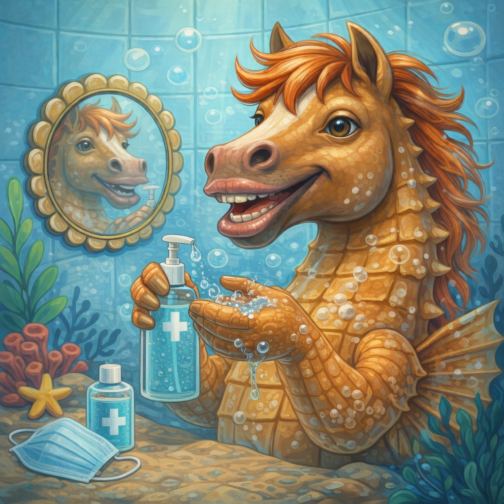

# [Антисептик для рук](./sanitizer.md)

**ID:** `sanitizer`  
**WikiData:** [Q520181](https://www.wikidata.org/wiki/Q520181)  
**Раздел:** 3.1. Здоровый образ жизни

> 💡 **Коротко:** Антисептик — это «план Б», когда нет воды и мыла. Он убивает большинство микробов за 20–30 секунд, но не заменяет полноценное мытьё рук и не работает на грязных или мокрых руках.

---

## Введение

В школе не всегда есть возможность вымыть руки: перемена короткая, в туалете очередь, а до столовой — две минуты. Именно для таких ситуаций существует антисептик (санитайзер) — гель, спрей или жидкость, которые быстро дезинфицируют кожу без воды.

Но антисептик — не магия. Он не справляется с видимой грязью, не работает, если руки мокрые, и может сушить кожу при постоянном использовании. [Антисептик для рук](./sanitizer.md) — это полезный инструмент, если знать, когда и как его применять.

---

## Как это работает

Большинство антисептиков содержат **спирт** (этиловый или изопропиловый) в концентрации **60–80%**. Спирт разрушает оболочки бактерий и вирусов, убивая их за секунды.

Что происходит:

1. Спирт проникает в клетку микроба.
2. Разрушает белки и мембрану.
3. Микроб погибает.
4. Спирт испаряется — руки сухие.

Почему важна концентрация:

* **Меньше 60%** — недостаточно эффективно.
* **60–80%** — оптимально.
* **Больше 80%** — спирт испаряется слишком быстро, не успевая подействовать.

Антисептик **не работает**:

* на **грязных** руках (грязь «прячет» микробов);
* на **мокрых** руках (вода разбавляет спирт);
* против **спор бактерий** (например, возбудителя ботулизма);
* против **норовируса** и некоторых кишечных инфекций (тут только мыло).

 

---

## Когда использовать

### Антисептик помогает

* В транспорте — после поручней и кнопок.
* Перед едой, если нет возможности помыть руки.
* После чихания/кашля в ладонь.
* После контакта с деньгами, дверными ручками.
* В поездке, походе, на экскурсии.

### Лучше вымыть руки

* Руки **видимо грязные** (земля, еда, краска).
* После туалета — мыло эффективнее.
* После работы с сырым мясом, яйцами.
* При контакте с больным кишечной инфекцией.

Связка: антисептик **дополняет** [мытьё рук](./handwashing.md), но не заменяет его.

---

## Как правильно использовать

1. **Руки должны быть сухими** — вытри, если мокрые.
2. Выдави **достаточно средства** — чтобы покрыть всю поверхность (обычно 2–3 мл, размер монеты).
3. Разотри по **всей поверхности**:
   * ладони,
   * тыльная сторона,
   * между пальцами,
   * кончики пальцев и ногти,
   * большие пальцы.
4. Три **20–30 секунд**, пока не высохнет.
5. **Не вытирай** — пусть испарится само.

### Частые ошибки

* Нанести каплю и решить, что готово.
* Вытереть салфеткой, не дождавшись высыхания.
* Использовать на грязных руках и думать, что они чистые.
* Наносить на мокрые руки.

---

## Как выбрать антисептик

| На что смотреть | Хорошо | Плохо |
|---|---|---|
| Содержание спирта | 60–80% | Меньше 60% или не указано |
| Форма | Гель, спрей, жидкость — на выбор | — |
| Объём | Маленький флакон (50–100 мл) удобен для рюкзака | Слишком большой неудобно носить |
| Добавки | Глицерин, алоэ (увлажнение) | Много отдушек (могут раздражать) |

**Антисептики без спирта** (на основе хлоргексидина, бензалкония) — работают, но медленнее и против меньшего спектра микробов. Для школы лучше спиртовой.

---

## Уход за кожей при частом использовании

Спирт сушит кожу. Если пользуешься антисептиком несколько раз в день:

* Выбирай средства **с увлажняющими добавками** (глицерин, пантенол, алоэ).
* Вечером наноси **увлажняющий крем** для рук.
* Если кожа трескается и краснеет — снизь частоту, вернись к мылу где возможно.

Связка с [уходом за кожей рук](./handwashing.md): чередуй мытьё и антисептик, чтобы кожа не пересыхала.

---

## Примеры из жизни школьника

1. **Столовая**: перемена 10 минут, в туалете очередь. Антисептик в кармане — обработал руки за 30 секунд перед едой.

2. **Общественный транспорт**: держался за поручень — протёр руки санитайзером, не дожидаясь дома.

3. **Контрольная**: потрогал общую ручку двери, потом лицо. Антисептик снижает риск занести инфекцию.

4. **Поход / экскурсия**: воды мало, мыла нет. Антисептик — единственный вариант.

5. **После урока физкультуры**: руки потные, но не грязные — антисептик подойдёт. Если грязные — только мыло.

---

## Частые ошибки

* **«Антисептик = чистые руки»** — нет, он убивает микробов, но не удаляет грязь.
* **Экономить и наносить мало** — не покроешь всю поверхность, часть микробов выживет.
* **Вытирать, не дожидаясь высыхания** — спирт не успевает подействовать.
* **Антисептик с блёстками/странным составом** — может не содержать достаточно спирта; это скорее игрушка.
* **Хранить на солнце или у батареи** — спирт может испаряться, эффективность падает.

---

## Интересные факты

* Современные антисептики стали массово популярны после эпидемии гриппа H1N1 (2009) и особенно после пандемии COVID-19 (2020).
* Спирт убивает **99,9% бактерий** за 30 секунд — но эти 0,1% могут выживать, поэтому мытьё рук всё равно нужно.
* Антисептик **горюч** — не используй рядом с открытым огнём и не давай детям играть.
* В больницах используют антисептики на основе **хлоргексидина** — он действует дольше, но для бытового использования спирт практичнее.

---

## Связанные привычки

* [Мытьё рук](./handwashing.md) — основной метод, антисептик дополняет.
* [Стрижка ногтей](./nails.md) — короткие ногти легче обработать антисептиком.
* [Уход за кожей лица](./facewash.md) — грязные руки → грязное лицо → [акне](./acne.md).
* [Душ](./shower.md) — полноценная гигиена тела.

---

## Заключение

[Антисептик для рук](./sanitizer.md) — удобный инструмент для быстрой дезинфекции, когда нет доступа к воде и мылу. Чтобы он работал: выбирай средство с 60–80% спирта, наноси на сухие руки, три 20–30 секунд и не вытирай. Но помни — это «план Б». Грязные руки, туалет, сырое мясо — только мыло. Антисептик помогает, но не творит чудес.

---

*Автор: Тремель Дмитрий • Сгенерировано с помощью Claude Opus 4.6 • Слов: 798 • 2026-03-11*