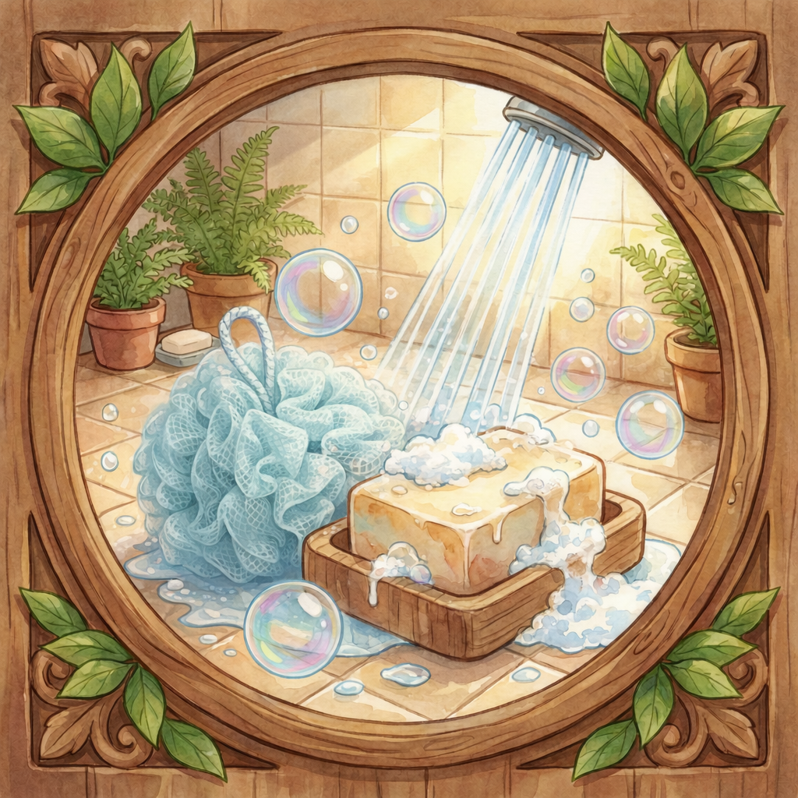

# [Душ и ванна](./shower.md)

**ID:** `shower`  
**WikiData:** [Q7863](https://www.wikidata.org/wiki/Q7863)  
**Раздел:** 3.1. [Здоровый образ жизни](../../vrednye_privychki/articles/profilaktika.md)

> 💡 **Коротко:** Главный способ очищения всего тела, помогающий смыть пот, грязь и [усталость](../../../3.1. healthy lifestyle/Sleep, nutrition, and adolescent energy/articles/sugar_rollercoaster.md).

---

## Введение
Привет! [Душ](./shower.md) — это не просто скучная обязанность, а настоящая кнопка "Перезагрузка" для твоего организма. Представь, что твое [тело](../../../1.2_natural_sciences/why_science_help_understand_world/organism.md) — это сложный биологический скафандр. За день он накапливает пыль с улицы, выхлопные [газы](../../../1.2_natural_sciences/physics_in_everyday_life/Q124003.md) машин и следы от прикосновений к сотням предметов.

Кроме того, твоя кожа постоянно работает сама по себе: она выделяет жир (себум) и сбрасывает миллионы отмерших клеток. Если вовремя не смыть этот "коктейль", поры закупориваются, появляются [прыщи](./acne.md) и раздражение. Поэтому [душ](sleep.md) — это [база](../../../1.2_natural_sciences/physics_in_everyday_life/Q5339.md) твоей уверенности и здоровья, такая же важная, как [сон](./sleep.md) или [еда](../../../3.1. healthy lifestyle/Sleep, nutrition, and adolescent energy/articles/stress_and_food.md). 🚿

## Как это работает: [химия](../../../1.2_natural_sciences/why_science_help_understand_world/natural_sciences.md) чистоты
Многие думают, что запах пота появляется от самого пота. Но это миф! Свежий пот почти не пахнет (он состоит в основном из воды и солей). Неприятный запах возникает, когда **[бактерии](../../../6.1_Independent_living_and_daily_living_skills/Simple_and_safe_cooking/articles/hand_hygiene.md)**, живущие на коже, начинают этот пот перерабатывать и размножаться.

Вот почему просто постоять под водой недостаточно:
*   **[Вода](../../../3.1. healthy lifestyle/Sleep, nutrition, and adolescent energy/articles/drinking_regime.md)** смывает пыль, но не может растворить жир.
*   **Гель или мыло** работают как [магниты](../../../1.2_natural_sciences/physics_in_everyday_life/Q11421.md): они захватывают жир и грязь, отрывают их от кожи и позволяют воде смыть всё в канализацию.
*   **Мочалка** помогает убрать слой мертвых клеток, чтобы кожа могла дышать. Кстати, мочалка — это сугубо личная вещь, как и [зубная щетка](./toothbrush.md). Никогда не бери чужую!

После душа кожа становится чистой, но беззащитной, поэтому многие используют [дезодорант](./deodorant.md), чтобы продлить эффект свежести.

 

## Примеры из жизни школьника
Давай посмотрим, как правильный душ помогает в типичных ситуациях:

1.  **После физкультуры или [тренировки](../../../3.1. healthy lifestyle/Sleep, nutrition, and adolescent energy/articles/sport_and_energy.md)**: Это обязательно. Даже если ты "совсем чуть-чуть" вспотел. Влажная и теплая [среда](../../../1.2_natural_sciences/physics_in_everyday_life/Q124003.md) под одеждой — это курорт для микробов. Если не помыться сразу, уже через час появится резкий запах, а на спине могут выскочить [прыщи](./acne.md). Не забудь также просушить [обувь](./shoes.md), чтобы там не завелся грибок.
2.  **Вечерний [ритуал](../../../2.1_society/how_and_where_find_friends/articles/druzhba_posle_shkoly.md)**: За день на тебя оседает городская пыль. Идти с ней в чистую постель — плохая идея. Грязь попадет на [постельное белье](./bedding.md), а оттуда — на твое лицо, вызывая воспаления. Вечерний душ смывает усталость и помогает быстрее уснуть.
3.  **Смена "обшивки"**: Нет никакого смысла мыться, если после этого ты надеваешь вчерашнюю футболку или несвежее [нижнее белье](./underwear.md). Чистое тело требует [чистой одежды](./clean_clothes.md). Это [правило](../../../1.2_natural_sciences/why_science_help_understand_world/patterns.md) работает только в комплексе!

## Интересные [факты](../../../1.2_natural_sciences/physics_in_everyday_life/Q17737.md)
*   **Смена кожи**: За год [человек](../../../1.2_natural_sciences/physics_in_everyday_life/Q45003.md) "сбрасывает" около 4 килограммов мертвой кожи. Большая часть смывается именно в душе. Если не мыться, эти чешуйки остаются на одежде и в кровати.
*   **Контрастный душ**: Если по утрам тебе сложно проснуться, попробуй в конце мытья включить прохладную воду на 15 секунд. Это заставляет кровь бежать быстрее и бодрит лучше, чем [энергетик](../../vrednye_privychki/articles/energetiki.md).
*   **Не кипятись**: Слишком горячая вода — [враг](../../../7.2 Media, leisure and hobbies/Computer games/articles/heroes_and_villains/main_villains.md) кожи. Она смывает защитный слой, из-за чего кожа становится сухой и начинает чесаться. Идеальная [температура](../../../1.1_structure_of_the_world/matter/articles/07_gases.md) — теплая, приятная телу (около 37-38 градусов).

## [Заключение](../../../1.2_natural_sciences/physics_in_everyday_life/Q2225.md)
Принимать [душ](./shower.md) нужно каждый день. Это занимает всего 10-15 минут, но дает тебе +100 очков к привлекательности и защите от болезней. Не забывай тщательно вытираться своим [личным полотенцем](./towel.md), особенно между пальцами ног, и наслаждайся ощущением чистоты! 🛁✨

---

*[Автор](../../../4.2_thinking_and_working_information/how_to_search_information/articles/copypaste.md): Бугренков [Владимир](../../../2.2_society/history/articles/Kievan_Rus.md) • Сгенерировано с помощью [ChatGPT](../../../7.1_art/modern_technological_art/articles/6.1_prompt_art.md) 5-2 • Слов: 485 • 2026-03-09*