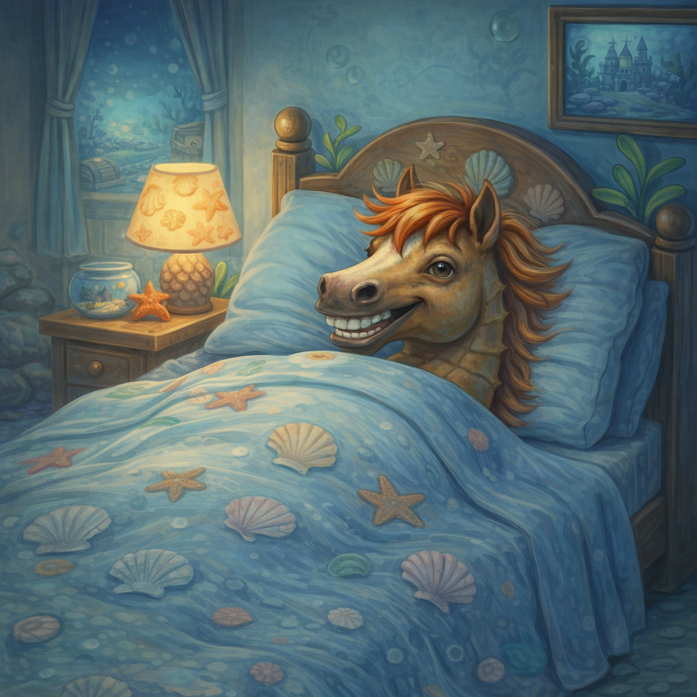

# [Здоровый сон](./sleep.md)

**ID:** `sleep`  
**WikiData:** [Q35831](https://www.wikidata.org/wiki/Q35831)  
**Раздел:** 3.1. Здоровый образ жизни

> 💡 **Коротко:** Сон — это не потерянное время, а период, когда мозг обрабатывает информацию, тело восстанавливается, а иммунитет укрепляется. 8–10 часов в одно и то же время — и учёба даётся легче, настроение стабильнее, а внешний вид лучше.

---

## Введение

«Досмотрю ещё одну серию», «дочитаю ленту», «доиграю раунд» — и вот уже 2 ночи, а в 7 вставать. Знакомо? В 8 классе многие считают, что сон — это скучно и его можно сократить без последствий. На самом деле недосып бьёт по всему: память, внимание, настроение, кожа, иммунитет.

[Здоровый сон](./sleep.md) — это не про «спать побольше», а про регулярность, режим и условия. Разобраться несложно, а эффект заметен уже через неделю.

---

## Как это работает: что происходит во сне

Сон — активный процесс, а не «выключение» мозга.

### Фазы сна

Каждую ночь мозг проходит **4–6 циклов** по ~90 минут:

* **Лёгкий сон** — засыпание, тело расслабляется.
* **Глубокий сон** — тело восстанавливается, растут мышцы, укрепляется иммунитет.
* **REM-сон (быстрый)** — мозг обрабатывает информацию, формируются воспоминания, снятся сны.

Если разбудить в середине цикла — ощущение разбитости. Если в конце — встаёшь легче.

### Что делает сон

* **Память и обучение** — во сне мозг «сортирует» информацию за день. Выучил параграф — во сне он закрепится.
* **Восстановление тела** — мышцы растут, раны заживают, иммунитет работает.
* **Гормоны** — во сне выделяется гормон роста (важно в подростковом возрасте).
* **Настроение** — недосып = раздражительность, тревожность, сложнее контролировать эмоции.
* **Внешность** — круги под глазами, тусклая кожа, [акне](./acne.md) — часто связаны с недосыпом.

 

---

## Сколько нужно спать

| Возраст | Рекомендуемое время |
|---|---|
| 13–15 лет | **8–10 часов** |
| 16–17 лет | **8–9 часов** |
| Взрослые | 7–9 часов |

Это не «максимум», а норма. Большинство подростков спят **6–7 часов** — и это хронический недосып.

### Признаки недосыпа

* Трудно проснуться, даже по будильнику.
* Засыпаешь на уроках или в транспорте.
* Раздражительность, плохое настроение без причины.
* Сложно сосредоточиться, всё забываешь.
* Часто болеешь простудами.
* Хочется сладкого и жирного (организм ищет быструю энергию).

---

## База: как наладить сон

### 1) Режим — главное правило

Мозг любит предсказуемость. Ложиться и вставать **в одно время** — важнее, чем общее количество часов.

* Выбери время подъёма (например, 7:00).
* Отсчитай назад 8–9 часов — это время отбоя (22:00–23:00).
* **Соблюдай и в выходные** — «отсыпаться до обеда» сбивает ритм на всю неделю.

Миф: «В выходные отосплюсь за будни».
На самом деле «досыпание» не компенсирует недосып полностью, а смещение режима вызывает «социальный джетлаг» — в понедельник ещё тяжелее.

### 2) Ритуал перед сном

За час до сна — спокойные занятия:

* Душ / умывание (см. [душ](./shower.md), [уход за лицом](./facewash.md)).
* Чтение бумажной книги.
* Спокойная музыка, подкаст.
* Лёгкая растяжка.

**Избегай за час до сна:**

* Телефон, компьютер, телевизор — синий свет подавляет мелатонин (гормон сна).
* Активные игры, споры, стресс.
* Тяжёлая еда, кофе, энергетики.

### 3) Условия для сна

* **Темнота** — мелатонин вырабатывается в темноте. Шторы блэкаут, убрать светящиеся индикаторы.
* **Тишина** — или беруши / белый шум, если шумно.
* **Прохлада** — оптимально 18–20°C. В жаре сон поверхностный.
* **Удобная постель** — чистое [постельное бельё](./bedding.md), удобная подушка.
* **Кровать = сон** — не учись, не ешь, не сиди в телефоне в кровати. Мозг должен связывать кровать только со сном.

### 4) Телефон — главный враг

Почему телефон мешает:

* **Синий свет** экрана подавляет выработку мелатонина.
* **Контент затягивает** — «ещё 5 минут» превращается в час.
* **Уведомления** будят среди ночи.

Что делать:

* За час до сна — телефон на зарядку **вне спальни** (или хотя бы не у кровати).
* Ночной режим / фильтр синего света — лучше, чем ничего, но не панацея.
* Будильник — купи обычный, чтобы не было повода держать телефон рядом.

---

## Примеры из жизни школьника

1. **Перед контрольной**: соблазн учить до ночи. Но сон важнее — во сне информация закрепляется. Лучше лечь вовремя и встать на час раньше, чем сидеть до 3 ночи.

2. **Выходные**: лёг в 3, встал в 12. В понедельник — разбитость. Причина — сбитые ритмы. Старайся не сдвигать подъём больше чем на час.

3. **Не могу уснуть**: лежишь и крутишь мысли. Встань, выйди из комнаты, сделай что-то спокойное (попей воды, почитай). Вернись, когда почувствуешь сонливость.

4. **Телефон под подушкой**: уведомление ночью — проснулся, посмотрел, уснуть сложнее. Телефон — в другую комнату или хотя бы на авиарежим.

---

## Частые ошибки

* **«Сон — для слабаков»** — недосып снижает результаты в учёбе, спорте и даже играх.
* **Кофе / энергетики вечером** — кофеин работает 6–8 часов; выпил в 18:00 — не уснёшь до полуночи.
* **Экран до последней минуты** — синий свет + затягивающий контент = бессонница.
* **«Отосплюсь на каникулах»** — хронический недосып накапливает последствия, которые не стираются за неделю.
* **Учёба в кровати** — мозг перестаёт воспринимать кровать как место для сна.
* **Разный режим будни/выходные** — сбивает внутренние часы.

---

## Когда к врачу

* Не можешь уснуть дольше 30–40 минут регулярно.
* Просыпаешься несколько раз за ночь.
* Храп с остановками дыхания.
* Днём постоянная сонливость, даже при достаточном сне.
* Ночные кошмары, лунатизм.

Это может быть расстройство сна — поможет терапевт или сомнолог.

---

## Интересные факты

* Рекорд без сна — **11 дней** (эксперимент 1964 года). К концу — галлюцинации, провалы памяти, неспособность думать. Не повторять.
* Подростковый мозг естественно «сдвигается» на более поздний режим — хочется ложиться позже. Но школа не сдвигается, поэтому важно сознательно соблюдать режим.
* **20 минут дневного сна** (не больше!) могут улучшить концентрацию. Дольше — будет тяжело проснуться и сбитый ночной сон.
* Недосып по эффекту на мозг похож на **алкогольное опьянение** — хуже реакция, внимание, принятие решений.

---

## Связанные привычки

* [Постельное бельё](./bedding.md) — чистая постель = комфортный сон.
* [Душ](./shower.md) — тёплый душ перед сном помогает расслабиться.
* [Уход за кожей лица](./facewash.md) — ночью кожа восстанавливается.
* [Питьевой режим](./water.md) — не пить много перед сном, чтобы не просыпаться.

---

## Заключение

[Здоровый сон](./sleep.md) — это 8–10 часов в одно и то же время, без телефона за час до сна, в тёмной прохладной комнате. Это не скучное правило взрослых, а способ лучше учиться, лучше выглядеть и лучше себя чувствовать. Эффект заметен уже через неделю режима — попробуй и сравни.

---

*Автор: Тремель Дмитрий • Сгенерировано с помощью Claude Opus 4.6 • Слов: 892 • 2026-03-11*