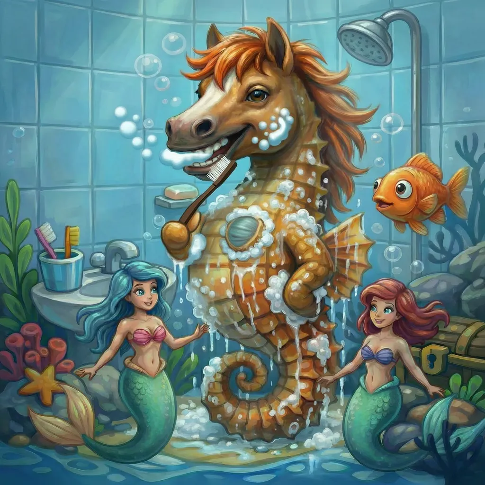
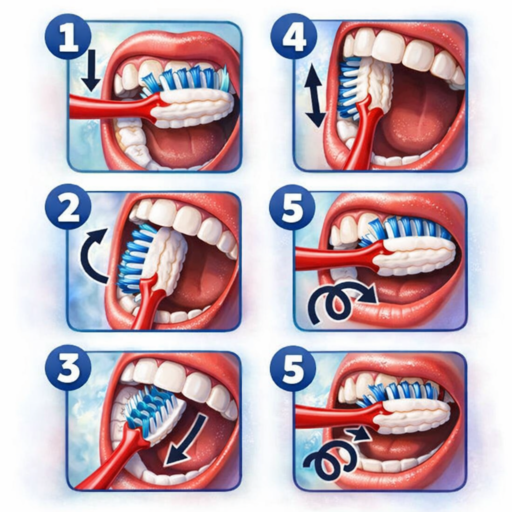

# [Чистка зубов](./toothbrush.md)

**ID:** `toothbrush`  
**WikiData:** [Q134205](https://www.wikidata.org/wiki/Q134205)  
**Раздел:** 3.1. [Здоровый образ жизни](../../vrednye_privychki/articles/profilaktika.md)

> 💡 **Коротко:** Главный способ сохранить зубы здоровыми, а улыбку — белоснежной, удаляя остатки еды и налет.

---

## Введение
Привет! Твоя улыбка — это не просто способ выразить радость, это твоя визитная карточка. Но чтобы она оставалась сияющей, за ней нужно ухаживать каждый день. [Чистка зубов](./toothbrush.md) — это не просто скучная утренняя [привычка](../../../7.2 Media, leisure and hobbies /useful_and_interesting_leisure/articles/how_not_to_quit_hobby.md), а настоящая высокотехнологичная операция по защите твоего организма. 

Зубы — самая твердая часть человеческого тела, но даже они могут "сдаться" под натиском крошечных невидимых врагов. Если ты хочешь как можно реже посещать [стоматолога](./dentist.md) для лечения и как можно чаще — просто для осмотра, то зубная щетка должна стать твоим лучшим другом. Давай разберемся, почему это так важно и как побеждать в битве за [здоровье](../../../3.1. healthy lifestyle/Sleep, nutrition, and adolescent energy/articles/chronic_sleep_deprivation.md) зубов каждый день. 🪥

## Как это работает: битва с налетом
Каждый раз, когда ты ешь (особенно что-то [сладкое](../../../1.2_natural_sciences/neurobiology_for_teens/articles/10_sweet_tooth.md) или мучное), во рту начинается бурная деятельность. Миллионы бактерий только и ждут момента, чтобы полакомиться остатками твоей еды. В процессе этого они создают **зубной налет** — липкую невидимую пленку.

Вот основные этапы этого процесса:
*   **Кислотная [атака](../../../5.1_technology_and_digital_literacy/how_internet_works/articles/dns/cdn.md)**: [Бактерии](../../../6.1_Independent_living_and_daily_living_skills/Simple_and_safe_cooking/articles/hand_hygiene.md) перерабатывают [сахар](../../../3.1. healthy lifestyle/Sleep, nutrition, and adolescent energy/articles/sugar_rollercoaster.md) в кислоту. Эта [кислота](../../../1.1_structure_of_the_world/matter/articles/12_chemical_properties.md) начинает растворять эмаль — защитный панцирь твоего зуба.
*   **Образование кариеса**: Если налет не счищать вовремя, в эмали появляется дырочка. Кариес не проходит сам по себе — его может вылечить только [врач](../../../3.1_healthy_lifestyle/pervaya_pomoshch/ushibi_porezy_ozhogi/06_ushib_kogda_vrach.md).
*   **Свежесть дыхания**: Неприятный запах часто вызывают [продукты](../../../3.1. healthy lifestyle/Sleep, nutrition, and adolescent energy/articles/healthy_school_snacks.md) жизнедеятельности тех самых бактерий. Убирая их, ты возвращаешь себе [уверенность](../../../2.1_society/how_and_where_find_friends/articles/otkaz_ne_konets.md) в общении.

Гайд как чистить зубы: держите щетку под углом около 45° к линии десен и мягкими выметающими движениями очищайте зубы от десны к краю зуба, последовательно проходя внешние, внутренние и жевательные поверхности в течение примерно двух минут. 🪥✨

Важно [помнить](../../../4.1_rules_of_study/how_to_memorize/articles/pamyat.md), что щетка очищает только открытые поверхности. Для того чтобы вычистить "узкие щели" между зубами, тебе обязательно понадобится [зубная нить](./floss.md). Это отличная [команда](../../../4.1_rules_of_study/how_to_learn_effectively/articles/peer_learning.md) для полной победы над грязью!

 

## Примеры из жизни школьника
Давай посмотрим, как правильный уход за зубами меняет твой учебный день:

1.  **Утренний старт**: Ночью, пока ты спал, слюны (которая защищает зубы) вырабатывалось меньше. Поэтому утром во рту может быть неприятный привкус. Тщательная [чистка зубов](handwashing.md) перед школой не только уберет бактерии, но и поможет тебе окончательно проснуться. Свежее [дыхание](../../../1.2_natural_sciences/physics_in_everyday_life/Q163214.md) — залог того, что тебе будет комфортно шептаться с другом на задней парте.
2.  **Обед в столовой**: После школьного обеда или перекуса печеньем частички еды застревают в зубах. Если нет возможности почистить зубы прямо в школе, прополощи рот обычной [водой](./water.md) или съешь твердое яблоко — это поможет механически счистить часть налета.
3.  **Вечерняя дисциплина**: Самая важная чистка — перед тем, как отправиться в [сон](./sleep.md). За день на зубах скопилось много "еды" для микробов. Если лечь [спать](../../../4.1_rules_of_study/how_to_memorize/articles/son.md) с грязными зубами, ты даешь бактериям целых 8-9 часов на спокойное разрушение твоей эмали. Никогда не пропускай вечернюю чистку!

## Интересные [факты](../../../1.2_natural_sciences/physics_in_everyday_life/Q17737.md)
*   **[Язык](../../../5.2_cybersecurity/cpp_fundamentals/1_introduction.md) тоже хочет быть чистым**: Большая часть бактерий, вызывающих запах, живет не на зубах, а на языке. Поэтому после зубов аккуратно почисти язык щеткой или специальным скребком.
*   **Замена инструмента**: Зубная щетка "изнашивается" через 3 месяца. Её щетинки становятся мягкими и перестают эффективно выметать грязь. Также обязательно поменяй щетку после того, как переболел простудой или гриппом, чтобы не заразить себя снова.
*   **[Правило](../../../1.2_natural_sciences/why_science_help_understand_world/patterns.md) 3 минут**: Большинство людей чистят зубы меньше минуты, хотя нужно [минимум](../../../1.2_natural_sciences/physics_in_everyday_life/Q136980.md) 3 минуты. Попробуй включить любимую песню или поставить таймер — ты удивишься, как долго на самом деле нужно работать щеткой для идеального результата.

## [Заключение](../../../1.2_natural_sciences/physics_in_everyday_life/Q2225.md)
[Чистка зубов](./toothbrush.md) — это твоя личная [зона](../../../5.1_technology_and_digital_literacy/how_internet_works/articles/dns/domains.md) ответственности. Это простая инвестиция: 6 минут в день (3 утром и 3 вечером) избавляют тебя от боли и серьезных трат в будущем. После чистки сполосни лицо, вытрись своим [личным полотенцем](./towel.md) и улыбнись своему отражению. Ты молодец! 😁✨

---

*[Автор](../../../4.2_thinking_and_working_information/how_to_search_information/articles/copypaste.md): Бугренков [Владимир](../../../2.2_society/history/articles/Kievan_Rus.md) • Сгенерировано с помощью [ChatGPT](../../../7.1_art/modern_technological_art/articles/6.1_prompt_art.md) 5-2 • Слов: 512 • 2026-03-09*