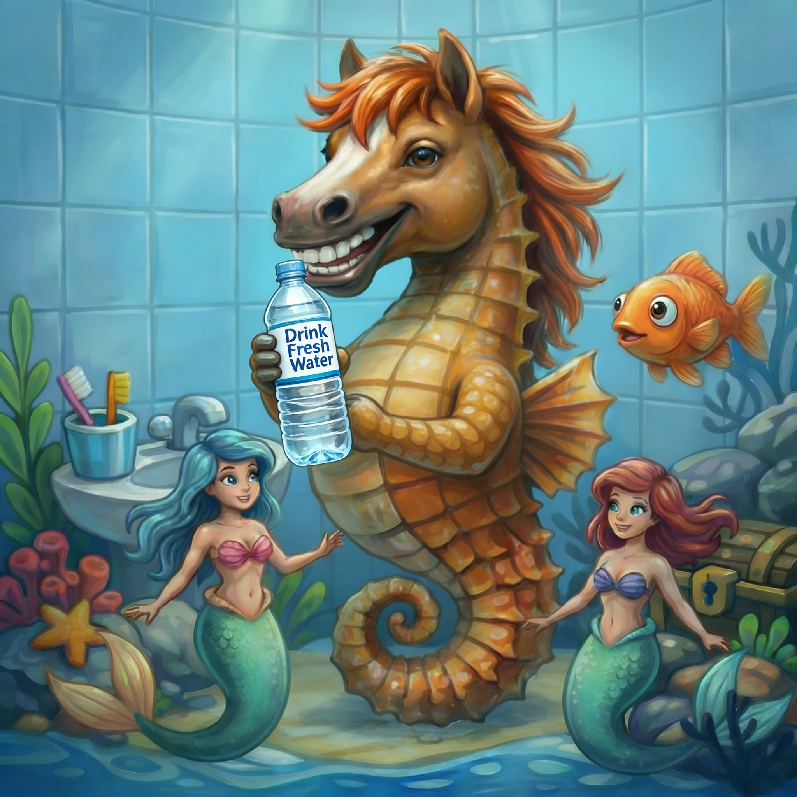

# [Водный баланс](./water.md)

**ID:** `water`  
**WikiData:** [Q4113990](https://www.wikidata.org/wiki/Q4113990)  
**Раздел:** 3.1. [Здоровый образ жизни](../../vrednye_privychki/articles/profilaktika.md)

> 💡 **Коротко:** Поддержание нужного количества воды в организме для правильной [работы](../../../8.2_future/choosing_a_career_path/articles/interview.md) мозга, мышц и кожи.

---

## Введение
Привет! Задумывался ли ты когда-нибудь, из чего ты состоишь? Нет, не только из "костей и мяса". На самом деле, ты — это настоящий "ходячий [океан](../../../1.2_natural_sciences/why_science_help_understand_world/earth_sciences.md)". Твой [организм](../../../1.2_natural_sciences/neurobiology_for_teens/articles/03_nervous_system_map.md) примерно на 60–70% состоит из воды. Это значит, что если бы ты весил 40 килограммов, то почти 28 из них составляла бы чистая [жидкость](../../../1.1_structure_of_the_world/matter/articles/06_liquids.md)!

[Водный баланс](./water.md) — это [равновесие](../../../1.2_natural_sciences/physics_in_everyday_life/Q169019.md) между тем, сколько воды ты выпиваешь, и тем, сколько твой организм тратит на разные [нужды](../../../6.2_money_and_literacy/how_to_save_for_goal/articles/needs_vs_wants.md). [Вода](../../../3.1. healthy lifestyle/Sleep, nutrition, and adolescent energy/articles/drinking_regime.md) — это главный [транспорт](../../../1.2_natural_sciences/physics_in_everyday_life/Q1751973.md) в твоем теле. Она развозит [витамины](../../../3.1. healthy lifestyle/Sleep, nutrition, and adolescent energy/articles/micronutrients_and_teenagers.md) к клеткам, помогает переваривать обед и "вымывает" всё лишнее. Без воды [жизнь](../../../1.2_natural_sciences/physics_in_everyday_life/Q1751973.md) человека невозможна дольше нескольких дней, поэтому следить за своим "внутренним уровнем моря" критически важно. 💧

## Как это работает: внутренняя [логистика](../../../2.2_history/world_economy_on_fingers/articles/suetskiy_kanal.md)
Представь, что твои сосуды — это скоростные шоссе. Чтобы "машины" (полезные вещества) ехали быстро, дорога должна быть ровной и влажной. Если воды мало, кровь становится гуще, и сердцу сложнее её перекачивать.

Вот за что отвечает вода в твоем теле:
*   **[Работа](../../../1.2_natural_sciences/physics_in_everyday_life/Q11382.md) мозга**: Твой [мозг](../../../3.1. healthy lifestyle/Sleep, nutrition, and adolescent energy/articles/breakfast_for_the_brain.md) — самый "мокрый" [орган](../../../7.1_art/musical_instruments/articles/organ.md) (он на 80% состоит из воды). Даже небольшая нехватка [жидкости](../../../1.2_natural_sciences/physics_in_everyday_life/Q124003.md) заставляет тебя туго соображать.
*   **Система охлаждения**: Когда тебе жарко или ты бегаешь, ты потеешь. Пот испаряется и охлаждает кожу. Чтобы эта система не "перегрелась", нужно постоянно доливать "охлаждающую жидкость". После активного спорта не забудь сходить в [душ](./shower.md), чтобы смыть соли, вышедшие с потом.
*   **Чистота изнутри**: Вода помогает почкам фильтровать кровь и выводить токсины. Это как внутренняя гигиена, такая же важная, как [мытье рук](./handwashing.md), только внутри тебя.

Твой организм очень умный. Когда [уровень](../../../../8.1_entertainment/articles/gamification.md) воды падает всего на 1–2%, он включает [сигнал](../../../5.1_technology_and_digital_literacy/how_internet_works/articles/wifi/router.md) "Жажда". Это как красная [лампочка](../../../7.2 Media, leisure and hobbies/Computer games/articles/technologies_inside/screen_magic.md) на приборной панели автомобиля: "Срочно заправься!".

 

## Примеры из жизни школьника
Давай разберем ситуации, когда вода решает всё:

1.  **Контрольная работа или сложный [урок](../../../5.1_technology_and_digital_literacy/information and media literacy/шаблон_урока_по_медиаграмотности.md)**: Если на втором или третьем уроке ты вдруг почувствовал, что буквы в учебнике расплываются, а голова стала тяжелой — скорее всего, ты просто хочешь пить. Пара глотков воды помогут мозгу "проснуться" и [сосредоточиться](../../../4.1_rules_of_study/how_to_memorize/articles/koncentraciya.md) на задаче. Всегда держи бутылку чистой воды на парте.
2.  **Урок физкультуры**: Во [время](../../../1.2_natural_sciences/physics_in_everyday_life/Q20702.md) бега или игры в футбол ты теряешь много влаги через [дыхание](../../../1.2_natural_sciences/physics_in_everyday_life/Q163214.md) и пот. Если не пить воду во время и после [тренировки](../../../3.1. healthy lifestyle/Sleep, nutrition, and adolescent energy/articles/sport_and_energy.md), может заболеть голова или начаться судорога в мышцах. Вода помогает мышцам восстанавливаться быстрее.
3.  **Красивая кожа**: Если ты пьешь достаточно воды, твоя кожа выглядит здоровой и упругой. Это помогает организму бороться с такими проблемами, как [акне](./acne.md), так как вода помогает выводить вещества, которые могут провоцировать воспаления.

## Интересные [факты](../../../1.2_natural_sciences/physics_in_everyday_life/Q17737.md)
*   **Вода в еде**: Мы получаем воду не только из стакана. Например, огурец и арбуз на 95% состоят из воды. Даже в хлебе есть немного влаги! Но чистая вода всё равно остается самым полезным напитком, в отличие от сладкой газировки, от которой пить хочется еще сильнее.
*   **[Цвет](../../../1.2_natural_sciences/physics_in_everyday_life/Q1075.md) — подсказка**: Твое [тело](../../../1.2_natural_sciences/why_science_help_understand_world/organism.md) дает тебе визуальные подсказки. Если ты пьешь достаточно, твоя моча будет светло-желтой или почти прозрачной. Если она темно-желтая — это крик организма о помощи: "Мне срочно нужна вода!".
*   **Вода и [рост](../../../3.1. healthy lifestyle/Sleep, nutrition, and adolescent energy/articles/micronutrients_and_teenagers.md)**: Вода участвует в строительстве новых клеток. Если ты хочешь вырасти крепким и здоровым, вода тебе необходима так же, как строительный [материал](../../../1.2_natural_sciences/physics_in_everyday_life/Q25358.md) для дома.

## [Заключение](../../../1.2_natural_sciences/physics_in_everyday_life/Q2225.md)
[Водный баланс](./water.md) — это залог твоего хорошего настроения и отличных оценок. Не жди, пока во рту станет совсем сухо. Пей понемногу в течение всего дня. Купи себе красивую многоразовую бутылку, которую приятно брать с собой в школу. Помни: чистая вода изнутри и [мытье рук](./handwashing.md) снаружи — это два главных [правила](../../../2.1_society/cause_and_effect_relationships/articles/why_rules_work.md) долгой и здоровой жизни! 🌍✨

---

*[Автор](../../../4.2_thinking_and_working_information/how_to_search_information/articles/copypaste.md): Бугренков [Владимир](../../../2.2_society/history/articles/Kievan_Rus.md) • Сгенерировано с помощью [ChatGPT](../../../7.1_art/modern_technological_art/articles/6.1_prompt_art.md) 5-2 • Слов: 538 • 2026-03-09*