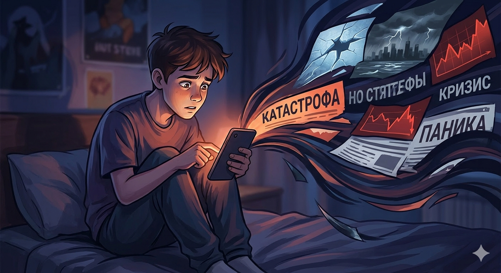

# Думскроллинг: Почему мы не можем перестать читать плохие новости?

«Еще одну [новость](../../../5.1_technology_and_digital_literacy/information and media literacy/информационная_диета.md), и точно [спать](../../../4.1_rules_of_study/how_to_memorize/articles/son.md)», — шепчешь ты себе в два часа ночи, продолжая листать ленту, заполненную сообщениями о катастрофах, конфликтах и проблемах. Если это состояние тебе знакомо, ты попал в ловушку **думскроллинга** (от англ. *doom* — гибель, и *scroll* — прокручивать). Это навязчивое [чтение](../../../4.1_rules_of_study/how_to_learn_effectively/articles/reading_skills.md) плохих новостей, которое затягивает вопреки здравому смыслу.

---

## Почему наш [мозг](../../../3.1. healthy lifestyle/Sleep, nutrition, and adolescent energy/articles/breakfast_for_the_brain.md) «любит» ужасы?

Казалось бы, зачем добровольно портить себе [настроение](../../../1.2_natural_sciences/neurobiology_for_teens/articles/10_sweet_tooth.md)? Но у нашего мозга есть на это две веские причины, доставшиеся нам от предков:

1.  **Древний инстинкт выживания:** Миллионы лет назад выживал тот, кто первым замечал [опасность](../../../3.1_healthy_lifestyle/pervaya_pomoshch/ushibi_porezy_ozhogi/06_ushib_kogda_vrach.md) — саблезубого тигра или приближающийся шторм. Мозг до сих пор считает, что сбор информации о катастрофах — это «разведка», которая поможет нам спастись. Мы думаем: «Если я буду знать всё об этой беде, я буду в безопасности». Но в современном мире это иллюзия.
2.  **Эффект новизны:** Каждое [обновление](../../../5.2_cybersecurity/passwords_cyber_safety/articles/update.md) ленты дает мозгу микропорцию [дофамина](Dopamine.md) (о котором мы говорили в прошлой статье). Мозгу неважно, хорошая новость или плохая, главное — она **новая**. Так [страх](../../../1.2_natural_sciences/neurobiology_for_teens/articles/14_amygdala_fear.md) смешивается с азартом.

---

## Как это убивает твое [здоровье](../../../3.1. healthy lifestyle/Sleep, nutrition, and adolescent energy/articles/chronic_sleep_deprivation.md)?

Когда ты читаешь о чем-то страшном, твое [тело](../../../1.2_natural_sciences/why_science_help_understand_world/organism.md) не понимает, что это происходит на другом конце света. Оно думает, что опасность рядом, и включает [режим](../../../4.1_rules_of_study/how_to_learn_effectively/articles/breaks_and_rest.md) «[Бей или беги](../../../1.2_natural_sciences/neurobiology_for_teens/articles/07_stress.md)».

### Гормональный шторм
В кровь выбрасывается **[кортизол](../../../1.2_natural_sciences/neurobiology_for_teens/articles/07_stress.md)** (гормон стресса). Если ты думскроллишь часами, [уровень](../../../../8.1_entertainment/articles/gamification.md) кортизола не падает, и начинаются проблемы:
* **Тоннельное [зрение](../../../1.2_natural_sciences/neurobiology_for_teens/articles/26_optical_illusions.md):** Ты перестаешь [замечать](../../../4.1_rules_of_study/how_to_memorize/articles/vnimanie.md) радости жизни, всё кажется серым и безнадежным.
* **Проблемы с учебой:** Мозг слишком занят «мониторингом угроз», чтобы [запоминать](../../../4.1_rules_of_study/how_to_memorize/articles/zapominanie.md) [правила](../../../2.1_society/cause_and_effect_relationships/articles/why_rules_work.md) по физике или английские слова.
* **Плохой [сон](../../../3.1. healthy lifestyle/Sleep, nutrition, and adolescent energy/articles/evening_rituals_sleep_fast.md):** [Синий свет](../../../3.1. healthy lifestyle/Sleep, nutrition, and adolescent energy/articles/gadgets_blue_light_sleep.md) экрана блокирует [мелатонин](../../../3.1. healthy lifestyle/Sleep, nutrition, and adolescent energy/articles/biology_of_night_owls_teens.md), а плохие новости держат психику в напряжении. В итоге — [бессонница](nedosypanie.md) или кошмары.

---

## [Проверка](../../../1.2_natural_sciences/why_science_help_understand_world/scientific_method.md): Ты информирован или ты в ловушке?

| Признак | Информированность | Думскроллинг |
| :--- | :--- | :--- |
| **[Время](../../../1.2_natural_sciences/physics_in_everyday_life/Q20702.md)** | 10-15 минут в день | [Часы](../../../1.2_natural_sciences/physics_in_everyday_life/Q20702.md) напролет, часто ночью |
| **[Цель](../../../1.2_natural_sciences/why_science_help_understand_world/research_work.md)** | Узнать ключевые [факты](../../../1.2_natural_sciences/physics_in_everyday_life/Q17737.md) | [Поиск](../../../3.2 healthy lifestyle/how to act in a dangerous situation/articles/lost-in-city.md) всё новых и новых подробностей |
| **[Эмоции](../../../3.1. healthy lifestyle/Sleep, nutrition, and adolescent energy/articles/stress_and_food.md)** | [Спокойствие](../../../7.2 Media, leisure and hobbies/Computer games/articles/useful_tips/toxic_players.md), [понимание](../../../2.1_society/cause_and_effect_relationships/articles/empathy_causality.md) ситуации | [Тревога](../../../1.2_natural_sciences/neurobiology_for_teens/articles/07_stress.md), паника, бессилие |
| **[Действие](../../../2.1_society/cause_and_effect_relationships/articles/personal_choice.md)** | Закрыл и пошел делать дела | Не можешь оторваться, читаешь [комментарии](../../../4.2_thinking_and_working_information/how_to_search_information/articles/cooperative_work.md) |

---

## Как вырваться из потока? ([Цифровая гигиена](../../../3.1. healthy lifestyle/Sleep, nutrition, and adolescent energy/articles/gadgets_blue_light_sleep.md))

Ты не сможешь исправить все проблемы мира, но ты можешь защитить свою голову. Попробуй эти правила:

1.  **Лимит «15 минут»:** Выбери один надежный [источник](../../../5.1_technology_and_digital_literacy/information and media literacy/дезинформация_и_фейки.md) новостей и проверяй его один раз в день (лучше в обед).
2.  **Никакого телефона в постели:** За час до сна убери [гаджеты](../../../3.1. healthy lifestyle/Sleep, nutrition, and adolescent energy/articles/gadgets_blue_light_sleep.md). Твоему мозгу нужно время, чтобы успокоиться.
3.  **Замещай действие:** Как только рука потянулась свайпнуть ленту — сделай 10 приседаний, выпей стакан воды или обними кота.
4.  **[Правило](../../../1.2_natural_sciences/why_science_help_understand_world/patterns.md) «Пяти радостей»:** На каждую прочитанную плохую новость найди пять хороших вещей в своей реальности.

> **Важный [вывод](../../../1.2_natural_sciences/why_science_help_understand_world/scientific_method.md):** Твое [внимание](../../../1.2_natural_sciences/neurobiology_for_teens/articles/16_love_chemistry.md) — это твой самый ценный ресурс. Не отдавай его алгоритмам, которые зарабатывают на твоем страхе.

---

**[Автор](../../../4.2_thinking_and_working_information/how_to_search_information/articles/copypaste.md):** Гуляев Антон

**[Оформление](../../../8.2_future/choosing_a_career_path/articles/designer.md):** [Проект](../../../1.2_natural_sciences/why_science_help_understand_world/research_work.md) «[Википедия](../../../4.2_thinking_and_working_information/how_to_search_information/articles/wikipedia.md) для восьмиклассника»