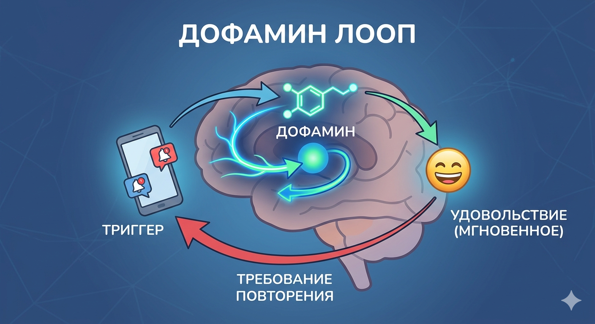

# Дофаминовая петля: Почему [мозг](../../../3.1. healthy lifestyle/Sleep, nutrition, and adolescent energy/articles/breakfast_for_the_brain.md) требует повторения?

Ты когда-нибудь задумывался, почему так сложно оторваться от ленты TikTok, перестать есть [чипсы](fastfud_i_pischevoy_musor.md), пока пачка не опустеет, или бросить игру на «еще одном, последнем уровне»? [Ответ](../../../5.1_technology_and_digital_literacy/how_internet_works/articles/http_https/http_https.md) кроется в глубоких структурах твоего мозга, и имя ему — **[дофамин](../../../1.2_natural_sciences/neurobiology_for_teens/articles/10_sweet_tooth.md)**.

---

## Что это такое на самом деле?
Дофамин — это нейромедиатор, [химический](../../../3.1_healthy_lifestyle/pervaya_pomoshch/ushibi_porezy_ozhogi/15_ozhog_kogda_skoraya.md) «посыльный», который передает сигналы между клетками мозга. Вопреки расхожему мнению, это не «гормон удовольствия» в чистом виде. Ученые называют его **гормоном обещания счастья** или предвкушения. Его главная задача — заставить тебя действовать ради получения награды.

### Как работает биологическая петля?
В древности этот механизм был вопросом жизни и смерти. Он поощрял [действия](../../../3.1_healthy_lifestyle/pervaya_pomoshch/ushibi_porezy_ozhogi/03_obschie_pravila_algorithm.md), необходимые для выживания:
1.  **[Поиск](../../../3.2 healthy lifestyle/how to act in a dangerous situation/articles/lost-in-city.md):** Нашел куст с ягодами — мозг выделил дофамин (приятное [возбуждение](../../../1.2_natural_sciences/neurobiology_for_teens/articles/16_love_chemistry.md)!).
2.  **[Обучение](../../../3.1. healthy lifestyle/Sleep, nutrition, and adolescent energy/articles/sleep_and_memory_grades.md):** Мозг [запомнил](../../../4.1_rules_of_study/how_to_memorize/articles/zapominanie.md): «Там была [еда](../../../3.1. healthy lifestyle/Sleep, nutrition, and adolescent energy/articles/stress_and_food.md), это было здорово».
3.  **[Повторение](../../../4.1_rules_of_study/how_to_memorize/articles/povtorenie.md):** В следующий раз при виде похожего куста дофамин заставляет тебя бежать к нему снова.

Сегодня этот древний механизм «взламывают» современные [технологии](../../../2.2_history/world_economy_on_fingers/articles/globalizatsiya.md) и [социальные сети](Social_media.md).

---

## Четыре этапа современной петли
[Алгоритмы](../../../4.2_thinking_and_working_information/how_to_search_information/articles/buble_filter.md) приложений специально проектируются так, чтобы ты проходил через эти четыре стадии по кругу:

1.  **[Триггер](../../../5.1_technology_and_digital_literacy/information and media literacy/эмоциональные_триггеры_в_контенте.md) ([Сигнал](../../../5.1_technology_and_digital_literacy/how_internet_works/articles/wifi/router.md)):** Всплывающее уведомление, характерный [звук](../../../1.2_natural_sciences/physics_in_everyday_life/Q124003.md) [сообщения](../../../5.1_technology_and_digital_literacy/operating system/articles/IPC.md) или просто вид иконки [приложения](../../../4.1_rules_of_study/how_to_learn_effectively/articles/digital_tools.md) на экране.
2.  **[Действие](../../../2.1_society/cause_and_effect_relationships/articles/personal_choice.md):** Ты совершаешь минимальное усилие — свайпаешь пальцем по экрану или кликаешь на ссылку.
3.  **[Переменная](../../../5.2_cybersecurity/cpp_fundamentals/3_variables.md) [награда](../../../1.2_natural_sciences/neurobiology_for_teens/articles/11_reward_system.md):** Ты получаешь что-то новое (смешной [мем](../../../7.2 Media, leisure and hobbies/Computer games/articles/game_culture/game_memes.md), [лайк](Social_media.md), бонус в игре). Важно, что награда **непредсказуема** — ты не знаешь, будет ли следующий ролик интересным. Это делает выброс дофамина в разы сильнее.
4.  **Инвестиция и замыкание:** Ты тратишь [время](../../../1.2_natural_sciences/physics_in_everyday_life/Q20702.md), мозг запоминает кратчайший [путь](../../../1.2_natural_sciences/physics_in_everyday_life/Q11476.md) к быстрому удовольствию и требует: «Сделай это еще раз!».

---

## Главная ловушка: Истощение рецепторов
Проблема в [том](../../../7.1_art/musical_instruments/articles/drums.md), что «легкий» дофамин от соцсетей или фастфуда очень интенсивен. Со временем рецепторы мозга «оглушаются» и становятся менее чувствительными.

* **[Толерантность](../../../1.2_natural_sciences/neurobiology_for_teens/articles/11_reward_system.md):** Тебе нужно всё больше времени в сети или всё больше лайков, чтобы просто чувствовать себя нормально.
* **[Обесценивание](../../../2.2_history/world_economy_on_fingers/articles/devalvatsiya.md) реальности:** На фоне ярких вспышек от гаджетов реальные, сложные [цели](../../../3.1_healthy_lifestyle/pervaya_pomoshch/ushibi_porezy_ozhogi/02_celi_pervoy_pomoshchi.md) ([учеба](../../../3.1. healthy lifestyle/Sleep, nutrition, and adolescent energy/articles/breakfast_for_the_brain.md), [спорт](../../../3.1. healthy lifestyle/Sleep, nutrition, and adolescent energy/articles/sport_and_energy.md), [чтение](../../../4.1_rules_of_study/how_to_learn_effectively/articles/reading_skills.md) книг) начинают казаться невыносимо скучными, потому что дофамин от них поступает медленно и требует реальных усилий.

### [Сравнение](../../../5.2_cybersecurity/cpp_fundamentals/5_operators.md) видов дофамина

| [Тип](../../../5.2_cybersecurity/cpp_fundamentals/13_struct.md) дофамина | [Источник](../../../5.1_technology_and_digital_literacy/information and media literacy/дезинформация_и_фейки.md) | [Скорость](../../../1.2_natural_sciences/physics_in_everyday_life/Q11402.md) получения | Последствия |
| :--- | :--- | :--- | :--- |
| **Дешевый** | [Соцсети](../../../2.1_society/how_and_where_find_friends/articles/tcifrovaya_druzhba.md), игры, [сладости](../../../3.1. healthy lifestyle/Sleep, nutrition, and adolescent energy/articles/sugar_rollercoaster.md), [вейп](../../../1.2_natural_sciences/neurobiology_for_teens/articles/13_nicotine.md) | Мгновенно | [Зависимость](how_addiction_changes_personality.md), апатия, [лень](../../../1.2_natural_sciences/neurobiology_for_teens/articles/12_lazy_brain.md) |
| **Дорогой** | Спорт, [творчество](../../../2.1_society/how_and_where_find_friends/articles/sam_sebe_interesnyi.md), учеба, [живое](../../../1.2_natural_sciences/why_science_help_understand_world/nature.md) [общение](../../../2.1_society/how_and_where_find_friends/articles/guide_dlya_introvertov.md) | Медленно | [Рост](../../../3.1. healthy lifestyle/Sleep, nutrition, and adolescent energy/articles/micronutrients_and_teenagers.md) личности, [уверенность](../../../2.1_society/how_and_where_find_friends/articles/otkaz_ne_konets.md), реальный [успех](../../../4.2_thinking_and_working_information/critical_thinking/articles/main_cognitive_distortions.md) |

---

## Как вернуть контроль над своим мозгом?
Ты можешь «перенастроить» свою дофаминовую систему, если начнешь внедрять эти [привычки](../../../1.2_natural_sciences/neurobiology_for_teens/articles/11_reward_system.md):

* **Дофаминовое голодание:** Устраивай дни (или хотя бы несколько часов) без гаджетов. Это поможет твоим рецепторам восстановить чувствительность к простым радостям жизни.
* **Усложняй путь к награде:** Удали самые «залипательные» приложения и заходи в них только через [браузер](../../../5.1_technology_and_digital_literacy/how_internet_works/articles/http_https/http_https.md). Дополнительные клики снизят дофаминовый азарт.
* **[Правило](../../../1.2_natural_sciences/why_science_help_understand_world/patterns.md) «Сначала дело»:** Используй соцсети как награду за выполненную сложную задачу (например, после 40 минут учебы).
* **Ищи «дорогой» дофамин:** Запишись в секцию, начни рисовать или учить новый [язык](../../../5.2_cybersecurity/cpp_fundamentals/1_introduction.md). Сначала будет трудно, но [удовольствие](../../../1.2_natural_sciences/neurobiology_for_teens/articles/11_reward_system.md) от результата будет гораздо глубже.

> **Помни:** Ты — хозяин своего мозга, а не раб его химических реакций.

---

**[Автор](../../../4.2_thinking_and_working_information/how_to_search_information/articles/copypaste.md):** Гуляев Антон

**Нейронные сети, использованные при создании статьи:** Gemini 3, Nano Banana 2