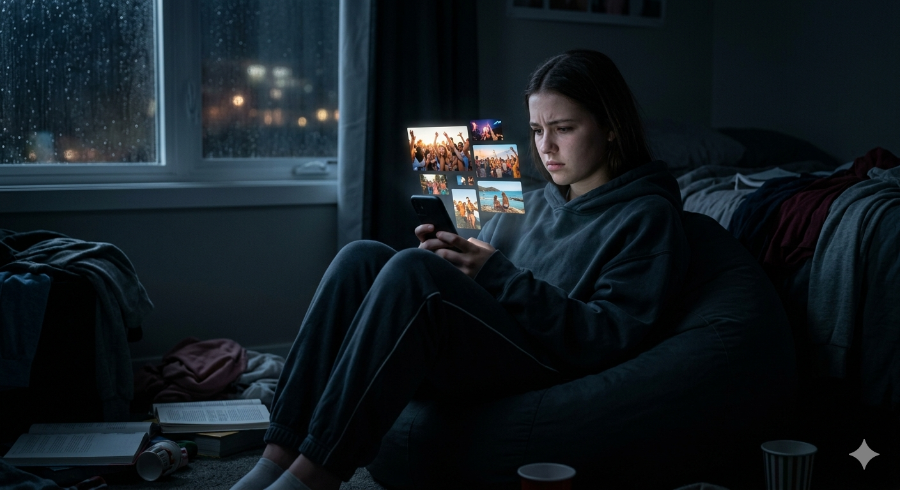
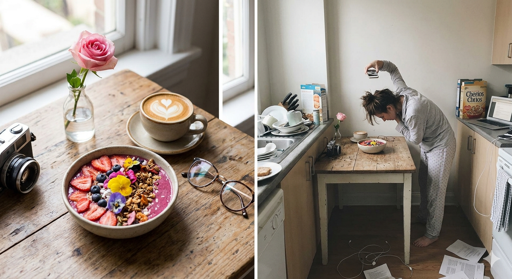

# [Зависимость](how_addiction_changes_personality.md) от соцсетей и синдром Упущенной Выгоды (FoMO)

Социальные сети сегодня — это не просто иконки на экране. Это огромные цифровые миры, созданные для того, чтобы забирать твое [время](../../../1.2_natural_sciences/physics_in_everyday_life/Q20702.md) и [внимание](../../../1.2_natural_sciences/neurobiology_for_teens/articles/16_love_chemistry.md). За красивыми интерфейсами стоят целые штаты психологов и инженеров из Кремниевой долины, которые знают, на какие «[кнопки](../../../7.1_art/musical_instruments/articles/accordion.md)» в твоем мозге нужно нажать, чтобы ты не мог закрыть приложение. Один из самых мощных таких инструментов называется **FoMO** (Fear of Missing Out), или синдром упущенной выгоды.

---

## Что такое FoMO на самом деле?

Представь ситуацию: ты сидишь дома, за окном [дождь](../../../3.2 healthy lifestyle/how to act in a dangerous situation/articles/thunderstorm-safety.md), ты делаешь скучную домашку по алгебре. Ты открываешь телефон и видишь: твои [друзья](../../../4.1_rules_of_study/how_to_learn_effectively/articles/peer_learning.md) пошли в [кино](../../../7.2 Media, leisure and hobbies /what_you_can_read_and_watch_to_develop_your_taste/articles/z1.md), кто-то ест невероятно красивое мороженое, а твой любимый блогер выложил сторис из крутого путешествия. 

В этот момент внутри рождается неприятное чувство — [смесь](../../../1.2_natural_sciences/why_science_help_understand_world/chemistry.md) легкой паники, зависти и грусти. Тебе кажется, что прямо сейчас все самое интересное происходит **не с тобой**. Ты боишься, что если отложишь телефон на час, то пропустишь важную [новость](../../../5.1_technology_and_digital_literacy/information and media literacy/информационная_диета.md), шутку или [событие](../../../2.1_society/cause_and_effect_relationships/articles/causality_base.md), которое изменит мир (или хотя бы твой класс).

### [Признаки](../../../3.1_healthy_lifestyle/pervaya_pomoshch/ushibi_porezy_ozhogi/04_ushib_chto_eto_priznaki.md) того, что FoMO захватил тебя:
* Ты обновляешь ленту сразу после пробуждения и прямо перед сном.
* Ты чувствуешь раздражение, если не можешь проверить [уведомления](../../../4.2_thinking_and_working_information/how_to_search_information/articles/information_hygiene.md) во время урока или обеда.
* Ты сравниваешь свою обычную [жизнь](../../../1.2_natural_sciences/physics_in_everyday_life/Q1751973.md) (с домашкой и уборкой) с «идеальной» жизнью людей из экрана.
* Ты ловишь себя на мысли, что твои [достижения](../../../4.1_rules_of_study/how_to_learn_effectively/articles/gamification.md) «недостаточно крутые», потому что у кого-то в соцсетях всё выглядит масштабнее.

---

## Ловушка «Идеальной витрины»

Важно понимать одну фундаментальную истину: в соцсетях мы видим не реальную жизнь человека, а его **«витрину»**. Это тщательно отобранные, отредактированные и профильтрованные моменты триумфа.

### Почему мы верим в эту иллюзию?
1.  **Эффект «лучших моментов»:** Никто не выкладывает сторис о [том](../../../7.1_art/musical_instruments/articles/drums.md), как он получил двойку, поссорился с родителями или просто три часа уныло лежал на диване.
2.  **Магия фильтров:** Современные [нейросети](../../../2.1_society/cause_and_effect_relationships/articles/ai_causality.md) могут за секунду сделать кожу идеальной, а небо — невероятно синим. Мы сравниваем свое «закулисье» (со всеми проблемами и бытовухой) с чужим «шоу» и неизбежно чувствуем, что проигрываем.
3.  **Социальное одобрение:** Лайки и [комментарии](../../../4.2_thinking_and_working_information/how_to_search_information/articles/cooperative_work.md) работают как цифровые медали. Если их мало, [мозг](../../../3.1. healthy lifestyle/Sleep, nutrition, and adolescent energy/articles/breakfast_for_the_brain.md) воспринимает это как личный [провал](../../../4.2_thinking_and_working_information/critical_thinking/articles/main_cognitive_distortions.md), хотя на самом деле это просто цифры в базе данных.

---

## Чем FoMO опасен для тебя?

Постоянное пребывание в этом состоянии — это не просто «плохое [настроение](../../../1.2_natural_sciences/neurobiology_for_teens/articles/10_sweet_tooth.md)», это серьезная нагрузка на психику:

* **Хроническая [тревога](Doomscrolling.md):** Ты постоянно «на иголках», боясь что-то упустить.
* **Тайм-киллинг:** Ты тратишь [часы](../../../1.2_natural_sciences/physics_in_everyday_life/Q20702.md) на бесконечный [скроллинг](Doomscrolling.md), забывая о своих настоящих [хобби](../../../2.1_society/how_and_where_find_friends/articles/neochevidnye_mesta_dlya_znakomstva.md) и друзьях.
* **Проблемы с концентрацией:** Твое внимание становится «рваным». Ты не можешь [сосредоточиться](../../../4.1_rules_of_study/how_to_memorize/articles/koncentraciya.md) на книге или фильме, потому что рука сама тянется к телефону.
* **[Зависть](../../../../8.1_self_understanding/articles/social_comparison.md):** Вместо того чтобы радоваться за других, ты начинаешь злиться на их [успех](../../../4.2_thinking_and_working_information/critical_thinking/articles/main_cognitive_distortions.md).

---

## Как победить FoMO? (Твой [план](../../../7.2 Media, leisure and hobbies/Computer games/articles/genres_and_worlds/strategy.md) действий)

Ты можешь контролировать [технологии](../../../2.2_history/world_economy_on_fingers/articles/globalizatsiya.md), а не наоборот. Вот несколько проверенных способов:

1.  **[Цифровой](../../../7.1_art/musical_instruments/articles/synthesizer.md) детокс:** Выделяй «безтелефонные зоны». Например, за 2 часа до сна телефон должен отправляться в другую комнату.
2.  **Ревизия подписок:** Пройдись по списку тех, на кого ты подписан. Если [контент](../../../5.1_technology_and_digital_literacy/information and media literacy/информационная_диета.md) какого-то блогера заставляет тебя чувствовать себя «недостаточно хорошим», просто нажми «Отписаться».
3.  **[Фокус](../../../1.2_natural_sciences/physics_in_everyday_life/Q35197.md) на моменте:** Попробуй хотя бы один раз сходить в красивое место или на [концерт](../../../7.1_art/musical_instruments/articles/accordion.md) и **ничего не снимать**. Просто посмотри на это своими глазами, а не через объектив камеры.
4.  **[Практика](../../../1.2_natural_sciences/physics_in_everyday_life/Q124003.md) благодарности:** Каждый вечер вспоминай три хорошие вещи, которые случились именно в твоей «реальной» жизни сегодня.

> **Запомни:** [Счастье](../../../1.2_natural_sciences/neurobiology_for_teens/articles/17_hugs_oxytocin.md) не измеряется лайками. Твоя настоящая жизнь происходит здесь и сейчас, а не за стеклом экрана.

---

**[Автор](../../../4.2_thinking_and_working_information/how_to_search_information/articles/copypaste.md):** Гуляев Антон

**Нейронные сети, использованные при создании статьи:** Gemini 3, Nano Banana 2