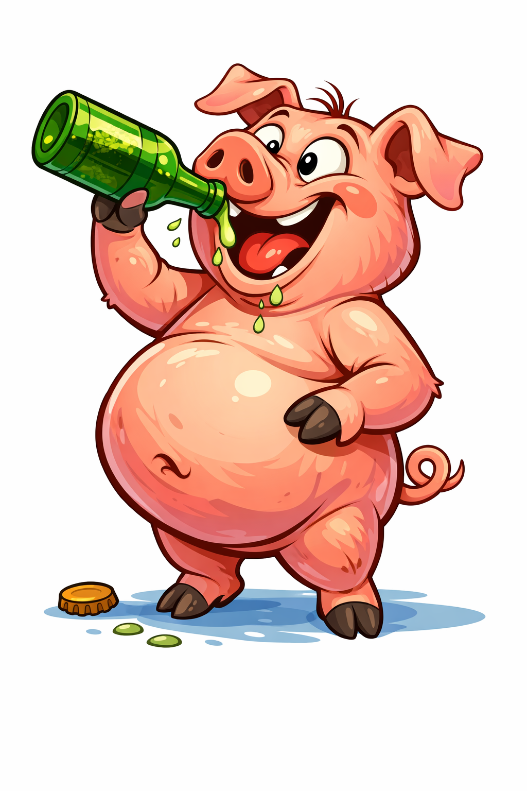

# [Алкоголь](./alcohol.md)

---

# [Алкоголь](./alcohol.md) 

## Введение

Привет, [друзья](../../../4.1_rules_of_study/how_to_learn_effectively/articles/peer_learning.md)! Сегодня поговорим об **[алкоголе](./alcohol.md)**. Это напитки, которые содержат спирт. Иногда их воспринимают как часть «взрослой жизни», но для [здоровья](./health.md) они могут быть опасны, особенно для подростков. [Организм](../../../1.2_natural_sciences/neurobiology_for_teens/articles/03_nervous_system_map.md) ещё развивается, и алкоголь мешает ему нормально расти и учиться.

## Основная часть

Алкоголь влияет на [мозг](../../../3.1. healthy lifestyle/Sleep, nutrition, and adolescent energy/articles/breakfast_for_the_brain.md) и [поведение](../../../1.2_natural_sciences/neurobiology_for_teens/articles/06_phineas_gage.md). [Человек](../../../1.2_natural_sciences/physics_in_everyday_life/Q45003.md) хуже соображает, теряет внимательность и делает [ошибки](../../../3.1_healthy_lifestyle/pervaya_pomoshch/ushibi_porezy_ozhogi/07_ushib_chego_nelzya.md). После употребления снижается координация, и возрастает [риск](../../../1.2_natural_sciences/neurobiology_for_teens/articles/05_teen_brain.md) травм. Кроме того, алкоголь может стать привычкой, от которой трудно отказаться.

### Как это работает

1. **[Влияние](../../../5.1_technology_and_digital_literacy/information and media literacy/манипуляции_и_пропаганда.md) на мозг**: спирт снижает [скорость](../../../1.2_natural_sciences/physics_in_everyday_life/Q11402.md) мышления и ухудшает [память](../../../3.1. healthy lifestyle/Sleep, nutrition, and adolescent energy/articles/sleep_and_memory_grades.md).
2. **Риск для безопасности**: реакции становятся медленнее, поэтому увеличивается шанс несчастных случаев.
3. **Формирование [привычки](../../../1.2_natural_sciences/neurobiology_for_teens/articles/11_reward_system.md)**: регулярное употребление превращается в [зависимость](how_addiction_changes_personality.md) и мешает учёбе и общению.

## Примеры из жизни школьника

1. **Кирилл и контрольная**: Кирилл попробовал алкоголь на празднике и на следующий день плохо [запомнил](../../../4.1_rules_of_study/how_to_memorize/articles/zapominanie.md) тему. На контрольной он растерялся и написал хуже, чем обычно.
2. **Аня и компания**: Аня отказалась от алкоголя, когда друзья предлагали «для смелости». Она почувствовала [уважение](../../../5.1_technology_and_digital_literacy/information and media literacy/этика_общения_в_сети.md) к себе и поняла, что может принимать решения сама.
3. **Денис и [тренировки](../../../3.1. healthy lifestyle/Sleep, nutrition, and adolescent energy/articles/sport_and_energy.md)**: Денис заметил, что после праздников с алкоголем ему тяжелее тренироваться. Он решил вообще не употреблять, чтобы сохранять форму.

## Интересные [факты](../../../1.2_natural_sciences/physics_in_everyday_life/Q17737.md)

1. **Подростковый организм более уязвим**: алкоголь сильнее влияет на растущий мозг, чем на взрослый.
2. **[Привычка](../../../7.2 Media, leisure and hobbies /useful_and_interesting_leisure/articles/how_not_to_quit_hobby.md) формируется незаметно**: сначала кажется, что это редкость, а потом хочется [повторять](../../../4.1_rules_of_study/how_to_memorize/articles/povtorenie.md) всё чаще.

## [Заключение](../../../1.2_natural_sciences/physics_in_everyday_life/Q2225.md)

**[Алкоголь](./alcohol.md)** не помогает решить проблемы и не делает человека взрослее. Наоборот, он мешает учиться, заниматься спортом и чувствовать себя хорошо. Лучший [выбор](../../../2.1_society/cause_and_effect_relationships/articles/personal_choice.md) — беречь [здоровье](../../../3.1. healthy lifestyle/Sleep, nutrition, and adolescent energy/articles/chronic_sleep_deprivation.md) и искать радость в безопасных занятиях и общении. 🌟

---

*[Автор](../../../4.2_thinking_and_working_information/how_to_search_information/articles/copypaste.md): Дмитрий Марьин • Сгенерировано с помощью OpenRouter • Слов: 302 • 2026-03-17*
