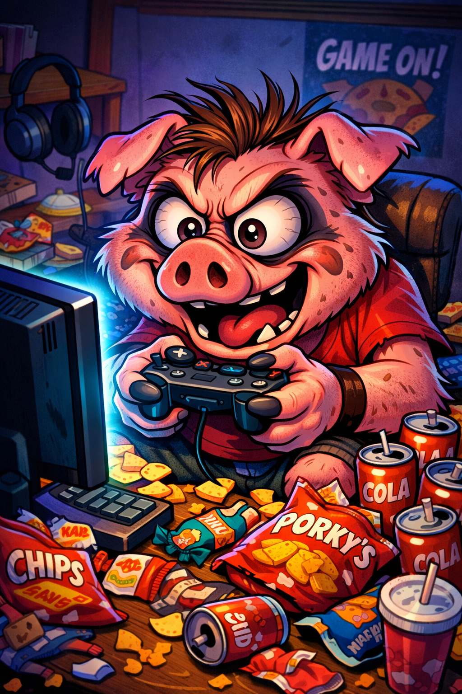

# [Зависимость от компьютерных игр](./computer_games.md)

## Введение

**[Компьютерные игры](./computer_games.md)** — заметная часть современной культуры: они развлекают, развивают [навыки](../../../7.2 Media, leisure and hobbies /useful_and_interesting_leisure/articles/computer_games_with_benefit.md) и помогают общаться. Однако у части игроков формируется **[зависимость](./computer_games.md)**, при которой [игра](../../../4.1_rules_of_study/how_to_learn_effectively/articles/gamification.md) перестает быть просто [хобби](../../../2.1_society/how_and_where_find_friends/articles/neochevidnye_mesta_dlya_znakomstva.md) и начинает доминировать над учебой, [работой](../../../8.2_future/choosing_a_career_path/articles/interview.md), **[здоровьем](./health.md)** и отношениями.

## Что такое игровая [зависимость](../../../3.1. healthy lifestyle/Sleep, nutrition, and adolescent energy/articles/the_energy_trap.md)

**[Игровая зависимость](./computer_games.md)** — это устойчивое, трудно контролируемое стремление играть, сопровождаемое потерей баланса между игрой и другими сферами жизни **[человека](./person.md)**. Важно отличать увлеченность от зависимости: первое не разрушает привычный уклад, второе — нарушает его.

## Основные [признаки](../../../3.1_healthy_lifestyle/pervaya_pomoshch/ushibi_porezy_ozhogi/04_ushib_chto_eto_priznaki.md)

1. [Потеря](../../../1.2_natural_sciences/neurobiology_for_teens/articles/20_sadness.md) контроля над временем, проведенным в **[игре](./computer_games.md)**.
2. Снижение интереса к прежним увлечениям, учебе или [работе](../../../8.2_future/choosing_a_career_path/articles/interview.md).
3. Игры становятся способом уйти от проблем, **[стресса](./stress.md)** или одиночества.
4. Раздражительность или [тревога](Doomscrolling.md) при невозможности поиграть.
5. Конфликты с близкими из-за режима и длительности **[игры](./computer_games.md)**.

## Причины формирования зависимости

1. **[Психологические факторы](./psychology.md)**: [стресс](../../../3.1. healthy lifestyle/Sleep, nutrition, and adolescent energy/articles/chronic_sleep_deprivation.md), [тревожность](../../../../8.1_self_understanding/articles/causes.md), низкая [самооценка](../../../2.1_society/how_and_where_find_friends/articles/otkaz_ne_konets.md), дефицит поддержки.
2. **[Социальные факторы](./social.md)**: [одиночество](../../../2.1_society/how_and_where_find_friends/articles/sam_sebe_interesnyi.md), [трудности](../../../4.1_rules_of_study/how_to_learn_effectively/articles/growth_mindset.md) с коммуникацией, отсутствие альтернативных активностей.
3. **[Дизайн игр](./game_design.md)**: системы [наград](Dopamine.md), ежедневные задания, рейтинги и внутриигровые события подталкивают к регулярному возвращению.

## Последствия

1. **[Учеба](./education.md)** или [работа](../../../1.2_natural_sciences/physics_in_everyday_life/Q11382.md): снижение успеваемости, пропуски, потеря мотивации.
2. **[Здоровье](./health.md)**: [недосып](nedosypanie.md), ухудшение зрения, проблемы с осанкой, [малоподвижность](malopodvizhnost.md).
3. **[Отношения](./relationships.md)**: отчуждение от семьи и друзей, снижение качества общения.
4. **[Психическое состояние](./mental_health.md)**: [рост](../../../3.1. healthy lifestyle/Sleep, nutrition, and adolescent energy/articles/micronutrients_and_teenagers.md) тревожности, раздражительности, чувство вины.

## Как отличить [риск](../../../1.2_natural_sciences/neurobiology_for_teens/articles/05_teen_brain.md) от зависимости

Если **[игра](./computer_games.md)** мешает обязательствам, а попытки сократить [время](../../../1.2_natural_sciences/physics_in_everyday_life/Q20702.md) регулярно заканчиваются срывами, это повод задуматься. Наличие одного признака еще не означает **[зависимость](./computer_games.md)**, но сочетание нескольких — [сигнал](../../../5.1_technology_and_digital_literacy/how_internet_works/articles/wifi/router.md) для изменения привычек.

## [Профилактика](../../../3.1_healthy_lifestyle/pervaya_pomoshch/ushibi_porezy_ozhogi/18_mify_i_7_pravil.md)

1. Четкий [режим дня](../../../3.1. healthy lifestyle/Sleep, nutrition, and adolescent energy/articles/social_jetlag_and_monday_morning.md) и ограничение времени **[игры](./computer_games.md)**.
2. Разнообразие активности: **[спорт](./sport.md)**, хобби, [прогулки](../../../7.2 Media, leisure and hobbies /useful_and_interesting_leisure/articles/active_recreation_and_sport.md), встречи.
3. Осознанное отношение к **[играм](./computer_games.md)**: понимать, что именно привлекает и почему.
4. [Перерывы](../../../4.1_rules_of_study/how_to_learn_effectively/articles/breaks_and_rest.md): короткие паузы каждые 60–90 минут.

## [Помощь](../../../3.1_healthy_lifestyle/pervaya_pomoshch/ushibi_porezy_ozhogi/10_krovotechenie_chto_delat.md) и [поддержка](../../../1.2_natural_sciences/neurobiology_for_teens/articles/17_hugs_oxytocin.md)

1. **[Саморегуляция](./self_regulation.md)**: [планирование](../../../3.1. healthy lifestyle/Sleep, nutrition, and adolescent energy/articles/ideal_schedule_energy_management.md) времени, отключение уведомлений, ограничение доступа к устройству в ночное время.
2. Поддержка близких: спокойный [разговор](../../../2.1_society/how_and_where_find_friends/articles/izi_temy_dlya_razgovora.md) без обвинений, [поиск](../../../3.2 healthy lifestyle/how to act in a dangerous situation/articles/lost-in-city.md) совместных альтернатив.
3. **[Профессиональная помощь](./help.md)**: консультации психолога при устойчивых трудностях контроля.

## [Заключение](../../../1.2_natural_sciences/physics_in_everyday_life/Q2225.md)

**[Компьютерные игры](./computer_games.md)** сами по себе не опасны, но важно сохранять [баланс](../../../1.2_natural_sciences/physics_in_everyday_life/Q634.md). Осознанность, [режим](../../../4.1_rules_of_study/how_to_learn_effectively/articles/breaks_and_rest.md) и поддержка помогают сделать игры частью полноценной жизни, а не ее единственным содержанием.

---

*[Автор](../../../4.2_thinking_and_working_information/how_to_search_information/articles/copypaste.md): Дмитрий Марьин • Сгенерировано с помощью OpenRouter • Слов: 327 • 2026-03-17*
