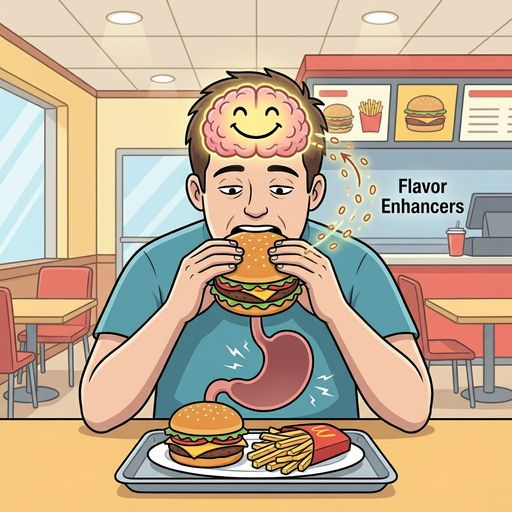

# Фастфуд и пищевой мусор: Как усилители вкуса подменяют чувство сытости

Ты съел целый бургер, большую картошку фри и запил всё это колой. По калориям — почти дневная норма. Желудок полный. Но через полтора часа ты снова хочешь есть. Как так?

Это не баг твоего организма. Это **фича** индустрии фастфуда. [Еда](../../../3.1. healthy lifestyle/Sleep, nutrition, and adolescent energy/articles/stress_and_food.md) специально разработана так, чтобы ты не мог остановиться и хотел ещё.

---

## [Формула](../../../1.2_natural_sciences/physics_in_everyday_life/Q11652.md) зависимости: [соль](myths_about_soft_drugs.md) + [сахар](../../../3.1. healthy lifestyle/Sleep, nutrition, and adolescent energy/articles/sugar_rollercoaster.md) + жир

В 1990-х годах [учёный](../../../1.2_natural_sciences/why_science_help_understand_world/science.md) Говард Москвиц ввёл понятие **bliss point** — «точка блаженства». Это идеальная пропорция [соли](myths_about_soft_drugs.md), сахара и жира, при которой [мозг](../../../3.1. healthy lifestyle/Sleep, nutrition, and adolescent energy/articles/breakfast_for_the_brain.md) получает максимальный выброс [дофамина](Dopamine.md).

Вся индустрия фастфуда построена на этой формуле. Каждый продукт — от соуса до булки — проходит десятки лабораторных тестов, чтобы попасть в эту точку.

| Компонент | Зачем нужен | Как работает |
| :--- | :--- | :--- |
| **Сахар** | Вызывает мгновенное [удовольствие](../../../1.2_natural_sciences/neurobiology_for_teens/articles/11_reward_system.md) | Активирует дофаминовые рецепторы, формирует тягу |
| **Соль** | Усиливает [вкус](../../../1.2_natural_sciences/neurobiology_for_teens/articles/10_sweet_tooth.md), маскирует дешевое сырьё | Задерживает воду, вызывает жажду (= покупка напитка) |
| **Жир** | Создаёт ощущение «насыщенности» во рту | Калорийный, но мозг плохо считает калории из жира |

Когда все три компонента совпадают — мозг буквально не может сказать «хватит». Это не слабость воли. Это [инженерия](../../../1.2_natural_sciences/physics_in_everyday_life/Q161635.md).

---

## Глутамат натрия: Вкус, которого нет

На этикетках ты можешь увидеть загадочное **E621** — это **глутамат натрия** (MSG). Один из самых мощных усилителей вкуса в мире.

Как он работает? В языке человека есть рецепторы пятого вкуса — **умами** (от японского «приятный вкус»). Это вкус белка, мяса, бульона. Когда рецепторы умами активируются, мозг получает [сигнал](../../../5.1_technology_and_digital_literacy/how_internet_works/articles/wifi/router.md): «Поступает белок! Это питательная еда!»

Глутамат натрия активирует эти рецепторы **искусственно**. Мозг думает, что ты ешь богатую белком пищу, хотя на самом деле перед тобой — крахмал, дешёвый жир и ароматизаторы.

**[Результат](../../../1.2_natural_sciences/why_science_help_understand_world/experimental_science.md):** Ты ешь пустые калории, но мозг записывает этот [опыт](../../../1.2_natural_sciences/why_science_help_understand_world/experimental_science.md) как «суперпитательный». И в следующий раз, когда ты проходишь мимо фастфуда, [тело](../../../1.2_natural_sciences/why_science_help_understand_world/organism.md) буквально тянет зайти. Потому что мозг помнит: «Там была отличная еда».

Только еды там не было. Был обман.

---

## Почему фастфуд не насыщает

Настоящая сытость — это сложный [процесс](../../../5.1_technology_and_digital_literacy/operating system/articles/process.md). Она зависит не только от объёма пищи в желудке, а от того, **что именно** ты съел.

### Как работает нормальное [насыщение](../../../1.2_natural_sciences/neurobiology_for_teens/articles/08_hunger.md)

1. Ты ешь продукт с белком и клетчаткой (мясо, овощи, крупы).
2. Желудок растягивается — первый сигнал мозгу.
3. В кишечнике питательные вещества всасываются — [организм](../../../1.2_natural_sciences/neurobiology_for_teens/articles/03_nervous_system_map.md) выделяет гормоны сытости (**[лептин](../../../1.2_natural_sciences/neurobiology_for_teens/articles/08_hunger.md)**, **холецистокинин**).
4. Мозг получает сигнал: «Достаточно, мы сыты».

### Как работает фастфуд

1. Ты ешь продукт с быстрыми углеводами и жиром, но почти без клетчатки.
2. Желудок растягивается — сигнал мозгу есть.
3. Но еда проскакивает через кишечник слишком быстро — гормоны сытости **не успевают выделиться** в полном объёме.
4. Через час мозг снова требует еду: «Где питательные вещества? Я их не получил!»

Вот почему после [тарелки](../../../7.1_art/musical_instruments/articles/drums.md) гречки с курицей ты сыт четыре часа, а после бургера с картошкой — голоден через полтора.

---

## Что такое «пищевой мусор»

Пищевой мусор — это не ругательство. Это термин для продуктов, которые содержат **много калорий и почти ноль пользы**: ни витаминов, ни минералов, ни клетчатки, ни нормального белка.

Примеры:

* **Чипсы** — крахмал + жир + соль + ароматизаторы
* **Сладкая газировка** — [вода](../../../3.1. healthy lifestyle/Sleep, nutrition, and adolescent energy/articles/drinking_regime.md) + сахар + [кислота](../../../1.1_structure_of_the_world/matter/articles/12_chemical_properties.md) + краситель
* **Лапша быстрого приготовления** — рафинированная мука + пальмовое масло + глутамат
* **Сухарики и снеки** — белая мука + жир + усилители вкуса
* **Дешёвые сосиски** — крахмал, шкуры, жир, нитриты и 5% мяса

Проблема не в [том](../../../7.1_art/musical_instruments/articles/drums.md), что ты съел это один раз. Проблема в том, что эта еда **вытесняет нормальную**. Когда ты перекусил чипсами — ты не голоден, но и не накормлен. Организм недополучил строительный [материал](../../../1.2_natural_sciences/physics_in_everyday_life/Q25358.md), а калории уже потрачены.

---

## Как фастфуд меняет вкусовые рецепторы

Есть [исследование](../../../1.2_natural_sciences/neurobiology_for_teens/articles/19_curiosity.md), которое должно тебя напрячь. Учёные из Университета Дьюка обнаружили, что регулярное [потребление](../../../2.1_society/cause_and_effect_relationships/articles/ecological_footprint.md) продуктов с усилителями вкуса **снижает чувствительность рецепторов**.

Простыми словами: после месяца на чипсах и бургерах обычная домашняя еда кажется пресной и невкусной. Не потому что она стала хуже, а потому что твои рецепторы привыкли к химическому «крику» усилителей.

Это работает как [громкость](../../../1.2_natural_sciences/physics_in_everyday_life/Q159190.md) музыки. Если ты привык слушать на максимуме — тихая [музыка](../../../1.2_natural_sciences/neurobiology_for_teens/articles/18_music_chills.md) кажется беззвучной. Рецепторы точно так же «оглушаются».

Хорошая [новость](../../../5.1_technology_and_digital_literacy/information and media literacy/информационная_диета.md): это **обратимо**. Через 2–3 недели без сверхстимуляции рецепторы восстанавливаются, и обычная еда снова становится вкусной.

---

## Фастфуд и [мозг подростка](../../../1.2_natural_sciences/neurobiology_for_teens/articles/05_teen_brain.md)

[Подростковый мозг](../../../1.2_natural_sciences/neurobiology_for_teens/articles/13_nicotine.md) особенно уязвим перед фастфудом. И вот почему.

### Дофаминовая ловушка

Сочетание соли, сахара и жира активирует **дофаминовую систему** — ту же самую, которая реагирует на [соцсети](Social_media.md), игры и другие «быстрые удовольствия». Мозг подростка находится в стадии активного формирования нейронных связей. Если в этот [период](../../../1.2_natural_sciences/physics_in_everyday_life/Q11652.md) он регулярно получает мощные дофаминовые «удары» от фастфуда, формируется устойчивый паттерн:

**[Стресс](../../../3.1. healthy lifestyle/Sleep, nutrition, and adolescent energy/articles/chronic_sleep_deprivation.md) → Фастфуд → Облегчение → [Повторение](../../../4.1_rules_of_study/how_to_memorize/articles/povtorenie.md)**

Это не метафора. Исследование Йельского университета показало, что снимки мозга людей, смотрящих на фотографии фастфуда, совпадают с реакциями мозга наркозависимых при виде вещества. Активируются одни и те же зоны — **[прилежащее ядро](../../../1.2_natural_sciences/neurobiology_for_teens/articles/11_reward_system.md) и вентральная область покрышки**.

### [Влияние](../../../5.1_technology_and_digital_literacy/information and media literacy/манипуляции_и_пропаганда.md) на [память](../../../3.1. healthy lifestyle/Sleep, nutrition, and adolescent energy/articles/sleep_and_memory_grades.md) и учёбу

Исследование Университета Нового Южного Уэльса (2023) показало, что крысы, которых неделю кормили едой с высоким содержанием жира и сахара, **хуже ориентировались в лабиринтах** и медленнее учились новым задачам. У них наблюдалось воспаление в гиппокампе — области мозга, отвечающей за память.

У людей эффект аналогичный. [Подростки](../../../3.1. healthy lifestyle/Sleep, nutrition, and adolescent energy/articles/biology_of_night_owls_teens.md), которые регулярно питаются фастфудом, показывают более низкие [результаты](../../../1.2_natural_sciences/why_science_help_understand_world/research_work.md) в тестах на рабочую память и концентрацию. Не потому что они «глупые», а потому что мозг буквально не получает материалов для нормальной [работы](../../../8.2_future/choosing_a_career_path/articles/interview.md) и одновременно борется с хроническим воспалением.

### Кожа, [вес](../../../1.2_natural_sciences/physics_in_everyday_life/Q11023.md) и [самооценка](../../../2.1_society/how_and_where_find_friends/articles/otkaz_ne_konets.md)

Фастфуд бьёт и по внешности. Избыток жиров и сахара провоцирует:

* **Акне** — кожное сало вырабатывается активнее из-за скачков инсулина
* **Набор веса** — причём жир откладывается преимущественно в области живота (висцеральный жир — самый опасный)
* **Тусклые волосы и ломкие [ногти](nailbiting.md)** — организм недополучает витаминов и минералов

А дальше срабатывает порочный круг: подросток недоволен внешностью → стресс → «заедает» стресс фастфудом → [внешность](../../../7.2 Media, leisure and hobbies/Computer games/articles/heroes_and_villains/create_your_hero.md) ухудшается → больше стресса.

---

## Что скрывают этикетки: разбор реальных составов

Давай честно посмотрим, из чего состоят «обычные» [продукты](../../../3.1. healthy lifestyle/Sleep, nutrition, and adolescent energy/articles/healthy_school_snacks.md), которые ты ешь, не задумываясь.

### Куриные наггетсы из фастфуда

Ты думаешь, что ешь курицу. На деле в типичных наггетсах из сетевого ресторана:

* **40–50% — курица** (и это не филе, а так называемая «механическая обвалка» — кости, хрящи и остатки мяса, перемолотые в пасту)
* **20% — панировка** из рафинированной муки и крахмала
* **15% — растительное масло** (впитанное при жарке во фритюре)
* **15% — вода, стабилизаторы, ароматизаторы**, глутамат, фосфаты

[Итого](../../../1.2_natural_sciences/physics_in_everyday_life/Q182453.md): **половина того, что ты считаешь мясом — не мясо.**

### Газировка

Стандартная порция (0,5 л) содержит:

* **53 г сахара** — это 13 чайных ложек. Дневная норма ВОЗ — 6 ложек
* **Ортофосфорная кислота** — та же кислота, которой чистят ржавчину. В малых дозах не убивает, но эмаль зубов разрушает за месяцы
* **[Кофеин](energetiki.md)** — 30–50 мг, чтобы ты захотел ещё
* **Карамельный краситель** — при производстве которого образуется [вещество](../../../1.1_structure_of_the_world/matter/articles/01_matter.md) 4-MEI, классифицированное как «возможно канцерогенное»

### Соус «сырный» или «чесночный»

В большинстве сетевых ресторанов этот соус содержит:

* 0% сыра или чеснока в натуральном виде
* Растительный жир, крахмал, ароматизаторы, идентичные натуральным, красители, консерванты

Название «сырный» — маркетинговый ход. По закону достаточно, чтобы вкус **напоминал** сыр.

---

## Маркетинг: как тебя заставляют покупать

Фастфуд-компании тратят миллиарды на то, чтобы ты зашёл именно к ним. Вот несколько приёмов, о которых стоит знать:

* **Красный и жёлтый [цвета](../../../1.2_natural_sciences/physics_in_everyday_life/Q11652.md)** в логотипах — они вызывают [голод](../../../1.2_natural_sciences/neurobiology_for_teens/articles/08_hunger.md) и ощущение срочности (вспомни McDonald's, Burger King, KFC)
* **Запах** — [вентиляция](../../../1.2_natural_sciences/physics_in_everyday_life/Q160329.md) ресторанов специально выводит аромат выпечки и жареного на улицу
* **Комбо-наборы** — ты берёшь больше, чем хотел, потому что «так выгоднее»
* **Размер порций** — маленький стакан газировки в фастфуде больше, чем стандартная кружка дома
* **[Скорость](../../../1.2_natural_sciences/physics_in_everyday_life/Q11402.md)** — еда готова за минуту, ты не успеваешь подумать, голоден ли ты на самом деле

---

## [Эксперимент](../../../1.2_natural_sciences/physics_in_everyday_life/Q1293220.md): [Что происходит](../../../5.1_technology_and_digital_literacy/how_internet_works/articles/web_basics/what_happens.md), если месяц питаться фастфудом

В 2004 году [режиссёр](../../../../8.1_entertainment/articles/director.md) Морган Сперлок провёл эксперимент, который лёг в основу документального фильма **Super Size Me**. [Правила](../../../2.1_society/cause_and_effect_relationships/articles/why_rules_work.md) были простые: 30 дней подряд есть только в McDonald's, три раза в день.

Результаты за один месяц:

* **Набрал 11 кг** веса
* [Уровень](../../../../8.1_entertainment/articles/gamification.md) холестерина вырос на **65%**
* Появились **боли в печени** — врачи сравнили состояние с алкогольным гепатитом
* [Настроение](../../../1.2_natural_sciences/neurobiology_for_teens/articles/10_sweet_tooth.md): постоянная раздражительность, апатия, упадок сил
* Сексуальная функция: снижение
* **[Восстановление](../../../4.1_rules_of_study/how_to_learn_effectively/articles/breaks_and_rest.md) заняло 14 месяцев** — в пять раз дольше, чем сам эксперимент

Конечно, никто не ест фастфуд три раза в день. Но если ты перекусываешь им 3–4 раза в неделю — ты на тех же рельсах, просто едешь медленнее.

---

## [Сравнение](../../../5.2_cybersecurity/cpp_fundamentals/5_operators.md): Фастфуд vs Домашняя еда

| | Бургер из сети | Домашний бургер |
| :--- | :--- | :--- |
| **Мясо** | Замороженная котлета из обвалки с добавками | Фарш из говядины, который ты видишь |
| **Булка** | Белая мука + сахар + консерванты (не плесневеет неделями) | Обычная булка (черствеет за 2 дня — это нормально) |
| **Соус** | Растительный жир + ароматизаторы + сахар | Сметана + горчица + огурец (30 секунд приготовления) |
| **Калории** | [500](../../../5.1_technology_and_digital_literacy/how_internet_works/articles/http_https/http_https.md)–700 ккал, почти без пользы | 350–500 ккал с реальным белком и витаминами |
| **[Стоимость](../../../6.1_Independent_living_and_daily_living_skills/reasonable_spending/articles/price.md)** | 250–400 ₽ за один бургер | 150–[200](../../../5.1_technology_and_digital_literacy/how_internet_works/articles/http_https/http_https.md) ₽ за порцию (с учётом продуктов на 4 бургера) |
| **[Время](../../../1.2_natural_sciences/physics_in_everyday_life/Q20702.md)** | 5 минут | 20 минут |

Двадцать минут — это одна серия на YouTube. Зато ты точно знаешь, что ешь.

---

## Что делать: Практический чек-лист

Мы не будем говорить «никогда не ешь фастфуд». Это нереалистично и бессмысленно. Но ты можешь перестать быть лёгкой добычей:

1. **Ешь до того, как проголодался.** Если ты идёшь мимо фастфуда сытым — шансы зайти минимальны. Голодный мозг не умеет принимать рациональные решения.
2. **Читай составы.** Просто начни. Ты удивишься, сколько «мусора» в продуктах, которые считаешь нормальными.
3. **[Правило](../../../1.2_natural_sciences/why_science_help_understand_world/patterns.md) 80/20.** 80% еды — нормальная, домашняя, понятная. 20% — что хочешь. Это устойчивый [баланс](../../../1.2_natural_sciences/physics_in_everyday_life/Q634.md) без фанатизма.
4. **Готовь аналоги дома.** Бургер из нормального мяса с овощами на гриле — вкуснее и дешевле, чем из ресторана. Картошку можно запечь в духовке вместо того, чтобы топить во фритюре.
5. **Устрой себе «перезагрузку» на 2 недели.** Откажись от чипсов, газировки и снеков. На третий день будет тяжело. К десятому — обычная еда начнёт раскрываться новыми вкусами.

> **Важный [вывод](../../../1.2_natural_sciences/why_science_help_understand_world/scientific_method.md):** Фастфуд не утоляет голод — он его создаёт. Твоё тело не получает того, что ему нужно, и продолжает просить ещё. Единственный способ разорвать этот цикл — дать организму настоящую еду.

---

**[Автор](../../../4.2_thinking_and_working_information/how_to_search_information/articles/copypaste.md):** Воробьев Глеб

**Нейронные сети, использованные при создании статьи:** Claude (Anthropic)
