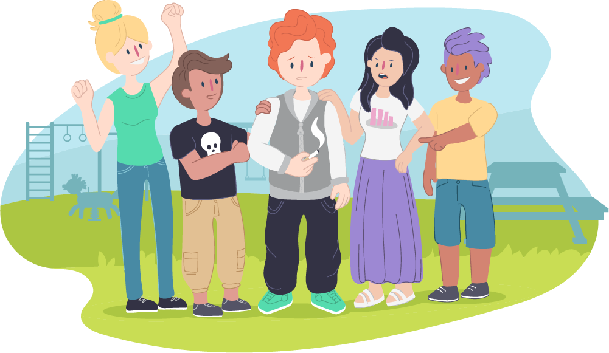
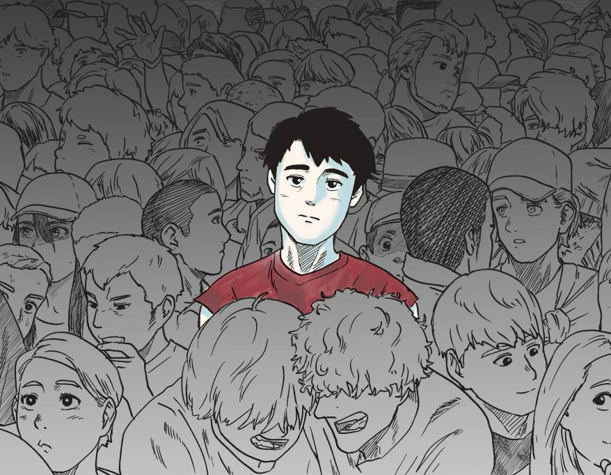
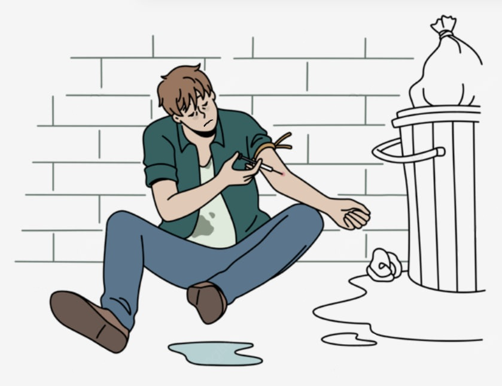

# Как [зависимость](../../../3.1. healthy lifestyle/Sleep, nutrition, and adolescent energy/articles/the_energy_trap.md) меняет [личность](../../../1.2_natural_sciences/neurobiology_for_teens/articles/06_phineas_gage.md): [история](../../../1.2_natural_sciences/physics_in_everyday_life/Q11469.md) одного «эксперимента»

> Знаешь, как выглядит дорога в никуда? Она никогда не начинается с обрыва. Сначала это просто тропинка, на которую свернули «просто посмотреть». А потом ты уже бежишь по ней и не можешь остановиться. Давай расскажу историю. Имя мы изменим, но таких историй — тысячи.

## Знакомься, это Дима

Дима — обычный парень. Ему 15. Он не плохой и не хороший — он самый обычный. Учится себе, играет в [компьютерные игры](computer_games.md), тусуется с друзьями. Иногда ссорится с родителями, иногда получает пятерки. В общем, ничего особенного.

Как думаешь, Дима планировал стать наркоманом? Конечно нет. Он просто хотел попробовать. Один раз. «За компанию». Ему говорили, что это «легкие» [наркотики](myths_about_soft_drugs.md), что это сейчас модно, что все так делают. И Дима поверил.

А теперь давай посмотрим, что случилось с Димой дальше.

---

## Этап 1. [Эксперимент](../../../1.2_natural_sciences/physics_in_everyday_life/Q1293220.md) (первые 1–2 месяца)

*Как это выглядит со стороны*

Дима начал иногда курить «травку» с друзьями на выходных. Иногда — нюхать соли на вечеринках. Он думал: «Я же контролирую [процесс](../../../5.1_technology_and_digital_literacy/operating system/articles/process.md). Я просто расслабляюсь. Это весело».

*[Что происходит](../../../5.1_technology_and_digital_literacy/how_internet_works/articles/web_basics/what_happens.md) внутри на самом деле*

[Мозг](../../../3.1. healthy lifestyle/Sleep, nutrition, and adolescent energy/articles/breakfast_for_the_brain.md) Димы быстро привыкает к тому, что кайф можно получать без усилий. Обычные радости — вкусная [еда](../../../3.1. healthy lifestyle/Sleep, nutrition, and adolescent energy/articles/stress_and_food.md), хорошая [музыка](../../../1.2_natural_sciences/neurobiology_for_teens/articles/18_music_chills.md), [общение](../../../2.1_society/how_and_where_find_friends/articles/guide_dlya_introvertov.md) с девушкой — становятся бледными и неинтересными.

Дима пока этого не замечает. Ему кажется, что все нормально. Но внутри уже запущены [часы](../../../1.2_natural_sciences/physics_in_everyday_life/Q20702.md).

**Признак этапа:**
> «Я могу бросить в любой момент. Просто пока не [хочу](../../../6.1_Independent_living_and_daily_living_skills/reasonable_spending/articles/want.md)».

---

## Этап 2. [Привычка](../../../7.2 Media, leisure and hobbies /useful_and_interesting_leisure/articles/how_not_to_quit_hobby.md) (3–6 месяцев)

*Как это выглядит со стороны*

Дима уже не ждет выходных, чтобы «расслабиться». Мысль о [том](../../../7.1_art/musical_instruments/articles/drums.md), чтобы употребить, приходит сама собой. Просто так, после школы. Или перед тем, как сесть за уроки. Или когда погода плохая.

[Друзья](../../../4.1_rules_of_study/how_to_learn_effectively/articles/peer_learning.md) начинают [замечать](../../../4.1_rules_of_study/how_to_memorize/articles/vnimanie.md), что Дима изменился. Раньше он был веселый, а теперь часто раздраженный. Раньше у него было много интересов, а теперь — только одна тема для разговоров: где и с кем можно «зависнуть».

Дима бросает старую компанию. Те, кто не употребляют, кажутся ему скучными. «Они ничего не понимают в жизни», — думает Дима.

*Что происходит внутри на самом деле*

Мозг Димы перестраивается. [Нейронные связи](../../../1.2_natural_sciences/neurobiology_for_teens/articles/21_how_memory_works.md), отвечающие за дружбу, учебу, [хобби](../../../2.1_society/how_and_where_find_friends/articles/neochevidnye_mesta_dlya_znakomstva.md) — отмирают за ненадобностью. Зато связи «[стресс](../../../3.1. healthy lifestyle/Sleep, nutrition, and adolescent energy/articles/chronic_sleep_deprivation.md) → [доза](overdose.md)» становятся супер-магистралями.

Дима уже не получает удовольствия от вещества. Он просто возвращает себя в «нормальное» состояние. То, что раньше казалось кайфом, теперь просто убирает ломку и плохое [настроение](../../../1.2_natural_sciences/neurobiology_for_teens/articles/10_sweet_tooth.md).

**Признак этапа:**
> «Мне это нужно, чтобы нормально себя чувствовать. Но я все еще контролирую дозу».

---

## Этап 3. Зависимость (6–12 месяцев)

*Как это выглядит со стороны*

Дима изменился до неузнаваемости. Посмотри на [фото](../../../5.1_technology_and_digital_literacy/information and media literacy/проверка_фото_на_манипуляции.md) годичной давности — это другой [человек](../../../1.2_natural_sciences/physics_in_everyday_life/Q45003.md).

Раньше: чистая [одежда](../../../1.2_natural_sciences/physics_in_everyday_life/Q487005.md), улыбка, ясный взгляд.
Сейчас: осунувшееся лицо, мешки под глазами, грязные волосы. Он похудел. Или наоборот — опух. Зубы портятся, кожа серая.

Дима врет родителям. Постоянно. Где был? У друзей. На что потратил [деньги](../../../2.1_society/cause_and_effect_relationships/articles/economic_chains.md)? Потерял. Почему не ночевал домой? Забыл предупредить.

Дима ворует. Сначала у родителей из кошелька — «просто в [долг](../../../2.1_society/cause_and_effect_relationships/articles/responsibility.md), я верну». Потом у друзей. Потом в магазинах.

Диме плевать на все. На учебу, на [будущее](../../../1.2_natural_sciences/physics_in_everyday_life/Q11469.md), на [отношения](../../../2.1_society/how_and_where_find_friends/articles/guide_dlya_introvertov.md). Есть только одна [цель](../../../1.2_natural_sciences/why_science_help_understand_world/research_work.md) — найти дозу.

*Что происходит внутри на самом деле*

Это называется **ангедония**. Дима разучился чувствовать радость без вещества. Вообще. Ему не вкусно, не интересно, не весело. Только страшно и больно.

Чтобы почувствовать себя человеком, нужна доза. Доза кончилась — началась ломка. Это не просто «плохое настроение». Это [боль](../../../1.2_natural_sciences/neurobiology_for_teens/articles/16_love_chemistry.md) во всем теле, озноб, пот, паника. Дима готов на все, чтобы это прекратить.

**Признак этапа:**
> «Я ненавижу себя. Я хочу остановиться. Но не могу».

---

## Что говорят врачи: почему Дима не может остановиться?

Слева — мозг здорового человека, справа — мозг наркомана

Мозг продолжает формироваться примерно до 21-25 лет. Самая последняя часть, которая созревает — это [лобные доли](../../../1.2_natural_sciences/neurobiology_for_teens/articles/04_main_parts_of_the_brain.md). Это та часть, которая отвечает за контроль. У подростков она еще не достроена до конца. А [наркотики](myths_about_soft_drugs.md) этот процесс строительства просто выключают.

Дима физически не может оценивать [риски](../../../7.2 Media, leisure and hobbies /useful_and_interesting_leisure/articles/safety_during_recreation.md) как взрослый человек. Его мозг работает по-другому. [Желание](../../../6.1_Independent_living_and_daily_living_skills/reasonable_spending/articles/want.md) сильнее разума.

Врачи называют это **«формирование зависимости»**. И это не слабость характера. Это болезнь. Так же как диабет или астма. Только диабет лечат таблетками, а зависимость лечить очень трудно. И не всегда получается.

---

## История Димы. Финал?

Давай остановимся здесь. Потому что дальше есть два варианта.

**Вариант А.** Дима попадает в больницу с [передозировкой](overdose.md). Или в тюрьму за кражу. Или просто исчезает — уходит из дома, теряется в большом городе. Таких историй много. Они не заканчиваются хорошо.

**Вариант Б.** Дима встречает человека, который говорит ему правду. [Родители](../../../../8.1_self_understanding/articles/family_influence.md), учитель, [психолог](../../../../8.1_self_understanding/articles/when_to_seek_help.md), кто-то из друзей, кто смог остановиться. Дима попадает в реабилитационный центр. Ему больно, трудно, он срывается, но потихоньку учится жить заново. Учиться радоваться простым вещам. Восстанавливать отношения. Мозг Димы после отказа от наркотиков постепенно восстанавливается.

Вариант Б возможен. Но он требует огромной [работы](../../../8.2_future/choosing_a_career_path/articles/interview.md) и помощи специалистов. Самому, без поддержки, выбраться почти невозможно. 

---

## Коротко: что случилось с Димой?

Давай соберем в одну таблицу то, через что прошел обычный парень за один год.

| Что было ДО | Что стало ЧЕРЕЗ ГОД |
| :--- | :--- |
| Учился в школе | Бросил школу или его выгнали |
| Был друг | Друзья остались только из «тусовки» |
| Хорошие отношения с родителями | Постоянные ссоры, вранье, кражи |
| Хобби, [интересы](../../../2.1_society/cause_and_effect_relationships/articles/conflict_roots.md) | Есть только одна цель — доза |
| Нормальный [сон](../../../3.1. healthy lifestyle/Sleep, nutrition, and adolescent energy/articles/evening_rituals_sleep_fast.md) и [аппетит](../../../1.2_natural_sciences/neurobiology_for_teens/articles/08_hunger.md) | [Бессонница](nedosypanie.md), худоба, болезни |
| Смотрел в будущее | Живет одним днем, будущего нет |

---

## Почему это важно понять прямо сейчас

Дима не собирался становиться зависимым. Он просто хотел попробовать. Один раз.

У тебя наверняка есть знакомые, которые уже прошли этот [путь](../../../1.2_natural_sciences/physics_in_everyday_life/Q11476.md). Или проходят прямо сейчас. Ты видишь, как они меняются. Ты чувствуешь, что что-то не так.

Ты не сможешь спасти того, кто не хочет спасаться. Но ты можешь сделать [выбор](../../../2.1_society/cause_and_effect_relationships/articles/personal_choice.md) за себя.

**История Димы — это не про «плохих людей». Это про обычных. Которые в какой-то момент поверили в «легкие наркотики» и в то, что они «контролируют ситуацию».**

Никто не просыпается утром с мыслью: «Хочу стать наркоманом». Это всегда начинается с одной маленькой уступки. С одного «просто попробую».

---

## Если ты узнал в этой истории себя или друга

Не молчи. Серьезно. Молчание — лучший друг зависимости.

*   Можно позвонить на телефон доверия: **8-800-2000-122**
*   Можно поговорить с родителями (да, это страшно, но они не враги, даже если сейчас кажется иначе)
*   Можно найти школьного психолога
*   Можно позвонить по номеру **8-800-700-50-50** — там работают специалисты по зависимостям

**Стыдно — болеть и ничего не делать. А просить [помощь](../../../3.1_healthy_lifestyle/pervaya_pomoshch/ushibi_porezy_ozhogi/10_krovotechenie_chto_delat.md) — не стыдно. Это нормально.**

Помни: у Димы в этой истории еще есть шанс. Но чем раньше он остановится, тем больше шансов, что он вернется к нормальной жизни.

---

**[Автор](../../../4.2_thinking_and_working_information/how_to_search_information/articles/copypaste.md):** Аксельрод Анастасия

**Нейронные сети, использованные при создании статьи:** DeepSeek