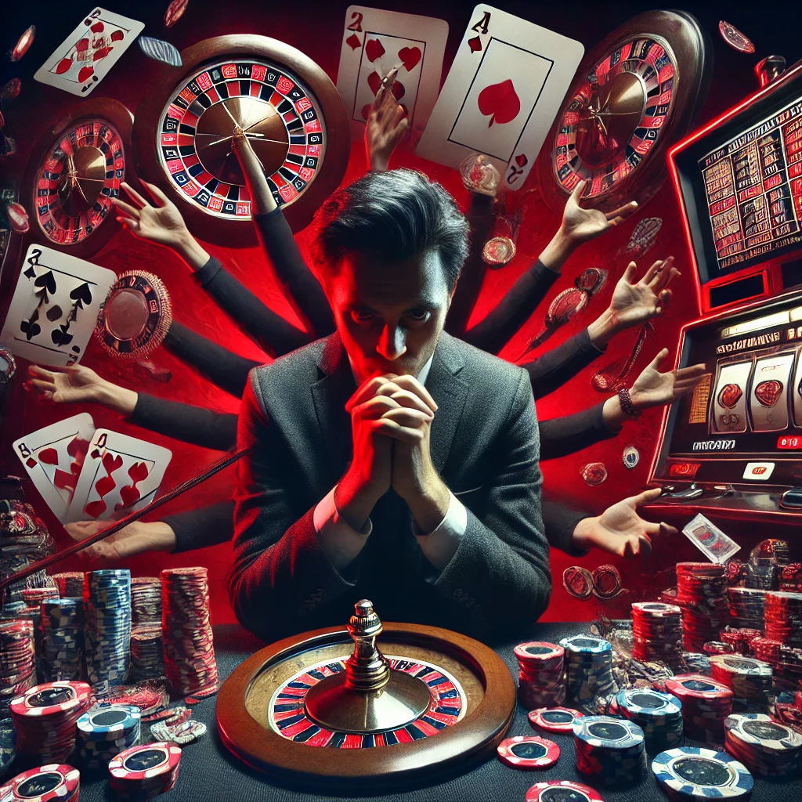

# Лудомания: [виды](../../../3.1_healthy_lifestyle/pervaya_pomoshch/ushibi_porezy_ozhogi/08_porezy_sadiny_vidy.md), последствия и пути преодоления

Лудомания ([игровая зависимость](computer_games.md), гемблинг-аддикция) — это серьезное психологическое расстройство, характеризующееся постоянной неспособностью человека сопротивляться импульсу играть в азартные игры, несмотря на разрушительные последствия для своего здоровья, финансового благополучия и социальных связей. В Международной классификации болезней (МКБ-11) лудомания классифицируется как расстройство, связанное с вызывающим [привыкание](../../../1.2_natural_sciences/neurobiology_for_teens/articles/11_reward_system.md) поведением. В этой статье мы рассмотрим основные виды игровой [зависимости](how_addiction_changes_personality.md), ее негативные последствия и эффективные [стратегии](../../../../8.1_self_understanding/articles/overcoming.md) [профилактики](profilaktika.md) и преодоления.

---

## Виды лудомании

Игровая зависимость не ограничивается только походами в казино. В современном мире она приобрела множество форм, которые условно можно разделить на несколько категорий.

### 1. Классическая (инструментальная) лудомания
Этот вид связан с традиционными азартными играми в реальных заведениях:
*   **Игровые автоматы:** Наиболее "быстрый" вид зависимости из-за мгновенной смены событий и иллюзии контроля.
*   **[Рулетка](../../../1.2_natural_sciences/physics_in_everyday_life/Q36253.md) и карточные игры (покер, блэкджек):** Здесь [зависимость](../../../3.1. healthy lifestyle/Sleep, nutrition, and adolescent energy/articles/the_energy_trap.md) часто подкрепляется верой игрока в собственные [навыки](../../../7.2 Media, leisure and hobbies /useful_and_interesting_leisure/articles/computer_games_with_benefit.md) и стратегии, что позволяет обыграть казино.
*   **Ставки на [спорт](../../../3.1. healthy lifestyle/Sleep, nutrition, and adolescent energy/articles/sport_and_energy.md) (беттинг):** Зависимый считает себя экспертом в спорте, что делает его уязвимым для постоянных ставок на исходы событий.

### 2. Компьютерная лудомания (гейминг-аддикция)
С развитием технологий зависимость от видеоигр стала отдельной серьезной проблемой:
*   **Многопользовательские ролевые игры (MMORPG):** Уход в виртуальный мир, где игрок проживает [жизнь](../../../1.2_natural_sciences/physics_in_everyday_life/Q1751973.md) своего персонажа, заменяя реальное [общение](../../../2.1_society/how_and_where_find_friends/articles/guide_dlya_introvertov.md) и [достижения](../../../4.1_rules_of_study/how_to_learn_effectively/articles/gamification.md).
*   **Социальные казино-игры:** Бесплатные игры с микротранзакциями (покупка внутриигровой валюты), которые имитируют механику азартных игр и приучают к ней с раннего возраста.
*   **Киберспортивные ставки:** Аналогичны ставкам на спорт, но в сфере компьютерных игр.

### 3. Лудомания в эпоху цифровых технологий
Новые формы зависимости, возникшие благодаря интернету:
*   **[Лутбоксы](computer_games.md):** Виртуальные контейнеры в играх с случайным набором предметов. Психологически они полностью идентичны игре в рулетку или открыванию карт.
*   **Крипто-гемблинг и ставки на криптовалюту:** Децентрализованные и анонимные платформы для азартных игр, которые сложнее контролировать.
*   **Трейдинг (дей-трейдинг):** Хотя это [форма](../../../7.1_art/modern_technological_art/articles/4.5_algorithmic_craft.md) инвестирования, для лудомана [процесс](../../../5.1_technology_and_digital_literacy/operating system/articles/process.md) покупки и продажи активов с высоким риском становится аналогом игры, где важен не [доход](../../../6.1_Independent_living_and_daily_living_skills/reasonable_spending/articles/income.md), а сам процесс и выброс адреналина.

---

## Негативные последствия лудомании

Игровая зависимость — это "болезнь", разрушающая все сферы жизни человека. Последствия можно разделить на несколько категорий:

### Финансовые последствия
*   Накопление огромных долгов и кредитов.
*   Продажа личного имущества.
*   Долги перед друзьями, родственниками и криминальными структурами.
*   Банкротство и [потеря](../../../1.2_natural_sciences/neurobiology_for_teens/articles/20_sadness.md) жилья.

### Социальные последствия
*   **Разрушение семьи:** Постоянная [ложь](../../../2.1_society/cause_and_effect_relationships/articles/false_connections.md), кражи у близких, потеря доверия и, как итог, разводы и разрыв с родственниками.
*   **Социальная [изоляция](../../../1.2_natural_sciences/physics_in_everyday_life/Q124291.md):** [Человек](../../../1.2_natural_sciences/physics_in_everyday_life/Q45003.md) перестает общаться с друзьями, не участвует в жизни общества, замыкаясь в своем мире игры.
*   **Потеря [работы](../../../8.2_future/choosing_a_career_path/articles/interview.md):** Снижение продуктивности, прогулы, неспособность выполнять свои обязанности из-за постоянных мыслей об игре.

### Психологические и физические последствия
*   Тяжелые формы депрессии, тревожности и апатии.
*   Суицидальные мысли и попытки ([риск](../../../1.2_natural_sciences/neurobiology_for_teens/articles/05_teen_brain.md) суицида среди лудоманов очень высок).
*   Психосоматические [заболевания](../../../8.2_future_and_path_choice/articles/stress_health_impact.md): [бессонница](nedosypanie.md), головные боли, проблемы с сердечно-сосудистой системой из-за постоянного стресса.
*   Злоупотребление [алкоголем](alcohol.md) или [наркотиками](myths_about_soft_drugs.md) как способ "снять [стресс](../../../3.1. healthy lifestyle/Sleep, nutrition, and adolescent energy/articles/chronic_sleep_deprivation.md)" после проигрыша.

---

## Как избежать и преодолеть зависимость

[Профилактика](../../../3.1_healthy_lifestyle/pervaya_pomoshch/ushibi_porezy_ozhogi/18_mify_i_7_pravil.md) и лечение лудомании — сложный процесс, требующий осознания проблемы и комплексного подхода.

### 1. Профилактика (Как не попасть в ловушку)
*   **Осознанность:** [Понимание](../../../2.1_society/cause_and_effect_relationships/articles/empathy_causality.md), что казино и игровые автоматы всегда настроены на прибыль. Выигрыш — это случайность, а не [закономерность](../../../2.1_society/cause_and_effect_relationships/articles/causality_base.md).
*   **Финансовый контроль:** Установите жесткие лимиты на суммы, которые вы готовы потратить на [развлечения](../../../6.1_Independent_living_and_daily_living_skills/reasonable_spending/articles/want.md) (и никогда не берите в [долг](../../../2.1_society/cause_and_effect_relationships/articles/responsibility.md) для игры).
*   **[Поиск](../../../3.2 healthy lifestyle/how to act in a dangerous situation/articles/lost-in-city.md) альтернатив:** Найдите [хобби](../../../2.1_society/how_and_where_find_friends/articles/neochevidnye_mesta_dlya_znakomstva.md) или занятие, которое приносит реальное [удовольствие](../../../1.2_natural_sciences/neurobiology_for_teens/articles/11_reward_system.md) и не связано с риском (спорт, [творчество](../../../2.1_society/how_and_where_find_friends/articles/sam_sebe_interesnyi.md), [чтение](../../../4.1_rules_of_study/how_to_learn_effectively/articles/reading_skills.md)).

### 2. [Самопомощь](../../../../8.1_self_understanding/articles/overcoming.md) на ранних стадиях
Если вы чувствуете, что тянетесь к игре:
*   Признайте проблему (самый важный [шаг](../../../1.2_natural_sciences/physics_in_everyday_life/Q36253.md)).
*   Ведите дневник расходов, чтобы видеть реальные суммы проигрышей.
*   Установите программы родительского контроля или блокировки игровых сайтов на своих устройствах.
*   Расскажите близкому человеку о своей проблеме.

### 3. Профессиональная [помощь](../../../3.1_healthy_lifestyle/pervaya_pomoshch/ushibi_porezy_ozhogi/10_krovotechenie_chto_delat.md)
На стадии сформировавшейся зависимости самопомощь часто неэффективна. Необходимо обратиться к специалистам:
*   **Психотерапия:** [Когнитивно-поведенческая терапия](../../../../8.1_self_understanding/articles/cbt_techniques.md) ([КПТ](../../../../8.1_self_understanding/articles/cbt_techniques.md)) помогает изменить [мышление](../../../1.2_natural_sciences/neurobiology_for_teens/articles/01_brain_complexity.md) и [поведение](../../../1.2_natural_sciences/neurobiology_for_teens/articles/06_phineas_gage.md), связанное с игрой.
*   **Группы поддержки:** Сообщества анонимных игроков (например, "Анонимные [игроки](../../../7.2 Media, leisure and hobbies/Computer games/articles/useful_tips/toxic_players.md)"), где люди делятся опытом и поддерживают друг друга на пути к выздоровлению.
*   **Медикаментозная [поддержка](../../../1.2_natural_sciences/neurobiology_for_teens/articles/17_hugs_oxytocin.md):** В некоторых случаях психиатры назначают антидепрессанты для коррекции сопутствующих состояний ([депрессия](../../../1.2_natural_sciences/neurobiology_for_teens/articles/20_sadness.md), [тревога](../../../1.2_natural_sciences/neurobiology_for_teens/articles/07_stress.md)).

---

## [Заключение](../../../1.2_natural_sciences/physics_in_everyday_life/Q2225.md)

Лудомания — это не просто "вредная [привычка](../../../7.2 Media, leisure and hobbies /useful_and_interesting_leisure/articles/how_not_to_quit_hobby.md)" или недостаток [силы](../../../1.2_natural_sciences/physics_in_everyday_life/Q11423.md) воли, а серьезное психическое расстройство, которое может разрушить жизнь человека. Важно [помнить](../../../4.1_rules_of_study/how_to_memorize/articles/pamyat.md), что азартные игры — это форма развлечения с заведомо отрицательным математическим ожиданием для игрока. Если вы или ваши [близкие](../../../7.2 Media, leisure and hobbies /useful_and_interesting_leisure/articles/leisure_with_friends_and_family.md) столкнулись с этой проблемой, не замалчивайте её. Чем раньше будет оказана помощь, тем больше шансов вернуться к здоровой и полноценной жизни.

---
Авторы: Мустафаев Алим

*При создании статьи использованы [нейросети](../../../2.1_society/cause_and_effect_relationships/articles/ai_causality.md): Deepseek*