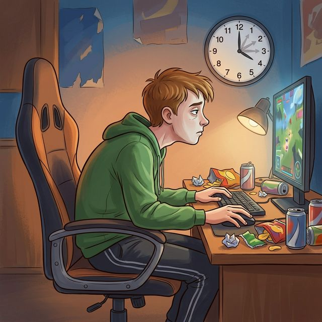
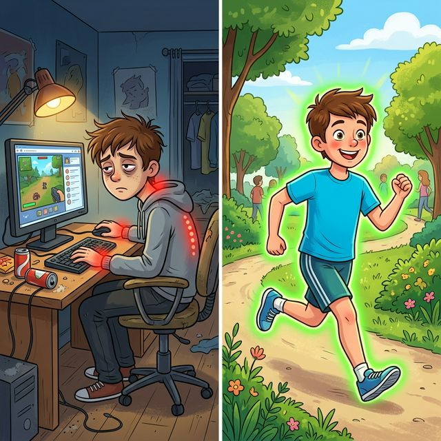

# Малоподвижный [образ](../../../7.2 Media, leisure and hobbies/Computer games/articles/game_culture/cosplay.md) жизни: что будет, если целый день сидеть

Ты проснулся. Сел за стол — [завтрак](../../../3.1. healthy lifestyle/Sleep, nutrition, and adolescent energy/articles/breakfast_for_the_brain.md). Сел в автобус — [школа](../../../3.1. healthy lifestyle/Sleep, nutrition, and adolescent energy/articles/healthy_school_snacks.md). Сел за парту — шесть уроков. Сел за комп — домашка. Сел за телефон — [отдых](../../../3.1. healthy lifestyle/Sleep, nutrition, and adolescent energy/articles/evening_rituals_sleep_fast.md). Лёг [спать](../../../4.1_rules_of_study/how_to_memorize/articles/son.md). [Итого](../../../1.2_natural_sciences/physics_in_everyday_life/Q182453.md) за день ты был в вертикальном положении от [силы](../../../1.2_natural_sciences/physics_in_everyday_life/Q11423.md) час: пока шёл до остановки и обратно.

Звучит как обычный день? Вот в этом и проблема. **Человеческое [тело](../../../1.2_natural_sciences/why_science_help_understand_world/organism.md) не рассчитано на то, чтобы сидеть 10–14 часов в сутки.** Наши предки проходили по 20–30 километров в день. Мы проходим 2–3 тысячи шагов. Разница — в десять раз. И тело за это расплачивается.

---

## Что такое гиподинамия?

**Гиподинамия** (от греч. *hypo* — мало, *dynamis* — [сила](../../../1.2_natural_sciences/physics_in_everyday_life/Q11023.md)) — это снижение двигательной активности ниже уровня, необходимого для нормального функционирования организма.

Это не болезнь в классическом смысле. Это **состояние**, которое приводит к десяткам болезней. Врачи называют гиподинамию **«тихим убийцей»** — потому что она действует медленно, незаметно и наверняка.

ВОЗ (Всемирная [организация](../../../4.1_rules_of_study/how_to_learn_effectively/articles/learning_environment.md) здравоохранения) ставит недостаток движения на **четвёртое место** среди причин смертности в мире — после высокого давления, [курения](smoking.md) и повышенного сахара в крови. Выше [алкоголя](alcohol.md). Выше ожирения. Сидение — опаснее, чем многие думают.

---

## [Что происходит](../../../5.1_technology_and_digital_literacy/how_internet_works/articles/web_basics/what_happens.md) с телом, когда ты сидишь весь день

Давай разберём по системам — как механик разбирает [двигатель](../../../1.2_natural_sciences/physics_in_everyday_life/Q177897.md).

### 1. Позвоночник: «Я не для этого создан»

Позвоночник человека — это S-образная конструкция, у него есть изгибы (шейный, грудной, поясничный), которые работают как амортизаторы. Когда ты сидишь с прямой спиной — нагрузка распределяется правильно.

Но кто из нас сидит с прямой спиной? Никто. Мы **сутулимся**, наклоняемся к экрану, задираем плечи, кладём ногу на ногу. В результате:

* **Межпозвоночные диски** (хрящевые «подушки» между позвонками) сплющиваются неравномерно. Со временем это приводит к **протрузиям и грыжам** — когда [диск](../../../5.1_technology_and_digital_literacy/operating system/articles/file_system.md) выдавливается и давит на нерв. Это больно. Очень.
* **Мышцы спины** ослабевают — они просто перестают работать, когда ты сидишь. Зато мышцы передней части тела (грудные, сгибатели бедра) укорачиваются. Получается **мышечный дисбаланс**: спереди всё стянуто, сзади всё провисло. Отсюда сутулость, которая со временем фиксируется.
* **«Компьютерная [шея](../../../7.2 Media, leisure and hobbies/Computer games/articles/useful_tips/eyes_and_back.md)»** — голова уходит вперёд. Каждый сантиметр наклона увеличивает нагрузку на шейные позвонки на **5 кг**. При типичном наклоне к смартфону голова «весит» не 5 кг, а все 25. Отсюда — головные боли, [боль](../../../1.2_natural_sciences/neurobiology_for_teens/articles/16_love_chemistry.md) в шее, онемение рук.

### 2. [Сердце](../../../3.1. healthy lifestyle/Sleep, nutrition, and adolescent energy/articles/the_energy_trap.md): «Мне нечего качать»

Сердце — это мышца. Как и любая мышца, она становится крепче от нагрузки и слабее от безделья.

Когда ты двигаешься, сердце учится эффективно перекачивать кровь. Оно становится сильнее, пульс в покое снижается (у спортсменов — 50–60 ударов в минуту, у малоподвижных — 80–90).

Когда ты сидишь всё [время](../../../1.2_natural_sciences/physics_in_everyday_life/Q20702.md):
* Сердце работает вхолостую и теряет тонус
* Кровь течёт медленнее, возрастает [риск](../../../1.2_natural_sciences/neurobiology_for_teens/articles/05_teen_brain.md) **тромбов** (сгустков крови, которые могут заблокировать сосуд)
* Холестерин откладывается на стенках сосудов — начинается **атеросклероз**

Да, атеросклероз — это не «болезнь стариков». [Исследование](../../../1.2_natural_sciences/neurobiology_for_teens/articles/19_curiosity.md), опубликованное в журнале *The Lancet*, показало, что первые жировые отложения в сосудах обнаруживаются уже в **15–17 лет** у подростков с низкой физической активностью.

### 3. Мышцы: «Используй или потеряй»

В мышечном мире действует жёсткое [правило](../../../1.2_natural_sciences/why_science_help_understand_world/patterns.md): **use [it](../../../8.2_future/choosing_a_career_path/articles/programmer.md) or lose it** — используй или потеряй.

Если мышцы не получают нагрузку, они атрофируются. Это происходит быстро: уже через **2 недели** без движения мышцы заметно теряют [объём](../../../1.2_natural_sciences/physics_in_everyday_life/Q39297.md) и силу. Космонавты на МКС занимаются спортом по 2,5 часа в день — и всё равно теряют мышечную массу в невесомости. А ты сидишь в «гравитационной невесомости» собственного кресла.

**Ягодичные мышцы** — самые большие мышцы тела — при сидячем образе жизни буквально «засыпают». Это называется **ягодичная амнезия** (синдром «мёртвой попы»). Звучит смешно, но последствия серьёзные: поясница и колени берут на себя лишнюю нагрузку и начинают болеть.

### 4. [Обмен веществ](../../../3.1. healthy lifestyle/Sleep, nutrition, and adolescent energy/articles/drinking_regime.md): «Всё на склад»

Исследование Университета Миссури показало: после 4 часов непрерывного сидения активность фермента **липопротеинлипазы** (он расщепляет жиры в крови) падает на **90%**. Девяносто! Жир, который мог бы использоваться как [топливо](../../../2.2_history/world_economy_on_fingers/articles/neft_v_mirovoy_ekonomike.md), отправляется на хранение — прежде всего в область живота.

Параллельно растёт [уровень](../../../../8.1_entertainment/articles/gamification.md) **инсулина**. Клетки теряют к нему чувствительность (инсулинорезистентность). Это прямой [путь](../../../1.2_natural_sciences/physics_in_everyday_life/Q11476.md) к **сахарному диабету 2 типа** — болезни, которая раньше считалась «возрастной», а теперь всё чаще диагностируется у подростков.

---

## Малоподвижность и [мозг](../../../3.1. healthy lifestyle/Sleep, nutrition, and adolescent energy/articles/breakfast_for_the_brain.md)

Думаешь, сидение вредит только телу? Мозг страдает не меньше.

### Кислородное голодание

Когда ты сидишь, [дыхание](../../../1.2_natural_sciences/physics_in_everyday_life/Q163214.md) становится поверхностным (диафрагма сжата). Кровь хуже насыщается кислородом. А мозг потребляет **20% всего кислорода** в организме, хотя весит всего 2% от массы тела. Меньше кислорода = мозг работает хуже. Отсюда — туман в голове, невозможность [сосредоточиться](../../../4.1_rules_of_study/how_to_memorize/articles/koncentraciya.md), постоянная «ватность».

### Дефицит нейротрофинов

Во время физической активности мозг вырабатывает белок **BDNF** (мозговой нейротрофический фактор) — это «удобрение» для нейронов. BDNF помогает образованию новых нервных клеток и укрепляет связи между ними. Нет движения = нет BDNF = мозг буквально перестаёт развиваться.

Исследование Иллинойсского университета: дети, которые занимались физкультурой по 40 минут в день, показали **на 20% лучшие [результаты](../../../1.2_natural_sciences/why_science_help_understand_world/research_work.md)** в тестах на [память](../../../3.1. healthy lifestyle/Sleep, nutrition, and adolescent energy/articles/sleep_and_memory_grades.md) и [внимание](../../../1.2_natural_sciences/neurobiology_for_teens/articles/16_love_chemistry.md) по сравнению с малоподвижными сверстниками.

### [Настроение](../../../1.2_natural_sciences/neurobiology_for_teens/articles/10_sweet_tooth.md) и психика

[Движение](../../../1.2_natural_sciences/physics_in_everyday_life/Q11023.md) стимулирует выработку **эндорфинов**, **серотонина** и **дофамина** — [нейромедиаторов](Dopamine.md), отвечающих за хорошее настроение. Без движения их уровень падает. [Результат](../../../1.2_natural_sciences/why_science_help_understand_world/experimental_science.md):

* Повышенная [тревожность](../../../../8.1_self_understanding/articles/causes.md)
* Раздражительность
* Чувство бессмысленности и апатия
* Склонность к депрессии

Мета-анализ 2023 года (49 исследований, 267 000 участников) показал, что регулярная [физическая активность](../../../3.1. healthy lifestyle/Sleep, nutrition, and adolescent energy/articles/sport_and_energy.md) снижает риск депрессии на **25%**.

---

## [Проверка](../../../1.2_natural_sciences/why_science_help_understand_world/scientific_method.md): ты в группе риска?

| Признак | Норма | Тревожный [сигнал](../../../5.1_technology_and_digital_literacy/how_internet_works/articles/wifi/router.md) |
| :--- | :--- | :--- |
| **[Шаги](../../../7.2 Media, leisure and hobbies/Computer games/articles/dream_team/composer.md) в день** | 8 000–10 000 | Меньше 3 000 |
| **Время сидения** | До 6 часов (с перерывами) | 10+ часов подряд |
| **Физкультура** | 3–5 раз в неделю по 30–60 мин | «Только на уроках, и то стою» |
| **Ощущения** | [Энергия](../../../3.1. healthy lifestyle/Sleep, nutrition, and adolescent energy/articles/breakfast_for_the_brain.md), [бодрость](energetiki.md) | Постоянная [усталость](../../../3.1. healthy lifestyle/Sleep, nutrition, and adolescent energy/articles/sugar_rollercoaster.md), тяжесть |
| **Боли** | Нет | [Спина](../../../7.2 Media, leisure and hobbies/Computer games/articles/useful_tips/eyes_and_back.md), шея, колени, головные боли |

Если ты узнал себя в правой колонке — это не приговор. Это сигнал начать двигаться. И начать можно прямо сегодня.

---

## «Сидение — это новое [курение](../../../1.2_natural_sciences/neurobiology_for_teens/articles/13_nicotine.md)»

Эту фразу произнёс [доктор](../../../8.2_future/choosing_a_career_path/articles/doctor.md) Джеймс Левин из клиники Мейо (США), и она стала лозунгом в медицинском сообществе. Почему [сравнение](../../../5.2_cybersecurity/cpp_fundamentals/5_operators.md) с курением?

* **Курение** разрушает [здоровье](../../../3.1. healthy lifestyle/Sleep, nutrition, and adolescent energy/articles/chronic_sleep_deprivation.md) медленно и незаметно. Ты не кашляешь после первой сигареты — но через 20 лет получаешь рак лёгких.
* **Сидение** разрушает здоровье точно так же: медленно, незаметно, но неумолимо.

И если про курение все знают, что это вредно, то про сидение — почти никто не задумывается. Ты сидишь 12 часов в день и считаешь это нормой, потому что «все так живут». Но «все» не значит «правильно».

---

## Что делать: Практический чек-лист

Мы не предлагаем тебе завтра пробежать марафон. Начни с малого:

1. **Правило 20-20.** Каждые 20 минут сидения — встань на [20 секунд](../../../6.1_Independent_living_and_daily_living_skills/Simple_and_safe_cooking/articles/hand_hygiene.md). Потянись, сделай пару шагов, присядь два раза. Это занимает меньше времени, чем [загрузка](../../../7.2 Media, leisure and hobbies/Computer games/articles/how_it_all_started/cartridge_versus_disc.md) рекламы на YouTube.
2. **10 000 шагов.** Установи шагомер (он есть в любом смартфоне). Начни считать. Первый день будет шоком — скорее всего, ты не набираешь и 3000. Добавляй по [500](../../../5.1_technology_and_digital_literacy/how_internet_works/articles/http_https/http_https.md) шагов каждую неделю.
3. **Утренняя [зарядка](../../../7.2 Media, leisure and hobbies/Computer games/articles/useful_tips/eyes_and_back.md) — 7 минут.** Это не «бабушкина» зарядка. Попробуй программу «7-Minute Workout» — она научно обоснована и занимает ровно 7 минут. Приседания, планка, выпады, отжимания.
4. **Измени маршрут.** Выйди на одну остановку раньше. Поднимайся пешком вместо лифта. Мелочи складываются: 4 этажа в день × 365 дней = 1460 этажей в год.
5. **Найди движение, от которого кайфуешь.** Не надо ходить в «качалку», если ненавидишь. Попробуй: скейт, велосипед, плавание, танцы, скалолазание, бег, йогу, даже прогулку с наушниками и подкастом. Главное — чтобы нравилось. Движение не должно быть наказанием.
6. **Стоячий стол или «[перерывы](../../../4.1_rules_of_study/how_to_learn_effectively/articles/breaks_and_rest.md) стоя».** Если дома делаешь уроки — попробуй часть времени работать стоя. Поставь ноутбук на комод или полку подходящей высоты.

> **Важный [вывод](../../../1.2_natural_sciences/why_science_help_understand_world/scientific_method.md):** Твоё тело — не кресло для мозга. Это машина, которая создана для движения. Каждый час, проведённый без движения, — это [кредит](../../../6.2_money_and_finance/personal_budget/credit.md), который тело рано или поздно потребует вернуть. С процентами. Начни двигаться сейчас — пока [цена](../../../6.1_Independent_living_and_daily_living_skills/reasonable_spending/articles/price.md) возврата минимальна.

---

**[Автор](../../../4.2_thinking_and_working_information/how_to_search_information/articles/copypaste.md):** Пономарев Артем

**Нейронные сети, использованные при создании статьи:** Claude (Anthropic)
