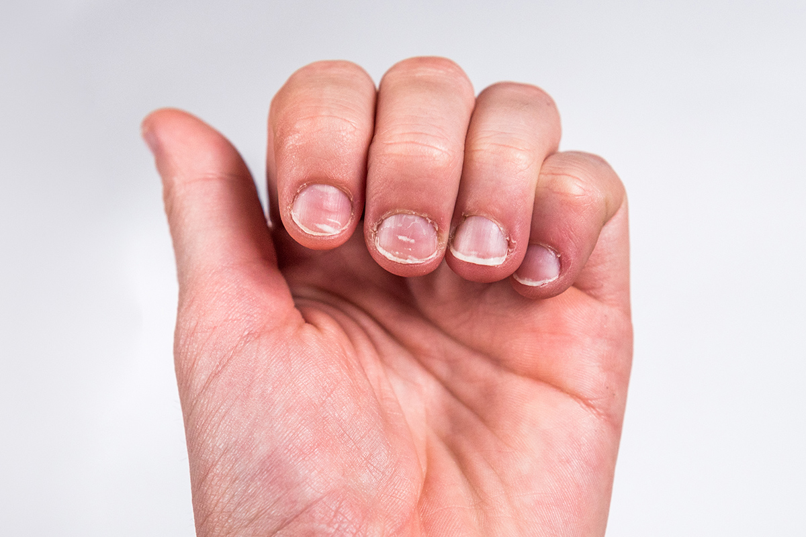

# Онихофагия: почему люди грызут ногти и как с этим справиться

Онихофагия (грызение ногтей) — распространённая [привычка](../../../7.2 Media, leisure and hobbies /useful_and_interesting_leisure/articles/how_not_to_quit_hobby.md), при которой [человек](../../../1.2_natural_sciences/physics_in_everyday_life/Q45003.md) часто и непроизвольно грызёт ногти до кожи пальцев. Она может возникать у детей, подростков и взрослых и иметь разные причины: от стресса и [тревоги](Doomscrolling.md) до скуки и [привычки](../../../1.2_natural_sciences/neurobiology_for_teens/articles/11_reward_system.md), закрепившейся с детства. В этой статье мы рассмотрим формы онихофагии, её возможные последствия и практические [методы](../../../4.1_rules_of_study/how_to_learn_effectively/articles/note_taking.md) борьбы с ней.

---

## Формы и [мотивация](../../../1.2_natural_sciences/neurobiology_for_teens/articles/11_reward_system.md)

Онихофагия проявляется по-разному и обычно имеет несколько триггеров:

### 1. Ситуативная (реактивная)
Когда ногти грызут в [ответ](../../../5.1_technology_and_digital_literacy/how_internet_works/articles/http_https/http_https.md) на конкретный [стрессовый](../../../4.1_rules_of_study/how_to_memorize/articles/stress.md) [стимул](../../../4.1_rules_of_study/how_to_memorize/articles/motivaciya.md): экзамен, [собеседование](../../../8.2_future/choosing_a_career_path/articles/interview.md), [конфликт](../../../2.1_society/cause_and_effect_relationships/articles/conflict_roots.md). [Действие](../../../2.1_society/cause_and_effect_relationships/articles/personal_choice.md) носит временный [характер](../../../1.2_natural_sciences/neurobiology_for_teens/articles/06_phineas_gage.md) и связано с конкретными ситуациями.

### 2. Хроническая (прагматическая)
Постоянная, устойчиво развившаяся привычка, которая сопровождает человека в повседневной жизни: во [время](../../../1.2_natural_sciences/physics_in_everyday_life/Q20702.md) просмотров [видео](../../../5.1_technology_and_digital_literacy/information and media literacy/оценка_качества_изображений_и_видео.md), при [работе](../../../8.2_future/choosing_a_career_path/articles/interview.md) за компьютером, в транспорте.

### 3. Психологически мотивированная
Иногда грызение ногтей связано с обсессивно-компульсивными чертами, тревожно-депрессивным фоном или как частью нервных привычек (подобно ковырянию кожи).

---

## Почему это вредно?

Несмотря на то что онихофагия часто воспринимается как безобидная привычка, у неё есть реальные [риски](../../../7.2 Media, leisure and hobbies /useful_and_interesting_leisure/articles/safety_during_recreation.md):

### Физические последствия
* Раздражение и повреждение кутикулы и окружающей кожи, что повышает [риск](../../../1.2_natural_sciences/neurobiology_for_teens/articles/05_teen_brain.md) инфекций (бактериальных и грибковых).
* [Деформация](../../../1.2_natural_sciences/physics_in_everyday_life/Q102836.md) ногтевой пластины при длительном воздействии.
* Болезненные трещины и воспаления вокруг ногтя.
* [Перенос бактерий](../../../6.1_Independent_living_and_daily_living_skills/Simple_and_safe_cooking/articles/cross_contamination.md) из рта на кожу и обратно — риск стоматологических и кожных инфекций.

### Психологические и социальные последствия
* [Сомнения](../../../8.2_future_and_path_choice/articles/02_insecurity_causes.md) в собственной гигиене и [неуверенность](../../../8.1_self-understanding/HowToFindYourStrengths/articles/impostor_syndrome.md) в общении.
* Социальная стигма — особенно у взрослых, когда привычка воспринимается как «незрелая».
* [Усиление](../../../1.2_natural_sciences/physics_in_everyday_life/Q136980.md) тревоги: цикл стресса → грызение → стыд → усиление тревоги.

---

## Как прекратить грызть ногти: практические [шаги](../../../7.2 Media, leisure and hobbies/Computer games/articles/dream_team/composer.md)

Онихофагия поддается лечению; чаще всего помогает сочетание простых практических приемов и психологической [работы](../../../8.2_future/choosing_a_career_path/articles/interview.md).

### 1. Поведенческие [техники](../../../8.2_future_and_path_choice/articles/03_stress_management.md)
* **Замещающие [действия](../../../3.1_healthy_lifestyle/pervaya_pomoshch/ushibi_porezy_ozhogi/03_obschie_pravila_algorithm.md):** держите в руках антистресс-гаджет (мячик, эспандер), шершавый браслет или другой предмет, который занимает пальцы.
* **Систематическое отталкивание:** намеренно увеличивайте интервалы между эпизодами грызения, фиксируйте [прогресс](../../../2.1_society/cause_and_effect_relationships/articles/lessons_of_history.md) в дневнике.
* **Отрезвление ритуалов:** если грызение связано с конкретной деятельностью (например, просмотром видео), сознательно измените [окружение](../../../7.2 Media, leisure and hobbies/Computer games/articles/dream_team/artist.md) — держите руки занятыми.

### 2. Негативное подкрепление (мягкое)
* **Горькие лаки для ногтей:** специальные покрытия с горьким вкусом, которые отпугивают во рту и снижают автоматическое действие.
* **Педикюр/маникюр:** ухоженные ногти и защитные покрытия могут повысить мотивацию не портить [результат](../../../1.2_natural_sciences/why_science_help_understand_world/experimental_science.md).

### 3. Психологические подходы
* **[Когнитивно-поведенческая терапия](../../../../8.1_self_understanding/articles/cbt_techniques.md) ([КПТ](../../../../8.1_self_understanding/articles/cbt_techniques.md)):** помогает выявить [триггеры](../../../7.2 Media, leisure and hobbies/Computer games/articles/technologies_inside/management_history.md) и заменить привычное [поведение](../../../1.2_natural_sciences/neurobiology_for_teens/articles/06_phineas_gage.md) альтернативными действиями.
* **Техники осознанности:** короткие дыхательные практики и [техника](../../../1.2_natural_sciences/physics_in_everyday_life/Q133673.md) «останови и отметь» помогают прерывать автоматические реакции.
* **Групповая [поддержка](../../../1.2_natural_sciences/neurobiology_for_teens/articles/17_hugs_oxytocin.md):** обмен опытом с людьми, которые успешно бросили привычку.

### 4. Медицинские и дентальные меры
* При наличии воспалений и инфекций — обратиться к дерматологу или хирургу.
* Для сильных проявлений, связанных с обсессивно-компульсивными чертами — консультация психиатра и возможная медикаментозная поддержка.

---

## Когда обратиться к специалисту?

Нужно обратиться к врачу, если:
* Появились [признаки](../../../3.1_healthy_lifestyle/pervaya_pomoshch/ushibi_porezy_ozhogi/04_ushib_chto_eto_priznaki.md) инфекции (гной, сильная [боль](../../../1.2_natural_sciences/neurobiology_for_teens/articles/16_love_chemistry.md), покраснение, [отёк](../../../3.1_healthy_lifestyle/pervaya_pomoshch/ushibi_porezy_ozhogi/04_ushib_chto_eto_priznaki.md)).
* Ногтевая пластина деформирована и не восстанавливается со временем.
* Привычка приводит к серьёзному социальному или профессиональному дискомфорту.

---

## [Заключение](../../../1.2_natural_sciences/physics_in_everyday_life/Q2225.md)

Онихофагия — распространённая и решаемая проблема. Комбинация практических приёмов (замещение, уход за руками), психотерапевтической работы и при необходимости медицинской помощи даёт хороший шанс избавиться от привычки. Главное — начать с маленьких шагов и фиксировать прогресс.

---
Авторы: Мустафаев Алим

*При создании статьи использованы [нейросети](../../../2.1_society/cause_and_effect_relationships/articles/ai_causality.md): Deepseek*
