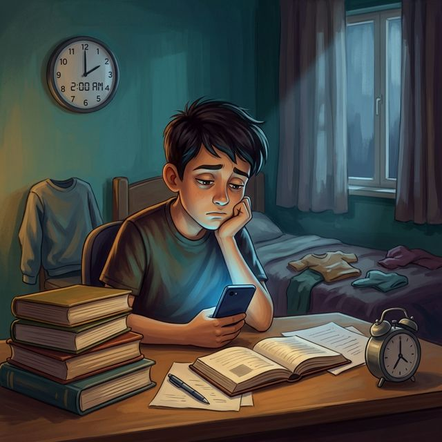
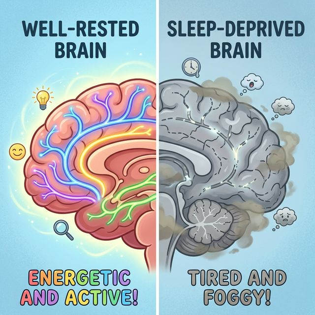

# Недосыпание: как [привычка](../../../7.2 Media, leisure and hobbies /useful_and_interesting_leisure/articles/how_not_to_quit_hobby.md) ложиться поздно убивает твой [мозг](../../../3.1. healthy lifestyle/Sleep, nutrition, and adolescent energy/articles/breakfast_for_the_brain.md)

«Ещё одно [видео](../../../5.1_technology_and_digital_literacy/information and media literacy/оценка_качества_изображений_и_видео.md), и точно ложусь». Знакомо? Ты говоришь себе это в полночь. Потом в час ночи. Потом в два. Будильник на семь утра никуда не делся, но ты уверен: «Я высплюсь на выходных». [Спойлер](../../../1.2_natural_sciences/neurobiology_for_teens/articles/19_curiosity.md) — **нет, не высплешься**. И вот почему.

---

## Зачем вообще нужен [сон](../../../3.1. healthy lifestyle/Sleep, nutrition, and adolescent energy/articles/evening_rituals_sleep_fast.md)?

Многие думают, что сон — это просто «выключение» тела. Как будто ты — телефон, который поставили на зарядку. На самом деле всё ровно наоборот: **во сне мозг работает интенсивнее, чем днём на уроке математики**.

Вот [что происходит](../../../5.1_technology_and_digital_literacy/how_internet_works/articles/web_basics/what_happens.md), пока ты спишь:

1. **Уборка мусора.** Мозг включает так называемую **глимфатическую систему** — это [сеть](../../../5.1_technology_and_digital_literacy/how_internet_works/articles/history/internet_history.md) каналов, которая вымывает токсины и [продукты](../../../3.1. healthy lifestyle/Sleep, nutrition, and adolescent energy/articles/healthy_school_snacks.md) распада из мозговой ткани. Днём она работает слабо, а ночью разворачивается на полную. Если ты не спишь — мусор остаётся. Представь, что ты перестал выносить мусор из квартиры на месяц. Примерно то же самое происходит с мозгом.

2. **Сортировка воспоминаний.** Всё, что ты узнал за день — формулы, новые слова, лица людей — ночью переносится из «оперативной [памяти](../../../4.1_rules_of_study/how_to_memorize/articles/pamyat.md)» ([гиппокамп](../../../1.2_natural_sciences/neurobiology_for_teens/articles/23_hippocampus.md)) в «жёсткий [диск](../../../5.1_technology_and_digital_literacy/operating system/articles/file_system.md)» ([кора мозга](../../../1.2_natural_sciences/neurobiology_for_teens/articles/04_main_parts_of_the_brain.md)). Если ты не выспался — [информация](../../../5.1_technology_and_digital_literacy/information and media literacy/как_устроена_современная_информационная_среда.md) буквально стирается. Ты учил параграф до двух ночи, но на контрольной [вспомнить](../../../4.1_rules_of_study/how_to_memorize/articles/aktivnoe_vspominanie.md) не можешь. Не потому что тупой, а потому что **мозг не успел сохранить [файл](../../../5.1_technology_and_digital_literacy/operating system/articles/file_system.md)**.

3. **[Рост](../../../3.1. healthy lifestyle/Sleep, nutrition, and adolescent energy/articles/micronutrients_and_teenagers.md) и [восстановление](../../../4.1_rules_of_study/how_to_learn_effectively/articles/breaks_and_rest.md).** Гормон роста (соматотропин) выделяется преимущественно во сне. Подросток, который систематически недосыпает, буквально мешает себе расти. Мышцы не восстанавливаются, [иммунитет](../../../3.1. healthy lifestyle/Sleep, nutrition, and adolescent energy/articles/chronic_sleep_deprivation.md) падает, кожа тускнеет.

---

## Что происходит с мозгом, когда ты недосыпаешь

Учёные из Университета Калифорнии в Беркли провели [эксперимент](../../../1.2_natural_sciences/physics_in_everyday_life/Q1293220.md): группу студентов разделили на две части. Одни спали нормально (8 часов), другие — по 5 часов в течение недели. Затем обоим группам дали одинаковые тесты.

[Результаты](../../../1.2_natural_sciences/why_science_help_understand_world/research_work.md):

| Показатель | Выспавшиеся | Недосыпавшие |
| :--- | :--- | :--- |
| **[Время](../../../1.2_natural_sciences/physics_in_everyday_life/Q20702.md) реакции** | Норма | Замедлено на 30% |
| **Количество ошибок** | 2–3 за тест | 8–12 за тест |
| **Эмоциональная [реакция](../../../1.2_natural_sciences/why_science_help_understand_world/chemistry.md)** | Спокойная | Раздражительность, вспышки агрессии |
| **Способность [запоминать](../../../4.1_rules_of_study/how_to_memorize/articles/zapominanie.md)** | 90% материала | 40% материала |

**Пять часов сна в течение недели** по воздействию на мозг эквивалентны **бессонной ночи**. А бессонная ночь снижает когнитивные [способности](../../../4.1_rules_of_study/how_to_learn_effectively/articles/growth_mindset.md) так же, как **лёгкое алкогольное [опьянение](alcohol.md)** (0.5 промилле). Ты фактически приходишь в школу «пьяным».

---

## [Дофамин](../../../1.2_natural_sciences/neurobiology_for_teens/articles/10_sweet_tooth.md) и экраны: почему ты не можешь лечь вовремя

Главный [враг](../../../7.2 Media, leisure and hobbies/Computer games/articles/heroes_and_villains/main_villains.md) подросткового сна — не домашка и не шумные [соседи](../../../2.1_society/how_and_where_find_friends/articles/druzhba_s_sosedyami.md). Это **экраны**.

### Двойной удар

**Удар первый: [синий свет](../../../3.1. healthy lifestyle/Sleep, nutrition, and adolescent energy/articles/gadgets_blue_light_sleep.md).** [Экран](../../../3.1. healthy lifestyle/Sleep, nutrition, and adolescent energy/articles/gadgets_blue_light_sleep.md) смартфона излучает [свет](../../../1.2_natural_sciences/physics_in_everyday_life/Q1.md) с длиной [волны](../../../1.2_natural_sciences/physics_in_everyday_life/Q136980.md) 450–490 нм (синий [спектр](../../../1.2_natural_sciences/physics_in_everyday_life/Q1075.md)). Этот свет попадает на особые клетки в глазах — **ганглионарные фоторецепторы** — и отправляет мозгу [сигнал](../../../5.1_technology_and_digital_literacy/how_internet_works/articles/wifi/router.md): «Сейчас день!» В [ответ](../../../5.1_technology_and_digital_literacy/how_internet_works/articles/http_https/http_https.md) мозг блокирует выработку **мелатонина** — гормона, который запускает [процесс](../../../5.1_technology_and_digital_literacy/operating system/articles/process.md) засыпания. Ты лежишь в кровати, [глаза](../../../7.2 Media, leisure and hobbies/Computer games/articles/useful_tips/eyes_and_back.md) закрыты — а мозг в боевом режиме.

**Удар второй: [дофаминовая петля](Dopamine.md).** Каждое новое видео в TikTok, каждое [обновление](../../../5.2_cybersecurity/passwords_cyber_safety/articles/update.md) ленты — это микродоза дофамина. Мозг не хочет останавливаться: «Ещё одно! А вдруг следующее будет смешнее?» Ты физически не можешь отложить телефон, потому что мозг находится в режиме охоты за наградой. А охотник не ложится [спать](../../../4.1_rules_of_study/how_to_memorize/articles/son.md), пока не поймал добычу.

[Результат](../../../1.2_natural_sciences/why_science_help_understand_world/experimental_science.md): ты ложишься в два ночи, хотя собирался в одиннадцать. У этого явления даже есть название — **revenge bedtime procrastination** (реваншевая [прокрастинация](../../../1.2_natural_sciences/neurobiology_for_teens/articles/12_lazy_brain.md) сна). Весь день ты был занят ([школа](../../../3.1. healthy lifestyle/Sleep, nutrition, and adolescent energy/articles/healthy_school_snacks.md), [кружки](../../../7.2 Media, leisure and hobbies /useful_and_interesting_leisure/articles/clubs_and_sections.md), домашка), и вечером мозг требует «своё» время. Ты мстишь дню, крадя время у ночи.

---

## Хронический [недосып](../../../3.1. healthy lifestyle/Sleep, nutrition, and adolescent energy/articles/chronic_sleep_deprivation.md): когда «чуть-чуть» становится катастрофой

Одна бессонная ночь — неприятно, но не смертельно. Мозг оправится. Проблема начинается, когда недосып становится **системой**.

### Что происходит через неделю

* [Концентрация](../../../1.2_natural_sciences/physics_in_everyday_life/Q506710.md) падает. Ты отвлекаешься каждые 3–5 минут.
* Появляются **микросны** — мозг отключается на 1–2 секунды прямо с открытыми глазами. Ты был на уроке, моргнул — и пропустил полминуты объяснения.
* [Настроение](../../../1.2_natural_sciences/neurobiology_for_teens/articles/10_sweet_tooth.md) плывёт. Мелочи бесят. Друг пошутил — а ты взрываешься.

### Что происходит через месяц

* Иммунитет садится. Ты начинаешь болеть чаще — простуды, герпес, аллергия обостряется.
* [Вес](../../../1.2_natural_sciences/physics_in_everyday_life/Q11023.md) растёт. Недосып повышает [уровень](../../../../8.1_entertainment/articles/gamification.md) **грелина** (гормон голода) и снижает **[лептин](../../../1.2_natural_sciences/neurobiology_for_teens/articles/08_hunger.md)** (гормон сытости). Ты постоянно хочешь есть, причём тянет на [сладкое](../../../1.2_natural_sciences/neurobiology_for_teens/articles/10_sweet_tooth.md) и жирное. [Организм](../../../1.2_natural_sciences/neurobiology_for_teens/articles/03_nervous_system_map.md) ищет быструю энергию, чтобы компенсировать [усталость](../../../3.1. healthy lifestyle/Sleep, nutrition, and adolescent energy/articles/sugar_rollercoaster.md).
* [Внешность](../../../7.2 Media, leisure and hobbies/Computer games/articles/heroes_and_villains/create_your_hero.md) меняется. Тёмные круги под глазами, серая кожа, высыпания. Это не «переходный [возраст](../../../5.1_technology_and_digital_literacy/information and media literacy/карта_компетенций_по_возрастам.md)», это [дефицит сна](../../../3.1. healthy lifestyle/Sleep, nutrition, and adolescent energy/articles/chronic_sleep_deprivation.md).

### Что происходит через год

* Устойчивое снижение успеваемости.
* Проблемы с тревожностью и депрессивные эпизоды. [Исследование](../../../1.2_natural_sciences/neurobiology_for_teens/articles/19_curiosity.md) Гарвардской медицинской школы показало, что [подростки](../../../3.1. healthy lifestyle/Sleep, nutrition, and adolescent energy/articles/biology_of_night_owls_teens.md), спящие менее 6 часов, в **3 раза чаще** сообщают о симптомах депрессии.
* Проблемы с ростом и физическим развитием.

---

## Сколько нужно спать?

Не «сколько получится», а сколько **реально нужно** твоему мозгу. Рекомендации Американской академии медицины сна:

| Возраст | Рекомендуемый сон |
| :--- | :--- |
| 6–12 лет | 9–12 часов |
| 13–18 лет | 8–10 часов |
| Взрослые | 7–9 часов |

Обрати [внимание](../../../1.2_natural_sciences/neurobiology_for_teens/articles/16_love_chemistry.md): подростку нужно **больше** сна, чем взрослому. Не меньше. Мозг в 14–17 лет перестраивается, формируются новые [нейронные связи](../../../1.2_natural_sciences/neurobiology_for_teens/articles/21_how_memory_works.md), созревают [лобные доли](../../../1.2_natural_sciences/neurobiology_for_teens/articles/04_main_parts_of_the_brain.md) (те самые, которые отвечают за контроль и [принятие решений](../../../1.2_natural_sciences/neurobiology_for_teens/articles/05_teen_brain.md)). Для всего этого нужен сон.

А теперь честно: сколько часов ты спал сегодня ночью?

---

## [История](../../../1.2_natural_sciences/physics_in_everyday_life/Q11469.md) Лены: «Я просто не могла уснуть»

Лене 14 лет. Она хорошо учится, ходит на [рисование](../../../7.2 Media, leisure and hobbies /useful_and_interesting_leisure/articles/creativity_and_handicrafts.md), у неё нормальная [семья](../../../5.1_technology_and_digital_literacy/information and media literacy/семейные_правила_потребления_контента.md). Никаких «проблем».

Всё началось с того, что подруга скинула ссылку на новый дорамный сериал. Лена начала смотреть по серии перед сном. Потом по две. Потом — «ну давай до конца сезона». Она ложилась в час, потом в два.

Через месяц Лена заметила: она не может уснуть без телефона. Даже если устала. Лежит в темноте — и [тревога](Doomscrolling.md). Мысли скачут. Единственный способ успокоиться — экран. Парадокс: то, что мешает спать, стало единственным способом «расслабиться».

Через три месяца: Лена засыпает на уроках. Учителя делают замечания. [Оценки](../../../3.1. healthy lifestyle/Sleep, nutrition, and adolescent energy/articles/sleep_and_memory_grades.md) поехали. Мама ругается. Лена нервничает — и вечером опять открывает телефон, «чтобы отвлечься». Круг замкнулся.

Лена не ленивая и не безответственная. Лена попала в **дофаминово-мелатониновую ловушку**: экран даёт дофамин → дофамин блокирует [мелатонин](../../../3.1. healthy lifestyle/Sleep, nutrition, and adolescent energy/articles/biology_of_night_owls_teens.md) → без мелатонина не можешь уснуть → берёшь экран, чтобы «расслабиться» → и всё по новой.

---

## Миф: «Отосплюсь на выходных»

Это самая популярная отмазка. И она не работает. Вот почему.

Когда ты спишь по 5 часов с понедельника по пятницу, ты накапливаешь **«сонный [долг](../../../2.1_society/cause_and_effect_relationships/articles/responsibility.md)»** — примерно 15 часов. В субботу ты спишь 12 часов. Отработал 4 часа долга. Осталось 11. В воскресенье ещё 10 часов — ещё 2 часа долга скостил.

Но это не главная проблема. Главная проблема в [том](../../../7.1_art/musical_instruments/articles/drums.md), что **нерегулярный сон сбивает [циркадные ритмы](../../../3.1. healthy lifestyle/Sleep, nutrition, and adolescent energy/articles/biology_of_night_owls_teens.md)**. Твои [биологические часы](../../../3.1. healthy lifestyle/Sleep, nutrition, and adolescent energy/articles/social_jetlag_and_monday_morning.md) не понимают, какой сейчас [режим](../../../4.1_rules_of_study/how_to_learn_effectively/articles/breaks_and_rest.md): «рабочий» или «выходной». Результат — в [понедельник](../../../3.1. healthy lifestyle/Sleep, nutrition, and adolescent energy/articles/social_jetlag_and_monday_morning.md) ты чувствуешь себя ещё хуже, чем в пятницу. Это называется **[социальный джетлаг](../../../3.1. healthy lifestyle/Sleep, nutrition, and adolescent energy/articles/social_jetlag_and_monday_morning.md)** — как будто ты каждую неделю летаешь из Москвы в [Нью-Йорк](../../../7.1_art/modern_technological_art/articles/1.1_hole_in_space.md) и обратно.

---

## Что делать: Практический чек-лист

1. **Убери телефон из спальни.** Физически. Купи обычный будильник за 300 рублей. Телефон — в другую комнату, на зарядку. Если его нет рядом — [соблазн](../../../6.1_Independent_living_and_daily_living_skills/reasonable_spending/articles/impulse_purchase.md) исчезает.
2. **[Правило](../../../1.2_natural_sciences/why_science_help_understand_world/patterns.md) «за час до сна».** За 60 минут до сна — никаких экранов. Вообще. Почитай бумажную книгу, послушай музыку, поговори с семьёй. Мозгу нужно время, чтобы начать вырабатывать мелатонин.
3. **Фиксируй время подъёма.** Не время засыпания, а время **подъёма**. Вставай в одно и то же время каждый день — и в будни, и в [выходные](../../../3.1. healthy lifestyle/Sleep, nutrition, and adolescent energy/articles/social_jetlag_and_monday_morning.md) (разница [максимум](../../../1.2_natural_sciences/physics_in_everyday_life/Q136980.md) 1 час). Через неделю [тело](../../../1.2_natural_sciences/why_science_help_understand_world/organism.md) само начнёт хотеть спать в нужное время.
4. **Прохлада + темнота.** Идеальная [температура](../../../1.1_structure_of_the_world/matter/articles/07_gases.md) для сна — 18–20 °[C](../../../2.1_society/how_and_where_find_friends/articles/sora_drug.md). Комната должна быть тёмной. Шторы блэкаут — лучшая инвестиция в [здоровье](../../../3.1. healthy lifestyle/Sleep, nutrition, and adolescent energy/articles/chronic_sleep_deprivation.md).
5. **Никакого кофеина после 15:00.** Чай, кофе, кола, [энергетики](energetiki.md) — всё это содержит [кофеин](../../../3.1. healthy lifestyle/Sleep, nutrition, and adolescent energy/articles/the_energy_trap.md), который держится в крови 6–8 часов. Выпил колу в шесть вечера — в полночь она ещё работает.

> **Важный [вывод](../../../1.2_natural_sciences/why_science_help_understand_world/scientific_method.md):** Сон — это не [потеря](../../../1.2_natural_sciences/neurobiology_for_teens/articles/20_sadness.md) времени. Это единственный способ, которым мозг обслуживает сам себя. Ты не «теряешь» 8 часов — ты инвестируешь их в [память](../../../3.1. healthy lifestyle/Sleep, nutrition, and adolescent energy/articles/sleep_and_memory_grades.md), здоровье и нормальное настроение. Экономить на сне — всё равно что экономить на бензине, доливая в бак воду. Какое-то время машина поедет. Но недалеко.

---

**[Автор](../../../4.2_thinking_and_working_information/how_to_search_information/articles/copypaste.md):** Пономарев Артем

**Нейронные сети, использованные при создании статьи:** Claude (Anthropic)
