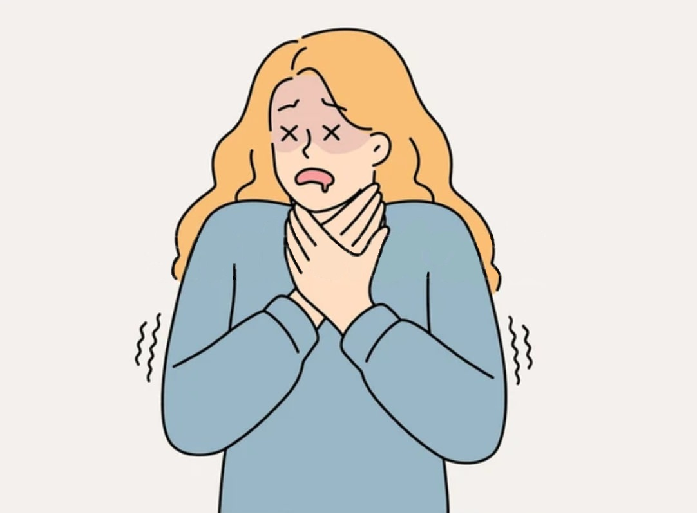
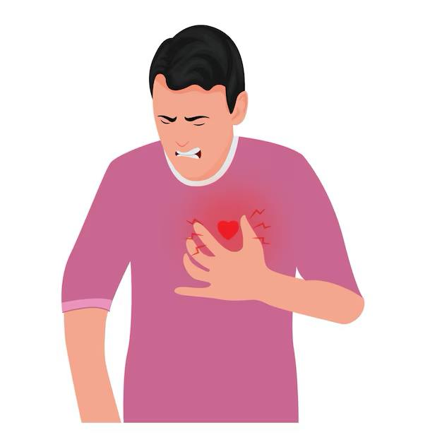
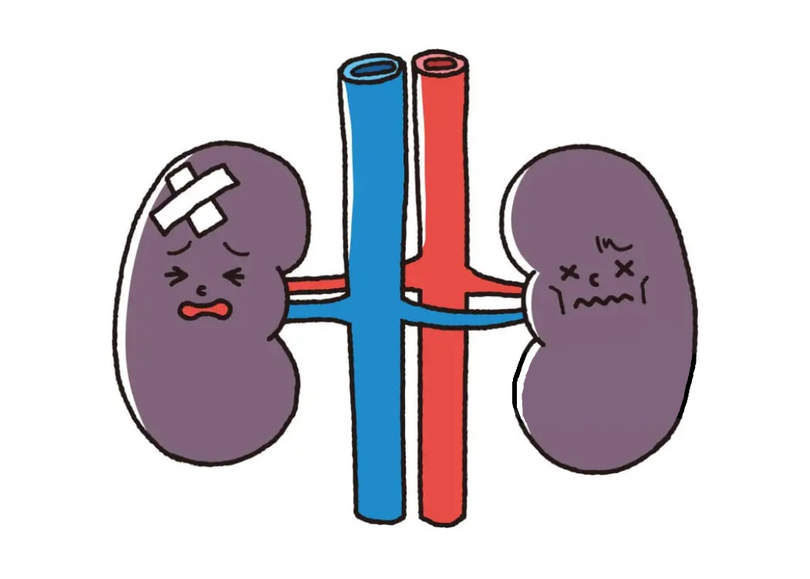
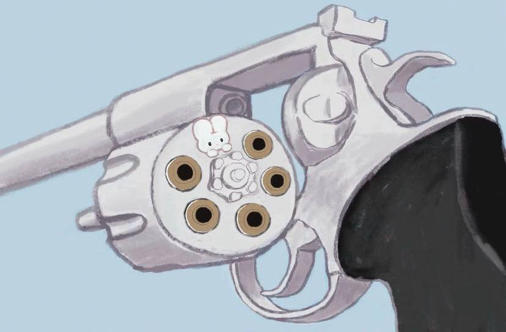
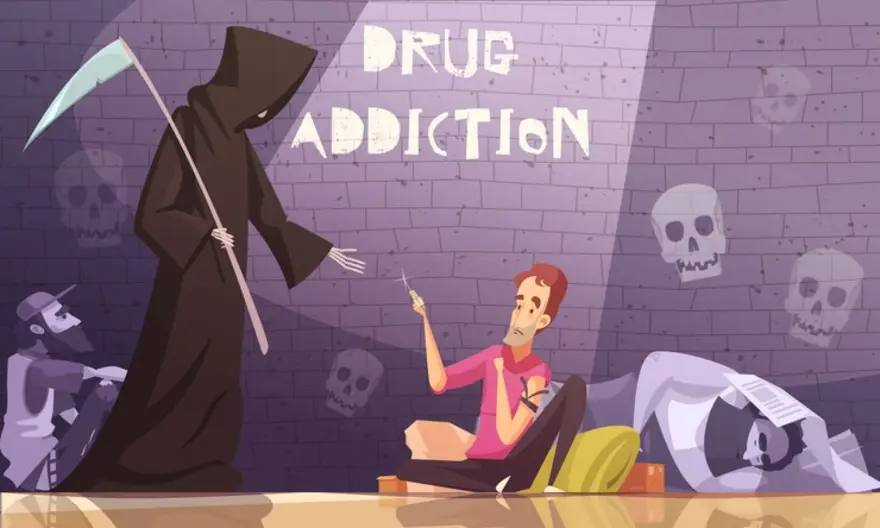

# Передозировка: [что происходит](../../../5.1_technology_and_digital_literacy/how_internet_works/articles/web_basics/what_happens.md) с телом и почему это страшно?

> Передозировка — это не [сюжет](../../../7.2 Media, leisure and hobbies/Computer games/articles/dream_team/screenwriter.md) из фильма, где героя откачали и он побежал дальше. В реальности это часто инвалидность или смерть. Давай разберемся, что именно происходит внутри тела, когда ты переходишь черту. Без страшилок, просто [биология](../../../3.1. healthy lifestyle/Sleep, nutrition, and adolescent energy/articles/biology_of_night_owls_teens.md).

## Что такое передозировка простыми словами?

Представь, что твой [организм](../../../1.2_natural_sciences/neurobiology_for_teens/articles/03_nervous_system_map.md) — это сложный механизм, как космический корабль. У него есть системы дыхания, сердцебиения, охлаждения. А [наркотик](myths_about_soft_drugs.md) — это [вирус](../../../5.2_cybersecurity/passwords_cyber_safety/articles/virus.md), который ломает все системы сразу.

**Передозировка (или отравление)** — это момент, когда организм больше не может справляться с ядом. Системы начинают отказывать одна за другой.

Важно понять: тебе не нужно принять «лошадиную дозу». Для передозировки достаточно обычной дозы, если:
- Организм ослаблен
- [Наркотик](myths_about_soft_drugs.md) оказался сильнее, чем обычно
- Ты смешал несколько веществ
- Ты давно не употреблял (после перерыва чувствительность выше)

---

## Что происходит с разными системами организма

Давай посмотрим на [тело](../../../1.2_natural_sciences/why_science_help_understand_world/organism.md) человека при передозировке. Это некрасивая картина, но это правда.

### 1. [Дыхание](../../../1.2_natural_sciences/physics_in_everyday_life/Q163214.md): «забыл вдохнуть»

[Наркотики](myths_about_soft_drugs.md) из группы **опиатов** (героин, морфин, некоторые обезболивающие) и **депрессанты** напрямую отключают дыхательный центр в мозгу.

Как это работает: [мозг](../../../3.1. healthy lifestyle/Sleep, nutrition, and adolescent energy/articles/breakfast_for_the_brain.md) посылает [сигнал](../../../5.1_technology_and_digital_literacy/how_internet_works/articles/wifi/router.md) диафрагме: «вдохни». Это происходит автоматически, ты об этом даже не думаешь. Опиаты этот сигнал глушат. [Человек](../../../1.2_natural_sciences/physics_in_everyday_life/Q45003.md) просто засыпает... и перестает дышать.

**Что чувствует человек:** Ничего. Он просто теряет сознание. Если рядом никого нет, кто бы его разбудил или перевернул, через 3–5 минут без кислорода наступает смерть.

**[Факт](../../../1.2_natural_sciences/why_science_help_understand_world/science.md):** Часто люди умирают не от того, что доза была огромной, а от того, что заснули на спине и захлебнулись рвотой или просто перестали дышать.

---

### 2. [Сердце](../../../3.1. healthy lifestyle/Sleep, nutrition, and adolescent energy/articles/the_energy_trap.md): «мотор заглох»

**Стимуляторы** (амфетамин, соли, кокаин, экстази) работают наоборот. Они заставляют сердце биться как бешеное.

Нормальный пульс взрослого человека — 60–80 ударов в минуту. Под стимуляторами сердце может разогнаться до **180–[200](../../../5.1_technology_and_digital_literacy/how_internet_works/articles/http_https/http_https.md) ударов** в минуту и выше. Это как если бы ты бежал стометровку на максимальной скорости, но без остановки.

Сердце не выдерживает такой нагрузки:
- Оно может просто остановиться (остановка сердца)
- Может случиться **инфаркт** — отмирание участка сердечной мышцы (да, это бывает даже в 16 лет)
- Может случиться **инсульт** — сосуд в мозгу лопается от давления

**Что чувствует человек:** Грудную клетку сдавливает, сердце колотится так, что кажется, сейчас выпрыгнет. Потом темнеет в глазах.

---

### 3. [Температура](../../../1.1_structure_of_the_world/matter/articles/07_gases.md): «внутренняя печка»

Под экстази и некоторыми другими веществами тело теряет способность регулировать температуру.

Обычно, когда жарко, мы потеем и охлаждаемся. Под наркотиком этот механизм ломается. Температура тела может подняться до **40–42 градусов**. Это критический [уровень](../../../../8.1_entertainment/articles/gamification.md), при котором белки в организме начинают разрушаться (сворачиваться, как яйцо на сковородке).

Плюс на вечеринках люди танцуют, не пьют воду и не чувствуют усталости. Организм перегревается, обезвоживается, и наступает **тепловой удар**.

**Что чувствует человек:** Сначала жар, потом спутанность сознания, потом [отказ](../../../2.1_society/how_and_where_find_friends/articles/otkaz_ne_konets.md) органов.

---

### 4. Почки: «фильтры забились»

При передозировке стимуляторами мышцы начинают разрушаться слишком быстро (это называется рабдомиолиз). [Продукты](../../../3.1. healthy lifestyle/Sleep, nutrition, and adolescent energy/articles/healthy_school_snacks.md) распада мышц забивают почки, как мусор забивает раковину.

Почки перестают работать. Без диализа (аппарата искусственной почки) человек умирает от отравления продуктами распада собственного организма.

---

## Почему это случается с обычными подростками?

Вот три главные причины, о которых никто не думает, когда в первый раз пробует.

### [Причина](../../../2.1_society/cause_and_effect_relationships/articles/causality_base.md) 1. Фактор непредсказуемости

Ты никогда не знаешь, что именно в пакетике.
- Уличные наркотики — это не лекарство из аптеки с четкой дозировкой.
- Сегодня там 10% чистого вещества, завтра — 80%.
- Туда могут подмешать что угодно: крысиный яд, стиральный порошок, другой наркотик.

**[Реальность](../../../1.2_natural_sciences/physics_in_everyday_life/Q140028.md):** Вчера твой знакомый укололся той же дозой и выжил. Сегодня ты уколешься такой же — и умрешь. Потому что [состав](../../../1.2_natural_sciences/physics_in_everyday_life/Q11469.md) другой.

### Причина 2. Смешивание

Очень многие думают: «Выпью [пива](alcohol.md) для расслабления и покурю травки». Или: «Приму колесо и запью [энергетиком](energetiki.md)».

[Алкоголь](alcohol.md) + наркотики = гремучая [смесь](../../../1.2_natural_sciences/why_science_help_understand_world/chemistry.md). Они усиливают [действие](../../../2.1_society/cause_and_effect_relationships/articles/personal_choice.md) друг друга. То, что по отдельности организм пережил бы, вместе его убивает.

### Причина 3. [Одиночество](../../../2.1_society/how_and_where_find_friends/articles/sam_sebe_interesnyi.md)

Самое страшное — употреблять в одиночку. Если рядом нет никого, кто вызовет скорую, перевернет на бок, не даст захлебнуться рвотой — шансов выжить почти нет.

---

## [Мифы](../../../1.2_natural_sciences/physics_in_everyday_life/Q140028.md) о спасении, в которые опасно верить

### Миф: «Если станет плохо, можно принять контрастный [душ](../../hygiene_and_personal_care/articles/sleep.md) и все пройдет»
**Правда:** При передозировке нет времени на душ. Человек теряет сознание за минуты. Душ не остановит остановку сердца.

### Миф: «[Друзья](../../../4.1_rules_of_study/how_to_learn_effectively/articles/peer_learning.md) отвезут в больницу, если что»
**Правда:** Друзья, которые сами под веществами, часто боятся вызывать скорую. Потому что у них тоже могут быть проблемы с законом. Поэтому они могут бросить тебя умирать.

### Миф: «[Скорая](../../../3.1_healthy_lifestyle/pervaya_pomoshch/ushibi_porezy_ozhogi/15_ozhog_kogda_skoraya.md) спасет, даже если я в коме»
**Правда:** Врачи — не боги. Если мозг был без кислорода больше 5–7 минут, спасать уже некого. Тело может остаться живым, но [личность](../../../1.2_natural_sciences/neurobiology_for_teens/articles/06_phineas_gage.md) умрет. Это называется **вегетативное состояние** — ты лежишь овощем и никогда не проснешься.

---

## Почему это важно знать?

Потому что никто из тех, кто в первый раз пробует наркотик, не думает, что умрет сегодня. Им кажется, что передозировка случается с какими-то другими, «самыми отбитыми». А на самом деле — с обычными.

**Передозировка не выбирает «плохих» или «хороших». Она просто случается.**

Вот сухие [факты](../../../1.2_natural_sciences/physics_in_everyday_life/Q17737.md):
- Передозировка — одна из главных причин смерти среди молодых людей в мире.
- Большинство погибших от передозировки пробовали наркотики «просто так», «по мелочи».
- Часто это происходит не с «наркоманами со стажем», а с новичками, которые ошиблись с дозой.

---

## Если ты это читаешь и тебе страшно — это нормально

[Страх](../../../1.2_natural_sciences/neurobiology_for_teens/articles/14_amygdala_fear.md) — это защитный механизм. Он говорит: «Стоп, [опасность](../../../3.1_healthy_lifestyle/pervaya_pomoshch/ushibi_porezy_ozhogi/06_ushib_kogda_vrach.md)!».

Ты не обязан ничего пробовать, чтобы быть крутым. Ты не обязан доказывать, что ты «свой». Твоя [жизнь](../../../1.2_natural_sciences/physics_in_everyday_life/Q1751973.md) — это единственное, что у тебя есть по-настоящему.

**Если с тобой или твоим другом случилась беда прямо сейчас:**
- **Скорая [помощь](../../../3.1_healthy_lifestyle/pervaya_pomoshch/ushibi_porezy_ozhogi/10_krovotechenie_chto_delat.md):** [103](../../../3.1_healthy_lifestyle/pervaya_pomoshch/ushibi_porezy_ozhogi/03_obschie_pravila_algorithm.md) или [112](../../../3.1_healthy_lifestyle/pervaya_pomoshch/ushibi_porezy_ozhogi/03_obschie_pravila_algorithm.md) (с мобильного)
- Не бойся звонить. Врачи обязаны спасать, а не наказывать.

**Если хочешь поговорить анонимно:**
- 8-800-2000-122 — телефон доверия
- 8-800-700-50-50 — помощь при [зависимостях](how_addiction_changes_personality.md)

Помни: передозировка не спрашивает, сколько тебе лет и какие у тебя планы на [будущее](../../../1.2_natural_sciences/physics_in_everyday_life/Q11469.md). Она просто приходит.

---

**[Автор](../../../4.2_thinking_and_working_information/how_to_search_information/articles/copypaste.md):** Аксельрод Анастасия

**Нейронные сети, использованные при создании статьи:** DeepSeek