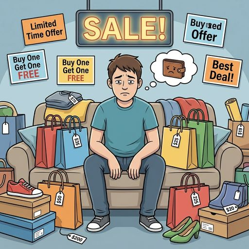

# Шопоголизм и [импульсивные покупки](../../../6.2_money_and_literacy/how_to_save_for_goal/articles/expenses.md): Как маркетологи играют на наших слабостях

Ты открываешь Wildberries «просто посмотреть». Через час у тебя в корзине три худи, светящийся чехол для телефона и набор маркеров, которые ты не планировал покупать. Палец завис над кнопкой «Оплатить». [Сердце](../../../3.1. healthy lifestyle/Sleep, nutrition, and adolescent energy/articles/the_energy_trap.md) колотится. Ты чувствуешь [предвкушение](Dopamine.md).

**Стоп. Это не покупка. Это дофаминовая ловушка.**

---

## Шопоголизм — это [зависимость](../../../3.1. healthy lifestyle/Sleep, nutrition, and adolescent energy/articles/the_energy_trap.md)?

Да. И это не преувеличение. В психологии это называется **ониомания** — навязчивое стремление совершать покупки, которое [человек](../../../1.2_natural_sciences/physics_in_everyday_life/Q45003.md) не может контролировать.

Механизм тот же, что и у любой другой [зависимости](how_addiction_changes_personality.md):

1. **[Триггер](../../../5.1_technology_and_digital_literacy/information and media literacy/эмоциональные_триггеры_в_контенте.md)** — скука, [стресс](../../../3.1. healthy lifestyle/Sleep, nutrition, and adolescent energy/articles/chronic_sleep_deprivation.md), [грусть](../../../1.2_natural_sciences/neurobiology_for_teens/articles/20_sadness.md), уведомление о распродаже
2. **[Действие](../../../2.1_society/cause_and_effect_relationships/articles/personal_choice.md)** — открыл приложение, начал листать
3. **[Награда](../../../1.2_natural_sciences/neurobiology_for_teens/articles/11_reward_system.md)** — нажал «Купить», получил всплеск дофамина
4. **Откат** — через день [посылка](../../../4.2_thinking_and_working_information/critical_thinking/articles/logical_errors_and_sophisms.md) пришла, а радости нет. Вещь лежит без дела

Причём главный кайф — не сама вещь. **Кайф — в моменте покупки.** Нажатие [кнопки](../../../7.1_art/musical_instruments/articles/accordion.md), подтверждение заказа, [ожидание](../../../1.2_natural_sciences/neurobiology_for_teens/articles/16_love_chemistry.md) доставки. Когда посылка приходит, [удовольствие](../../../1.2_natural_sciences/neurobiology_for_teens/articles/11_reward_system.md) уже прошло. Знакомо?

---

## [Что происходит](../../../5.1_technology_and_digital_literacy/how_internet_works/articles/web_basics/what_happens.md) в мозге

Когда ты видишь вещь, которая тебе нравится, [мозг](../../../3.1. healthy lifestyle/Sleep, nutrition, and adolescent energy/articles/breakfast_for_the_brain.md) выделяет **[дофамин](../../../1.2_natural_sciences/neurobiology_for_teens/articles/10_sweet_tooth.md)** — [нейромедиатор](Dopamine.md) предвкушения. Тот самый, о котором мы говорили в статье про дофаминовую петлю.

Но вот ключевое: дофамин выделяется не когда ты получил вещь, а **когда ты только думаешь о покупке**. Мозг рисует картинку: «Вот я в этом худи, вот все завидуют, вот как будет круто». Именно эта фантазия вызывает удовольствие.

А когда ты получил товар — дофамин уже упал. [Реальность](../../../1.2_natural_sciences/physics_in_everyday_life/Q140028.md) не совпадает с фантазией. Худи оказывается обычным. Маркеры лежат в ящике. Чехол не такой яркий, как на [фото](../../../5.1_technology_and_digital_literacy/information and media literacy/проверка_фото_на_манипуляции.md).

И мозг начинает искать **новую покупку**, чтобы снова запустить цикл предвкушения.

---

## Анатомия импульсной покупки: 7 секунд

Учёные из Стэнфордского университета провели [эксперимент](../../../1.2_natural_sciences/physics_in_everyday_life/Q1293220.md): показывали людям фотографии товаров и одновременно сканировали их мозг с помощью фМРТ. [Результаты](../../../1.2_natural_sciences/why_science_help_understand_world/research_work.md):

1. **0–2 секунды.** Активируется **[прилежащее ядро](../../../1.2_natural_sciences/neurobiology_for_teens/articles/11_reward_system.md)** — центр удовольствия. Мозг реагирует на красивую картинку так же, как на вкусную еду или комплимент.
2. **2–4 секунды.** Подключается **[островковая кора](../../../1.2_natural_sciences/neurobiology_for_teens/articles/15_empathy.md)** — она обрабатывает цену. Если [цена](../../../6.1_Independent_living_and_daily_living_skills/reasonable_spending/articles/price.md) кажется высокой, возникает «болевой» [сигнал](../../../5.1_technology_and_digital_literacy/how_internet_works/articles/wifi/router.md). Если низкой (скидка!) — сигнал подавляется.
3. **4–7 секунд.** **[Префронтальная кора](../../../1.2_natural_sciences/neurobiology_for_teens/articles/04_main_parts_of_the_brain.md)** (рациональная часть мозга) пытается вмешаться: «Тебе это действительно нужно?» Но у подростков эта часть мозга ещё не полностью развита, поэтому её голос тихий.
4. **Клик.** Удовольствие побеждает. Покупка совершена.

Весь [процесс](../../../5.1_technology_and_digital_literacy/operating system/articles/process.md) — **меньше 7 секунд**. Именно поэтому маркетологи делают кнопку «Купить» максимально доступной и яркой. Чем меньше шагов между «увидел» и «купил» — тем выше конверсия.

---

## [Феномен](../../../../8.1_self_understanding/articles/history_of_impostor_syndrome.md) «распаковки»: Зависимость нового поколения

Ты наверняка видел [видео](../../../5.1_technology_and_digital_literacy/information and media literacy/оценка_качества_изображений_и_видео.md) на YouTube и TikTok, где люди распаковывают посылки. Миллионы просмотров, миллионы [подписчиков](Social_media.md). Почему?

Потому что **[наблюдение](../../../1.2_natural_sciences/neurobiology_for_teens/articles/15_empathy.md) за распаковкой активирует ту же дофаминовую систему**, что и собственная покупка. Ты смотришь, как кто-то открывает коробку, и твой мозг выделяет дофамин — [предвкушение](../../../1.2_natural_sciences/neurobiology_for_teens/articles/18_music_chills.md), [интерес](../../../1.2_natural_sciences/neurobiology_for_teens/articles/19_curiosity.md), «а что там внутри?»

Это создаёт двойной эффект:

* **Нормализация** — «все покупают, все распаковывают, это нормально»
* **[Зависть](../../../../8.1_self_understanding/articles/social_comparison.md) и [желание](../../../6.1_Independent_living_and_daily_living_skills/reasonable_spending/articles/want.md)** — «я тоже [хочу](../../../6.1_Independent_living_and_daily_living_skills/reasonable_spending/articles/want.md) такой момент, я тоже хочу снять такое видео»
* **Снижение порога** — после десятого видео с распаковкой сделать собственный заказ кажется естественным и безобидным

Блогеры, которые снимают «haul» (покупки за раз на крупную сумму), получают [деньги](../../../2.1_society/cause_and_effect_relationships/articles/economic_chains.md) от рекламодателей. Они не тратят свои деньги — они тратят **твои**, потому что ты идёшь и покупаешь после просмотра.

---

## Быстрая мода: Купил, выбросил, купил снова

Отдельная ловушка — **fast fashion** (быстрая мода). Бренды вроде Shein, Zara, H&M выпускают новые коллекции **каждые 2–3 недели**. Смысл простой: вещи стоят дёшево, [качество](../../../6.1_Independent_living_and_daily_living_skills/reasonable_spending/articles/quality.md) низкое, через месяц они выглядят изношенными — и ты покупаешь новые.

Средний подросток сегодня покупает **в 5 раз больше одежды**, чем его сверстник 20 лет назад. При этом каждая вещь носится **в 7 раз меньше**.

Вот что стоит за «дешёвой» футболкой за 300 рублей:

* Она произведена на фабрике в Бангладеш, где работники получают 3–5 долларов в день
* Краска содержит химикаты, которые запрещены в [ЕС](../../../2.2_history/world_economy_on_fingers/articles/evropeyskiy_soyuz.md) для текстиля
* Ткань начнёт расползаться после третьей стирки
* Через месяц она отправится на свалку, где будет разлагаться **[200](../../../5.1_technology_and_digital_literacy/how_internet_works/articles/http_https/http_https.md) лет** (синтетика)

Ты не «экономишь». Ты покупаешь мусор, который притворяется одеждой. И тратишь в сумме **больше**, чем потратил бы на одну качественную вещь.

---

## Шопоголизм в цифрах

* **62%** подростков 14–17 лет совершали покупку, о которой потом жалели (опрос SuperJob, 2024)
* Средний россиянин проводит **45 минут в день** в приложениях маркетплейсов
* Wildberries, Ozon и другие маркетплейсы фиксируют **пик заказов между 22:00 и 01:00** — когда [сила](../../../1.2_natural_sciences/physics_in_everyday_life/Q11023.md) воли на минимуме, а [усталость](../../../3.1. healthy lifestyle/Sleep, nutrition, and adolescent energy/articles/sugar_rollercoaster.md) снижает контроль импульсов
* **40%** купленной одежды ни разу не надевается ([данные](../../../2.1_society/cause_and_effect_relationships/articles/ai_causality.md) McKinsey Global Fashion Index)
* Возврат товаров на маркетплейсах составляет **25–30%** — каждый третий-четвёртый заказ возвращается, потому что «в жизни не такой, как на фото»

---

## [История](../../../1.2_natural_sciences/physics_in_everyday_life/Q11469.md) Кати: как «просто посмотреть» превращается в проблему

Кате 15 лет. Она учится в обычной школе, живёт с мамой. [Карманные деньги](../../../6.1_Independent_living_and_daily_living_skills/reasonable_spending/articles/income.md) — 3000 рублей в месяц. Казалось бы, много ли на это купишь?

Всё началось с того, что подруга скинула ссылку на «крутой чехол за 150 рублей» на Wildberries. Катя зарегистрировалась, заказала чехол. Пришло push-уведомление: «Персональная скидка 20% на первый заказ от 1000 ₽». Катя добрала товаров до тысячи.

Через неделю: «Ваши [баллы](../../../4.1_rules_of_study/how_to_learn_effectively/articles/gamification.md) сгорают через 3 дня!» Катя зашла потратить баллы, а вышла с новым заказом на 800 рублей.

Через месяц: Катя заходила в приложение каждый вечер. Перед сном, «чтобы расслабиться». Листала, добавляла в корзину, иногда покупала. Карманных [денег](../../../8.2_future/choosing_a_career_path/articles/salary.md) стало не хватать. Она попросила у мамы «на школьные [расходы](../../../6.1_Independent_living_and_daily_living_skills/reasonable_spending/articles/expense.md)» и потратила на заказ.

Через три месяца: у Кати в шкафу лежали вещи с бирками, которые она ни разу не надела. Она скрывала покупки. Она чувствовала стыд, но не могла остановиться. Вечерний [скроллинг](Doomscrolling.md) маркетплейса стал ритуалом, без которого она не могла заснуть.

Катя — не «плохая» и не «слабая». Катя — обычный подросток, который столкнулся с машиной, спроектированной лучшими психологами мира для того, чтобы ты покупал.

---

## Как маркетологи взламывают твой мозг

Компании тратят миллиарды на исследования поведения покупателей. Каждая кнопка, каждый [цвет](../../../1.2_natural_sciences/physics_in_everyday_life/Q1075.md), каждое уведомление на экране — это [результат](../../../1.2_natural_sciences/why_science_help_understand_world/experimental_science.md) [работы](../../../8.2_future/choosing_a_career_path/articles/interview.md) психологов. Вот главные приёмы:

### 1. Искусственный дефицит

«Осталось 2 штуки!», «[Акция](../../../6.1_Independent_living_and_daily_living_skills/reasonable_spending/articles/discount.md) заканчивается через 01:47:23». Это [давление](../../../1.1_structure_of_the_world/matter/articles/07_gases.md) времени. Мозг переключается в [режим](../../../4.1_rules_of_study/how_to_learn_effectively/articles/breaks_and_rest.md) паники: «Если не купишь сейчас — потеряешь навсегда!»

На самом деле в 90% случаев товар никуда не денется. Завтра будет новая «последняя акция». Но в момент стресса ты не думаешь рационально.

### 2. Якорная цена

Зачёркнутая цена **4999 ₽** и красная **1999 ₽** рядом. Ты не знаешь, стоила ли вещь когда-либо 4999. Возможно, она всегда стоила 1999. Но мозг уже зафиксировал «скидку 60%» и считает это выгодной сделкой.

### 3. Бесплатная доставка «от суммы»

«Бесплатная доставка от 2000 ₽». Твой заказ на 1600. Что ты делаешь? Добавляешь ещё одну вещь на [500](../../../5.1_technology_and_digital_literacy/how_internet_works/articles/http_https/http_https.md) рублей, «чтобы не платить за доставку». В итоге потратил больше, чем планировал. Доставка стоила 200. Ты «сэкономил» 200, потратив лишних 500.

### 4. Персональные рекомендации

[Алгоритмы](../../../4.2_thinking_and_working_information/how_to_search_information/articles/buble_filter.md) знают, что ты смотрел, что лайкал, на чём задерживал взгляд. Они подсовывают именно то, что ты хочешь, именно тогда, когда ты уязвим — поздно вечером, после тяжёлого дня, в момент скуки.

### 5. Кэшбэк и бонусы

«Купи и получи 15% баллами!» Это не скидка. Это **привязка**. Баллы можно потратить только в этом магазине. Ты возвращаешься снова и снова, потому что «у меня же там баллы пропадают».

---

## [Проверка](../../../1.2_natural_sciences/why_science_help_understand_world/scientific_method.md): Шопоголик или нет?

| Признак | Норма | Тревожный сигнал |
| :--- | :--- | :--- |
| **[Частота](../../../1.2_natural_sciences/physics_in_everyday_life/Q11388.md) покупок** | Покупаешь, когда нужно | Покупаешь, когда грустно / скучно / тревожно |
| **[Планирование](../../../3.1. healthy lifestyle/Sleep, nutrition, and adolescent energy/articles/ideal_schedule_energy_management.md)** | Знаешь, что хочешь, до открытия [приложения](../../../4.1_rules_of_study/how_to_learn_effectively/articles/digital_tools.md) | Открываешь «просто посмотреть» и уходишь с заказом |
| **[Эмоции](../../../3.1. healthy lifestyle/Sleep, nutrition, and adolescent energy/articles/stress_and_food.md) после** | Доволен покупкой | Чувство вины, «зачем я это купил?» |
| **Использование** | Пользуешься купленным | Вещи лежат с бирками неделями |
| **Финансы** | Тратишь в рамках бюджета | Тратишь всё или залезаешь в [долг](../../../2.1_society/cause_and_effect_relationships/articles/responsibility.md) |

Если ты узнал себя в правой колонке три раза и более — стоит задуматься.

---

## Почему [подростки](../../../3.1. healthy lifestyle/Sleep, nutrition, and adolescent energy/articles/biology_of_night_owls_teens.md) особенно уязвимы

У подростков есть три фактора, которые делают их идеальной мишенью для маркетологов:

**1. [Лобные доли](../../../1.2_natural_sciences/neurobiology_for_teens/articles/04_main_parts_of_the_brain.md) ещё формируются.** Та часть мозга, которая отвечает за контроль импульсов, планирование и оценку последствий, созревает только к 25 годам. Поэтому подростку **физически сложнее** сказать «нет» импульсной покупке, чем взрослому.

**2. [Социальное давление](../../../8.2_future_and_path_choice/articles/02_insecurity_causes.md).** «У всех есть, а у меня нет» — один из самых сильных мотиваторов в подростковом возрасте. Маркетологи это знают и создают тренды, которые заставляют чувствовать себя «не таким», если у тебя нет определённой вещи.

**3. Доступ к [деньгам](../../../8.2_future/choosing_a_career_path/articles/salary.md) без опыта.** Карты, переводы, рассрочки — подросток может потратить деньги за секунду, не ощущая их физической потери. Когда ты отдаёшь [наличные](../../../6.1_Independent_living_and_daily_living_skills/reasonable_spending/articles/cash.md) — ты чувствуешь, как деньги уходят. Когда нажимаешь кнопку — нет.

**4. Идентичность через вещи.** В 13–17 лет ты ищешь [ответ](../../../5.1_technology_and_digital_literacy/how_internet_works/articles/http_https/http_https.md) на вопрос «Кто я?». Маркетологи предлагают готовый ответ: «Ты — это то, что ты носишь, на чём ездишь, какой у тебя телефон». Купи правильные кроссовки — и ты «свой». Не купи — и ты «аутсайдер». Это [манипуляция](../../../2.1_society/cause_and_effect_relationships/articles/false_connections.md), но она работает, потому что попадает в больное место.

---

## Рассрочки и «Купи сейчас — плати потом»

Маркетплейсы всё чаще предлагают рассрочки и [сервисы](../../../4.1_rules_of_study/how_to_learn_effectively/articles/digital_tools.md) «[оплата](../../../6.1_Independent_living_and_daily_living_skills/reasonable_spending/articles/expense.md) частями». Звучит безобидно: вместо 5000 сразу — четыре платежа по 1250. Но за этим стоит психологический трюк.

Когда ты видишь цену **5000 ₽** — мозг регистрирует «[боль](../../../1.2_natural_sciences/neurobiology_for_teens/articles/16_love_chemistry.md) потери». Когда ту же цену разбивают на **1250 ₽** — боль снижается в четыре раза. Ты покупаешь вещь, которую не купил бы за полную [стоимость](../../../6.1_Independent_living_and_daily_living_skills/reasonable_spending/articles/price.md), потому что **маленькая [сумма](../../../6.1_Independent_living_and_daily_living_skills/reasonable_spending/articles/receipt.md) не вызывает тревогу**.

Проблема: ты набираешь несколько рассрочек одновременно. И вместо одного платежа в 1250 у тебя пять по 1250 = 6250 в месяц. А потом ещё три. И ещё.

Взрослые люди с [зарплатой](../../../8.2_future/choosing_a_career_path/articles/salary.md) попадают в долговую яму через рассрочки. Подростку, у которого нет стабильного [дохода](../../../8.2_future/choosing_a_career_path/articles/salary.md), хватит одного неудачного месяца.

---

## Что делать: Практический чек-лист

1. **[Правило](../../../1.2_natural_sciences/why_science_help_understand_world/patterns.md) 48 часов.** Хочешь что-то купить? Подожди два дня. Если через 48 часов всё ещё хочешь — покупай. В 70% случаев желание проходит.
2. **Удали приложения магазинов с телефона.** Заходи через [браузер](../../../5.1_technology_and_digital_literacy/how_internet_works/articles/http_https/http_https.md). Каждый дополнительный [шаг](../../../1.2_natural_sciences/physics_in_everyday_life/Q36253.md) — это шанс для мозга включить рациональное [мышление](../../../1.2_natural_sciences/neurobiology_for_teens/articles/01_brain_complexity.md).
3. **Отключи [уведомления](../../../4.2_thinking_and_working_information/how_to_search_information/articles/information_hygiene.md).** «Скидка 50% только сегодня!» — это не [информация](../../../5.1_technology_and_digital_literacy/information and media literacy/как_устроена_современная_информационная_среда.md), это манипуляция. Не давай чужим алгоритмам решать, когда тебе тратить деньги.
4. **Веди [список](../../../5.2_cybersecurity/cpp_fundamentals/10_arrays.md) покупок.** Записывай, что реально нужно. Покупай только из списка. Всё остальное — [импульс](../../../1.2_natural_sciences/physics_in_everyday_life/Q41273.md), который пройдёт.
5. **Считай в часах работы.** Вещь стоит 2000 рублей? Если ты зарабатываешь 200 рублей в час — это 10 часов твоей жизни. Стоит ли худи десяти часов?
6. **Найди, что стоит за импульсом.** Ты покупаешь, потому что тебе скучно? Тревожно? Одиноко? Покупка не решит ни одну из этих проблем. Она только замаскирует их на полчаса.

> **Важный [вывод](../../../1.2_natural_sciences/why_science_help_understand_world/scientific_method.md):** Маркетологи не продают тебе вещи. Они продают тебе эмоции. Ощущение крутости, принадлежности, контроля. Но эмоцию [нельзя](../../../3.1_healthy_lifestyle/pervaya_pomoshch/ushibi_porezy_ozhogi/07_ushib_chego_nelzya.md) купить в интернет-магазине. Она заканчивается в момент оплаты.

---

## Если это серьёзно

Импульсивные покупки — это одно. Настоящий шопоголизм — другое. Если ты:

* тратишь деньги, которых у тебя нет (берёшь в долг у друзей, родителей)
* прячешь покупки или врёшь о [том](../../../7.1_art/musical_instruments/articles/drums.md), сколько потратил
* чувствуешь, что не можешь остановиться, даже когда понимаешь проблему

— это повод поговорить с кем-то, [кому](overdose.md) доверяешь. [Родители](../../../../8.1_self_understanding/articles/family_influence.md), школьный [психолог](../../../../8.1_self_understanding/articles/when_to_seek_help.md), телефон доверия **8-800-2000-122**. Зависимость — это не стыдно. Стыдно — делать вид, что всё нормально, когда это не так.

---

**[Автор](../../../4.2_thinking_and_working_information/how_to_search_information/articles/copypaste.md):** Воробьев Глеб

**Нейронные сети, использованные при создании статьи:** Claude (Anthropic)
