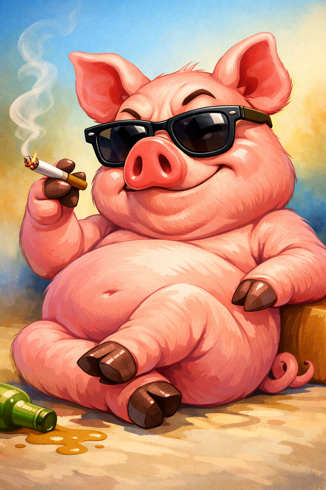

# [Курение](./smoking.md)

---

# [Курение](./smoking.md) 

## Введение

Привет, [друзья](../../../4.1_rules_of_study/how_to_learn_effectively/articles/peer_learning.md)! Сегодня поговорим о **[курении](./smoking.md)**. Это [привычка](../../../7.2 Media, leisure and hobbies /useful_and_interesting_leisure/articles/how_not_to_quit_hobby.md), которая кажется «обычной», но на самом деле приносит много вреда [здоровью](./health.md). Когда кто-то курит, дым попадает в лёгкие, а вместе с ним — вещества, которые мешают организму нормально работать. Даже если кажется, что «ничего страшного», [вред](../../../3.1. healthy lifestyle/Sleep, nutrition, and adolescent energy/articles/the_energy_trap.md) накапливается постепенно.

## Основная часть

[Курение](../../../1.2_natural_sciences/neurobiology_for_teens/articles/13_nicotine.md) влияет на [дыхание](../../../1.2_natural_sciences/physics_in_everyday_life/Q163214.md), [выносливость](../../../3.1. healthy lifestyle/Sleep, nutrition, and adolescent energy/articles/sport_and_energy.md) и внешний вид. [Человек](../../../1.2_natural_sciences/physics_in_everyday_life/Q45003.md) быстрее устаёт, ему сложнее заниматься спортом, ухудшается состояние кожи и зубов. Ещё один важный момент — пассивное курение: когда рядом курят другие, дым вдыхает и тот, кто сам не курит.

### Как это работает

1. **[Привыкание](../../../1.2_natural_sciences/neurobiology_for_teens/articles/11_reward_system.md)**: [никотин](../../../1.2_natural_sciences/neurobiology_for_teens/articles/13_nicotine.md) вызывает [зависимость](how_addiction_changes_personality.md), и из-за этого бросить курить бывает сложно.
2. **Вред лёгким**: дым раздражает дыхательные пути, поэтому появляется кашель и одышка.
3. **Меньше энергии**: организму сложнее получать достаточно кислорода, и это снижает выносливость.

## Примеры из жизни школьника

1. **Саша и физкультура**: Саша начал курить «за компанию», и на уроках физкультуры стал быстрее задыхаться. Он заметил, что раньше мог пробежать больше, а теперь устаёт уже в начале.
2. **Лера и запах**: Лера не курит, но дома курят взрослые. Ей неприятно, что [одежда](../../../1.2_natural_sciences/physics_in_everyday_life/Q487005.md) впитывает запах дыма, и у неё часто болит горло.
3. **Игорь и [выбор](../../../2.1_society/cause_and_effect_relationships/articles/personal_choice.md)**: Игорь видел, как старшие ребята курят, но решил отказаться. Он заметил, что после тренировок ему легче восстанавливаться, чем тем, кто курит.

## Интересные [факты](../../../1.2_natural_sciences/physics_in_everyday_life/Q17737.md)

1. **Пассивное курение**: даже если ты не куришь сам, дым рядом тоже может вредить здоровью.
2. **Сложно бросить**: [зависимость](../../../3.1. healthy lifestyle/Sleep, nutrition, and adolescent energy/articles/the_energy_trap.md) от никотина формируется быстро, поэтому лучше вообще не начинать.

## [Заключение](../../../1.2_natural_sciences/physics_in_everyday_life/Q2225.md)

**[Курение](./smoking.md)** — это привычка, которая кажется «мелочью», но со временем серьёзно влияет на [здоровье](../../../3.1. healthy lifestyle/Sleep, nutrition, and adolescent energy/articles/chronic_sleep_deprivation.md). Самое разумное [решение](../../../2.1_society/cause_and_effect_relationships/articles/personal_choice.md) — не начинать, а если уже куришь, искать поддержку и способы отказаться. [Забота](../../../8.2_future_and_path_choice/articles/support_and_help.md) о себе — это [уважение](../../../5.1_technology_and_digital_literacy/information and media literacy/этика_общения_в_сети.md) к своему будущему. 🌟

---

*[Автор](../../../4.2_thinking_and_working_information/how_to_search_information/articles/copypaste.md): Дмитрий Марьин • Сгенерировано с помощью OpenRouter • Слов: 327 • 2026-03-17*
