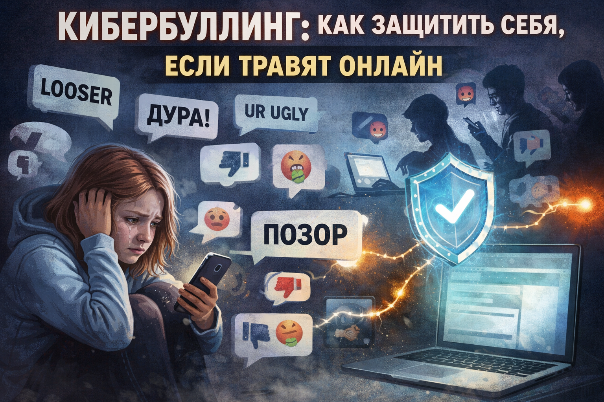

# Кибербуллинг: как защитить себя, если травят онлайн

Кибербуллинг - это травля в интернете: в чатах, комментариях, играх, соцсетях и мессенджерах. Он может выглядеть как «шутка», но последствия бывают серьезными: тревога, страх, стыд, нежелание идти в школу, проблемы со сном и учебой.

Важно помнить: ты не обязан терпеть оскорбления и не должен разбираться с этим в одиночку. Чем раньше подключаются взрослые и есть доказательства, тем быстрее можно остановить травлю.

## Иллюстрация

*Экран телефона с оскорбительными сообщениями и кнопками «блокировать» и «пожаловаться».*

## Как распознать кибербуллинг
- Тебя регулярно оскорбляют, высмеивают или унижают в переписке.
- В общий чат специально отправляют обидные мемы или фото про тебя.
- Распространяют ложные слухи, фейки или чужие личные данные.
- Пишут угрозы, шантажируют, требуют деньги или фото.
- Создают фальшивый аккаунт от твоего имени.
- Специально исключают из групп и обсуждений, чтобы унизить.

Разовая грубость тоже неприятна, но кибербуллинг обычно повторяется и направлен на то, чтобы сделать тебе больно.

## План действий «Стоп - Сохрани - Заблокируй - Сообщи»
1. Остановись и не отвечай агрессией.
Оскорбления в ответ обычно только усиливают конфликт и могут обернуться против тебя.
2. Сохрани доказательства.
Сделай скриншоты с именем аккаунта, датой, временем, ссылкой и текстом сообщений.
3. Заблокируй обидчика.
Прекрати доступ к себе: в мессенджере, соцсети, игре, комментариях.
4. Пожалуйся на контент.
Используй кнопку «Пожаловаться», чтобы платформа получила сигнал о нарушении.
5. Расскажи взрослому.
Обратись к родителям, классному руководителю, школьному психологу или другому безопасному взрослому.

## Какие доказательства важно сохранить
- Скриншоты переписки и комментариев.
- Ссылки на профиль обидчика и публикации.
- Дату и время сообщений.
- Имена свидетелей, если они были в чате.
- Информацию о фальшивых аккаунтах, если их создали от твоего имени.

Не удаляй переписку сразу. Сначала сохрани все, что может подтвердить факт травли.

## Что делать нельзя
- Не вступай в «перестрелку» оскорблениями.
- Не пересылай обидный контент другим людям.
- Не публикуй личные данные обидчика в ответ.
- Не соглашайся на «тайные встречи», чтобы «разобраться».
- Не молчи, надеясь, что само пройдет.

## Когда нужна срочная помощь
Сразу зови взрослых и звони в [112](./emergency-112.md), если:
- есть прямые угрозы жизни и здоровью;
- тебя шантажируют деньгами или интимными фото;
- преследуют не только в сети, но и в реальной жизни;
- пишут, что знают, где ты живешь, и обещают прийти.

В таких случаях не нужно спорить с обидчиком. Нужны доказательства и помощь взрослых.

## Как поддержать друга, если травят его
- Напиши, что он не один и ты на его стороне.
- Не лайкай и не пересылай обидные посты.
- Помоги сделать скриншоты и жалобу на платформе.
- Предложи вместе подойти к учителю, родителю или психологу.

Даже одно спокойное сообщение поддержки может сильно помочь человеку, которого травят.

## Как снизить риск кибербуллинга
- Закрой профиль для незнакомых пользователей.
- Ограничь, кто может писать личные сообщения.
- Не публикуй лишние личные данные и геолокацию.
- Используй сложные пароли и двухфакторную защиту.
- Сразу блокируй подозрительные аккаунты.

## Запомни главное
Кибербуллинг останавливается не спором, а четким планом: сохранить доказательства, ограничить контакт, сообщить взрослым и обратиться за помощью. Просить помощи в такой ситуации - это правильное и сильное решение.

Смотри также: [Безопасность в интернете](./internet-safety.md), [Подозрительные ссылки](./phishing-links.md), [Экстренный номер 112](./emergency-112.md).

---
Автор: Тутаев Владимир
