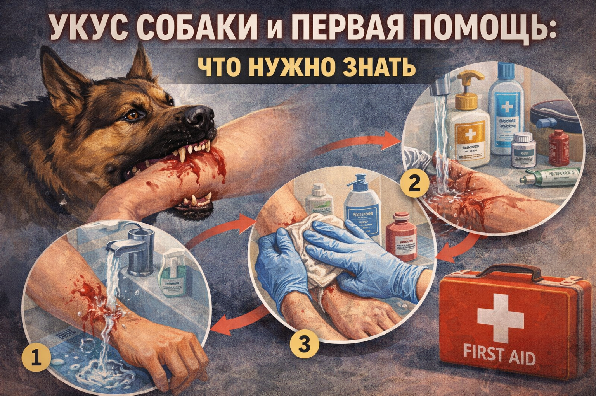

# Укус собаки и первая помощь: что нужно знать

Большинство собак не нападает без причины, но при испуге, боли, защите территории или щенков животное может повести себя агрессивно. Поэтому важно знать не только первую помощь, но и правила поведения, которые снижают риск укуса.

Даже небольшой укус требует внимания: через рану может попасть инфекция. Правильные действия в первые минуты уменьшают риск осложнений и помогают врачу быстрее принять решение о лечении.

## Иллюстрация

*Ребёнок спокойно отходит от собаки, рядом взрослый оказывает первую помощь.*

## Как снизить риск укуса
- Не подходи к незнакомой собаке без разрешения хозяина.
- Не трогай собаку, когда она ест, спит или охраняет щенков.
- Не тяни за хвост, уши и не пытайся «дразнить» животное.
- Не наклоняйся резко к морде собаки.
- Не убегай от агрессивной собаки: это может спровоцировать погоню.

## Признаки, что собака напряжена
- рычит, скалит зубы;
- прижимает уши, жестко смотрит;
- шерсть на спине поднимается;
- делает резкие выпады вперед.

Если видишь такие признаки, лучше сразу увеличить дистанцию.

## Если собака ведет себя угрожающе
1. Остановись и замри.
2. Не кричи, не маши руками и не делай резких движений.
3. Не смотри собаке прямо в глаза.
4. Медленно отходи боком к безопасному месту.
5. Позови взрослого или зайди в помещение, если это рядом.

## Первая помощь при укусе
1. Сначала обеспечь безопасность.
Отойди от собаки и позови взрослого.
2. Останови кровотечение.
Прижми рану чистой салфеткой или тканью. Если кровь сильно идет, продолжай прижимать до приезда помощи.
3. Промой рану водой с мылом 10-15 минут.
Это важный шаг, который помогает уменьшить риск инфекции.
4. Обработай только края раны антисептиком.
Не заливай глубоко внутрь раны спирт, йод или зеленку.
5. Наложи чистую сухую повязку.
6. Обратись к врачу в тот же день, даже если рана маленькая.

## Когда нужно срочно звонить 112
- кровотечение не останавливается;
- глубокая рана, рваные края, видны ткани;
- укус в лицо, шею, кисть, область суставов или гениталий;
- пострадавший бледнеет, слабеет, теряет сознание;
- укусила бездомная собака, и нет данных о прививках животного.

В этих случаях сразу звони в [112](./emergency-112.md).

## Что важно сообщить врачу
- когда и где произошел укус;
- известна ли собака и есть ли хозяин;
- есть ли сведения о прививках животного;
- какие действия уже были сделаны (промывание, повязка, обработка).

Эта информация помогает врачу оценить риск инфекции, столбняка и бешенства.

## Чего делать нельзя
- Не накладывай жгут без необходимости.
- Не прижигай рану.
- Не заклеивай рану герметично грязными материалами.
- Не откладывай визит к врачу «до завтра».
- Не пытайся лечиться только домашними средствами.

## Почему осмотр у врача обязателен
После укуса может понадобиться дополнительная обработка раны, профилактика инфекции, а в некоторых случаях прививки по медицинским показаниям. Даже если сначала кажется, что «ничего страшного», осложнения могут развиться позже.

## Запомни главное
Лучший способ защиты - спокойное поведение рядом с собаками. Если укус произошел, действуй по алгоритму: безопасность, остановка кровотечения, промывание, повязка, врач в тот же день.

Смотри также: [Экстренный номер 112](./emergency-112.md), [Незнакомец на улице](./stranger-safety.md).

---
Автор: Тутаев Владимир
