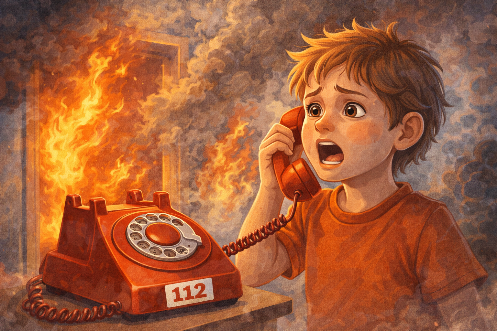

# Экстренный номер 112: как звонить так, чтобы помощь приехала быстрее

`112` - это единый номер экстренных служб. По нему можно вызвать пожарных, скорую помощь, полицию и другие службы реагирования. Этот номер нужен для ситуаций, когда есть опасность для жизни, здоровья или безопасности. Позвонить можно даже в сильном волнении, если держаться простого порядка и говорить по шагам. Не нужно ждать, пока рядом окажется кто-то смелее или старше: если ситуация действительно опасная, звонок может стать самым важным действием в этот момент.

## Иллюстрация

*Место для изображения: ребенок говорит по телефону и передает оператору адрес.*

## Когда нужно звонить
- Пожар или задымление.
Если ты видишь огонь, чувствуешь сильный запах гари или помещение быстро заполняется дымом, помощь нужна сразу.
Даже если пламя кажется небольшим, оно может распространиться очень быстро, особенно в квартире, подъезде или на кухне.
- Травма или резкое ухудшение самочувствия.
Звони, если человек сильно ударился, потерял сознание, ему трудно дышать, у него сильная боль или кровотечение.
Сюда же относятся ситуации, когда человеку стало очень плохо внезапно: он не может встать, ответить на вопросы или выглядит так, будто вот-вот потеряет сознание.
- Потерялся ребенок и нет безопасного взрослого рядом.
Если рядом нет родителей, учителя, охраны, продавца или другого взрослого, которому можно доверять, лучше сразу обратиться за помощью.
Чем раньше взрослые узнают, где ты находишься, тем быстрее смогут помочь и тем меньше риск уйти еще дальше от безопасного места.
- Угроза нападения, преследование, опасная ситуация на улице.
Если кто-то ведет себя агрессивно, пытается увести тебя, ломится в дверь или рядом происходит что-то опасное, не жди, что проблема решится сама.
Если есть возможность, во время звонка перейди ближе к людям, в магазин, аптеку, охрану или другое людное и безопасное место.

## Что обязательно сказать оператору
1. Что случилось.
Коротко назови причину звонка: пожар, человеку плохо, кто-то потерялся, есть угроза.
Не нужно начинать издалека и долго объяснять все детали. Сначала скажи самое главное, чтобы оператор сразу понял, какую помощь отправлять.
2. Где это произошло: адрес, этаж, ориентиры.
Самая важная часть звонка - место. Назови улицу, номер дома, квартиру, этаж, подъезд, а если точного адреса не знаешь - магазин, остановку, школу или другой заметный ориентир рядом.
Если ты на улице, можно назвать название парка, станции, номер автобуса, детской площадки или цвет и вывеску ближайшего здания.
3. Сколько людей в опасности.
Скажи, пострадал один человек или несколько, есть ли рядом дети, пожилые люди или те, кто не может выйти сам.
Если кто-то заперт, лежит без движения или не может говорить, это тоже важно сообщить сразу.
4. Кто звонит и с какого номера.
Назови свое имя. Если звонишь не со своего телефона, тоже скажи об этом, чтобы оператор понимал, как с тобой связаться.
После этого старайся держать телефон под рукой и не отключать звук, потому что тебе могут перезвонить для уточнения адреса или деталей.

## Пример сообщения
«Здравствуйте. Меня зовут ____. Мы находимся по адресу ____. У нас ____ (пожар/травма/угроза). Нужна помощь».

Если трудно подобрать слова, можно говорить совсем просто. Главное - не красиво рассказывать, а быстро и понятно передать суть: что случилось, где это произошло и кому нужна помощь.
Если рядом пострадавший, можно сразу добавить: «Человек без сознания», «Есть кровь», «Мы не можем выйти», «За мной идет незнакомый человек». Такие короткие уточнения помогают оператору быстрее оценить опасность.

## Как говорить правильно
- Говори спокойно и короткими фразами.
Даже если страшно, постарайся не тараторить. Когда речь понятная, оператор быстрее понимает ситуацию.
Если голос дрожит, это нормально. Можно на секунду вдохнуть и потом снова говорить коротко: одно предложение - одна важная мысль.
- Отвечай на вопросы по порядку.
Оператор может задавать уточняющие вопросы не из любопытства, а чтобы отправить нужную службу как можно точнее.
Иногда вопросы кажутся повторяющимися, но это нужно для проверки адреса, состояния человека или степени угрозы.
- Не бросай трубку первым.
Иногда оператор дает важные инструкции: как выйти из помещения, как остановить кровь или где ждать спасателей.
Пока связь сохраняется, тебе могут подсказать действия, которые помогут дожить до приезда взрослых и служб.
- Если связь оборвалась, перезвони.
Если не получается дозвониться сразу, попробуй еще раз и по возможности перейди в место, где лучше связь и безопаснее находиться.
Если говорить трудно, можно позвонить еще раз и начать с самой короткой фразы: «Пожар, адрес...», «Мне страшно, я потерялся, я у...».

## Что делать после звонка
- Выполняй инструкции оператора.
Он может сказать отойти от опасного места, открыть дверь спасателям, прижать рану тканью или оставаться на линии.
Если рядом маленький ребенок, пожилой человек или кто-то в панике, постарайся коротко передавать им эти инструкции.
- Встреть взрослых спасателей, если это безопасно.
Если ты в безопасном месте и можешь помочь, покажи, куда идти, особенно если дом большой, подъездов несколько или трудно найти вход.
Но не возвращайся в опасную зону ради этого. Встречать спасателей нужно только тогда, когда тебе самому ничего не угрожает.
- Не мешай работе служб на месте происшествия.
После приезда помощи не спорь, не бегай рядом и не пытайся снимать происходящее. Лучше сразу отойти туда, где скажут взрослые.
Если тебя просят подождать, назвать имя, показать квартиру или ответить на вопросы, отвечай спокойно и четко.

## Почему нельзя шутить с 112
Ложные вызовы отнимают время у тех, кому помощь нужна прямо сейчас. Пока оператор и службы реагируют на чью-то шутку, в другом месте кто-то может ждать настоящую помощь. В экстренной службе каждая минута важна, поэтому звонить на `112` нужно только по реальной причине. Этот номер не подходит для розыгрышей, проверки телефона или скуки. Чем меньше ложных звонков, тем быстрее помощь приходит туда, где действительно беда.

## Запомни главное
Четкий звонок в `112` может спасти жизнь. Главное - точный адрес, короткое объяснение ситуации и спокойная речь. Чем понятнее ты говоришь, тем быстрее нужная помощь сможет приехать. Не нужно знать специальные слова или разбираться во всех службах: достаточно не молчать, назвать место и честно рассказать, что произошло.

Смотри также: [Пожар дома](./fire-at-home.md), [Потерялся в городе](./lost-in-city.md), [Гроза на улице](./thunderstorm-safety.md).

---
Автор: Глумов Николай
