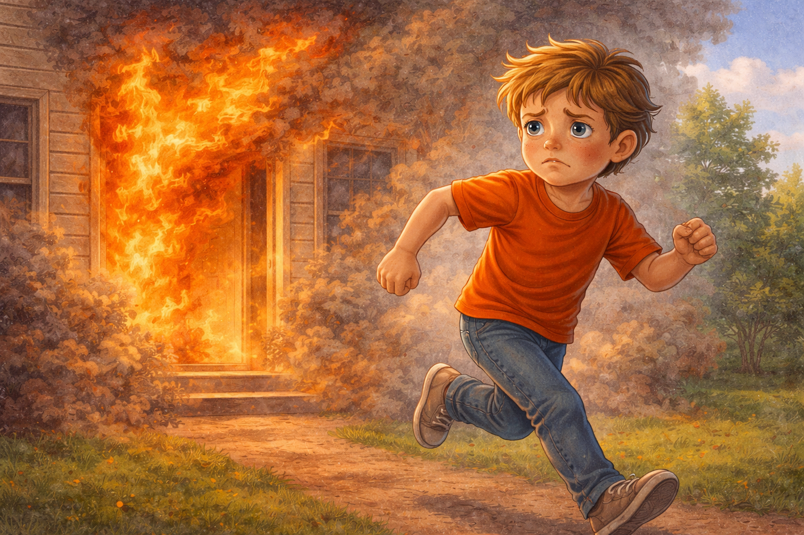

# Пожар дома: как действовать ребенку

Пожар дома развивается очень быстро. Иногда от маленькой искры за пару минут появляется много дыма, и становится трудно дышать и ориентироваться. Огонь и дым могут заполнить комнату раньше, чем кажется, поэтому в опасной ситуации важнее всего не паниковать, а действовать по простому и понятному плану. Чем быстрее человек понимает, что происходит, и начинает двигаться к безопасному месту, тем больше шансов избежать тяжелых последствий. Главное правило при пожаре простое: не спорить с опасностью, не проверять, «показалось или нет», а сразу относиться к дыму и огню всерьез.

## Иллюстрация

*Место для изображения: ребенок покидает дом.*

## Почему это опасно
- Огонь обжигает кожу и может перекрыть путь к выходу.
Если пламя находится между тобой и дверью, выбраться становится намного труднее и опаснее.
Иногда огонь появляется не сразу перед глазами, а в соседней комнате или в коридоре, поэтому важно замечать запах гари и дым как можно раньше.
Иногда кажется, что можно быстро пробежать мимо огня, но это очень рискованно: жар и дым действуют быстрее, чем человек успевает среагировать.
- Дым часто опаснее самого пламени: им легко надышаться.
Из-за дыма начинает щипать глаза, трудно видеть, кашлять и нормально дышать. Иногда именно дым мешает человеку выбраться вовремя.
Даже если огонь еще далеко, густой дым уже может сделать помещение очень опасным.
Поэтому нельзя ждать, пока станет совсем темно или трудно дышать. Если дыма становится больше, нужно немедленно уходить или звать помощь.
- В панике люди прячутся, и спасателям сложнее их найти.
Когда страшно, хочется спрятаться под кроватью или в шкафу, но это опасно: время теряется, а воздух становится хуже.
Спасатели в первую очередь ищут людей у выхода, у окна или там, где человек может подать голос.
Чем понятнее твои действия, тем проще взрослым и спасателям понять, где ты и как тебе помочь.

## Как подготовиться заранее
1. Узнай с родителями, где у вас ближайший выход из квартиры и из подъезда.
Посмотри, как идти до двери, до лестницы и до выхода из дома, если в коридоре темно или много дыма.
Полезно запомнить не только главный путь, но и запасной вариант, если обычный проход окажется в дыму.
Можно даже несколько раз спокойно пройти этот маршрут днем, чтобы в опасный момент тело само помнило, куда двигаться.
2. Договорись с семьей о месте встречи во дворе.
Это поможет не бегать вокруг дома в поисках друг друга после выхода.
Лучше выбрать заметное и понятное место: лавочку, дерево, фонарь или площадку рядом с домом.
Так взрослые быстрее поймут, все ли вышли, и смогут сообщить пожарным, если кого-то не хватает.
3. Запомни номер [112](./emergency-112.md).
Важно не только помнить номер, но и понимать, в каких случаях по нему нужно звонить.
Еще полезно знать свой домашний адрес без подсказки взрослых.
Если ребенок может назвать улицу, дом, квартиру и этаж, помощь приходит быстрее и точнее.
4. Проверь, что в квартире свободен путь к двери и нет лишних вещей в проходе.
Если проход заставлен коробками, обувью или сумками, в спешке можно упасть и потерять время.
Особенно важно, чтобы дверь легко открывалась и к ней не приходилось пробираться через вещи.
Подумай вместе с родителями, нет ли у вас мест, где ночью легко споткнуться: например, о рюкзак, табуретку или игрушки.

## Что делать сразу
1. Громко крикни: «Пожар!».
Так ты быстрее предупредишь всех, кто находится рядом и может не заметить дым или огонь.
Иногда люди в другой комнате спят, слушают музыку или просто не чувствуют запаха гари сразу.
Если рядом взрослый, сразу позови его по имени или громко постучи в дверь комнаты.
2. Если выход безопасен, быстро выходи вместе со взрослыми.
Лучше двигаться к двери сразу, не ожидая, что огонь «сам потухнет» или что дым рассеется.
Если рядом младший брат, сестра или человек, которому нужна помощь, важно позвать взрослых и не разделяться без причины.
Если дверь открыта и путь чистый, не задерживайся в коридоре и не оборачивайся лишний раз.
3. Не собирай вещи и не возвращайся за ними.
Ни телефон, ни игрушка, ни одежда не важнее безопасности.
Даже одна лишняя минута может решить очень многое, когда в доме огонь или густой дым.
Лучше выйти сразу в том, что на тебе есть, чем тратить время на куртку, обувь или любимые вещи.
4. Если есть дым, двигайся ниже к полу и прикрой нос тканью.
Внизу воздуха обычно больше, а дыма меньше. Даже простая ткань может немного облегчить дыхание на короткое время.
Не нужно вставать во весь рост, чтобы оглядеться: так можно вдохнуть больше дыма.
Если приходится ползти, делай это в сторону выхода спокойно и быстро, не пытаясь вернуться назад.
5. После выхода звони в [112](./emergency-112.md) или попроси взрослого позвонить.
Нужно как можно быстрее сообщить точный адрес, чтобы пожарные не теряли время на поиски места.
После выхода отойди на безопасное расстояние от дома и не стой у подъезда или под окнами.
Если кто-то остался внутри, об этом нужно сказать сразу и очень четко.

## Если выйти не получается
- Закрой дверь в комнату, чтобы дым шел медленнее.
Закрытая дверь может дать тебе немного времени до приезда спасателей.
Если ручка двери горячая, открывать ее опасно: за ней может быть огонь или сильный жар.
Не стой посреди комнаты. Лучше сразу выбрать место ближе к окну или туда, где тебя смогут быстрее заметить.
- Заткни щели мокрой тканью.
Это поможет уменьшить количество дыма, который попадает внутрь.
Если ткань высохла, по возможности снова намочи ее, но только если вода рядом и это безопасно.
Если мокрой ткани нет, все равно используй любую плотную ткань, чтобы хоть немного задержать дым.
- Подойди к окну, зови на помощь, маши яркой вещью.
Так тебя будет легче заметить с улицы или из соседних домов.
Если окно не открывается или открывать его опасно, все равно оставайся рядом и подавай голос.
Не прячься в ванной, кладовке или под мебелью, если там тебя будет трудно увидеть и услышать.
- Сообщи оператору [112](./emergency-112.md) точный адрес, этаж и номер квартиры.
Если можешь, скажи еще, в какой комнате ты находишься и видно ли тебя из окна.
Чем точнее информация, тем быстрее спасатели поймут, где именно тебя искать.
Можно добавить, какого цвета у тебя одежда или у какого окна ты стоишь, если дом большой и окон много.

## Частые ошибки
- Прятаться в шкафу или под кроватью.
Спасатели могут не сразу заметить тебя, а времени при пожаре очень мало.
Когда человек прячется молча, найти его становится гораздо сложнее.
Безопаснее быть там, где можно позвать на помощь и где тебя видно.
- Ехать на лифте.
При пожаре лифт может остановиться, задымиться или открыть двери на опасном этаже.
Безопаснее пользоваться только лестницей, если путь по ней не перекрыт дымом и огнем.
Даже если лифт кажется быстрым и удобным, при пожаре он становится ловушкой.
- Открывать все окна настежь рядом с огнем.
Сильный приток воздуха может помочь огню разгореться еще сильнее.
Поэтому не нужно бездумно распахивать окна и двери в месте, где уже есть пламя.
Любое действие должно помогать выбраться и звать помощь, а не усиливать пожар.
- Возвращаться за телефоном, игрушкой или документами.
Любое возвращение в опасную зону резко увеличивает риск.
Даже если кажется, что вещь лежит совсем близко, внутри помещения ситуация может измениться за секунды.
Многие опасные ошибки происходят именно тогда, когда человек думает: «Я только на секунду».

## Мини-тренировка для семьи
Раз в месяц можно пройти домашнюю «репетицию»: кто кого предупреждает, кто берет младшего, где встречаемся после выхода. Можно даже мысленно пройти путь от комнаты до двери и до выхода из подъезда. Еще полезно проговорить, что делать, если дым появился ночью или если кто-то оказался в дальней комнате. Можно устроить короткую тренировку на две-три минуты: услышали условный сигнал, быстро встали, вышли к двери и вспомнили место встречи. Такие тренировки делают действия быстрыми, спокойными и уверенными.

## Запомни главное
Твой приоритет при пожаре: быстро выйти, позвать на помощь и быть на связи со взрослыми и спасателями. Самое важное - не прятаться, не терять время на вещи и как можно скорее оказаться в безопасном месте. Простое правило такое: увидел огонь или дым, предупредил других, вышел, позвонил в помощь и больше не возвращался внутрь. Чем раньше начать действовать правильно, тем больше шансов сохранить здоровье и жизнь себе и другим.

Смотри также: [Дым в подъезде](./smoke-in-entrance.md), [Эвакуация из здания](./building-evacuation.md), [Экстренный номер 112](./emergency-112.md).

---
Автор: Глумов Николай
