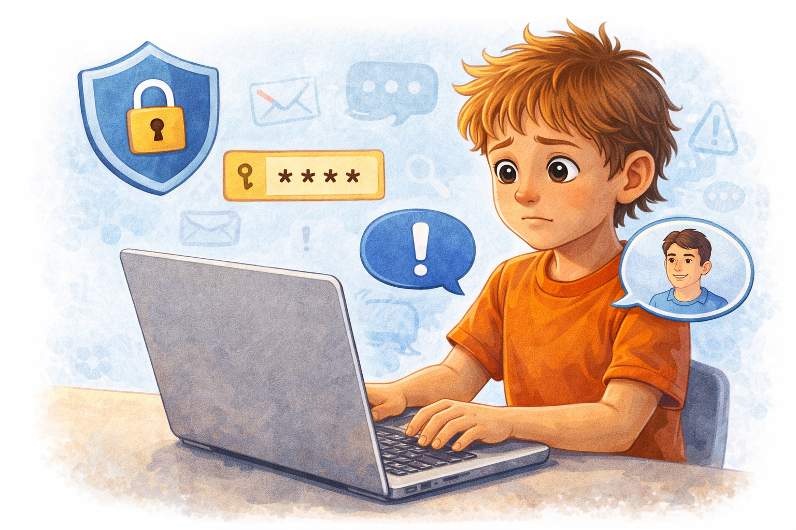

# Безопасность в интернете: правила, которые реально работают

Интернет помогает учиться, общаться и развлекаться. В сети можно смотреть видео, играть, искать информацию для школы, переписываться с друзьями и узнавать новое. Но там же есть мошенники, вредный контент и люди, которые могут пытаться обмануть ребенка. Некоторые делают это грубо и заметно, а некоторые выглядят вежливыми, дружелюбными и даже полезными. Поэтому в интернете важны такие же правила, как на улице: осторожность, проверка и поддержка взрослых. Хорошая интернет-безопасность начинается не со страха, а с привычки думать: кто мне пишет, зачем он это делает и безопасно ли то, что меня просят сделать.

Иногда опасность в интернете не выглядит как опасность. Это может быть «добрый» незнакомец, который слишком быстро начинает задавать личные вопросы, сообщение о выигрыше, просьба срочно подтвердить пароль, предложение бесплатно получить что-то редкое в игре или ссылка от знакомого, чей аккаунт уже взломали. Все это выглядит по-разному, но правило одно и то же: если что-то кажется странным, слишком выгодным или слишком срочным, нужно остановиться и проверить.

## Иллюстрация

*Ребенок работает за ноутбуком, рядом значки «пароль», «замок», «сообщить взрослому».*

## 7 базовых правил
1. Не передавай пароль друзьям и незнакомым людям.
Даже если человек кажется хорошим знакомым, пароль должен знать только владелец аккаунта и, если нужно, родители. Пароль - это ключ к переписке, фотографиям, играм и личным данным.
Нельзя передавать пароль «на минуту», «чтобы помочь», «чтобы зайти с другого телефона» или «потому что мы друзья». Настоящая дружба не требует отдавать доступ к своему аккаунту.
2. Не публикуй адрес дома, школу и номер телефона.
По таким данным можно понять, где ты бываешь, когда остаешься без родителей и как тебя найти в реальной жизни. Чем меньше личней информации в открытом доступе, тем безопаснее.
Даже если страница кажется маленькой и «никто не смотрит», публикации могут пересылать, сохранять или показывать другим людям.
3. Используй разные пароли для разных сервисов.
Если один пароль попадет к мошенникам, они не смогут войти сразу во все аккаунты. Это особенно важно для почты, мессенджеров и игровых платформ.
Хороший пароль не должен быть слишком простым. Имя, дата рождения или слово `123456` легко подобрать.
4. Включай двухфакторную защиту, если она есть.
Тогда одного пароля будет недостаточно: для входа понадобится еще код из сообщения, приложения или подтверждение на устройстве.
Это особенно полезно для тех аккаунтов, где хранятся важные сообщения, школьные данные, фото или покупки.
5. Не открывай странные ссылки и файлы.
Даже если в сообщении написано «это срочно», «смотри быстрее» или «ты на фото», сначала остановись и проверь. Опасные ссылки часто ведут на поддельные сайты или зараженные страницы.
Файлы с непонятными названиями, архивы от незнакомцев и неожиданные вложения лучше не открывать совсем.
6. Ограничивай доступ к профилю настройками приватности.
Лучше, чтобы твои публикации, фото и список друзей видели только те, кого ты действительно знаешь.
Полезно также ограничить, кто может тебе писать, комментировать публикации и отправлять заявки в друзья.
7. При подозрении сразу говори взрослому.
Не нужно пытаться решать все самому, особенно если страшно, стыдно или непонятно, что делать дальше. Быстрое обращение за помощью часто останавливает проблему в самом начале.
Чем раньше рассказать о проблеме, тем легче заблокировать аккаунт, сменить пароль, пожаловаться на нарушение или остановить травлю.

## Какие данные считаются личными
Личными считаются фамилия, адрес, номер телефона, фото документов, геолокация, данные банковской карты, логины и пароли. Сюда же относятся школа, класс, расписание занятий, фото пропуска, билетов, чеков, переписка, фотографии из квартиры, информация о том, когда дома никого нет, и любые сведения, по которым можно понять, кто ты и где тебя искать.

Иногда дети думают, что опасны только «взрослые» данные вроде номера карты или паспорта. Но на самом деле даже простая фраза «я живу рядом с этим торговым центром» или фото на фоне подъезда уже могут выдать слишком много. Особенно осторожно нужно относиться к фотографиям и видео: в кадр может случайно попасть адрес на конверте, номер школы на форме, расписание на стене, номер автомобиля или геолокация.

Полезно запомнить простое правило: если информацию не стоит писать на большом плакате для незнакомых людей, не стоит выкладывать ее и в интернет.

Отдельно стоит помнить про фотографии друзей и семьи. Даже если тебе кажется, что фото хорошее и безобидное, другой человек может не хотеть, чтобы его выкладывали. Перед публикацией лучше спросить разрешение, а если это касается маленьких детей, семейных данных или домашней обстановки, стоит быть особенно внимательным.

## Если тебя что-то насторожило
- Не отвечай сразу.
Мошенники и опасные собеседники часто давят на спешку: «ответь немедленно», «это секрет», «никому не говори». Чем сильнее тебя торопят, тем важнее сделать паузу.
Иногда уже сама спешка показывает, что перед тобой что-то нечестное. Честным людям обычно не нужно заставлять тебя отвечать мгновенно.
- Сделай скриншот.
Скриншот поможет сохранить переписку, угрозы, подозрительные сообщения, имя аккаунта и время отправки. Это полезно, если потом нужно будет показать взрослому, учителю или поддержке сервиса.
Если сообщений много, можно сделать несколько скриншотов подряд, чтобы сохранить весь разговор целиком.
- Заблокируй подозрительный аккаунт.
Если человек пишет странные вещи, просит фото, деньги, личные данные, зовет куда-то перейти или начинает пугать, лучше прекратить контакт сразу.
Не нужно предупреждать мошенника, что ты его сейчас заблокируешь. Лучше просто прекратить доступ к себе без лишнего разговора.
- Сообщи родителям или учителю.
Если ситуация связана со школой, одноклассниками, травлей или угрозами, важно не оставаться с этим одному. Взрослый поможет оценить серьезность ситуации и решить, что делать дальше.
Если ты боишься, что тебя будут ругать, все равно лучше рассказать. Намного хуже оставаться наедине с проблемой и ждать, пока она станет больше.

Иногда настораживают не только люди, но и сами сайты. Например, страница может выглядеть странно, просить ввести пароль «для подтверждения», обещать подарок, бесплатную валюту в игре, выигрыш или редкий приз. В таких случаях тоже не нужно продолжать дальше. Закрой страницу, ничего не вводи и покажи ее взрослому.

Если тебя пугают, стыдят, шантажируют или требуют сохранить тайну, это особенно серьезный сигнал опасности. Безопасный взрослый никогда не будет ругать за то, что ты вовремя попросил помощи.

Если тебе пишет человек, которого ты не знаешь в жизни, и слишком быстро предлагает «дружить по секрету», перейти в другой мессенджер, созвониться без ведома родителей или отправить фото, это тоже повод сразу насторожиться. В интернете не нужно продолжать разговор только из вежливости.

## Полезные привычки
- Обновлять приложения.
Обновления часто исправляют уязвимости и делают программы безопаснее. Если долго не обновлять устройство, оно может стать легче для взлома или заражения.
Это касается не только телефона, но и планшета, компьютера, браузера и даже игр.
- Использовать антивирус.
Он не решает все проблемы, но может предупредить о вредном файле, подозрительном сайте или опасной программе.
Но даже с антивирусом все равно важно думать своей головой и не скачивать подозрительное.
- Проверять, на каком сайте вводишь пароль.
Иногда мошенники делают страницы, очень похожие на настоящие. Важно смотреть внимательно: нет ли ошибок в адресе сайта, странних символов или лишних букв.
Если сайт выглядит знакомым, это еще не значит, что он настоящий. Подделки часто копируют цвет, логотип и форму входа.
- Выходить из аккаунтов на чужих устройствах.
Если ты вошел в почту, игру или мессенджер на школьном, общем или чужом компьютере, не забудь выйти из аккаунта после использования.
После этого полезно проверить, не сохранился ли пароль в браузере, если устройство не твое.

Еще одна полезная привычка - не скачивать все подряд. Игры, моды, читы, «ускорители», «взломанные версии» и неизвестные программы часто оказываются опасными. Лучше устанавливать приложения только из проверенных источников и вместе со взрослыми, если есть сомнения.

Стоит также время от времени проверять настройки приватности. Иногда после обновлений приложения меняют параметры доступа, и профиль становится более открытым, чем ты хотел. Полезно смотреть, кто может писать тебе, видеть твои фото, добавлять тебя в друзья или отмечать на публикациях.

Еще важно помнить о вежливости и границах. Не все риски в интернете связаны с вирусами. Иногда опасность начинается с простого разговора, который постепенно становится неприятным, давящим или слишком личным. Если беседа перестала быть комфортной, ее можно и нужно закончить.

Полезно также устраивать себе небольшую проверку перед нажатием на кнопку: я точно знаю этого человека, я понимаю, зачем мне это сообщение, я уверен, что ссылка настоящая, мне не стыдно будет показать это взрослому. Если на любой из этих вопросов ответ «нет», лучше не продолжать.

## Запомни главное
В интернете не нужно доказывать смелость. Самое умное решение - вовремя остановиться и проверить информацию. Безопасное поведение в сети - это не страх перед интернетом, а привычка замечать риски, не делиться лишним и вовремя обращаться за помощью. Если сообщение, ссылка, просьба или человек вызывают сомнение, лучше притормозить, ничего не отправлять и обсудить ситуацию со взрослым. Осторожность в интернете - это не слабость, а реальная защита. Чем чаще ты проверяешь, кому доверяешь и что публикуешь, тем безопаснее и спокойнее чувствуешь себя в сети.

Смотри также: [Кибербуллинг](./cyberbullying.md), [Подозрительные ссылки](./phishing-links.md).

---
Автор: Глумов Николай
