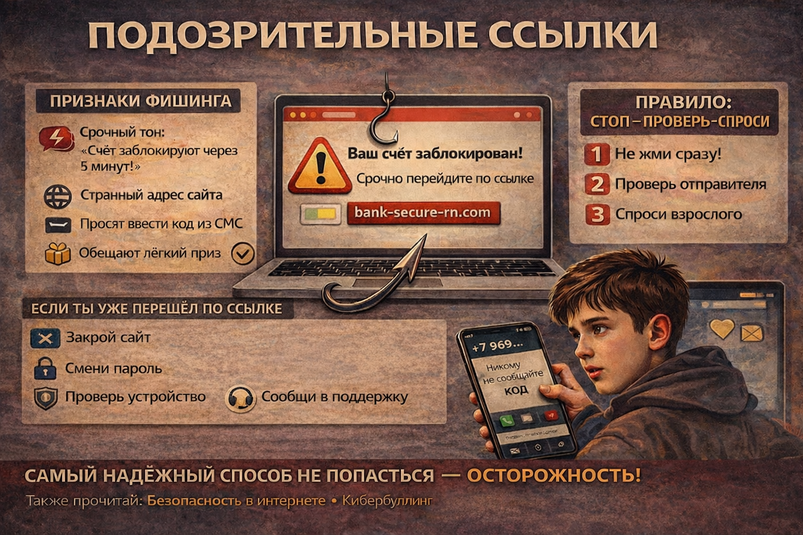

# Подозрительные ссылки: как не попасться на интернет-обман

Фишинг - это способ обмана, когда мошенники маскируются под знакомые сервисы и пытаются получить пароли, коды и деньги. Чаще всего все начинается с сообщения: «Срочно перейди по ссылке».

## Иллюстрация

*Место для изображения: письмо с подозрительной ссылкой и предупреждающим знаком.*

## Признаки фишинга
- Слишком срочный тон: «Счет заблокируют через 5 минут».
- Странный адрес сайта с лишними символами.
- Ошибки в тексте.
- Просьба отправить код из SMS.
- Обещание «легкого приза» за вход по ссылке.

## Правило «Стоп - Проверь - Спроси»
1. Не нажимай сразу.
2. Проверь отправителя.
3. Сравни адрес сайта с официальным.
4. Спроси взрослого, если сомневаешься.

## Если ты уже перешел по ссылке
1. Закрой страницу.
2. Сообщи взрослому.
3. Смените пароль от аккаунта.
4. Проверь устройство антивирусом.
5. Сообщи о подозрении в поддержку сервиса.

## Как защищаться заранее
- Используй сложные пароли.
- Включай двухфакторную защиту.
- Не сохраняй пароли в открытых заметках.
- Регулярно обновляй браузер и приложения.

## Запомни главное
Самая надежная защита от фишинга - не спешить и проверять.

Смотри также: [Безопасность в интернете](./internet-safety.md), [Кибербуллинг](./cyberbullying.md).

---
Автор: Участник 3
