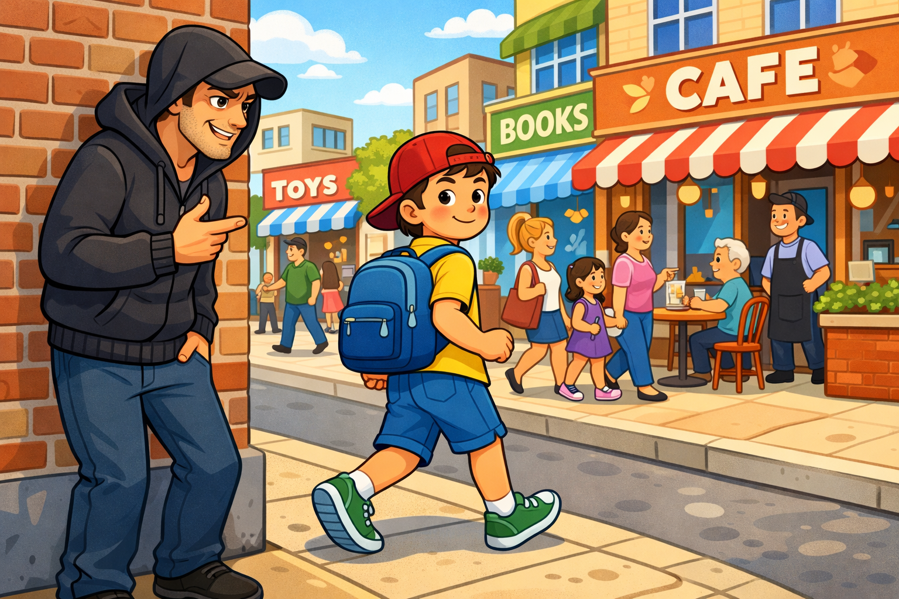

# Незнакомец на улице: как распознать риск и защитить себя

Общаться с людьми нужно вежливо, но безопасность всегда важнее вежливости. Если незнакомец предлагает куда-то пойти, что-то взять или что-то скрыть от родителей, это повод насторожиться.

## Иллюстрация

*Место для изображения: ребенок отходит к людному месту и зовет на помощь.*

## Правило «Нет - Отойди - Расскажи»
1. Скажи короткое твердое «Нет».
2. Сразу отойди к людям, свету и камерам.
3. Расскажи взрослому, которому доверяешь.

## Опасные уловки
- «Твоя мама просила меня тебя забрать».
- «Помоги найти собачку».
- «У меня есть подарок для тебя».
- «Это секрет, никому не говори».

Даже если человек улыбается и говорит спокойно, не иди с ним.

## Семейный пароль
Семья может придумать кодовое слово. Если взрослый его не знает, значит, с ним нельзя никуда идти.

## Что делать, если тебя преследуют
1. Иди в людное место: магазин, аптеку, пункт охраны.
2. Громко скажи: «Я вас не знаю! Помогите!».
3. Позвони родителям или в [112](./emergency-112.md).

## Что делать друзьям рядом
Если рядом друг попал в такую ситуацию, не уходи. Позови взрослых и оставайся рядом до прибытия помощи.

## Запомни главное
Ты имеешь право отказаться, уйти и звать на помощь. Это не грубость, а правильная защита.

Смотри также: [Потерялся в городе](./lost-in-city.md), [Экстренный номер 112](./emergency-112.md), [Укус собаки и первая помощь](./dog-bite-first-aid.md).

---
Автор: Участник 2
