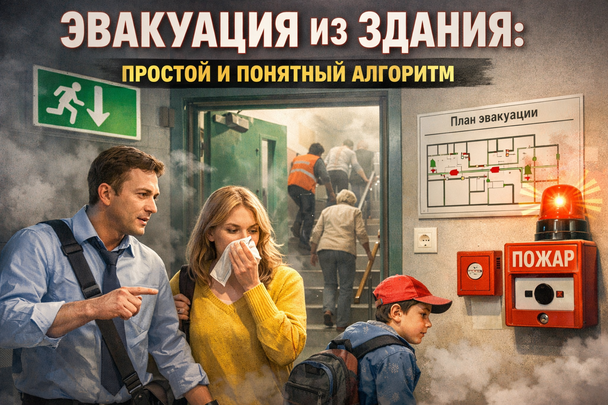

# [Эвакуация](../../../3.2 healthy lifestyle/how to act in a dangerous situation/articles/fire-at-home.md) из [здания](../../../1.2_natural_sciences/physics_in_everyday_life/Q83301.md): как выйти быстро и безопасно

Эвакуация нужна, когда внутри здания находиться опасно: при пожаре, сильном дыме, аварии, угрозе обрушения, утечке газа или другой чрезвычайной ситуации. В такие минуты важно не спорить с опасностью и не терять [время](../../../1.2_natural_sciences/physics_in_everyday_life/Q20702.md) на лишние [действия](../../../3.1_healthy_lifestyle/pervaya_pomoshch/ushibi_porezy_ozhogi/03_obschie_pravila_algorithm.md).

Главная [цель](../../../1.2_natural_sciences/why_science_help_understand_world/research_work.md) эвакуации: организованно вывести людей в безопасную зону и не допустить паники. Спокойные, понятные и одинаковые действия всех людей работают лучше, чем попытка «спастись любой ценой» в одиночку.

## Иллюстрация

*Школьники выходят по лестнице по стрелкам плана эвакуации.*

## Когда начинается эвакуация
- Сработала пожарная сигнализация.
- Прозвучало оповещение по громкой связи.
- Ответственный взрослый (учитель, охранник, [тренер](../../../7.2 Media, leisure and hobbies/Computer games/articles/game_culture/esports.md), администратор) дал команду покинуть здание.
- Ты видишь явные [признаки](../../../3.1_healthy_lifestyle/pervaya_pomoshch/ushibi_porezy_ozhogi/04_ushib_chto_eto_priznaki.md) [опасности](../../../1.2_natural_sciences/physics_in_everyday_life/Q845744.md): [дым](../../../3.1_healthy lifestyle/vrednye_privychki/articles/smoking.md), запах гари, искрение, обрушение элементов.

Если есть [сомнения](../../../8.2_future_and_path_choice/articles/02_insecurity_causes.md), лучше считать ситуацию опасной и действовать по плану эвакуации.

## Что полезно знать заранее
1. Посмотри [план эвакуации](../../../3.2 healthy lifestyle/how to act in a dangerous situation/articles/building-evacuation.md) в школе, ТЦ, [секции](../../../7.2 Media, leisure and hobbies /useful_and_interesting_leisure/articles/clubs_and_sections.md) или кружке.
2. Запомни [минимум](../../../1.2_natural_sciences/physics_in_everyday_life/Q136980.md) два выхода: основной и запасной.
3. Обрати [внимание](../../../1.2_natural_sciences/neurobiology_for_teens/articles/16_love_chemistry.md), где лестницы и где находятся [огнетушители](../../../1.2_natural_sciences/physics_in_everyday_life/Q1997.md).
4. Узнай точку сбора на улице для класса или группы.

Если заранее понимать маршрут, в реальной тревоге действовать намного проще.

## [Алгоритм](../../../2.1_society/cause_and_effect_relationships/articles/ai_causality.md) «Услышал - Сориентировался - Вышел - Отметился»
1. Остановись и слушай команды.
Не спорь и не отвлекайся на разговоры. В первые секунды важнее всего понять, куда двигаться.
2. Оставь вещи.
Не трать время на рюкзак, куртку, сменку, телефон или другие предметы.
3. Двигайся вместе с группой по обозначенному маршруту.
Иди по указателям и командам взрослых. Не срезай [путь](../../../1.2_natural_sciences/physics_in_everyday_life/Q11476.md) через незнакомые коридоры.
4. Пользуйся только лестницей.
Лифт при ЧС может остановиться между этажами или открыться в дым.
5. На улице сразу иди к точке сбора.
Не оставайся у двери и не возвращайся обратно без команды специалистов.

## [Правила](../../../2.1_society/cause_and_effect_relationships/articles/why_rules_work.md) движения в потоке людей
- Иди быстрым шагом, но не беги.
- Не толкайся и не обгоняй без необходимости.
- Держи руки свободными, чтобы не потерять [равновесие](../../../1.2_natural_sciences/physics_in_everyday_life/Q169019.md).
- Соблюдай дистанцию, чтобы не образовалась давка.
- Если кто-то споткнулся рядом, предупреди взрослых и помоги подняться, если это безопасно.

Паника обычно начинается из-за крика и резких движений. Спокойное [поведение](../../../1.2_natural_sciences/neurobiology_for_teens/articles/06_phineas_gage.md) снижает [риск](../../../1.2_natural_sciences/neurobiology_for_teens/articles/05_teen_brain.md) для всей группы.

## Что делать при дыме
1. Прикрой нос и рот тканью (шарф, рукав, платок).
2. Двигайся ниже к полу, где обычно меньше дыма.
3. Держись за стену или перила, чтобы не потерять [направление](../../../1.2_natural_sciences/physics_in_everyday_life/Q11402.md).
4. Не отделяйся от класса или группы.
5. Если путь перекрыт дымом или огнем, вернись в более безопасную зону и жди указаний взрослых.

Если становится трудно дышать, появляется сильный кашель или головокружение, сразу сообщи об этом взрослому рядом.

## Если ты отделился от класса или родителей
- Не бегай по этажам в поисках знакомых.
- Иди к ближайшему безопасному выходу по указателям.
- Обратись к взрослому сотруднику (учитель, охранник, администратор) и скажи, что ты один.
- После выхода оставайся на месте сбора, чтобы тебя быстро нашли.

Главное [правило](../../../1.2_natural_sciences/why_science_help_understand_world/patterns.md): сначала выйти в безопасное место, потом искать своих.

## После выхода из здания
1. Отойди на безопасное [расстояние](../../../1.2_natural_sciences/physics_in_everyday_life/Q11412.md) от здания.
2. Найди своего учителя, руководителя группы или родителя.
3. Проверь, все ли рядом, и сообщи, если кого-то не хватает.
4. Не мешай [работе](../../../8.2_future/choosing_a_career_path/articles/interview.md) спасателей и экстренных служб.
5. При необходимости звони в [112](./emergency-112.md).

## Частые [ошибки](../../../3.1_healthy_lifestyle/pervaya_pomoshch/ushibi_porezy_ozhogi/07_ushib_chego_nelzya.md)
- Возвращаться в здание за вещами.
- Пользоваться лифтом во время эвакуации.
- Самовольно менять маршрут.
- Бежать впереди толпы, создавая давку.
- Снимать [видео](../../../5.1_technology_and_digital_literacy/information and media literacy/оценка_качества_изображений_и_видео.md) вместо того, чтобы выходить.

## Мини-чеклист для запоминания
- Услышал тревогу: остановился и слушаю команду.
- Вещи не беру.
- Иду по маршруту к выходу.
- Лифтом не пользуюсь.
- На улице иду к точке сбора.
- Обратно в здание не возвращаюсь.

## Запомни главное
Эвакуация работает только тогда, когда люди действуют организованно. [Спокойствие](../../../7.2 Media, leisure and hobbies/Computer games/articles/useful_tips/toxic_players.md), [движение](../../../1.2_natural_sciences/physics_in_everyday_life/Q11023.md) по маршруту и выполнение команд взрослых помогают выбраться быстрее и безопаснее.

Смотри также: [Пожар дома](./fire-at-home.md), [Дым в подъезде](./smoke-in-entrance.md), [Экстренный номер 112](./emergency-112.md).

---
[Автор](../../../4.2_thinking_and_working_information/how_to_search_information/articles/copypaste.md): Тутаев [Владимир](../../../2.2_society/history/articles/Kievan_Rus.md)
