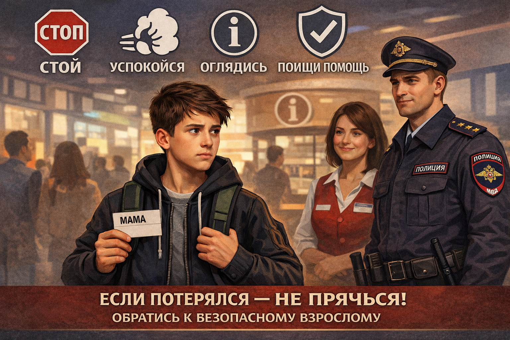

# [Потерялся в городе](../../../3.2 healthy lifestyle/how to act in a dangerous situation/articles/lost-in-city.md): что делать [шаг](../../../1.2_natural_sciences/physics_in_everyday_life/Q36253.md) за шагом

Потеряться можно в торговом центре, парке, метро или просто на оживлённой улице. Это пугает, но даже в такой ситуации важно не паниковать. Если действовать спокойно и по плану, [помощь](../../../3.1_healthy_lifestyle/pervaya_pomoshch/ushibi_porezy_ozhogi/10_krovotechenie_chto_delat.md) найдётся быстрее.

## Иллюстрация
  
*Ребёнок в людном месте обращается к сотруднику в форме.*

## [Первый шаг](../../../1.2_natural_sciences/physics_in_everyday_life/Q26540.md): остановись
Когда ребёнок начинает бегать в разные стороны, взрослым становится труднее его найти. Гораздо безопаснее остановиться в заметном месте, оглядеться и постараться не уходить далеко от того места, где [потерялся](../../../3.2 healthy lifestyle/how to act in a dangerous situation/articles/lost-in-city.md).

Это поможет тебе и взрослым, которые будут тебя искать, быстрее тебя найти. Если тебе удалось найти место, где ты можешь спокойно постоять, это даст возможность родителям или другим взрослым тебя заметить. Не стоит бегать, это только усложнит [поиск](../../../3.2 healthy lifestyle/how to act in a dangerous situation/articles/lost-in-city.md).

## [Правило](../../../1.2_natural_sciences/why_science_help_understand_world/patterns.md) «СТОП»
1. **С**топ: перестань метаться и бежать куда попало.  
2. **Т**ихо подыши, чтобы немного успокоиться.  
3. **О**глядись: найди рядом заметный [ориентир](../../../../8.1_self_understanding/articles/social_comparison.md) — кассу, стойку информации, вход, вывеску.  
4. **П**опроси помощь у безопасного взрослого.

### Почему важно остановиться?
Когда ты в панике, очень легко начать бегать или кричать, что делает ситуацию более напряжённой. Важно остановиться, расслабиться, чтобы не затруднять поиски. Остановка на месте — это первый шаг, который помогает как тебе, так и тем, кто тебя ищет.

## К кому обращаться
Лучше всего обращаться к тем взрослым, которые работают рядом и могут помочь сразу:
- полицейский;
- охранник или сотрудник в форме;
- сотрудник магазина за стойкой;
- администратор;
- женщина с ребёнком.

Старайся подойти к тем людям, у которых есть униформа или чёткие отличительные знаки, например, эмблемы охраны или работника магазина. Это поможет избежать риска попасть в руки незнакомца.

### Кто поможет:
- **Полицейский** — это самый безопасный и очевидный [выбор](../../../2.1_society/cause_and_effect_relationships/articles/personal_choice.md). Он всегда готов помочь.
- **Охранник** — тоже может помочь, особенно если ты находишься в торговом центре или на вокзале.
- **Сотрудник магазина или администрации** — эти люди всегда на месте, они знают, как действовать в подобных ситуациях.
- **Женщина с детьми** — если поблизости нет официальных лиц, женщина с детьми может помочь. Она поймёт, как важно не оставлять ребёнка в беде.

## Что сказать
Говори просто и ясно:  
**«Я потерялся. Помогите, пожалуйста, позвонить маме или папе».**

Если помнишь номер родителей, продиктуй его. Если не помнишь, попроси взрослого позвонить в [112](./emergency-112.md) или помочь связаться с полицией и администрацией места, где ты находишься. Важно сказать, что ты потерялся и тебе нужна помощь, а не просто надеяться, что кто-то заметит, что ты в беде.

## Что важно [помнить](../../../4.1_rules_of_study/how_to_memorize/articles/pamyat.md)
Не нужно стесняться или бояться попросить о помощи. Потеряться может любой. Главное — не прятаться и не пытаться решить всё самому, если рядом есть взрослые, которые отвечают за [безопасность](../../../1.2_natural_sciences/neurobiology_for_teens/articles/17_hugs_oxytocin.md). Помощь очень важна, и безопасно полагаться на взрослых, которые могут сделать всё, чтобы помочь.

Если ты чувствуешь, что на тебя никто не обращает [внимания](../../../4.1_rules_of_study/how_to_memorize/articles/vnimanie.md), всегда действуй смело: попроси нескольких людей подойти к тебе и помочь.

## Что [нельзя](../../../3.1_healthy_lifestyle/pervaya_pomoshch/ushibi_porezy_ozhogi/07_ushib_chego_nelzya.md) делать
- Не уходить с незнакомцем в машину или в безлюдное место.
- Не соглашаться «пойти поискать родителей» далеко от людного места.
- Не выбегать на улицу или дорогу в панике.
- Не молчать из-за страха или стыда.

### Почему нельзя уходить с незнакомцами?
Важно помнить, что даже если кто-то кажется добрым, нельзя уходить с ним в одиночку. Мало ли что может случиться. Никогда не соглашайся идти с чужими людьми в другие места, даже если они обещают помочь. Всегда можно попросить помощь у сотрудников или взрослых, которым доверяешь.

## Полезная подготовка заранее
К таким ситуациям лучше подготовиться заранее:
- выучить наизусть хотя бы один номер родителя;
- носить в рюкзаке или кармане карточку с контактами семьи;
- договориться с родителями о точке встречи в больших местах;
- [запомнить](../../../4.1_rules_of_study/how_to_memorize/articles/zapominanie.md) своё имя, фамилию и, по возможности, [адрес](../../../5.1_technology_and_digital_literacy/how_internet_works/articles/ip_mac/ip_and_mac.md).

### Как быть готовым:
1. **Запомни номера телефонов**. Это поможет в экстренной ситуации быстро связаться с родителями. Если не можешь запомнить их все, выбери один основной.
2. **Карточка с контактами**. Иногда это может быть самым быстрым способом восстановить [связь](../../../1.2_natural_sciences/physics_in_everyday_life/Q12969754.md), если тебе нужно будет найти помощь. 
3. **Точка встречи**. С родителями заранее договорись о месте, где можно встретиться, если кто-то потеряется в большом месте. Например, около центральной кассы в торговом центре или на выходе с вокзала.
4. **Личное имя и фамилия**. Очень важно, чтобы ты мог легко сказать, кто ты, где находишься и как тебя зовут.

### Почему это важно?
Запомнив эти простые вещи, ты сможешь легко позаботиться о себе в случае потери. [Знание](../../../1.2_natural_sciences/why_science_help_understand_world/science.md) этих базовых шагов помогает не паниковать и принимать правильные решения быстро.

## Запомни главное
Если потерялся, не геройствуй в одиночку. Твоя задача — остановиться, успокоиться и как можно быстрее обратиться к безопасному взрослому. Чем раньше ты попросишь помощь, тем быстрее найдутся [родители](../../../../8.1_self_understanding/articles/family_influence.md).

Смотри также: [Незнакомец на улице](./stranger-safety.md), [Экстренный номер 112](./emergency-112.md).

---
[Автор](../../../4.2_thinking_and_working_information/how_to_search_information/articles/copypaste.md): Андрей Вельма
