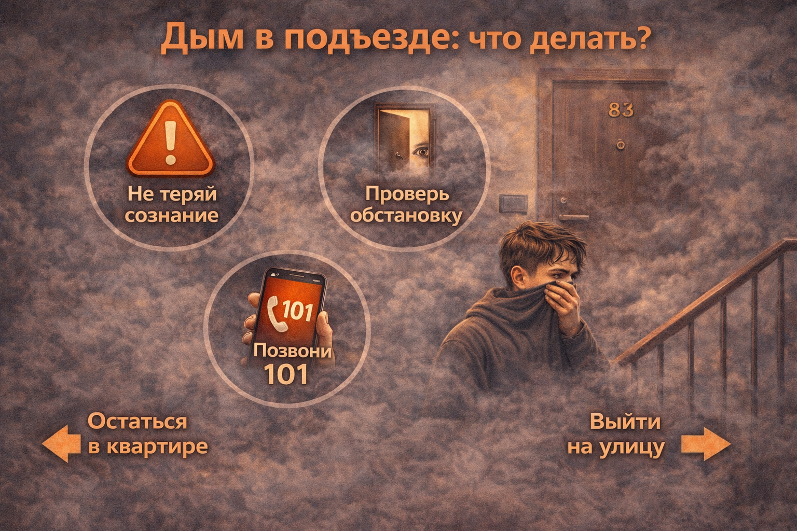

# [Дым в подъезде](../../../3.2 healthy lifestyle/how to act in a dangerous situation/articles/smoke-in-entrance.md): как действовать безопасно

Когда в подъезде появляется [дым](../../../3.1_healthy lifestyle/vrednye_privychki/articles/smoking.md), [опасность](../../../3.1_healthy_lifestyle/pervaya_pomoshch/ushibi_porezy_ozhogi/06_ushib_kogda_vrach.md) может быть рядом, даже если огня пока не видно. В такой ситуации важно сначала оценить обстановку, а уже потом принимать [решение](../../../2.1_society/cause_and_effect_relationships/articles/personal_choice.md): выходить или ждать [помощь](../../../3.1_healthy_lifestyle/pervaya_pomoshch/ushibi_porezy_ozhogi/10_krovotechenie_chto_delat.md) в квартире. Пренебрежение мерами безопасности может привести к тяжёлым последствиям, включая потерю сознания или [отравление](../../../3.1_healthy lifestyle/vrednye_privychki/articles/overdose.md) ядовитыми газами. Следуй нашим рекомендациям для безопасного поведения в случае задымления.

## Иллюстрация
  
*Лестничная [клетка](../../../1.2_natural_sciences/physics_in_everyday_life/Q40260.md) с дымом и закрытая дверь квартиры.*

## Почему дым особенно опасен
- **Снижает видимость** — дым блокирует [зрение](../../../1.2_natural_sciences/neurobiology_for_teens/articles/26_optical_illusions.md), что может привести к панике и дезориентации.
- **Раздражает дыхательные пути** — попадание дыма в дыхательные пути вызывает удушье, раздражение и даже может привести к потере сознания.
- **Содержит ядовитые [газы](../../../1.2_natural_sciences/physics_in_everyday_life/Q124003.md)** — угарный [газ](../../../1.1_structure_of_the_world/matter/articles/07_gases.md) (CO) и другие [продукты](../../../3.1. healthy lifestyle/Sleep, nutrition, and adolescent energy/articles/healthy_school_snacks.md) горения могут быть смертельно опасными, даже если огня не видно.
- **Трудно найти [выход](../../../3.2 healthy lifestyle/how to act in a dangerous situation/articles/building-evacuation.md)** — в задымлённом пространстве трудно ориентироваться, а поиски выхода могут занять много времени.

## Что делать при задымлении в подъезде
1. **Не паникуй** — сохраняй [спокойствие](../../../7.2 Media, leisure and hobbies/Computer games/articles/useful_tips/toxic_players.md), это поможет принимать правильные решения.
2. **Не открывай дверь резко** — дым может проникнуть в квартиру, если дверь будет открыта.
3. **Осторожно потрогай дверь тыльной стороной ладони** — если она горячая, за ней может быть [огонь](../../../3.2 healthy lifestyle/how to act in a dangerous situation/articles/fire-at-home.md).
4. **Запах гари** — если чувствуешь сильный запах гари, действуй как при блокировке выхода.

## Как проверять обстановку
1. **Не открывай дверь резко** — не спеши открывать дверь, чтобы не дать дыму проникнуть в квартиру.
2. **Осторожно потрогай дверь тыльной стороной ладони** — проверяй температуру двери.
3. **Если дверь горячая** — это может означать, что за ней есть огонь, и открывать её опасно.
4. **Если дверь холодная, но чувствуешь запах дыма** — действуй осторожно и открывай дверь постепенно.
5. **Если чувствуешь, что [воздух](../../../1.2_natural_sciences/physics_in_everyday_life/Q487005.md) тяжелый** — это значит, что за дверью уже есть дым, и нужно действовать по сценарию блокировки выхода.

## Если выход заблокирован
Если ты не можешь выйти, не паникуй. Важно соблюдать спокойствие и следовать чётким инструкциям:
- **Оставайся в квартире** — не пытайся открывать дверь, если на лестничной клетке слишком много дыма.
- **Плотно закрой дверь** — закрой щели, чтобы предотвратить попадание дыма.
- **Используй мокрые ткани** — закрой щели в двери, оконные рамы мокрыми тканями, чтобы минимизировать попадание дыма в квартиру.
- **Подойди к окну** — открой окно, чтобы дышать свежим воздухом, и сообщи спасателям о своём местоположении.
- **Позвони в [112](./emergency-112.md)** — сообщи свою точную локацию и объясни, что ты не можешь выйти из квартиры.

## Если [путь](../../../1.2_natural_sciences/physics_in_everyday_life/Q11476.md) свободен
Если дым не блокирует путь, выходить нужно спокойно и уверенно:
- **Выходи быстро по лестнице** — избегай лифта, так как он может застрять или привести к задымлению.
- **Двигайся ниже к полу** — если дым уже попал в коридор, двигайся ниже к полу, где воздух чище.
- **Не пользуйся лифтом** — лифт может остановиться и застрять, что увеличит [риски](../../../7.2 Media, leisure and hobbies /useful_and_interesting_leisure/articles/safety_during_recreation.md) отравления.
- **На улице отойди на безопасное [расстояние](../../../1.2_natural_sciences/physics_in_everyday_life/Q11412.md)** — держись подальше от [здания](../../../1.2_natural_sciences/physics_in_everyday_life/Q83301.md), чтобы не попасть в дымовую зону.

## Как выбрать безопасный путь эвакуации
- **Проверь, не заблокированы ли выходы** — убедись, что пути эвакуации свободны.
- **Иди вдоль стены** — если в дыму не видно, ориентируйся по стенам, чтобы не заблудиться.
- **Запоминай маршрут** — если ты не можешь покинуть квартиру, в следующий раз выбери другой путь.

## Что важно сообщить взрослым и спасателям
Скажи, где именно дым:
- у мусоропровода,
- на лестнице,
- у соседней квартиры или на конкретном этаже.

Это поможет спасателям быстрее понять [источник](../../../5.1_technology_and_digital_literacy/information and media literacy/дезинформация_и_фейки.md) [опасности](../../../1.2_natural_sciences/physics_in_everyday_life/Q845744.md) и организовать эвакуацию.

## Частые [ошибки](../../../3.1_healthy_lifestyle/pervaya_pomoshch/ushibi_porezy_ozhogi/07_ushib_chego_nelzya.md)
- **Выбегать без проверки двери** — это одна из самых частых ошибок. Никогда не открывай дверь, если она горячая или запах дыма слишком сильный.
- **Кричать и бегать по этажам без плана** — это только усилит панику.
- **Возвращаться в квартиру за вещами после выхода** — в экстренной ситуации вещи не важны, главное — спасти свою [жизнь](../../../1.2_natural_sciences/physics_in_everyday_life/Q1751973.md).
- **Игнорировать [признаки](../../../3.1_healthy_lifestyle/pervaya_pomoshch/ushibi_porezy_ozhogi/04_ushib_chto_eto_priznaki.md) дыма в доме** — если ты чувствуешь запах дыма, сразу сообщи об этом и начинай принимать меры.

## Запомни главное
Если сомневаешься, что путь безопасен, лучше не рисковать и вызвать спасателей. Не стоит пытаться самостоятельно выбираться, если есть хоть малейшая [угроза](../../../5.1_technology_and_digital_literacy/information and media literacy/информационная_безопасность_для_детей.md).

## Как предотвратить [распространение](../../../1.2_natural_sciences/physics_in_everyday_life/Q41364.md) дыма
- **Закрытие дверей** — всегда следи за тем, чтобы двери на лестничной клетке были закрыты.
- **Уплотнители на дверях** — установи уплотнители, чтобы дым не проникал в квартиру.
- **Проверь пути эвакуации** — убедись, что все выходы из квартиры и подъезда свободны.
- **Регулярная [проверка](../../../1.2_natural_sciences/why_science_help_understand_world/scientific_method.md) дымовых извещателей** — тестируй их каждый месяц и меняй [батарейки](../../../1.2_natural_sciences/physics_in_everyday_life/Q176140.md).

## Роль дымовых извещателей
- **Установка дымовых извещателей** — обязательно установи дымовые извещатели в каждой комнате и коридоре.
- **Ежемесячная проверка работоспособности** — регулярно проверяй их [работу](../../../8.2_future/choosing_a_career_path/articles/interview.md).
- **[Передача сигнала](../../../1.2_natural_sciences/neurobiology_for_teens/articles/02_neuron_main_cell.md) на [смартфон](../../../1.2_natural_sciences/physics_in_everyday_life/Q3198.md)** — многие современные [устройства](../../../5.1_technology_and_digital_literacy/operating system/articles/HAL.md) передают [сигнал](../../../5.1_technology_and_digital_literacy/how_internet_works/articles/wifi/router.md) тревоги на смартфон, что даёт возможность быстро реагировать на потенциальную угрозу.

## Как действовать, если кто-то остался в квартире
- **Сообщи спасателям** — если кто-то не может выбраться, сообщи об этом спасателям.
- **Не пытайся спасать других без подготовки** — не рискуй своей жизнью, если это может привести к трагедии.
- **Оставайся у [окна](../../../5.1_technology_and_digital_literacy/operating system/articles/window_manager.md)** — если ты не можешь выбраться, стой у окна, чтобы спасатели могли найти тебя.

## Как действовать при задымлении в подвале или в квартире
- **Не спускайся в подвал** — если в подвале начало задымления, не спускайся туда без помощи спасателей.
- **Не пытайся отключать оборудование** — если причиной дыма является неисправная [техника](../../../1.2_natural_sciences/physics_in_everyday_life/Q133673.md) или газ, не пытайся выключать оборудование самостоятельно.
- **Используй кондиционер для подачи воздуха** — если это возможно, включи кондиционер или вентилятор для подачи свежего воздуха.

## Что делать, если не слышишь сигнала тревоги
- **Не паникуй** — если ты не слышишь сигнал тревоги, сразу же позвони в [112](./emergency-112.md) и сообщи о [том](../../../7.1_art/musical_instruments/articles/drums.md), [что происходит](../../../5.1_technology_and_digital_literacy/how_internet_works/articles/web_basics/what_happens.md).
- **Проверь дымовые извещатели** — если ты видишь дым, но не слышишь сигнал тревоги, это может быть связано с неисправной системой.

## Оборудование для эвакуации
- **[План эвакуации](../../../3.2 healthy lifestyle/how to act in a dangerous situation/articles/building-evacuation.md)** — каждый дом должен иметь план эвакуации, который необходимо изучить заранее.
- **Сигнализация и система оповещения** — во многих современных зданиях установлены автоматические системы оповещения, которые помогут быстрее покинуть здание в случае ЧП.

## Как действовать при сильном задымлении
- **Мокрая ткань** — обмотай ткань вокруг носа и рта, чтобы облегчить [дыхание](../../../1.2_natural_sciences/physics_in_everyday_life/Q163214.md).
- **Ползание по полу** — дым поднимется наверх, поэтому держись ближе к полу, где воздуха больше.
- **План эвакуации** — всегда знай план эвакуации заранее.

Смотри также: [Пожар дома](./fire-at-home.md), [Эвакуация из здания](./building-evacuation.md), [Экстренный номер 112](./emergency-112.md).

---
[Автор](../../../4.2_thinking_and_working_information/how_to_search_information/articles/copypaste.md): Андрей Вельма