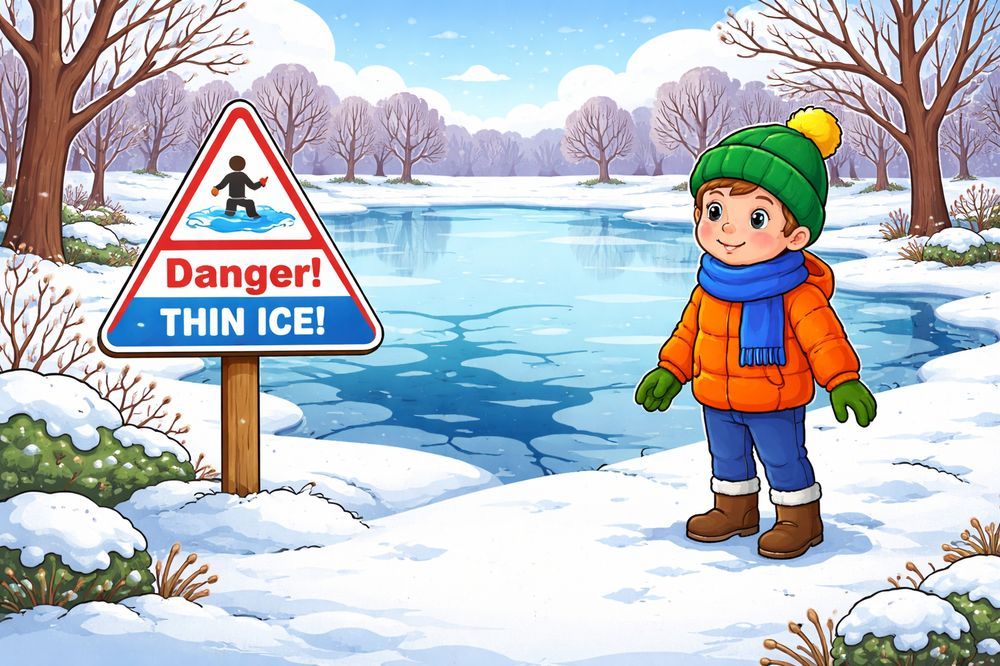

# [Тонкий лед](../../../3.2 healthy lifestyle/how to act in a dangerous situation/articles/thin-ice.md): как избежать беды зимой

[Лед](../../../3.2 healthy lifestyle/how to act in a dangerous situation/articles/thin-ice.md) может выглядеть надежным, но внутри быть рыхлым и слабым. Особенно опасны первые морозы и периоды оттепели. Чтобы не рисковать жизнью, нужно знать простые [правила](../../../2.1_society/cause_and_effect_relationships/articles/why_rules_work.md) поведения у водоемов зимой. Каждый год десятки людей проваливаются под лед, потому что были уверены: «выдержит». Но лед — обманчивая [поверхность](../../../1.2_natural_sciences/physics_in_everyday_life/Q35197.md), и его прочность зависит от множества факторов: температуры воздуха, течения, глубины, наличия снега сверху. [Знание](../../../1.2_natural_sciences/why_science_help_understand_world/science.md) этих правил может спасти [жизнь](../../../1.2_natural_sciences/physics_in_everyday_life/Q1751973.md) — твою или того, кто окажется рядом.

## Иллюстрация

*Предупреждающий знак у водоема и [ребенок](../../../5.1_technology_and_digital_literacy/information and media literacy/информационная_безопасность_для_детей.md) на безопасном расстоянии от кромки льда.*

## Почему лед так опасен
- Холодная [вода](../../../3.1. healthy lifestyle/Sleep, nutrition, and adolescent energy/articles/drinking_regime.md) мгновенно отнимает [силы](../../../1.2_natural_sciences/physics_in_everyday_life/Q11423.md).
Попав в ледяную воду, [человек](../../../1.2_natural_sciences/physics_in_everyday_life/Q45003.md) испытывает шок: перехватывает [дыхание](../../../1.2_natural_sciences/physics_in_everyday_life/Q163214.md), мышцы сводит от холода.
Даже хороший пловец в холодной воде теряет способность двигаться уже через несколько минут.
Ребенку в такой ситуации продержаться на поверхности еще сложнее, чем взрослому.
- Выбраться из полыньи очень трудно.
Края полыньи обламываются, руки скользят, а мокрая [одежда](../../../1.2_natural_sciences/physics_in_everyday_life/Q487005.md) тянет вниз.
Без посторонней помощи или подручных средств вылезти на лед почти невозможно.
Каждая неудачная попытка забирает силы и увеличивает [опасность](../../../3.1_healthy_lifestyle/pervaya_pomoshch/ushibi_porezy_ozhogi/06_ushib_kogda_vrach.md).
- После спасения переохлаждение продолжается.
Даже когда человек уже на берегу, его [тело](../../../1.2_natural_sciences/why_science_help_understand_world/organism.md) продолжает терять [тепло](../../../1.2_natural_sciences/physics_in_everyday_life/Q11382.md).
Без теплой одежды и медицинской помощи переохлаждение может привести к серьезным последствиям.
Поэтому после провала под лед обязательно нужен осмотр врача, даже если кажется, что всё обошлось.

## Когда лед особенно опасен
- После оттепели и дождя.
Даже один теплый день может сильно ослабить лед, который казался крепким.
[Дождь](../../../3.2 healthy lifestyle/how to act in a dangerous situation/articles/thunderstorm-safety.md) размывает верхний слой и делает поверхность скользкой, а внутреннюю структуру — рыхлой.
Особенно коварен лед, покрытый свежим снегом после оттепели: снег скрывает трещины и слабые места.
- Возле кустов, камышей, мостов и мест с течением.
Течение подмывает лед снизу, делая его тоньше в этих местах.
Рядом с камышами и кустами лед часто неравномерный: в одном месте толстый, а в шаге от него — тонкий.
У мостов и свай лед ослаблен вибрацией и движением воды.
- Там, где есть трещины, темные пятна и вода на поверхности.
Темные пятна на льду — признак того, что лед тонкий и вода просвечивает снизу.
Трещины показывают, что лед уже не выдерживает нагрузку и может обломиться.
Вода на поверхности льда — [сигнал](../../../5.1_technology_and_digital_literacy/how_internet_works/articles/wifi/router.md), что он начал таять или под ним поднялся [уровень](../../../../8.1_entertainment/articles/gamification.md) воды.
- В местах, где в водоем впадают ручьи или стоки.
Теплая вода из стоков размывает лед даже в сильный мороз.
Такие места могут выглядеть обычно, но лед там значительно тоньше, чем в других частях водоема.

## [Правила безопасности](../../../1.2_natural_sciences/physics_in_everyday_life/Q186161.md)
1. Не выходи на лед без взрослых.
Даже если [друзья](../../../4.1_rules_of_study/how_to_learn_effectively/articles/peer_learning.md) уже гуляют по льду, это не значит, что он безопасен.
Лед может выдерживать одного человека, но не выдержать двоих рядом.
Взрослый сможет оценить обстановку и принять [решение](../../../2.1_society/cause_and_effect_relationships/articles/personal_choice.md), безопасно ли выходить.
2. Не проверяй лед прыжками.
Прыжки создают резкую нагрузку на одну точку, и лед может сломаться мгновенно.
Даже топать ногой по льду опасно: если он тонкий, нога провалится.
Толщину льда проверяют специальными инструментами, а не ногами.
3. Не ходи по льду в темноте.
В темноте невозможно увидеть трещины, полыньи и опасные участки.
Легко потерять [направление](../../../1.2_natural_sciences/physics_in_everyday_life/Q11402.md) и оказаться в месте, где лед тоньше.
Даже знакомый водоем в темноте становится непредсказуемым.
4. Избегай мест, где на льду много следов и трещин.
Большое количество следов говорит о [том](../../../7.1_art/musical_instruments/articles/drums.md), что лед уже испытал нагрузку.
Трещины — прямой сигнал, что прочность снижена.
Лучше обойти такое место по берегу, даже если это дольше.

## Какой лед считается безопасным
- Прозрачный голубоватый лед толщиной от 7 см может выдержать одного человека.
Но даже такой лед безопасен не везде: у берега, у камышей и на течении он может быть тоньше.
- Белый или мутный лед в два раза слабее прозрачного.
Он образуется из мокрого снега и содержит воздушные пузыри, которые снижают прочность.
- Серый или желтоватый лед — самый опасный.
Это тающий лед, который может сломаться в любой момент даже под небольшим весом.

## Если лед затрещал под ногами
- Сразу остановись.
Не делай резких движений. Каждый [шаг](../../../1.2_natural_sciences/physics_in_everyday_life/Q36253.md) увеличивает [давление](../../../1.1_structure_of_the_world/matter/articles/07_gases.md) на уже ослабленный участок.
Паника и бег — худшее, что можно сделать в этот момент.
- Ляг на живот и распредели [вес](../../../1.2_natural_sciences/physics_in_everyday_life/Q11023.md).
Чем больше [площадь](../../../3.1_healthy_lifestyle/pervaya_pomoshch/ushibi_porezy_ozhogi/13_ozhogi_vidy_stepeni.md) тела на льду, тем меньше давление на каждую точку.
В положении лежа шанс, что лед выдержит, значительно выше.
- Медленно ползи назад тем же путем.
[Путь](../../../1.2_natural_sciences/physics_in_everyday_life/Q11476.md), по которому ты пришел, уже выдержал твой вес один раз.
Не ползи в новую сторону — там лед может быть еще тоньше.
Двигайся плавно, без рывков, распределяя вес равномерно.
- Зови на [помощь](../../../3.1_healthy_lifestyle/pervaya_pomoshch/ushibi_porezy_ozhogi/10_krovotechenie_chto_delat.md).
Кричи громко, чтобы люди на берегу услышали.
Если с тобой есть телефон, позвони в [112](./emergency-112.md), но не останавливайся, продолжай медленно двигаться к берегу.

## Если человек провалился
1. Позвони в [112](./emergency-112.md).
Сообщи точное место: название водоема, ближайшую улицу или [ориентир](../../../../8.1_self_understanding/articles/social_comparison.md).
Скажи, сколько человек в воде и как давно это произошло.
Не теряй времени — каждая минута в ледяной воде на счету.
2. Не подходи близко к краю полыньи.
Лед вокруг полыньи уже ослаблен и может обломиться под тобой.
Подходить нужно только лежа, распределив вес, и только если есть длинный предмет для спасения.
Если ты не уверен в прочности льда, лучше остаться на берегу и ждать спасателей.
3. Протяни длинный предмет: шарф, палку, веревку, ремень.
Никогда не протягивай руку — тебя могут утянуть в воду.
Чем длиннее предмет, тем безопаснее для спасающего.
Если ничего нет, можно снять куртку и бросить рукав.
4. После спасения укрой пострадавшего теплой одеждой и жди медиков.
Мокрую одежду по возможности нужно снять и заменить сухой.
Укутай человека во что есть: куртки, шарфы, одеяла.
Дай теплое питье, если есть, но ни в коем случае не [алкоголь](../../../3.1_healthy lifestyle/vrednye_privychki/articles/alcohol.md).
Не растирай кожу — это может навредить при сильном переохлаждении.

## Частые [ошибки](../../../3.1_healthy_lifestyle/pervaya_pomoshch/ushibi_porezy_ozhogi/07_ushib_chego_nelzya.md)
- Подходить к полынье стоя в полный [рост](../../../3.1. healthy lifestyle/Sleep, nutrition, and adolescent energy/articles/micronutrients_and_teenagers.md).
Стоя ты создаешь максимальное давление на маленькую площадь, и лед ломается легче.
Правильно — ложиться и ползти, чтобы распределить вес.
- Пытаться вытянуть человека рукой на короткой дистанции.
Это самая опасная [ошибка](../../../5.1_technology_and_digital_literacy/how_internet_works/articles/http_https/http_https.md): человек в панике может схватить тебя и утянуть в воду.
Всегда используй промежуточный предмет и держись на расстоянии.
- Уводить пострадавшего домой без осмотра врача.
Переохлаждение может иметь скрытые последствия, которые проявятся позже.
Только [врач](../../../3.1_healthy_lifestyle/pervaya_pomoshch/ushibi_porezy_ozhogi/06_ushib_kogda_vrach.md) может оценить состояние и назначить правильную помощь.
Даже если человек говорит, что чувствует себя нормально, осмотр обязателен.
- Выходить на лед, потому что «все ходят».
[Чужой](../../../3.2 healthy lifestyle/how to act in a dangerous situation/articles/stranger-safety.md) пример — не гарантия безопасности. Лед мог выдержать предыдущего человека, но не выдержать следующего.
У каждого свой вес, а лед мог ослабнуть за [время](../../../1.2_natural_sciences/physics_in_everyday_life/Q20702.md), пока по нему ходили другие.

## Как подготовиться к зиме
- Обсуди с родителями правила поведения у водоемов.
Договоритесь, что без взрослых на лед выходить [нельзя](../../../3.1_healthy_lifestyle/pervaya_pomoshch/ushibi_porezy_ozhogi/07_ushib_chego_nelzya.md), даже если он выглядит крепким.
- Запомни номер [112](./emergency-112.md) и свой домашний [адрес](../../../5.1_technology_and_digital_literacy/how_internet_works/articles/ip_mac/ip_and_mac.md).
В экстренной ситуации нужно быстро и четко назвать место происшествия.
- Если гуляешь рядом с водоемом, держись подальше от кромки.
Даже на берегу лед может быть скользким и неустойчивым.
Лучше выбирать маршруты подальше от воды, особенно в оттепель.

## Запомни главное
[Безопасность на льду](../../../3.2 healthy lifestyle/how to act in a dangerous situation/articles/thin-ice.md) начинается с простого решения: лучше не выходить на сомнительный лед вообще. Никакая прогулка, рыбалка или [игра](../../../4.1_rules_of_study/how_to_learn_effectively/articles/gamification.md) не стоит риска провалиться в ледяную воду. Если лед вызывает хоть малейшее сомнение — обойди водоем по берегу. Это всегда безопаснее, чем проверять удачу. Помни: крепкий на вид лед может оказаться смертельно опасным, а осторожность — это не трусость, а разумное [поведение](../../../1.2_natural_sciences/neurobiology_for_teens/articles/06_phineas_gage.md).

Смотри также: [Экстренный номер 112](./emergency-112.md), [Гроза на улице](./thunderstorm-safety.md).

---
[Автор](../../../4.2_thinking_and_working_information/how_to_search_information/articles/copypaste.md): Илья Чибугаев
