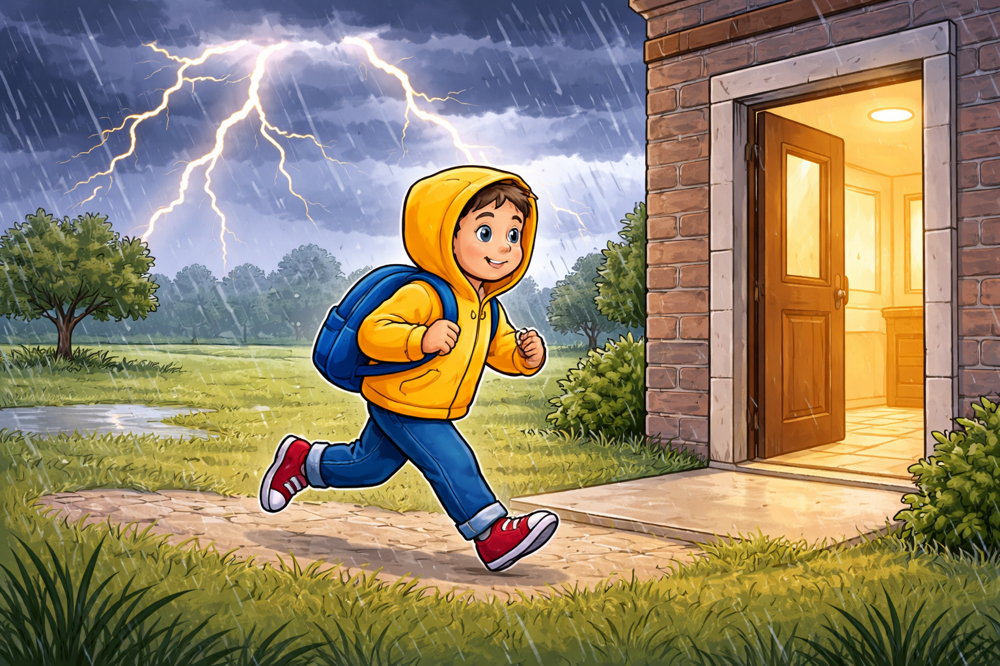

# [Гроза](../../../3.2 healthy lifestyle/how to act in a dangerous situation/articles/thunderstorm-safety.md) на улице: как действовать безопасно

Гроза опасна молниями, порывистым ветром и сильным дождем. На открытом пространстве [риск](../../../1.2_natural_sciences/neurobiology_for_teens/articles/05_teen_brain.md) выше, поэтому главная задача — как можно быстрее найти безопасное [укрытие](../../../3.2 healthy lifestyle/how to act in a dangerous situation/articles/thunderstorm-safety.md). Каждый год [молнии](../../../1.2_natural_sciences/physics_in_everyday_life/Q33741.md) поражают тысячи людей по всему миру, и большинство несчастных случаев происходят именно потому, что [человек](../../../1.2_natural_sciences/physics_in_everyday_life/Q45003.md) не успел или не захотел спрятаться вовремя. Гроза может начаться внезапно, даже если утром светило [солнце](../../../1.2_natural_sciences/physics_in_everyday_life/Q11388.md), поэтому важно знать [признаки](../../../3.1_healthy_lifestyle/pervaya_pomoshch/ushibi_porezy_ozhogi/04_ushib_chto_eto_priznaki.md) приближающейся грозы и уметь быстро действовать.

## Иллюстрация

*[Ребенок](../../../5.1_technology_and_digital_literacy/information and media literacy/информационная_безопасность_для_детей.md) уходит с открытого поля в здание во [время](../../../1.2_natural_sciences/physics_in_everyday_life/Q20702.md) грозы.*

## Почему гроза опасна
- [Молния](../../../1.1_structure_of_the_world/matter/articles/08_plasma.md) бьет в самые высокие объекты.
На открытом [поле](../../../5.2_cybersecurity/cpp_fundamentals/13_struct.md) самым высоким объектом может оказаться человек, стоящий в полный [рост](../../../3.1. healthy lifestyle/Sleep, nutrition, and adolescent energy/articles/micronutrients_and_teenagers.md).
Молния ищет кратчайший [путь](../../../1.2_natural_sciences/physics_in_everyday_life/Q11476.md) к земле, и всё, что возвышается над поверхностью, притягивает [разряд](../../../1.2_natural_sciences/physics_in_everyday_life/Q33741.md).
Именно поэтому так опасно стоять на холме, у одинокого дерева или рядом с высоким металлическим предметом.
- Удар молнии может быть смертельным.
Молния несет огромную энергию: [температура](../../../1.1_structure_of_the_world/matter/articles/07_gases.md) разряда достигает 30 000 градусов.
Даже если человек выживает после удара, он может получить тяжелые [ожоги](../../../6.1_Independent_living_and_daily_living_skills/Simple_and_safe_cooking/articles/safe_use_of_kitchen_appliances.md) и [травмы](../../../1.2_natural_sciences/physics_in_everyday_life/Q628858.md).
Последствия удара молнии бывают очень серьезными и требуют немедленной медицинской помощи.
- Гроза приносит не только молнии.
Порывистый ветер может ломать ветки и валить деревья.
Сильный [дождь](../../../3.2 healthy lifestyle/how to act in a dangerous situation/articles/thunderstorm-safety.md) ухудшает видимость и делает поверхности скользкими.
Град может причинить травмы, если не успеть спрятаться.

## Как понять, что гроза приближается
- Небо темнеет с одной стороны, появляются мощные темные облака.
Грозовые облака выглядят тяжелыми, иногда с характерной наковальней наверху.
Если облака быстро приближаются и небо темнеет, нужно начинать искать укрытие.
- Слышен далекий [гром](../../../1.2_natural_sciences/physics_in_everyday_life/Q33741.md).
Если между вспышкой молнии и громом проходит менее 30 секунд, гроза уже близко.
[Правило](../../../1.2_natural_sciences/why_science_help_understand_world/patterns.md) простое: считай секунды между молнией и громом. Каждые 3 секунды — примерно 1 километр.
Если промежуток сокращается, гроза приближается и нужно действовать быстро.
- [Воздух](../../../1.2_natural_sciences/physics_in_everyday_life/Q487005.md) становится влажным и душным.
Перед грозой часто наступает характерная духота и затишье.
Ветер может резко смениться или стихнуть, а потом налететь с новой силой.

## Где безопасно
- В капитальном здании с крышей и стенами.
Это самое надежное укрытие. Стены и крыша защищают от молнии, ветра и дождя.
Внутри [здания](../../../1.2_natural_sciences/physics_in_everyday_life/Q83301.md) не стой у открытых окон и не трогай металлические предметы, подключенные к сети.
[Школа](../../../3.1. healthy lifestyle/Sleep, nutrition, and adolescent energy/articles/healthy_school_snacks.md), магазин, [подъезд](../../../3.2 healthy lifestyle/how to act in a dangerous situation/articles/smoke-in-entrance.md) жилого дома — всё это хорошие [варианты](../../../6.1_Independent_living_and_daily_living_skills/reasonable_spending/articles/comparison.md).
- В автомобиле с закрытыми окнами.
Металлический [корпус](../../../1.2_natural_sciences/physics_in_everyday_life/Q11223329.md) автомобиля работает как [клетка](../../../1.2_natural_sciences/physics_in_everyday_life/Q40260.md) Фарадея: разряд проходит по поверхности, не задевая пассажиров.
Важно закрыть [окна](../../../5.1_technology_and_digital_literacy/operating system/articles/window_manager.md) и не касаться металлических частей внутри машины.
Мотоцикл, велосипед и открытый [транспорт](../../../1.2_natural_sciences/physics_in_everyday_life/Q1751973.md) не защищают от молнии.

## Где опасно
- Под одиноким деревом.
Это одно из самых опасных мест во время грозы. [Дерево](../../../1.2_natural_sciences/physics_in_everyday_life/Q487005.md) притягивает молнию, а [ток](../../../1.2_natural_sciences/physics_in_everyday_life/Q177897.md) распространяется по земле вокруг него.
Даже если молния ударит в дерево, а не в тебя, шаговое [напряжение](../../../1.2_natural_sciences/physics_in_everyday_life/Q11023.md) может поразить человека, стоящего рядом.
Если ты в лесу, лучше найти группу невысоких деревьев и присесть между ними, не касаясь стволов.
- На вершине холма и открытом поле.
Человек на возвышенности — идеальная мишень для молнии.
Если ты на открытом поле, нужно быстро уйти к низине, оврагу или любому углублению.
Не ложись на землю — это увеличивает [площадь](../../../3.1_healthy_lifestyle/pervaya_pomoshch/ushibi_porezy_ozhogi/13_ozhogi_vidy_stepeni.md) контакта и риск поражения шаговым напряжением.
- Рядом с водой и металлическими ограждениями.
[Вода](../../../3.1. healthy lifestyle/Sleep, nutrition, and adolescent energy/articles/drinking_regime.md) отлично проводит [электричество](../../../1.2_natural_sciences/physics_in_everyday_life/Q11408.md), поэтому купание, рыбалка и нахождение у берега в грозу крайне опасны.
Металлические ограждения, [трубы](../../../5.1_technology_and_digital_literacy/operating system/articles/IPC.md) и рельсы могут проводить ток на большие расстояния.
Если ты на пляже или у реки, немедленно отойди от воды и ищи укрытие.
- На детских площадках с металлическими конструкциями.
Горки, лесенки, [качели](../../../1.2_natural_sciences/physics_in_everyday_life/Q1530280.md) — всё это [металл](../../../1.2_natural_sciences/physics_in_everyday_life/Q2225.md), который притягивает молнию.
Во время грозы [нельзя](../../../3.1_healthy_lifestyle/pervaya_pomoshch/ushibi_porezy_ozhogi/07_ushib_chego_nelzya.md) находиться на площадке и тем более касаться металлических элементов.
Даже после того как гроза, казалось бы, прошла, подожди 30 минут после последнего грома, прежде чем возвращаться.

## Если гроза началась внезапно
1. Уйди с возвышенности.
Двигайся вниз по склону, в сторону низин, оврагов или зданий.
Не беги — в панике легко упасть на мокрой поверхности.
Двигайся быстро, но аккуратно, выбирая безопасный маршрут.
2. Убери из рук металлические предметы.
Зонт с металлическим стержнем, удочка, велосипед — всё это нужно отложить в сторону.
Металл притягивает разряд и увеличивает [опасность](../../../3.1_healthy_lifestyle/pervaya_pomoshch/ushibi_porezy_ozhogi/06_ushib_kogda_vrach.md).
Если ты на велосипеде, слезь с него и отойди на несколько метров.
3. Не стой у столбов и высоких конструкций.
Фонарные столбы, электрические опоры и вышки — всё это притягивает молнию.
Отойди от них [минимум](../../../1.2_natural_sciences/physics_in_everyday_life/Q136980.md) на 10-15 метров.
4. Если укрытия нет, присядь на корточки, ноги вместе.
Это называется «поза молнии»: ты снижаешь свой рост и уменьшаешь площадь контакта с землей.
Ноги должны быть вместе, чтобы снизить разницу потенциалов между ними при шаговом напряжении.
Закрой уши руками, чтобы защитить барабанные перепонки от громкого удара грома.
5. Не ложись на землю полностью.
Лежа ты увеличиваешь площадь тела, которая касается земли, и ток может пройти через всё [тело](../../../1.2_natural_sciences/why_science_help_understand_world/organism.md).
Присесть на корточки безопаснее, чем лечь на мокрую землю.

## Что делать дома
- Закрой окна.
Порывы ветра могут забросить в комнату дождь, ветки и осколки.
Закрытые окна также снижают риск поражения от шаровой молнии, хотя это редкое [явление](../../../1.2_natural_sciences/physics_in_everyday_life/Q163214.md).
- Отключи ненужные [электроприборы](../../../6.1_Independent_living_and_daily_living_skills/Simple_and_safe_cooking/articles/kitchen_fire_safety.md).
Молния может вызвать скачок напряжения в электросети и повредить технику.
Лучше выдернуть вилки из розеток, а не просто выключить кнопкой.
Особенно важно отключить компьютеры и дорогую электронику.
- Не стой у открытого окна и не трогай мокрыми руками розетки.
Открытое окно — это путь для ветра, дождя и, в редких случаях, шаровой молнии.
Мокрые руки лучше проводят электричество, поэтому любые контакты с электроприборами во время грозы опасны.
- Не принимай ванну и не пользуйся водопроводом без необходимости.
Вода в трубах может проводить ток, если молния ударит в дом или рядом с ним.
Лучше подождать, пока гроза пройдет, прежде чем мыть руки или принимать [душ](../../../3.1_healthy lifestyle/hygiene_and_personal_care/articles/sleep.md).

## Если есть пострадавший
Позови взрослых, оцени обстановку и вызови [112](./emergency-112.md). Не рискуй собственной безопасностью.
Человека, пораженного молнией, можно безопасно трогать — он не проводит ток.
Если пострадавший не дышит, начни сердечно-легочную реанимацию, если умеешь, или попроси взрослого это сделать.
Уложи пострадавшего в удобное положение и укрой от дождя до приезда скорой помощи.
Запомни время происшествия и обстоятельства — эта [информация](../../../5.1_technology_and_digital_literacy/information and media literacy/как_устроена_современная_информационная_среда.md) нужна медикам.

## Частые [ошибки](../../../3.1_healthy_lifestyle/pervaya_pomoshch/ushibi_porezy_ozhogi/07_ushib_chego_nelzya.md)
- Прятаться под одиноким деревом.
Это самая распространенная и самая опасная [ошибка](../../../5.1_technology_and_digital_literacy/how_internet_works/articles/http_https/http_https.md) при грозе.
Дерево — природный [громоотвод](../../../1.2_natural_sciences/physics_in_everyday_life/Q33741.md), и находиться рядом с ним смертельно опасно.
- Продолжать купаться, думая, что «гроза далеко».
Молния может ударить на расстоянии до 15 км от центра грозы.
Если слышен гром, нужно немедленно выходить из воды.
- Прятаться в палатке.
Палатка не защищает от молнии. Тонкая ткань и металлические стойки — это не укрытие.
Если ты в походе, лучше найти низину или овраг подальше от деревьев и воды.
- Пользоваться телефоном на открытом пространстве.
Сам телефон не притягивает молнию, но [разговор](../../../2.1_society/how_and_where_find_friends/articles/izi_temy_dlya_razgovora.md) отвлекает от наблюдения за обстановкой.
Если нужно позвонить — сделай это быстро, а потом продолжай двигаться к укрытию.

## Правило 30/30
Если между вспышкой молнии и громом меньше 30 секунд — ищи укрытие немедленно. После последнего удара грома подожди ещё 30 минут, прежде чем выходить на открытое [пространство](../../../1.2_natural_sciences/physics_in_everyday_life/Q36253.md). Гроза может вернуться или молния ударить уже после того, как дождь закончился.

## Запомни главное
Лучшее [решение](../../../2.1_society/cause_and_effect_relationships/articles/personal_choice.md) при грозе — заранее уйти в укрытие, не ждать «пока пройдет». Молния непредсказуема и бьет быстрее, чем человек успевает среагировать. Если ты заметил признаки грозы — темные облака, далекий гром, духоту — начинай двигаться к безопасному месту сразу. Не жди, пока начнется ливень. Осторожность и быстрая [реакция](../../../1.2_natural_sciences/why_science_help_understand_world/chemistry.md) — лучшая [защита](../../../5.1_technology_and_digital_literacy/how_internet_works/articles/dns/cdn.md) от грозы.

Смотри также: [Экстренный номер 112](./emergency-112.md), [Тонкий лед](./thin-ice.md).

---
[Автор](../../../4.2_thinking_and_working_information/how_to_search_information/articles/copypaste.md): Илья Чибугаев
