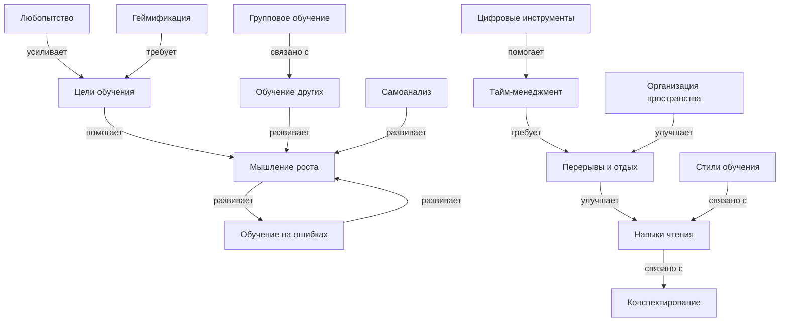

# Как учиться эффективно и с удовольствием

## Описание раздела

Этот раздел энциклопедии посвящён тому, как учиться не просто правильно, а **с удовольствием**. Мы собрали 15 ключевых понятий, которые помогут превратить учёбу из обязанности в увлекательное приключение. Раздел охватывает постановку целей, индивидуальные стили обучения, управление временем, развитие мышления роста и многие другие аспекты эффективного обучения.

Все материалы написаны простым и понятным языком для школьников 10-16 лет.

---

## Цель работы

В рамках лабораторной работы по курсу «Искусственный интеллект» было сделано:

- выделены 15 ключевых понятий, связанных с эффективным обучением;
- построена онтология предметной области с иерархическими и горизонтальными связями;
- написаны 15 энциклопедических статей с помощью генеративного ИИ;
- установлены перекрёстные ссылки между всеми статьями;
- найдены и использованы данные из структурированных источников знаний (Wikidata, DBpedia);
- подготовлены SPARQL-запросы для извлечения информации.

---

## Состав группы

| Участник         |
|------------------|
| Сидоров Дмитрий  |
| Таланкин Кирилл  |
| Магомедов Эдуард |
| Лизунов Кирилл   |
| Павлов Олег      |

---

## Список понятий

1. Цели обучения (Learning goals)
2. Стили обучения (Learning styles)
3. Тайм-менеджмент (Time management)
4. Мышление роста (Growth mindset)
5. Любопытство (Curiosity)
6. Обучение на ошибках (Learning from mistakes)
7. Геймификация (Gamification)
8. Групповое обучение (Peer learning)
9. Обучение других (Teaching others)
10. Организация пространства (Learning environment)
11. Цифровые инструменты (Digital tools)
12. Навыки чтения (Reading skills)
13. Конспектирование (Note-taking)
14. Перерывы и отдых (Breaks and rest)
15. Самоанализ (Self-reflection)

---

## Концептуализация предметной области

В данной предметной области выделены следующие группы сущностей:

- **Базовые понятия**: цели обучения, стили обучения, любопытство;
- **Навыки**: чтение, конспектирование, тайм-менеджмент;
- **Психологические аспекты**: мышление роста, мотивация, самоанализ;
- **Методы обучения**: геймификация, групповое обучение, обучение других;
- **Организационные аспекты**: пространство, цифровые инструменты, перерывы.

### Типы связей

Помимо иерархических связей (включает, вид, часть), в онтологии используются горизонтальные связи разных видов:

| Тип связи | Пример |
|-----------|--------|
| **помогает** | Цели → помогают → Мотивация |
| **усиливает** | Любопытство → усиливает → Мотивация |
| **развивает** | Обучение других → развивает → Понимание |
| **требует** | Геймификация → требует → Цели |
| **улучшает** | Перерывы → улучшают → Концентрацию |
| **связано с** | Стили обучения → связаны → Навыки чтения |

---

## Онтология раздела



---

## Таблица понятий

| Понятие | Описание | Связанные понятия | Файл |
|---------|----------|-------------------|------|
| Цели обучения | Как ставить правильные задачи для успеха | Мотивация, Тайм-менеджмент, Мышление роста | learning_goals.md |
| Стили обучения | Индивидуальные подходы: визуалы, аудиалы, кинестетики | Навыки чтения, Визуализация | learning_styles.md |
| Тайм-менеджмент | Управление временем при обучении | Цели, Перерывы, Цифровые инструменты | time_management.md |
| Мышление роста | Вера в развитие способностей | Обучение на ошибках, Самоанализ, Мотивация | growth_mindset.md |
| Любопытство | Двигатель обучения, желание узнавать | Мотивация, Цели, Исследование | curiosity.md |
| Обучение на ошибках | Превращение неудач в возможности | Мышление роста, Самоанализ | learning_from_mistakes.md |
| Геймификация | Превращение учёбы в игру | Мотивация, Цели, Групповое обучение | gamification.md |
| Групповое обучение | Учёба с друзьями и одноклассниками | Обучение других, Коммуникация | peer_learning.md |
| Обучение других | Метод Фейнмана: учить = учиться | Групповое обучение, Понимание | teaching_others.md |
| Организация пространства | Создание удобного места для занятий | Перерывы, Внимание, Комфорт | learning_environment.md |
| Цифровые инструменты | Приложения и сервисы для обучения | Тайм-менеджмент, Геймификация | digital_tools.md |
| Навыки чтения | Эффективное чтение и понимание | Конспектирование, Внимание | reading_skills.md |
| Конспектирование | Методы записи информации | Навыки чтения, Память, Визуализация | note_taking.md |
| Перерывы и отдых | Важность отдыха для продуктивности | Тайм-менеджмент, Сон, Усталость | breaks_and_rest.md |
| Самоанализ | Оценка прогресса и корректировка | Мышление роста, Обучение на ошибках | self_reflection.md |

---

## Использование структурированных источников знаний

В проекте использовались открытые базы знаний для обоснования и верификации материала:

- **Wikidata** — структурированная база знаний, содержащая данные о понятиях, их свойствах и связях;
- **DBpedia** — проект, извлекающий структурированные данные из Википедии.

Для каждого понятия найден соответствующий идентификатор в Wikidata (указан в concepts.json).

---

## Примеры SPARQL-запросов

### Запрос 1: описания всех понятий раздела

```sparql
SELECT ?item ?itemLabel ?itemDescription WHERE {
  VALUES ?item {
    wd:Q1494068 wd:Q1197056 wd:Q1072005 wd:Q1989664
    wd:Q131005 wd:Q1054052 wd:Q1699526 wd:Q7193318
    wd:Q559130 wd:Q1137670 wd:Q581684 wd:Q7962
    wd:Q209729 wd:Q1047016 wd:Q11089007
  }
  SERVICE wikibase:label { bd:serviceParam wikibase:language "ru,en". }
}
```

### Запрос 2: подклассы понятия «Обучение» (Learning)

```sparql
SELECT ?subclass ?subclassLabel ?subclassDescription WHERE {
  ?subclass wdt:P279 wd:Q8434 .
  SERVICE wikibase:label { bd:serviceParam wikibase:language "ru,en". }
}
```

### Запрос 3: свойства понятия «Мышление роста» (Growth mindset)

```sparql
SELECT ?property ?propertyLabel ?value ?valueLabel WHERE {
  wd:Q1989664 ?prop ?value .
  ?property wikibase:directClaim ?prop .
  SERVICE wikibase:label { bd:serviceParam wikibase:language "ru,en". }
}
```

---

## Использование LLM

Для генерации статей использовалась языковая модель **GigaChat**.

Процесс работы:

1. **Промпты** формулировались по единому шаблону, включающему:
   - описание проекта и аудитории (школьники 10-16 лет);
   - полную карту файлов и путей для корректных внутренних ссылок;
   - список обязательных связанных понятий для каждой статьи;
   - требования к структуре: вступление, объяснение, примеры, практические советы, таблицы, частые ошибки, связь с другими понятиями, интересные факты, раздел «см. также».

2. **Генерация**: каждая статья генерировалась отдельным запросом с указанием конкретного понятия и его обязательных связей.

3. **Проверка**: каждая статья проверялась вручную на:
   - корректность внутренних ссылок;
   - отсутствие псевдонауки и выдуманных фактов;
   - доступность языка для целевой аудитории;
   - наличие достаточного числа перекрёстных ссылок.

---

## Перекрёстные ссылки

Все 15 статей расположены в одной папке:

```
WEB/how_to_learn_effectively/articles/
```

Благодаря этому ссылки между статьями оформляются единообразно:

```markdown
[Цели обучения](./learning_goals.md)
[Мышление роста](./growth_mindset.md)
[Перерывы и отдых](./breaks_and_rest.md)
```

В каждой статье содержится:
- 5–8 естественных внутренних ссылок в тексте;
- 4–7 ссылок в разделе «См. также».

Леммы в concepts.json содержат различные словоформы каждого понятия (падежи, глагольные формы, синонимы), что позволяет находить упоминания терминов в разных контекстах.

---

## Структура файлов

```text
WORK/how_to_learn_effectively/
  README.md
  concepts.json
  
WEB/how_to_learn_effectively/
  articles/
    learning_goals.md
    learning_styles.md
    time_management.md
    growth_mindset.md
    curiosity.md
    learning_from_mistakes.md
    gamification.md
    peer_learning.md
    teaching_others.md
    learning_environment.md
    digital_tools.md
    reading_skills.md
    note_taking.md
    breaks_and_rest.md
    self_reflection.md
```

---

## Итоги

В результате работы был создан полноценный раздел энциклопедии по теме «Как учиться эффективно и с удовольствием». Раздел содержит 15 связанных между собой статей, каждая из которых написана понятным языком для школьников.

Была построена онтология предметной области, включающая:
- иерархические связи (виды навыков, методы обучения);
- горизонтальные связи (помогает, усиливает, развивает, требует, улучшает).

Для всех понятий найдены соответствующие сущности в Wikidata, что подтверждает научную обоснованность выбранных тем. Подготовлены SPARQL-запросы для извлечения дополнительной информации из баз знаний.

### Особенности раздела:

1. **Практическая направленность**: каждая статья содержит конкретные упражнения и рекомендации.
2. **Междисциплинарность**: связаны психология, педагогика, нейробиология и практические навыки.
3. **Современный подход**: включены цифровые инструменты, геймификация, методы XXI века.
4. **Научная база**: все методы имеют научное обоснование (исследования, эксперименты).
5. **Доступность**: язык адаптирован для школьников, сложные концепции объяснены через аналогии.

В дальнейшем раздел можно улучшить:
- добавив иллюстрации и схемы к каждой статье;
- расширив описания методов практическими упражнениями;
- интегрировав раздел с другими темами энциклопедии KidBook;
- создав интерактивные элементы (тесты, чек-листы, трекеры).

---

Авторы: Команда по эффективному обучению;  
Ресурсы: LLM - GigaChat, Wikidata
