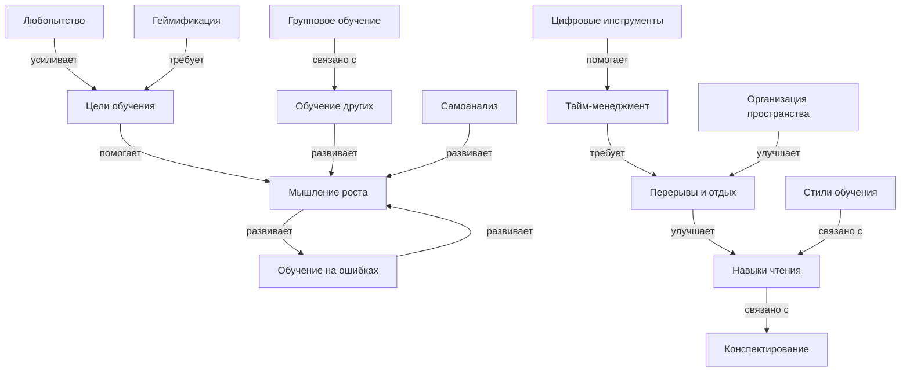

# Как учиться эффективно и с удовольствием

## Описание раздела

Этот раздел энциклопедии посвящён тому, как учиться не просто правильно, а **с удовольствием**. Мы собрали 15 ключевых понятий, которые помогут превратить учёбу из обязанности в увлекательное приключение. Раздел охватывает постановку целей, индивидуальные [стили обучения](articles/learning_styles.md), [управление временем](articles/time_management.md), [развитие](../../3.1. healthy lifestyle/Sleep, nutrition, and adolescent energy/articles/micronutrients_and_teenagers.md) мышления роста и многие другие аспекты эффективного обучения.

Все [материалы](../../1.2_natural_sciences/physics_in_everyday_life/Q487005.md) написаны простым и понятным языком для школьников 10-16 лет.

---

## [Цель](../../1.2_natural_sciences/why_science_help_understand_world/research_work.md) [работы](../../8.2_future/choosing_a_career_path/articles/interview.md)

В рамках лабораторной работы по курсу «[Искусственный интеллект](../../1.2_natural_sciences/physics_in_everyday_life/Q11023.md)» было сделано:

- выделены 15 ключевых понятий, связанных с эффективным обучением;
- построена онтология предметной области с иерархическими и горизонтальными связями;
- написаны 15 энциклопедических статей с помощью генеративного ИИ;
- установлены перекрёстные ссылки между всеми статьями;
- найдены и использованы [данные](../../2.1_society/cause_and_effect_relationships/articles/ai_causality.md) из структурированных источников знаний (Wikidata, DBpedia);
- подготовлены SPARQL-запросы для извлечения информации.

---

## [Состав](../../1.2_natural_sciences/physics_in_everyday_life/Q11469.md) группы

| Участник         |
|------------------|
| Сидоров Дмитрий  |
| Таланкин Кирилл  |
| Магомедов Эдуард |
| Лизунов Кирилл   |
| Павлов Олег      |

---

## [Список](../../5.2_cybersecurity/cpp_fundamentals/10_arrays.md) понятий

1. [Цели обучения](articles/learning_goals.md) (Learning goals)
2. Стили обучения (Learning styles)
3. [Тайм-менеджмент](../../3.1. healthy lifestyle/Sleep, nutrition, and adolescent energy/articles/ideal_schedule_energy_management.md) (Time management)
4. [Мышление роста](articles/growth_mindset.md) ([Growth mindset](articles/growth_mindset.md))
5. [Любопытство](../../1.2_natural_sciences/neurobiology_for_teens/articles/19_curiosity.md) (Curiosity)
6. [Обучение на ошибках](../../4.2_thinking_and_working_information/critical_thinking/articles/reflection_and_post_mortem.md) (Learning from mistakes)
7. [Геймификация](articles/gamification.md) (Gamification)
8. [Групповое обучение](articles/peer_learning.md) ([Peer learning](articles/peer_learning.md))
9. [Обучение других](articles/teaching_others.md) (Teaching others)
10. [Организация](articles/learning_environment.md) пространства (Learning environment)
11. [Цифровые инструменты](articles/digital_tools.md) (Digital tools)
12. [Навыки](../../7.2 Media, leisure and hobbies /useful_and_interesting_leisure/articles/computer_games_with_benefit.md) чтения (Reading skills)
13. [Конспектирование](articles/reading_skills.md) (Note-taking)
14. [Перерывы](articles/breaks_and_rest.md) и [отдых](../../3.1. healthy lifestyle/Sleep, nutrition, and adolescent energy/articles/evening_rituals_sleep_fast.md) (Breaks and rest)
15. [Самоанализ](articles/self_reflection.md) (Self-reflection)

---

## Концептуализация предметной области

В данной предметной области выделены следующие группы сущностей:

- **Базовые понятия**: цели обучения, стили обучения, любопытство;
- **Навыки**: [чтение](articles/reading_skills.md), конспектирование, тайм-менеджмент;
- **Психологические аспекты**: мышление роста, [мотивация](../../1.2_natural_sciences/neurobiology_for_teens/articles/11_reward_system.md), самоанализ;
- **[Методы](articles/note_taking.md) обучения**: геймификация, групповое обучение, обучение других;
- **Организационные аспекты**: [пространство](../../1.2_natural_sciences/physics_in_everyday_life/Q36253.md), цифровые инструменты, перерывы.

### Типы связей

Помимо иерархических связей (включает, вид, часть), в онтологии используются горизонтальные связи разных видов:

| [Тип](../../5.2_cybersecurity/cpp_fundamentals/13_struct.md) связи | Пример |
|-----------|--------|
| **помогает** | [Цели](../../3.1_healthy_lifestyle/pervaya_pomoshch/ushibi_porezy_ozhogi/02_celi_pervoy_pomoshchi.md) → помогают → Мотивация |
| **усиливает** | Любопытство → усиливает → Мотивация |
| **развивает** | Обучение других → развивает → [Понимание](../../2.1_society/cause_and_effect_relationships/articles/empathy_causality.md) |
| **требует** | Геймификация → требует → Цели |
| **улучшает** | Перерывы → улучшают → Концентрацию |
| **связано с** | Стили обучения → связаны → Навыки чтения |

---

## Онтология раздела



---

## Таблица понятий

| Понятие | Описание | Связанные понятия | [Файл](../../5.1_technology_and_digital_literacy/operating system/articles/file_system.md) |
|---------|----------|-------------------|------|
| Цели обучения | Как ставить правильные [задачи](../../1.2_natural_sciences/why_science_help_understand_world/research_work.md) для успеха | Мотивация, Тайм-менеджмент, Мышление роста | learning_goals.md |
| Стили обучения | Индивидуальные подходы: визуалы, аудиалы, кинестетики | Навыки чтения, [Визуализация](../how_to_memorize/articles/vizualizaciya.md) | learning_styles.md |
| Тайм-менеджмент | Управление временем при обучении | Цели, Перерывы, Цифровые инструменты | time_management.md |
| Мышление роста | Вера в развитие способностей | Обучение на ошибках, Самоанализ, Мотивация | growth_mindset.md |
| Любопытство | [Двигатель](../../1.2_natural_sciences/physics_in_everyday_life/Q177897.md) обучения, [желание](../../6.1_Independent_living_and_daily_living_skills/reasonable_spending/articles/want.md) узнавать | Мотивация, Цели, [Исследование](../../1.2_natural_sciences/neurobiology_for_teens/articles/19_curiosity.md) | curiosity.md |
| Обучение на ошибках | Превращение неудач в возможности | Мышление роста, Самоанализ | learning_from_mistakes.md |
| Геймификация | Превращение учёбы в игру | Мотивация, Цели, Групповое обучение | gamification.md |
| Групповое обучение | [Учёба](../../8.1_colf-underctandina/HouToFindVourStrenaths/articles/use_strengths_in_life.md) с друзьями и одноклассниками | Обучение других, [Коммуникация](../../2.1_society/how_and_where_find_friends/articles/guide_dlya_introvertov.md) | peer_learning.md |
| Обучение других | [Метод Фейнмана](articles/teaching_others.md): учить = учиться | Групповое обучение, Понимание | teaching_others.md |
| Организация пространства | Создание удобного места для занятий | Перерывы, [Внимание](../../1.2_natural_sciences/neurobiology_for_teens/articles/16_love_chemistry.md), [Комфорт](articles/learning_environment.md) | learning_environment.md |
| Цифровые инструменты | [Приложения](articles/digital_tools.md) и [сервисы](articles/digital_tools.md) для обучения | Тайм-менеджмент, Геймификация | digital_tools.md |
| Навыки чтения | [Эффективное чтение](articles/reading_skills.md) и понимание | Конспектирование, Внимание | reading_skills.md |
| Конспектирование | Методы [записи](articles/note_taking.md) информации | Навыки чтения, [Память](../../3.1. healthy lifestyle/Sleep, nutrition, and adolescent energy/articles/sleep_and_memory_grades.md), Визуализация | note_taking.md |
| Перерывы и отдых | Важность отдыха для продуктивности | Тайм-менеджмент, [Сон](../../3.1. healthy lifestyle/Sleep, nutrition, and adolescent energy/articles/evening_rituals_sleep_fast.md), [Усталость](../../3.1. healthy lifestyle/Sleep, nutrition, and adolescent energy/articles/sugar_rollercoaster.md) | breaks_and_rest.md |
| Самоанализ | [Оценка](articles/self_reflection.md) прогресса и [корректировка](articles/self_reflection.md) | Мышление роста, Обучение на ошибках | self_reflection.md |

---

## Использование структурированных источников знаний

В проекте использовались открытые базы знаний для обоснования и верификации материала:

- **Wikidata** — структурированная [база](../../1.2_natural_sciences/physics_in_everyday_life/Q5339.md) знаний, содержащая данные о понятиях, их свойствах и связях;
- **DBpedia** — [проект](../../1.2_natural_sciences/why_science_help_understand_world/research_work.md), извлекающий структурированные данные из Википедии.

Для каждого понятия найден соответствующий идентификатор в Wikidata (указан в concepts.json).

---

## Примеры SPARQL-запросов

### [Запрос](../../5.1_technology_and_digital_literacy/how_internet_works/articles/http_https/http_https.md) 1: описания всех понятий раздела

```sparql
SELECT ?item ?itemLabel ?itemDescription WHERE {
  VALUES ?item {
    wd:Q1494068 wd:Q1197056 wd:Q1072005 wd:Q1989664
    wd:Q131005 wd:Q1054052 wd:Q1699526 wd:Q7193318
    wd:Q559130 wd:Q1137670 wd:Q581684 wd:Q7962
    wd:Q209729 wd:Q1047016 wd:Q11089007
  }
  SERVICE wikibase:label { bd:serviceParam wikibase:language "ru,en". }
}
```

### Запрос 2: подклассы понятия «[Обучение](../../3.1. healthy lifestyle/Sleep, nutrition, and adolescent energy/articles/sleep_and_memory_grades.md)» (Learning)

```sparql
SELECT ?subclass ?subclassLabel ?subclassDescription WHERE {
  ?subclass wdt:P279 wd:Q8434 .
  SERVICE wikibase:label { bd:serviceParam wikibase:language "ru,en". }
}
```

### Запрос 3: свойства понятия «Мышление роста» (Growth mindset)

```sparql
SELECT ?property ?propertyLabel ?value ?valueLabel WHERE {
  wd:Q1989664 ?prop ?value .
  ?property wikibase:directClaim ?prop .
  SERVICE wikibase:label { bd:serviceParam wikibase:language "ru,en". }
}
```

---

## Использование [LLM](../../7.1_art/modern_technological_art/README.md)

Для генерации статей использовалась языковая модель **GigaChat**.

[Процесс](../../5.1_technology_and_digital_literacy/operating system/articles/process.md) работы:

1. **Промпты** формулировались по единому шаблону, включающему:
   - описание проекта и аудитории (школьники 10-16 лет);
   - полную карту файлов и путей для корректных внутренних ссылок;
   - список обязательных связанных понятий для каждой статьи;
   - требования к структуре: вступление, [объяснение](articles/teaching_others.md), примеры, практические [советы](../../7.2 Media, leisure and hobbies /useful_and_interesting_leisure/articles/mistakes_in_choosing_hobby.md), таблицы, частые [ошибки](../../3.1_healthy_lifestyle/pervaya_pomoshch/ushibi_porezy_ozhogi/07_ushib_chego_nelzya.md), [связь](../../1.2_natural_sciences/physics_in_everyday_life/Q12969754.md) с другими понятиями, интересные [факты](../../1.2_natural_sciences/physics_in_everyday_life/Q17737.md), раздел «см. также».

2. **Генерация**: каждая статья генерировалась отдельным запросом с указанием конкретного понятия и его обязательных связей.

3. **[Проверка](../../1.2_natural_sciences/why_science_help_understand_world/scientific_method.md)**: каждая статья проверялась вручную на:
   - корректность внутренних ссылок;
   - отсутствие псевдонауки и выдуманных фактов;
   - доступность языка для целевой аудитории;
   - наличие достаточного числа перекрёстных ссылок.

---

## Перекрёстные ссылки

Все 15 статей расположены в одной папке:

```
WEB/how_to_learn_effectively/articles/
```

Благодаря этому ссылки между статьями оформляются единообразно:

```markdown
[Цели обучения](./learning_goals.md)
[Мышление роста](./growth_mindset.md)
[Перерывы и отдых](./breaks_and_rest.md)
```

В каждой статье содержится:
- 5–8 естественных внутренних ссылок в тексте;
- 4–7 ссылок в разделе «См. также».

Леммы в concepts.json содержат различные словоформы каждого понятия (падежи, глагольные формы, синонимы), что позволяет находить упоминания терминов в разных контекстах.

---

## [Структура](articles/note_taking.md) файлов

```text
WORK/how_to_learn_effectively/
  README.md
  concepts.json
  
WEB/how_to_learn_effectively/
  articles/
    learning_goals.md
    learning_styles.md
    time_management.md
    growth_mindset.md
    curiosity.md
    learning_from_mistakes.md
    gamification.md
    peer_learning.md
    teaching_others.md
    learning_environment.md
    digital_tools.md
    reading_skills.md
    note_taking.md
    breaks_and_rest.md
    self_reflection.md
```

---

## Итоги

В результате работы был создан полноценный раздел энциклопедии по теме «Как учиться эффективно и с удовольствием». Раздел содержит 15 связанных между собой статей, каждая из которых написана понятным языком для школьников.

Была построена онтология предметной области, включающая:
- иерархические связи ([виды](../../3.1_healthy_lifestyle/pervaya_pomoshch/ushibi_porezy_ozhogi/08_porezy_sadiny_vidy.md) навыков, методы обучения);
- горизонтальные связи (помогает, усиливает, развивает, требует, улучшает).

Для всех понятий найдены соответствующие сущности в Wikidata, что подтверждает научную обоснованность выбранных тем. Подготовлены SPARQL-запросы для извлечения дополнительной информации из баз знаний.

### Особенности раздела:

1. **Практическая [направленность](../../1.2_natural_sciences/physics_in_everyday_life/Q38867.md)**: каждая статья содержит конкретные упражнения и рекомендации.
2. **Междисциплинарность**: связаны [психология](../../2.1_society/cause_and_effect_relationships/articles/empathy_causality.md), педагогика, [нейробиология](../../1.2_natural_sciences/neurobiology_for_teens/articles/01_brain_complexity.md) и практические навыки.
3. **Современный подход**: включены цифровые инструменты, геймификация, методы XXI века.
4. **[Научная база](../../4.2_thinking_and_working_information/how_to_search_information/articles/science.md)**: все методы имеют научное обоснование (исследования, эксперименты).
5. **Доступность**: [язык](../../5.2_cybersecurity/cpp_fundamentals/1_introduction.md) адаптирован для школьников, сложные концепции объяснены через аналогии.

В дальнейшем раздел можно улучшить:
- добавив иллюстрации и схемы к каждой статье;
- расширив описания методов практическими упражнениями;
- интегрировав раздел с другими темами энциклопедии KidBook;
- создав интерактивные элементы (тесты, чек-листы, трекеры).

---

Авторы: [Команда](articles/peer_learning.md) по эффективному обучению;  
[Ресурсы](../../2.1_society/cause_and_effect_relationships/articles/ecological_footprint.md): LLM - GigaChat, Wikidata
