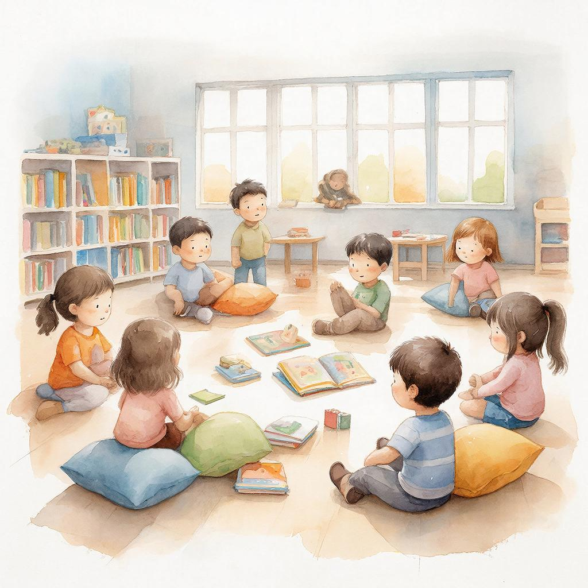

# Перерывы и [отдых](../../../3.1. healthy lifestyle/Sleep, nutrition, and adolescent energy/articles/evening_rituals_sleep_fast.md): почему [нельзя](../../../3.1_healthy_lifestyle/pervaya_pomoshch/ushibi_porezy_ozhogi/07_ushib_chego_nelzya.md) учиться без остановки



«Работай умно, а не усердно». Эта мудрость особенно важна для учёбы. Многие думают: чем дольше сидишь за учебниками, тем лучше [результат](../../../1.2_natural_sciences/why_science_help_understand_world/experimental_science.md). Но это [ошибка](../../../5.1_technology_and_digital_literacy/how_internet_works/articles/http_https/http_https.md)! [Мозг](../../../3.1. healthy lifestyle/Sleep, nutrition, and adolescent energy/articles/breakfast_for_the_brain.md) — не мышца, которую можно «накачать» многочасовыми тренировками. Мозгу нужен **отдых** для роста и запоминания.

---

## Почему перерывы так важны?

### 1. Мозг устаёт

Представьте: вы бежали 2 часа без остановки. Сможете ли вы бежать быстро ещё час? Нет! Мозг работает так же.

**[Что происходит](../../../5.1_technology_and_digital_literacy/how_internet_works/articles/web_basics/what_happens.md) при долгой учёбе без перерыва:**
- 📉 Падает [концентрация](../../../1.2_natural_sciences/physics_in_everyday_life/Q506710.md)
- 📉 Замедляется [обработка информации](../../../1.2_natural_sciences/neurobiology_for_teens/articles/26_optical_illusions.md)
- 📉 Растёт число ошибок
- 📉 Ухудшается [настроение](../../../1.2_natural_sciences/neurobiology_for_teens/articles/10_sweet_tooth.md)
- 📉 Накапливается [стресс](../../../3.1. healthy lifestyle/Sleep, nutrition, and adolescent energy/articles/chronic_sleep_deprivation.md)

**[Исследование](../../../1.2_natural_sciences/neurobiology_for_teens/articles/19_curiosity.md):** После 50 минут непрерывной [работы](../../../8.2_future/choosing_a_career_path/articles/interview.md) [продуктивность](../../../3.1. healthy lifestyle/Sleep, nutrition, and adolescent energy/articles/ideal_schedule_energy_management.md) падает на **40%**.

---

### 2. [Запоминание](../../../1.2_natural_sciences/neurobiology_for_teens/articles/21_how_memory_works.md) происходит во [время](../../../1.2_natural_sciences/physics_in_everyday_life/Q20702.md) отдыха

Когда вы учите что-то новое, в мозге образуются временные связи. Чтобы они стали постоянными (перешли в [долговременную память](./dolgovremennaya_pamyat.md)), нужно время.

**[Процесс](../../../5.1_technology_and_digital_literacy/operating system/articles/process.md):**
1. [Учёба](../../../8.1_colf-underctandina/HouToFindVourStrenaths/articles/use_strengths_in_life.md) → [информация](../../../5.1_technology_and_digital_literacy/information and media literacy/как_устроена_современная_информационная_среда.md) в кратковременной [памяти](../../how_to_memorize/articles/pamyat.md)
2. **[Перерыв](../../../7.2 Media, leisure and hobbies/Computer games/articles/useful_tips/eyes_and_back.md)** → мозг обрабатывает, закрепляет
3. [Повторение](../../how_to_memorize/articles/povtorenie.md) → информация в долговременной памяти

**Без перерыва:** Информация не успевает закрепиться → забывае́те через час.

---

### 3. Отдых предотвращает [выгорание](../../../7.2 Media, leisure and hobbies /useful_and_interesting_leisure/articles/balance_study_rest_hobby.md)

**Выгорание** — состояние эмоционального и физического истощения от [перегрузки](../../../1.2_natural_sciences/physics_in_everyday_life/Q11376.md).

**[Симптомы](../../../4.2_thinking_and_working_information/critical_thinking/articles/problem_structuring.md):**
- 😴 Постоянная [усталость](../../../3.1. healthy lifestyle/Sleep, nutrition, and adolescent energy/articles/sugar_rollercoaster.md)
- 😠 Раздражительность
- 😞 [Потеря](../../../1.2_natural_sciences/neurobiology_for_teens/articles/20_sadness.md) интереса к учёбе
- 😰 [Тревожность](../../../../8.1_self_understanding/articles/causes.md)
- 🤕 Головные боли

**[Профилактика](../../../3.1_healthy_lifestyle/pervaya_pomoshch/ushibi_porezy_ozhogi/18_mify_i_7_pravil.md):** Регулярные перерывы + полноценный отдых.

---

## Научно обоснованные [циклы](../../../1.2_natural_sciences/why_science_help_understand_world/patterns.md) работы

### [Метод](../../../5.1_technology_and_digital_literacy/how_internet_works/articles/http_https/http_https.md) Помодоро: 25 + 5

**[Структура](note_taking.md):**
```
25 мин работа → 5 мин отдых → 25 мин работа → 5 мин отдых → 
25 мин работа → 5 мин отдых → 25 мин работа → 15-30 мин длинный отдых
```

**Почему работает:**
- 25 минут — оптимальное время для фокуса
- 5 минут — достаточно для микро-восстановления
- Длинный перерыв после 4 циклов — для полного восстановления

**Для кого:** Школьники, студенты, взрослые

---

### Метод 52 + 17

Исследование компании DeskTime (проанализировали 5000 работников):

**Самые продуктивные люди работают:**
- 52 минуты фокусированно
- 17 минут полный отдых

**Почему:** 52 минуты — предел концентрации для большинства людей.

---

### Метод 90 + 20 (Ультрадианные ритмы)

**Биологические циклы:**
- Мозг работает циклами по 90-120 минут
- После цикла — спад энергии на 20-30 минут

**Как использовать:**
- 90 минут глубокой работы
- 20-30 минут полноценного отдыха

**Для кого:** Для длительных проектов, написания работ, подготовки к экзаменам

---

### Метод 45 + 15 (Школьный стандарт)

**Почему 45 минут:**
- Оптимально для возраста 7-17 лет
- Соответствует школьному уроку
- Легко вписать в расписание

**Как использовать:**
- 45 минут учёба
- 15 минут [активный отдых](../../../7.2 Media, leisure and hobbies /useful_and_interesting_leisure/articles/active_recreation_and_sport.md) (не телефон!)

---

## Что делать в перерывах?

### ✅ Полезно:

| Активность | Почему полезно | Сколько времени |
|------------|----------------|-----------------|
| **Прогулка** | [Кислород](../../../1.2_natural_sciences/physics_in_everyday_life/Q629.md), [движение](../../../1.2_natural_sciences/physics_in_everyday_life/Q11023.md), смена обстановки | 5-15 мин |
| **Растяжка** | Снимает [напряжение](../../../1.2_natural_sciences/physics_in_everyday_life/Q11023.md) в спине, шее | 3-5 мин |
| **Глазная гимнастика** | Снижает усталость [глаз](../../../1.2_natural_sciences/physics_in_everyday_life/Q467980.md) | 2-3 мин |
| **[Вода](../../../3.1. healthy lifestyle/Sleep, nutrition, and adolescent energy/articles/drinking_regime.md) + лёгкий перекус** | Восполняет энергию | 5 мин |
| **[Дыхательные упражнения](../../../8.2_future_and_path_choice/articles/03_stress_management.md)** | Снижает стресс, насыщает кислородом | 2-5 мин |
| **[Общение](../../../2.1_society/how_and_where_find_friends/articles/guide_dlya_introvertov.md)** | Социальная разгрузка, смех | 5-10 мин |
| **[Музыка](../../../1.2_natural_sciences/neurobiology_for_teens/articles/18_music_chills.md)** | Эмоциональная разрядка | 3-5 мин |
| **[Медитация](../../../8.2_future_and_path_choice/articles/relaxation_and_recovery.md)** | Очищает [ум](../../../7.2 Media, leisure and hobbies/Computer games/articles/useful_tips/educational_games.md), снижает тревожность | 5-10 мин |

---

### ❌ Вредно:

| Активность | Почему вредно | Чем заменить |
|------------|---------------|--------------|
| **Листание соцсетей** | Мозг не отдыхает, новая информация перегружает | Прогулка, музыка |
| **[Видеоигры](../../../7.1_art/modern_technological_art/articles/3.1_uncensored_library.md)** | Азарт, [возбуждение](../../../1.2_natural_sciences/neurobiology_for_teens/articles/16_love_chemistry.md), сложно остановиться | [Настольная игра](../../../../8.1_entertainment/articles/board-games.md), пазл |
| **Просмотр сериала** | «Ещё 5 минуточек» → 30 минут потеряно | Короткое [видео](../../../5.1_technology_and_digital_literacy/information and media literacy/оценка_качества_изображений_и_видео.md), музыкальный клип |
| **[Еда](../../../3.1. healthy lifestyle/Sleep, nutrition, and adolescent energy/articles/stress_and_food.md) у экрана** | Не отдыхаете, переедаете | Встать, поесть без экрана |
| **Споры/ссоры** | Стресс вместо отдыха | Спокойное общение |
| **Дремление >20 мин** | Сложно проснуться, [инерция](../../../1.2_natural_sciences/physics_in_everyday_life/Q11402.md) сна |Power nap 10-15 мин |

---

## [Виды](../../../3.1_healthy_lifestyle/pervaya_pomoshch/ushibi_porezy_ozhogi/08_porezy_sadiny_vidy.md) отдыха

### 1. Активный отдых

**Что:** Движение, смена деятельности

**Примеры:**
- Прогулка на свежем воздухе
- Лёгкая разминка, растяжка
- Танцы под музыку
- [Игра](gamification.md) с питомцем
- [Работа](../../../1.2_natural_sciences/physics_in_everyday_life/Q11382.md) по дому (полить цветы, убрать на столе)

**Когда:** Короткие перерывы (5-15 минут)

**Почему:** Движение разгоняет кровь, насыщает мозг кислородом.

---

### 2. Пассивный отдых

**Что:** [Покой](../../../1.2_natural_sciences/physics_in_everyday_life/Q1530280.md), [расслабление](../../../8.2_future_and_path_choice/articles/relaxation_and_recovery.md)

**Примеры:**
- Закрыть [глаза](../../../7.2 Media, leisure and hobbies/Computer games/articles/useful_tips/eyes_and_back.md), посидеть в тишине
- Лёгкая медитация
- Дыхательные упражнения
- Просто полежать (без телефона!)

**Когда:** После интенсивной умственной работы

**Почему:** Мозгу нужно время «на переваривание» информации.

---

### 3. Социальный отдых

**Что:** Общение с людьми

**Примеры:**
- Поболтать с семьёй
- Позвонить другу
- Поиграть с братом/сестрой
- Обнять питомца

**Когда:** Когда чувствуете [одиночество](../../../2.1_society/how_and_where_find_friends/articles/sam_sebe_interesnyi.md), усталость от учёбы

**Почему:** Социальная [связь](../../../1.2_natural_sciences/physics_in_everyday_life/Q12969754.md) снижает стресс, поднимает настроение.

---

### 4. Творческий отдых

**Что:** [Творчество](../../../2.1_society/how_and_where_find_friends/articles/sam_sebe_interesnyi.md) без [цели](../../../3.1_healthy_lifestyle/pervaya_pomoshch/ushibi_porezy_ozhogi/02_celi_pervoy_pomoshchi.md)

**Примеры:**
- Порисовать (не для [оценки](../../../3.1. healthy lifestyle/Sleep, nutrition, and adolescent energy/articles/sleep_and_memory_grades.md), для удовольствия)
- Поиграть на музыкальном инструменте
- Написать стишок
- Сложить оригами

**Когда:** Нужна смена типа мышления

**Почему:** Творчество активирует другие зоны мозга, даёт инсайты.

---

## Глаза тоже устают!

При чтении и [работе](../../../8.2_future/choosing_a_career_path/articles/interview.md) с экраном глаза напрягаются. Вот простая гимнастика:

### Упражнения для глаз (2-3 минуты):

1. **Пальминг** (1 мин)
   - Потрите ладони друг о друга
   - Приложите к закрытым глазам
   - Почувствуйте [тепло](../../../1.2_natural_sciences/physics_in_everyday_life/Q11382.md), расслабьтесь

2. **Вверх-вниз, влево-вправо** (30 сек)
   - Смотрите вверх, вниз, влево, вправо
   - Медленно, плавно

3. **Круги** (30 сек)
   - Рисуйте глазами круги по часовой стрелке
   - Затем против

4. **Близко-далеко** (1 мин)
   - Смотрите на кончик носа (близко)
   - Затем в окно (далеко)
   - Повторите 5-7 раз

5. **Частое [моргание](../../../7.2 Media, leisure and hobbies/Computer games/articles/useful_tips/eyes_and_back.md)** (30 сек)
   - Быстро моргайте 30 секунд
   - Увлажняет глаза

**[Правило](../../../1.2_natural_sciences/why_science_help_understand_world/patterns.md) 20-20-20:** Каждые 20 минут смотрите на 20 футов (6 метров) вдаль в течение [20 секунд](../../../6.1_Independent_living_and_daily_living_skills/Simple_and_safe_cooking/articles/hand_hygiene.md).

---

## Power Nap: [сила](../../../1.2_natural_sciences/physics_in_everyday_life/Q11023.md) короткого сна

**Power Nap** — короткий [сон](../../../3.1. healthy lifestyle/Sleep, nutrition, and adolescent energy/articles/evening_rituals_sleep_fast.md) днём для восстановления.

**[Правила](../../../2.1_society/cause_and_effect_relationships/articles/why_rules_work.md):**
- ⏰ 10-20 минут (не больше!)
- 🕐 Оптимально: 13:00-15:00
- 🛏️ Удобное место, не слишком тепло
- ⏰ Будильник обязательно!

**Эффект:**
- ✅ +34% к бдительности
- ✅ +54% к продуктивности
- ✅ [Улучшение](learning_from_mistakes.md) настроения
- ✅ Снижение стресса

**Осторожно:** Сон >30 минут вызывает инерцию сна (чувство разбитости).

---

## Сон: главный отдых для учёбы

**Сон — это не опция, это [необходимость](../../../6.1_Independent_living_and_daily_living_skills/reasonable_spending/articles/need.md)!**

**Что происходит во сне:**
- 🧠 Мозг обрабатывает дневную информацию
- 💾 Перевод из кратковременной в долговременную [память](../../../3.1. healthy lifestyle/Sleep, nutrition, and adolescent energy/articles/sleep_and_memory_grades.md)
- 🧹 Очистка от «мусора» (токсинов)
- 🔋 Восстановление энергии

**[Нормы](../../../2.1_society/cause_and_effect_relationships/articles/why_rules_work.md) сна:**
| [Возраст](../../../5.1_technology_and_digital_literacy/information and media literacy/карта_компетенций_по_возрастам.md) | Сколько нужно |
|---------|---------------|
| 6-13 лет | 9-11 часов |
| 14-17 лет | 8-10 часов |
| 18+ лет | 7-9 часов |

**[Факт](../../../1.2_natural_sciences/why_science_help_understand_world/science.md):** [Недосып](../../../3.1. healthy lifestyle/Sleep, nutrition, and adolescent energy/articles/chronic_sleep_deprivation.md) 1 ночь = снижение концентрации на **30%**, памяти на **40%**.

---

## [Признаки](../../../3.1_healthy_lifestyle/pervaya_pomoshch/ushibi_porezy_ozhogi/04_ushib_chto_eto_priznaki.md), что вам нужен перерыв

Прислушивайтесь к телу:

| [Сигнал](../../../5.1_technology_and_digital_literacy/how_internet_works/articles/wifi/router.md) | Что значит | Что делать |
|--------|------------|------------|
| **Тяжело [сосредоточиться](../../how_to_memorize/articles/koncentraciya.md)** | Мозг [устал](../../how_to_memorize/articles/ustalost.md) | Перерыв 5-10 мин |
| **Зевок** | Нехватка кислорода | Проветрить, прогулка |
| **Головная [боль](../../../1.2_natural_sciences/neurobiology_for_teens/articles/16_love_chemistry.md)** | Перенапряжение | Закрыть глаза, тишина |
| **Раздражительность** | Эмоциональное истощение | Социальный отдых, музыка |
| **[Ошибки](../../../3.1_healthy_lifestyle/pervaya_pomoshch/ushibi_porezy_ozhogi/07_ushib_chego_nelzya.md) в простых вещах** | Падение концентрации | Длинный перерыв 20-30 мин |
| **Хочется есть/пить** | Нужна [энергия](../../../3.1. healthy lifestyle/Sleep, nutrition, and adolescent energy/articles/breakfast_for_the_brain.md) | Перекус, вода |
| **Болят глаза** | Зрительное [утомление](../../how_to_memorize/articles/ustalost.md) | Гимнастика для глаз |
| **[Спина](../../../7.2 Media, leisure and hobbies/Computer games/articles/useful_tips/eyes_and_back.md) затекла** | Физическое напряжение | Растяжка, разминка |

---

## Связь с другими понятиями

Перерывы и отдых связаны с:
- [Тайм-менеджментом](time_management.md) — [планирование](../../../3.1. healthy lifestyle/Sleep, nutrition, and adolescent energy/articles/ideal_schedule_energy_management.md) работы и отдыха
- [Сном](./son.md) — [ночной отдых](../../how_to_memorize/articles/son.md)
- [Усталостью](./ustalost.md) — профилактика переутомления
- [Мотивацией](./motivaciya.md) — отдых восстанавливает [желание учиться](../../how_to_memorize/articles/motivaciya.md)

---

## Практические упражнения

### Упражнение 1: «Неделя Помодоро»

Попробуйте метод Помодоро (25+5) в течение недели:
- Скачайте таймер (Forest, Focus To-Do)
- Записывайте, сколько циклов сделали
- В конце недели оцените: стало ли легче?

---

### Упражнение 2: «Меню перерывов»

Составьте [список](../../../5.2_cybersecurity/cpp_fundamentals/10_arrays.md) из 10 активностей для перерывов:
- 3 активных (прогулка, растяжка...)
- 3 пассивных (медитация, тишина...)
- 2 социальных (звонок другу, игра с питомцем)
- 2 творческих ([рисование](../../../7.2 Media, leisure and hobbies /useful_and_interesting_leisure/articles/creativity_and_handicrafts.md), музыка)

Используйте в течение недели!

---

### Упражнение 3: «Глазная неделя»

Каждый час делайте гимнастику для глаз:
- Пальминг 1 мин
- Вверх-вниз, влево-вправо 30 сек
- Близко-далеко 1 мин

Через неделю заметите: глаза устают меньше!

---

### Упражнение 4: «Дневник энергии»

В течение недели записывайте:
- Во сколько начали учиться
- Когда почувствовали усталость
- Что делали в перерыве
- Насколько помогло (1-10)

Найдите свой оптимальный [ритм](../../../1.2_natural_sciences/neurobiology_for_teens/articles/18_music_chills.md)!

---

## Интересные [факты](../../../1.2_natural_sciences/physics_in_everyday_life/Q17737.md)

1. **Леонардо да Винчи** спал по 20 минут каждые 4 часа (полифазный сон). Он говорил: «Короткий отдых освежает ум лучше, чем долгий сон».

2. Исследование **University of Illinois**: люди, которые делают короткие перерывы, остаются сфокусированными на задаче на **90% дольше**, чем те, кто работает без перерывов.

3. В Японии есть понятие **«инэмури»** — дремать на работе или учёбе. Это считается признаком усердия ([человек](../../../1.2_natural_sciences/physics_in_everyday_life/Q45003.md) так устал, потому что много работал).

4. **[Наполеон Бонапарт](../../../2.2_society/history/articles/Patriotic_War.md)** спал по 4 часа ночью и 20 минут днём. Он говорил: «[Природа](../../../1.2_natural_sciences/physics_in_everyday_life/Q11408.md) дала нам два вида смерти: сон и смерть. Я предпочитаю [спать](../../how_to_memorize/articles/son.md) коротко».

5. Исследование **[NASA](../../../7.1_art/modern_technological_art/articles/5.3_refik_anadol.md)**: пилоты, которые делали 26-минутный перерыв во время длинных перелётов, показывали на **34% лучшую производительность** и на 54% лучшую бдительность.

---

## См. также

- [Тайм-менеджмент](time_management.md)
- [Сон](./son.md)
- [Усталость](./ustalost.md)
- [Мотивация](./motivaciya.md)
- [Стресс](./stress.md)

---

Помните: перерывы — это не [лень](../../../1.2_natural_sciences/neurobiology_for_teens/articles/12_lazy_brain.md). Это **научно обоснованный способ** учиться эффективнее. Мозг растёт и запоминает не во время учёбы, а во время отдыха.

**Ваш челлендж:** Завтра используйте метод Помодоро (25+5) [минимум](../../../1.2_natural_sciences/physics_in_everyday_life/Q136980.md) 4 цикла. В перерывах — никаких экранов! Прогулка, растяжка, вода. Вечером запишите: сколько сделали, как себя чувствовали.

---
Авторы: Павлов Олег;  
[Ресурсы](../../../2.1_society/cause_and_effect_relationships/articles/ecological_footprint.md): [LLM](../../../7.1_art/modern_technological_art/README.md) - GigaChat, Wikidata Q1047016
