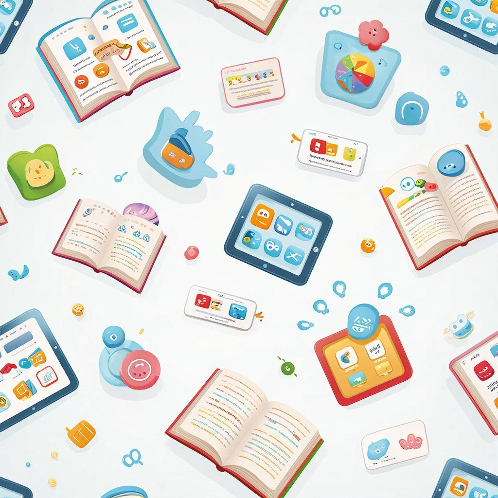

# Цифровые [инструменты](../../../1.2_natural_sciences/physics_in_everyday_life/Q36253.md) для обучения: приложения, сервисы и онлайн-ресурсы

Мы живём в цифровую эпоху. [Смартфон](../../../1.2_natural_sciences/physics_in_everyday_life/Q3198.md), планшет, компьютер — это не только [развлечения](../../../6.1_Independent_living_and_daily_living_skills/reasonable_spending/articles/want.md). Это мощные инструменты для обучения! Правильно подобранные приложения и сервисы могут превратить ваше [устройство](../../../1.2_natural_sciences/physics_in_everyday_life/Q178032.md) в персонального репетитора, библиотеку и организатора в одном флаконе.

---

## Зачем нужны цифровые инструменты?

Цифровые инструменты — это программы, приложения и онлайн-сервисы, которые помогают учиться эффективнее.

**Что они дают:**
- 📚 Доступ к знаниям 24/7
- 🎯 [Персонализация](../../../4.2_thinking_and_working_information/how_to_search_information/articles/buble_filter.md) под ваш [уровень](../../../../8.1_entertainment/articles/gamification.md)
- ⚡ Мгновенная [обратная связь](../../../8.1_self-understanding/HowToFindYourStrengths/articles/objective_view.md)
- 🎮 [Геймификация](gamification.md) и [интерес](../../../1.2_natural_sciences/neurobiology_for_teens/articles/19_curiosity.md)
- 📊 [Отслеживание прогресса](../../../6.2_money_and_literacy/how_to_save_for_goal/articles/planning.md)
- 🤝 [Сообщество](../../../2.1_society/how_and_where_find_friends/articles/druzhba_s_sosedyami.md) для помощи

**[Факт](../../../1.2_natural_sciences/why_science_help_understand_world/science.md):** Исследования показывают, что студенты, использующие образовательные приложения, учатся на **20-30% эффективнее**.

---

## Категории инструментов

### 1. Языковые приложения

**Duolingo** 🦉
- **Что:** [Изучение](../../../1.2_natural_sciences/why_science_help_understand_world/science.md) языков через игру
- **Как:** Уроки по 5-10 минут, жизни, уровни, лиги
- **Плюсы:** Бесплатно, геймификация, много языков
- **Минусы:** Поверхностно для продвинутых
- **Для кого:** Начальный и средний уровень

**Busuu**
- **Что:** Языки с носителями
- **Как:** Уроки + [проверка](../../../1.2_natural_sciences/why_science_help_understand_world/scientific_method.md) носителями языка
- **Плюсы:** Живая обратная связь, сертификаты
- **Минусы:** Платно для полного доступа
- **Для кого:** Все уровни

**Quizlet**
- **Что:** Карточки для запоминания слов
- **Как:** Создаёте карточки, учите в разных режимах
- **Плюсы:** Бесплатно, свои наборы, режимы игры
- **Минусы:** Нужно создавать самому
- **Для кого:** Все, кто учит слова

---

### 2. [Математика](../../../1.2_natural_sciences/physics_in_everyday_life/Q140028.md) и точные науки

**Khan Academy** 📐
- **Что:** Бесплатные видеоуроки по всем предметам
- **Как:** Смотрите [видео](../../../5.1_technology_and_digital_literacy/information and media literacy/оценка_качества_изображений_и_видео.md), решаете [задачи](../../../1.2_natural_sciences/why_science_help_understand_world/research_work.md), получаете бейджи
- **Плюсы:** Полностью бесплатно, всё от 1 до 11 класса
- **Минусы:** На английском (есть русские субтитры)
- **Для кого:** Все уровни

**Photomath** 📱
- **Что:** Решает примеры по [фото](../../../5.1_technology_and_digital_literacy/information and media literacy/проверка_фото_на_манипуляции.md)
- **Как:** Фотографируете пример → получаете [решение](../../../2.1_society/cause_and_effect_relationships/articles/personal_choice.md) с объяснением
- **Плюсы:** Мгновенное решение, пошаговые объяснения
- **Минусы:** Можно злоупотреблять, не думая
- **Для кого:** Проверка домашних заданий

**GeoGebra** 📊
- **Что:** [Геометрия](../../../1.2_natural_sciences/physics_in_everyday_life/Q34442.md), алгебра, графики
- **Как:** Строите графики, фигуры, экспериментируете
- **Плюсы:** [Визуализация](../../how_to_memorize/articles/vizualizaciya.md), интерактивность, бесплатно
- **Минусы:** Нужно разобраться в интерфейсе
- **Для кого:** 7-11 класс, студенты

**Wolfram Alpha** 🧮
- **Что:** Вычислительный движок
- **Как:** Вводите задачу → получаете решение и графики
- **Плюсы:** Решает всё: от арифметики до квантовой [физики](../../../1.2_natural_sciences/physics_in_everyday_life/Q172280.md)
- **Минусы:** Платно для подробных решений
- **Для кого:** Старшеклассники, студенты

---

### 3. [Конспектирование](reading_skills.md) и [организация](learning_environment.md)

**[Notion](../../../4.2_thinking_and_working_information/how_to_search_information/articles/second_mind.md)** 📝
- **Что:** Универсальное [рабочее пространство](../../../1.2_natural_sciences/physics_in_everyday_life/Q628858.md)
- **Как:** Создаёте [страницы](../../../5.1_technology_and_digital_literacy/operating system/articles/memory_management.md), базы знаний, трекеры
- **Плюсы:** Гибкость, шаблоны, синхронизация
- **Минусы:** Сложно для новичков
- **Для кого:** Все, кто хочет систему

**Evernote** 🐘
- **Что:** [Заметки](../../how_to_memorize/articles/konspektirovanie.md) и организация
- **Как:** Пишете, сохраняете веб-страницы, ищете по тексту
- **Плюсы:** [Поиск](../../../3.2 healthy lifestyle/how to act in a dangerous situation/articles/lost-in-city.md) по тексту в картинках, синхронизация
- **Минусы:** Бесплатная версия ограничена
- **Для кого:** Все уровни

**OneNote** 📓
- **Что:** Цифровая тетрадь от Microsoft
- **Как:** Создаёте «блокноты» по предметам, пишете, рисуете
- **Плюсы:** Бесплатно, интеграция с Office, рукописный ввод
- **Минусы:** Лучше работает на [Windows](../../../5.1_technology_and_digital_literacy/operating system/articles/operating_system.md)
- **Для кого:** Школьники, студенты

**Google Keep** 💡
- **Что:** Быстрые заметки и напоминания
- **Как:** Цветные стикеры, списки, голосовые заметки
- **Плюсы:** Просто, быстро, бесплатно
- **Минусы:** Мало функций для сложных проектов
- **Для кого:** Быстрые заметки, списки дел

---

### 4. Онлайн-курсы и платформы

**Coursera** 🎓
- **Что:** [Курсы](../../../2.1_society/how_and_where_find_friends/articles/skill_miks.md) от ведущих университетов
- **Как:** Смотрите лекции, делаете задания, получаете [сертификат](../../../5.1_technology_and_digital_literacy/how_internet_works/articles/http_https/http_https.md)
- **Плюсы:** Престижные университеты, качественные [материалы](../../../1.2_natural_sciences/physics_in_everyday_life/Q487005.md)
- **Минусы:** Платно для сертификата
- **Для кого:** Старшеклассники, студенты, взрослые

**Stepik** 📖
- **Что:** Российская [платформа](../../../5.1_technology_and_digital_literacy/information and media literacy/как_работают_новостные_ленты.md) курсов
- **Как:** Интерактивные уроки с автопроверкой
- **Плюсы:** Много бесплатных курсов, на русском
- **Минусы:** Разное [качество](../../../6.1_Independent_living_and_daily_living_skills/reasonable_spending/articles/quality.md) курсов
- **Для кого:** Все уровни, особенно [IT](../../../8.2_future/choosing_a_career_path/articles/programmer.md)

**YouTube Edu** 📺
- **Что:** Образовательные каналы
- **Как:** Смотрите видео по темам
- **Плюсы:** Бесплатно, огромный [выбор](../../../2.1_society/cause_and_effect_relationships/articles/personal_choice.md)
- **Минусы:** Нужно искать качественные каналы
- **Для кого:** Все

**Популярные каналы:**
- Khan Academy ([русский](../../../7.1_art/musical_instruments/articles/balalaika.md))
- GetAClass — [физика](../../../1.2_natural_sciences/physics_in_everyday_life/Q11023.md), математика
- Toples — [наука](../../../1.2_natural_sciences/physics_in_everyday_life/Q238323.md) популярно
- ПостНаука — лекции учёных
- Science 2.0 — эксперименты

---

### 5. Карточки и [запоминание](../../../1.2_natural_sciences/neurobiology_for_teens/articles/21_how_memory_works.md)

**Anki** 🃏
- **Что:** [Интервальное повторение](../../../1.2_natural_sciences/neurobiology_for_teens/articles/24_forgetting_curve.md)
- **Как:** Создаёте карточки, приложение показывает в оптимальное [время](../../../1.2_natural_sciences/physics_in_everyday_life/Q20702.md)
- **Плюсы:** Научно обоснованный [метод](../../../5.1_technology_and_digital_literacy/how_internet_works/articles/http_https/http_https.md), бесплатно
- **Минусы:** Нужно создавать карточки самому
- **Для кого:** Все, кто учит большие объёмы

**Memrise** 🌱
- **Что:** Карточки с мнемотехниками
- **Как:** Учитесь с помощью мемов и ассоциаций
- **Плюсы:** Запоминание через [ассоциации](../../../1.2_natural_sciences/neurobiology_for_teens/articles/18_music_chills.md), весело
- **Минусы:** Меньше языков, чем в Duolingo
- **Для кого:** Изучение языков, терминов

---

### 6. [Тайм-менеджмент](../../../3.1. healthy lifestyle/Sleep, nutrition, and adolescent energy/articles/ideal_schedule_energy_management.md) и [фокус](../../../1.2_natural_sciences/physics_in_everyday_life/Q35197.md)

**Forest** 🌲
- **Что:** Таймер + выращивание деревьев
- **Как:** Ставите таймер → растёт [дерево](../../../1.2_natural_sciences/physics_in_everyday_life/Q487005.md). Берёте телефон → дерево погибает
- **Плюсы:** Геймификация фокуса, визуально приятно
- **Минусы:** Платно для всех функций
- **Для кого:** Все, кто отвлекается на телефон

**Todoist** ✅
- **Что:** Менеджер задач
- **Как:** Создаёте задачи, проекты, повторяющиеся дела
- **Плюсы:** Просто, кроссплатформенно, интеграции
- **Минусы:** Продвинутые функции платные
- **Для кого:** Все уровни

**Trello** 📋
- **Что:** Канбан-доски для проектов
- **Как:** Карточки по колонкам (Нужно/В процессе/Готово)
- **Плюсы:** Визуально, удобно для проектов
- **Минусы:** Избыточно для простых списков
- **Для кого:** Проектная [работа](../../../1.2_natural_sciences/physics_in_everyday_life/Q11382.md), групповые задачи

**Focus To-Do** ⏱️
- **Что:** Помодоро + задачи
- **Как:** Таймер 25 минут + [список](../../../5.2_cybersecurity/cpp_fundamentals/10_arrays.md) дел
- **Плюсы:** Всё в одном, [статистика](../../../4.2_thinking_and_working_information/critical_thinking/articles/data_and_statistics.md)
- **Минусы:** Много рекламы в бесплатной версии
- **Для кого:** Любители метода Помодоро

---

### 7. Библиотеки и [поиск информации](../../../1.2_natural_sciences/neurobiology_for_teens/articles/19_curiosity.md)

**[Google Scholar](../../../4.2_thinking_and_working_information/how_to_search_information/articles/science.md)** 📚
- **Что:** Поиск научных статей
- **Как:** Ищете по темам, находите исследования
- **Плюсы:** Научные [источники](../../../4.2_thinking_and_working_information/how_to_search_information/articles/three_whales.md), бесплатно
- **Минусы:** Сложно для школьников
- **Для кого:** Старшеклассники, студенты

**Arzamas** 🏛️
- **Что:** [Культура](../../../2.1_society/cause_and_effect_relationships/articles/why_rules_work.md) и [история](../../../1.2_natural_sciences/physics_in_everyday_life/Q11469.md)
- **Как:** Курсы, статьи, подкасты по гуманитарным наукам
- **Плюсы:** Качественный [контент](../../../5.1_technology_and_digital_literacy/information and media literacy/информационная_диета.md), на русском
- **Минусы:** Мало точных наук
- **Для кого:** Гуманитарии

**Лекториум** 🎤
- **Что:** Видеолекции российских преподавателей
- **Как:** Смотрите лекции по предметам
- **Плюсы:** На русском, школьная [программа](../../../5.1_technology_and_digital_literacy/operating system/articles/process.md)
- **Минусы:** Меньше интерактива
- **Для кого:** 5-11 класс

---

## Как выбрать инструменты?

### [Критерии выбора](../../../6.1_Independent_living_and_daily_living_skills/reasonable_spending/articles/comparison.md):

| Критерий | [Вопросы](curiosity.md) |
|----------|---------|
| **[Цель](../../../1.2_natural_sciences/why_science_help_understand_world/research_work.md)** | Что я [хочу](../../../6.1_Independent_living_and_daily_living_skills/reasonable_spending/articles/want.md) улучшить? ([язык](../../../5.2_cybersecurity/cpp_fundamentals/1_introduction.md), математика, организация) |
| **Уровень** | Подходит ли для моего уровня? |
| **Время** | Сколько времени готов тратить? |
| **[Бюджет](../../../6.1_Independent_living_and_daily_living_skills/reasonable_spending/articles/budget.md)** | Бесплатно или готов платить? |
| **Устройство** | Телефон, планшет, компьютер? |
| **Отзывы** | Что говорят другие пользователи? |

---

## [Правила](../../../2.1_society/cause_and_effect_relationships/articles/why_rules_work.md) использования

### ✅ Делайте:

1. **Начните с 1-2 приложений** — не скачивайте всё сразу
2. **Используйте регулярно** — лучше 10 минут каждый день, чем 2 часа раз в неделю
3. **Сочетайте с традиционным обучением** — приложения дополняют, не заменяют
4. **Отслеживайте [прогресс](../../../2.1_society/cause_and_effect_relationships/articles/lessons_of_history.md)** — смотрите статистику в приложениях
5. **Делитесь с друзьями** — соревнуйтесь, помогайте друг другу

---

### ❌ Не делайте:

| [Ошибка](../../../5.1_technology_and_digital_literacy/how_internet_works/articles/http_https/http_https.md) | Почему это плохо | Как исправить |
|--------|------------------|---------------|
| **Пассивное [потребление](../../../2.1_society/cause_and_effect_relationships/articles/ecological_footprint.md)** | Просто смотрите, не делаете | Делайте упражнения после видео |
| **Мультизадачность** | Учитесь + [соцсети](../../../2.1_society/how_and_where_find_friends/articles/tcifrovaya_druzhba.md) | Выключите [уведомления](../../../4.2_thinking_and_working_information/how_to_search_information/articles/information_hygiene.md) |
| **[Зависимость](../../../3.1. healthy lifestyle/Sleep, nutrition, and adolescent energy/articles/the_energy_trap.md) от решений** | Photomath решает за вас | Сначала пробуйте сами, потом проверяйте |
| **[Перегрузка](../../../5.1_technology_and_digital_literacy/information and media literacy/информационная_диета.md)** | 10 приложений сразу | Выберите 2-3 ключевых |
| **[Ожидание](../../../1.2_natural_sciences/neurobiology_for_teens/articles/16_love_chemistry.md) чуда** | «Приложение само научит» | Приложения — инструмент, а не волшебство |

---

## [Цифровая гигиена](../../../3.1. healthy lifestyle/Sleep, nutrition, and adolescent energy/articles/gadgets_blue_light_sleep.md)

### [Защита](../../../5.1_technology_and_digital_literacy/how_internet_works/articles/dns/cdn.md) зрения:

- **[Правило](../../../1.2_natural_sciences/why_science_help_understand_world/patterns.md) 20-20-20:** Каждые 20 минут смотрите на 20 футов (6 метров) в течение [20 секунд](../../../6.1_Independent_living_and_daily_living_skills/Simple_and_safe_cooking/articles/hand_hygiene.md)
- **Яркость экрана** = яркость окружения
- **[Расстояние](../../../1.2_natural_sciences/physics_in_everyday_life/Q11412.md)** до экрана: 50-70 см
- **Ночной [режим](breaks_and_rest.md)** вечером ([фильтр](../../../3.1_healthy lifestyle/vrednye_privychki/articles/Social_media.md) синего)

---

### [Цифровой детокс](../../../3.1_healthy lifestyle/vrednye_privychki/articles/Social_media.md):

- **[Часы](../../../1.2_natural_sciences/physics_in_everyday_life/Q20702.md) без экрана** перед сном ([минимум](../../../1.2_natural_sciences/physics_in_everyday_life/Q136980.md) 1 час)
- **Дни без соцсетей** (например, воскресенье)
- **Уведомления off** во время учёбы
- **[Физическая активность](../../../3.1. healthy lifestyle/Sleep, nutrition, and adolescent energy/articles/sport_and_energy.md)** вместо экрана в перерывах

---

## [Связь](../../../1.2_natural_sciences/physics_in_everyday_life/Q12969754.md) с другими понятиями

Цифровые инструменты связаны с:
- [Тайм-менеджментом](time_management.md) — приложения для планирования
- [Геймификацией](gamification.md) — игровые элементы в приложениях
- [Навыками чтения](reading_skills.md) — [чтение](reading_skills.md) с экрана
- [Самоанализом](self_reflection.md) — статистика прогресса

---

## Практические упражнения

### Упражнение 1: «[Цифровой](../../../7.1_art/musical_instruments/articles/synthesizer.md) аудит»

1. Выпишите все приложения на телефоне/планшете
2. Разделите на: «Для учёбы», «Для развлечений», «Неясно»
3. Удалите 3 приложения из категории «Неясно»
4. Установите 1-2 учебных приложения из этой статьи

---

### Упражнение 2: «Неделя с новым инструментом»

1. Выберите одно приложение из статьи
2. Используйте его 7 дней подряд
3. В конце недели запишите:
   - Что понравилось?
   - Что помогло?
   - Что изменить?

---

### Упражнение 3: «Цифровая библиотека»

Создайте свою коллекцию ресурсов:
- 3 сайта для [поиска информации](../../../../4.2/how_to_search_information/articles/information_search.md)
- 2 приложения для конспектирования
- 1 приложение для запоминания
- 1 приложение для планирования

---

## Интересные [факты](../../../1.2_natural_sciences/physics_in_everyday_life/Q17737.md)

1. **Duolingo** имеет более [500](../../../5.1_technology_and_digital_literacy/how_internet_works/articles/http_https/http_https.md) миллионов пользователей по всему миру. Это больше, чем население всей Европы!

2. [Исследование](../../../1.2_natural_sciences/neurobiology_for_teens/articles/19_curiosity.md) **Google**: студенты, которые используют цифровые инструменты для организации, тратят на **7 часов меньше в неделю** на поиск материалов.

3. **Khan Academy** начался с одного видео на YouTube в 2006 году. Сейчас это крупнейшая бесплатная образовательная платформа в мире.

4. В Эстонии **99% школьников** используют цифровые платформы для обучения. Страна занимает первые места в мире по качеству образования.

---

## См. также

- [Тайм-менеджмент](time_management.md)
- [Геймификация](gamification.md)
- [Навыки чтения](reading_skills.md)
- [Конспектирование](./konspektirovanie.md)
- [Самоанализ](self_reflection.md)

---

Помните: цифровые инструменты — это не замена учителю или учебнику. Это **усилители** ваших способностей. Как молоток не построит дом сам, но в руках мастера создаёт шедевры.

**Ваш челлендж:** Выберите одно приложение из статьи и начните использовать его сегодня. Через месяц оцените [результат](../../../1.2_natural_sciences/why_science_help_understand_world/experimental_science.md)!

---
Авторы: Лизунов Кирилл;  
[Ресурсы](../../../2.1_society/cause_and_effect_relationships/articles/ecological_footprint.md): [LLM](../../../7.1_art/modern_technological_art/README.md) - GigaChat, Wikidata Q581684
