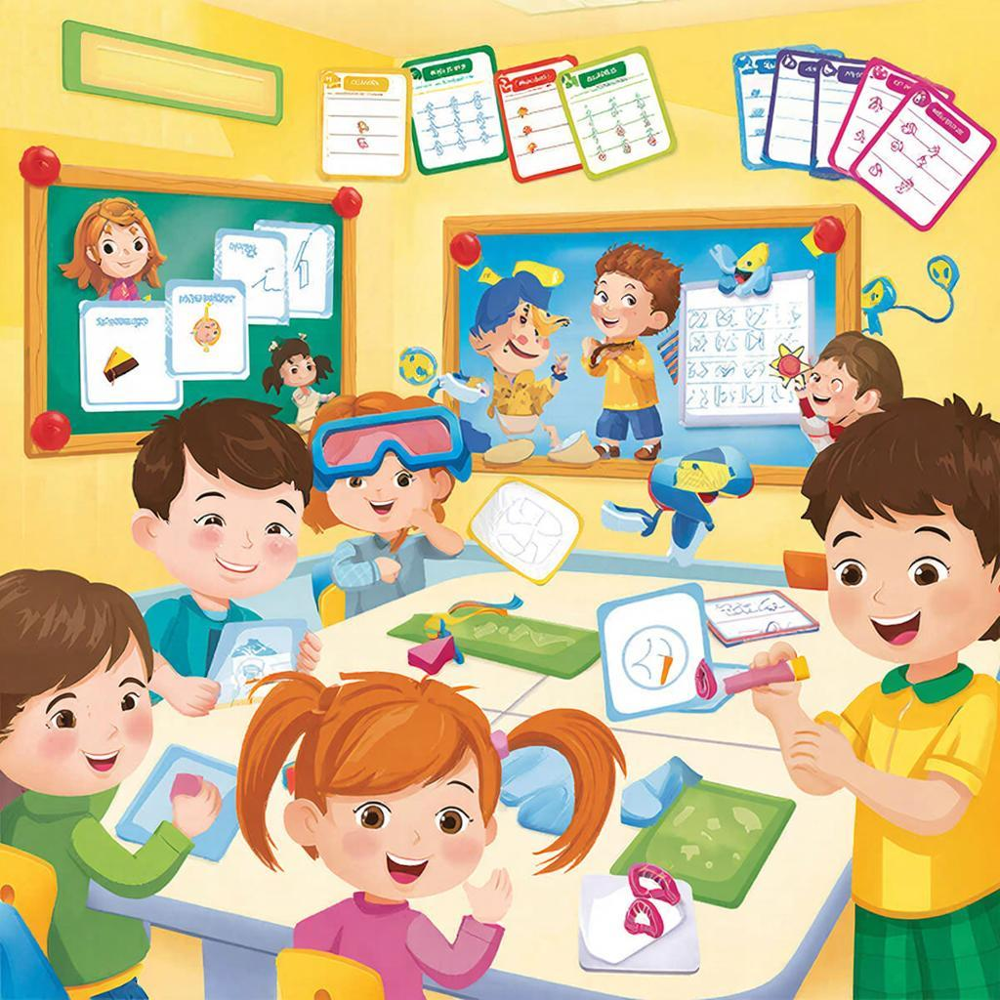

# Геймификация обучения: как превратить учёбу в увлекательную игру



Представьте: вы не «учитесь», а «проходите [уровень](../../../../8.1_entertainment/articles/gamification.md)». Не «делаете домашку», а «выполняете [квест](../../../7.2 Media, leisure and hobbies/Computer games/articles/dream_team/screenwriter.md)». Не «готовитесь к контрольной», а «сражаетесь с боссом». Это и есть **геймификация** — использование игровых механик в обучении. И это работает удивительно эффективно!

---

## Что такое геймификация?

**Геймификация** (от англ. *game* — игра) — это применение игровых элементов в неигровых процессах, например, в учёбе.

**Игровые элементы:**
- 🏆 [Очки](../../../1.2_natural_sciences/physics_in_everyday_life/Q14620.md) и баллы
- 🥇 Уровни и ранги
- 🏅 Достижения и награды
- 📊 Прогресс-бары
- 👥 Аватары и [персонажи](../../../7.2 Media, leisure and hobbies/Computer games/articles/dream_team/screenwriter.md)
- ⚔️ Соревнования и рейтинги
- 🎯 [Квесты](../../../7.2 Media, leisure and hobbies/Computer games/articles/useful_tips/educational_games.md) и миссии

---

## Почему игры так затягивают?

Игры созданы так, чтобы удерживать [внимание](../../../1.2_natural_sciences/neurobiology_for_teens/articles/16_love_chemistry.md). Вот их секреты:

### 1. Чёткая [цель](../../../1.2_natural_sciences/why_science_help_understand_world/research_work.md)
В игре всегда ясно: «Спаси принцессу», «Построй [город](../../../3.2 healthy lifestyle/how to act in a dangerous situation/articles/lost-in-city.md)», «Пройди уровень». В учёбе [цели](../../../3.1_healthy_lifestyle/pervaya_pomoshch/ushibi_porezy_ozhogi/02_celi_pervoy_pomoshchi.md) часто размыты: «Выучи параграф».

**Геймификация:** «Собери 5 звёзд за [чтение](reading_skills.md) параграфа»

---

### 2. Мгновенная [обратная связь](../../../8.1_self-understanding/HowToFindYourStrengths/articles/objective_view.md)
В игре сразу видно: попал — +10 очков, промахнулся — минус [жизнь](../../../1.2_natural_sciences/physics_in_everyday_life/Q1751973.md). В учёбе обратная связь запаздывает: контрольная через неделю.

**Геймификация:** Тесты с мгновенным результатом, прогресс-бары

---

### 3. [Прогресс](../../../2.1_society/cause_and_effect_relationships/articles/lessons_of_history.md) виден
В играх всегда есть [шкала](../../../1.2_natural_sciences/physics_in_everyday_life/Q11223329.md) опыта: 750/1000 XP. Видно, сколько осталось до уровня. В учёбе прогресс часто неочевиден.

**Геймификация:** Визуальные трекеры, карты прогресса

---

### 4. Награды
Игры дают награды постоянно: [монеты](../../../6.1_Independent_living_and_daily_living_skills/reasonable_spending/articles/cash.md), предметы, открытия. В учёбе награды редки: пятерка в четверти.

**Геймификация:** Бейджи, значки, бонусы за каждое [достижение](../../../6.1_Independent_living_and_daily_living_skills/reasonable_spending/articles/financial_goal.md)

---

### 5. [Право](../../../5.1_technology_and_digital_literacy/information and media literacy/авторское_право_и_честное_использование.md) на ошибку
В игре можно погибнуть и возродиться. [Ошибка](../../../5.1_technology_and_digital_literacy/how_internet_works/articles/http_https/http_https.md) — часть процесса. В учёбе ошибка часто = плохая [оценка](self_reflection.md).

**Геймификация:** «Попытки» вместо «оценок», можно пробовать снова

---

## Элементы геймификации для учёбы

### 1. Система очков

Превратите задания в квесты с баллами:

| Задание | Баллы |
|---------|-------|
| Сделать домашку | 10 XP |
| Получить пятёрку | 25 XP |
| Прочитать главу | 15 XP |
| Объяснить другу | 20 XP |
| Без ошибок в тесте | 30 XP |

Накопленные баллы = уровни и награды!

---

### 2. Уровни и прогресс

Создайте систему уровней:

- 🟢 Уровень 1: Новичок (0-100 XP)
- 🔵 Уровень 2: Ученик (101-300 XP)
- 🟣 Уровень 3: Знаток (301-600 XP)
- 🟡 Уровень 4: Мастер (601-1000 XP)
- 🟠 Уровень 5: [Эксперт](../../../../8.1_self_understanding/articles/types_of_impostor_syndrome.md) (1001+ XP)

Каждый уровень — новые привилегии!

---

### 3. Достижения (ачивки)

Создайте коллекцию достижений:

🏆 **«Первая кровь»** — первая пятёрка по предмету  
🏆 **«Книжный червь»** — прочитать 10 книг  
🏆 **«Марафонец»** — учиться без перерыва 2 часа  
🏆 **«[Наставник](../../../../8.1_self_understanding/articles/mentorship.md)»** — помочь 5 одноклассникам  
🏆 **«Феникс»** — исправить двойку на пятёрку  
🏆 **«Полиглот»** — выучить 100 иностранных слов  

---

### 4. Прогресс-бары

Визуализируйте прогресс:

```
Глава 1: ████████████░░░░ 75%
Глава 2: ██████░░░░░░░░░░ 40%
Глава 3: ███░░░░░░░░░░░░░ 20%
```

[Мозг](../../../3.1. healthy lifestyle/Sleep, nutrition, and adolescent energy/articles/breakfast_for_the_brain.md) любит видеть прогресс!

---

### 5. Рейтинги и соревнования

Создайте таблицу лидеров (с друзьями или одноклассниками):

| Место | Имя | XP |
|-------|-----|-----|
| 🥇 | Анна | 1250 |
| 🥈 | Борис | 1180 |
| 🥉 | Виктория | 1050 |
| 4 | Григорий | 980 |

**Важно:** [Соревнование](../../../7.2 Media, leisure and hobbies/Computer games/articles/genres_and_worlds/racing_fighting_sports.md) должно быть здоровым, не токсичным!

---

## Как внедрить геймификацию?

### Для себя лично

**1. Создайте персонажа**
Придумайте [аватар](../../../7.2 Media, leisure and hobbies/Computer games/articles/heroes_and_villains/create_your_hero.md), который будет «вами» в учебном квесте. Нарисуйте его или выберите картинку.

**2. Определите квесты**
Каждое учебное задание — квест:
- «Победить дракона Домашки»
- «Найти сокровище Знаний в библиотеке»
- «Разгадать загадку Контрольной»

**3. Настройте награды**
Определили уровень? Наградите себя:
- [Время](../../../1.2_natural_sciences/physics_in_everyday_life/Q20702.md) в любимой игре
- Вкусняшка
- Серия любимого сериала
- Новая вещь (в рамках бюджета)

---

### Для класса или группы

**1. Общая система баллов**
Учитель раздаёт баллы за:
- Активность на уроке
- [Помощь](../../../3.1_healthy_lifestyle/pervaya_pomoshch/ushibi_porezy_ozhogi/10_krovotechenie_chto_delat.md) одноклассникам
- Творческие проекты
- [Улучшение](learning_from_mistakes.md) результатов

**2. Классные достижения**
- «Самый [внимательный](../../how_to_memorize/articles/vnimanie.md)» — кто нашёл больше всех ошибок в тесте
- «Генератор идей» — кто предложил лучшее [решение](../../../2.1_society/cause_and_effect_relationships/articles/personal_choice.md)
- «Командный игрок» — кто помог большинству одноклассников

**3. Сезонные ивенты**
- «Неделя математики» — двойные баллы за [задачи](../../../1.2_natural_sciences/why_science_help_understand_world/research_work.md)
- «Читай-месяц» — бонусы за прочитанные [книги](../../../7.2 Media, leisure and hobbies /useful_and_interesting_leisure/articles/reading_and_self_education.md)
- «Научный бум» — награды за эксперименты

---

## Готовые [приложения](digital_tools.md) с геймификацией

### Duolingo 🦉
[Изучение](../../../1.2_natural_sciences/why_science_help_understand_world/science.md) языков через игру:
- Жизни за [ошибки](../../../3.1_healthy_lifestyle/pervaya_pomoshch/ushibi_porezy_ozhogi/07_ushib_chego_nelzya.md)
- Серии дней (streak)
- Лиги и рейтинги
- [Опыт](../../../1.2_natural_sciences/why_science_help_understand_world/experimental_science.md) и уровни

### Habitica 🎮
Трекер привычек в стиле [RPG](../../../7.2 Media, leisure and hobbies/Computer games/articles/heroes_and_villains/create_your_hero.md):
- [Персонаж](../../../7.2 Media, leisure and hobbies/Computer games/articles/game_culture/cosplay.md) = вы
- Задания = квесты
- Невыполнение = [потеря](../../../1.2_natural_sciences/neurobiology_for_teens/articles/20_sadness.md) здоровья
- Награды = золото и предметы

### ClassDojo 👾
Для классов:
- Аватары-монстрики
- Баллы за [поведение](../../../1.2_natural_sciences/neurobiology_for_teens/articles/06_phineas_gage.md) и успехи
- Рейтинги
- Награды для всего класса

---

## Геймификация без приложений

Не обязательно скачивать приложения. Можно использовать бумагу и [творчество](../../../2.1_society/how_and_where_find_friends/articles/sam_sebe_interesnyi.md)!

### 1. Трекер на стене

Нарисуйте большую карту-бродилку. Каждый изученный_topic — [клетка](../../../1.2_natural_sciences/physics_in_everyday_life/Q40260.md) вперёд. Дошёл до конца — получил приз!

### 2. [Карта](../../../5.1_technology_and_digital_literacy/information and media literacy/карта_компетенций_по_возрастам.md) сокровищ

Спрячьте «сокровище» (приз) в конце учебной темы. Каждая выполненная задача — подсказка, где искать дальше.

### 3. Босс-файт

Контрольная = сражение с боссом. Подготовьтесь:
- Соберите «оружие» (конспекты)
- Выучите «заклинания» (формулы)
- Наденьте «броню» (выспитесь)

[Победа](../../../7.2 Media, leisure and hobbies/Computer games/articles/genres_and_worlds/racing_fighting_sports.md) = бонусы!

---

## [Психология](../../../2.1_society/cause_and_effect_relationships/articles/empathy_causality.md) геймификации: почему это работает?

### [Дофаминовая петля](../../../3.1_healthy lifestyle/vrednye_privychki/articles/Dopamine.md)

Когда вы получаете награду (баллы, бейдж, уровень), мозг выделяет **[дофамин](../../../1.2_natural_sciences/neurobiology_for_teens/articles/10_sweet_tooth.md)** — гормон удовольствия. Хочется ещё!

**Петля:**
Задание → Выполнение → [Награда](../../../1.2_natural_sciences/neurobiology_for_teens/articles/11_reward_system.md) → Дофамин → [Мотивация](../../../1.2_natural_sciences/neurobiology_for_teens/articles/11_reward_system.md) → Новое задание

---

### Состояние потока

Игры вводят в **[поток](../../../5.1_technology_and_digital_literacy/operating system/articles/thread.md)** — состояние полной поглощённости. В потоке:
- Время летит незаметно
- [Сосредоточенность](../../how_to_memorize/articles/koncentraciya.md) максимальна
- [Усталость](../../../3.1. healthy lifestyle/Sleep, nutrition, and adolescent energy/articles/sugar_rollercoaster.md) не чувствуется

Геймификация помогает войти в поток при учёбе!

---

## Частые ошибки геймификации

| Ошибка | Почему это плохо | Как исправить |
|--------|------------------|---------------|
| Слишком сложно | Отпугивает новичков | Начните с простых механик |
| Награды не ценны | Не мотивируют | Спросите: «Что реально хочется?» |
| Только соревнование | Демотивирует отстающих | Добавьте личные достижения |
| Нет прогресса | Непонятно, как идёт | Визуализируйте прогресс |
| Однообразие | Надоедает | Меняйте квесты и награды |

---

## [Связь](../../../1.2_natural_sciences/physics_in_everyday_life/Q12969754.md) с другими понятиями

Геймификация связана с:
- [Мотивацией](./motivaciya.md) — внешняя и внутренняя мотивация через игру
- [Целями обучения](learning_goals.md) — квесты = маленькие цели
- [Мышлением роста](growth_mindset.md) — ошибки = потеря жизней, можно возродиться
- [Перерывами и отдыхом](breaks_and_rest.md) — игра = [отдых](../../../3.1. healthy lifestyle/Sleep, nutrition, and adolescent energy/articles/evening_rituals_sleep_fast.md)

---

## Практические упражнения

### Упражнение 1: «Создай своего героя»

Нарисуйте или опишите своего учебного персонажа:
- Имя
- Класс (воин знаний, маг наук, плут эрудиции)
- Стартовые [характеристики](../../../6.1_Independent_living_and_daily_living_skills/reasonable_spending/articles/comparison.md) ([интеллект](../../../2.1_society/cause_and_effect_relationships/articles/critical_thinking_in_education.md), [воля](../../../2.1_society/cause_and_effect_relationships/articles/personal_choice.md), удача)
- Цель квеста

---

### Упражнение 2: «Неделя квестов»

Превратите учебную неделю в RPG:
- [Понедельник](../../../3.1. healthy lifestyle/Sleep, nutrition, and adolescent energy/articles/social_jetlag_and_monday_morning.md): «Победить дракона Математики»
- Вторник: «Исследовать пещеру Истории»
- [Среда](../../../1.2_natural_sciences/physics_in_everyday_life/Q124003.md): «Разгадать загадку [Физики](../../../1.2_natural_sciences/physics_in_everyday_life/Q172280.md)»
- И так далее...

Запишите, сколько XP набрали!

---

### Упражнение 3: «Коллекция ачивок»

Придумайте 10 личных достижений и нарисуйте значки для каждого. Отмечайте выполнение!

---

## Интересные [факты](../../../1.2_natural_sciences/physics_in_everyday_life/Q17737.md)

1. **Duolingo** имеет [500](../../../5.1_technology_and_digital_literacy/how_internet_works/articles/http_https/http_https.md)+ миллионов пользователей. Люди проходят тысячи уроков добровольно — потому что это игра!

2. [Исследование](../../../1.2_natural_sciences/neurobiology_for_teens/articles/19_curiosity.md) University of Colorado: геймифицированное [обучение](../../../3.1. healthy lifestyle/Sleep, nutrition, and adolescent energy/articles/sleep_and_memory_grades.md) повышает [результаты](../../../1.2_natural_sciences/why_science_help_understand_world/research_work.md) тестов на **14%** и [вовлечённость](../../../4.2_thinking_and_working_information/critical_thinking/articles/information_bubbles.md) на **40%**.

3. **[World of Warcraft](../../../5.1_technology_and_digital_literacy/how_internet_works/articles/tcp_udp/online_games.md)** использовалась для изучения лидерских навыков. Менеджеры проходили рейды и становились лучшими руководителями!

4. В Южной Корее есть [школа](../../../3.1. healthy lifestyle/Sleep, nutrition, and adolescent energy/articles/healthy_school_snacks.md), где вся система оценок заменена на уровни и достижения. [Успеваемость](../../../3.1. healthy lifestyle/Sleep, nutrition, and adolescent energy/articles/sleep_and_memory_grades.md) выросла на **25%**.

---

## См. также

- [Мотивация](./motivaciya.md)
- [Цели обучения](learning_goals.md)
- [Мышление роста](growth_mindset.md)
- [Перерывы и отдых](breaks_and_rest.md)
- [Геймификация](https://ru.wikipedia.org/wiki/Геймификация)

---

Геймификация — это не «детский сад». Это мощный инструмент, который использует естественную [любовь](../../../1.2_natural_sciences/neurobiology_for_teens/articles/16_love_chemistry.md) человека к игре. Превратите учёбу в приключение, и вы не заметите, как втянетесь!

**Ваш первый квест:** Придумайте себе 3 учебных достижения на эту неделю и наградите себя за выполнение. Level up!

---
Авторы: Магомедов Эдуард;  
[Ресурсы](../../../2.1_society/cause_and_effect_relationships/articles/ecological_footprint.md): [LLM](../../../7.1_art/modern_technological_art/README.md) - GigaChat, Wikidata Q1699526
