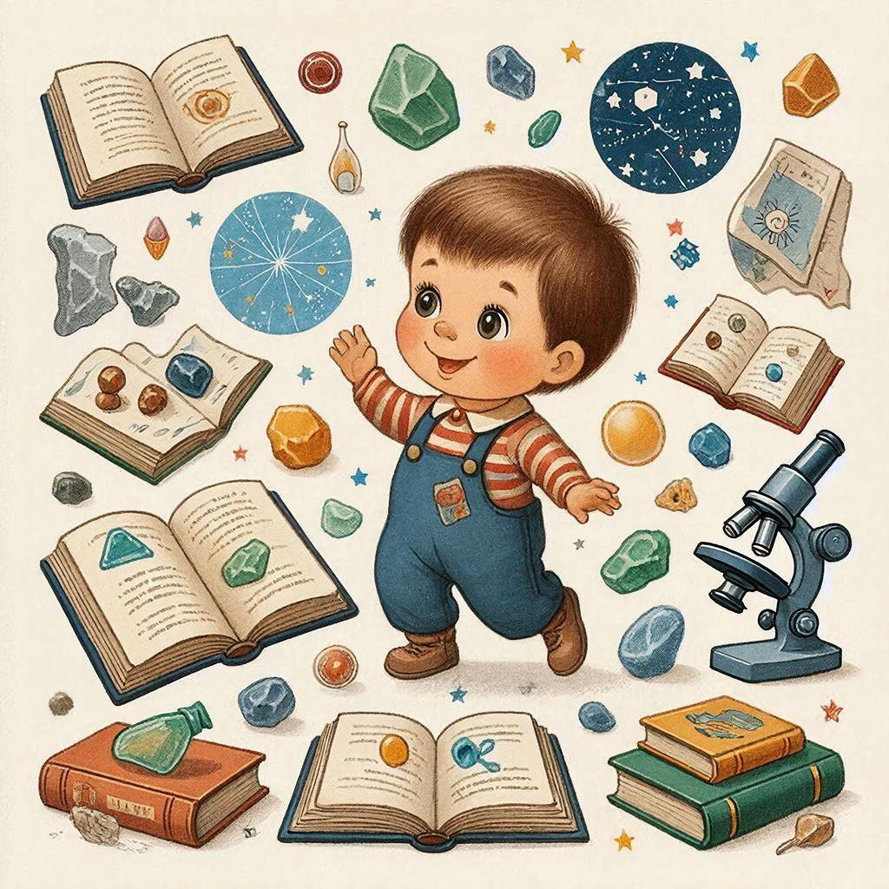

# [Мышление](../../../1.2_natural_sciences/neurobiology_for_teens/articles/01_brain_complexity.md) роста: как верить в свои способности и развиваться

Вы когда-нибудь думали: «У меня не получится», «Я не способный к математике», «Это не моё»? Эти фразы — признак **фиксированного мышления**. А вот [фраза](../../../7.2 Media, leisure and hobbies/Computer games/articles/game_culture/game_memes.md) «Я ещё не научился, но научусь» — это **мышление роста**. Именно оно помогает добиваться успеха в учёбе и жизни.

---

## Что такое мышление роста?

**Мышление роста** (growth mindset) — это вера в то, что способности и [интеллект](../../../2.1_society/cause_and_effect_relationships/articles/critical_thinking_in_education.md) можно развить через усилия, [обучение](../../../3.1. healthy lifestyle/Sleep, nutrition, and adolescent energy/articles/sleep_and_memory_grades.md) и настойчивость.

**Фиксированное мышление** — это убеждение, что способности даны от рождения и изменить их [нельзя](../../../3.1_healthy_lifestyle/pervaya_pomoshch/ushibi_porezy_ozhogi/07_ushib_chego_nelzya.md).

| Фиксированное мышление | Мышление роста |
|------------------------|----------------|
| «У меня не получается» | «Я пока не научился» |
| «Это слишком сложно» | «Это займёт больше времени» |
| «Я сделал ошибку — я неудачник» | «[Ошибка](../../../5.1_technology_and_digital_literacy/how_internet_works/articles/http_https/http_https.md) — это [урок](../../../5.1_technology_and_digital_literacy/information and media literacy/шаблон_урока_по_медиаграмотности.md)» |
| «Другие умнее меня» | «Я могу учиться у других» |
| «Нет смысла пытаться» | «Попробую другой способ» |

---

## Почему это важно?

Исследования психолога Кэрол Дуэк показали удивительные вещи:

- Ученики с мышлением роста получают **более высокие [оценки](../../../3.1. healthy lifestyle/Sleep, nutrition, and adolescent energy/articles/sleep_and_memory_grades.md)**
- Они **не боятся сложных задач**
- Быстрее **восстанавливаются после неудач**
- Получают **[удовольствие](../../../1.2_natural_sciences/neurobiology_for_teens/articles/11_reward_system.md) от процесса** обучения, а не только от результата

[Мозг](../../../3.1. healthy lifestyle/Sleep, nutrition, and adolescent energy/articles/breakfast_for_the_brain.md) — как мышца: чем больше тренируешь, тем сильнее становится!

---

## Как работает мозг?

Каждый раз, когда вы учитесь чему-то новому, в мозге образуются новые **[нейронные связи](../../../1.2_natural_sciences/neurobiology_for_teens/articles/21_how_memory_works.md)**. Чем чаще вы практикуетесь, тем крепче становятся эти связи.

**Пример:**
- Первый раз решили задачу по алгебре → слабая [связь](../../../1.2_natural_sciences/physics_in_everyday_life/Q12969754.md)
- Решили 10 таких задач → связь укрепилась
- Решили 50 задач → связь стала «автобаном»!

[!NOTE]
Мозг пластичен на протяжении всей жизни. Это называется **[нейропластичность](../../../1.2_natural_sciences/neurobiology_for_teens/articles/22_neuroplasticity.md)**. Вы можете учиться в любом возрасте!

---

## [Сила](../../../1.2_natural_sciences/physics_in_everyday_life/Q11023.md) слова «пока»

Одно маленькое слово меняет всё:

❌ «Я не понимаю физику» → мозг сдаётся  
✅ «Я **пока** не понимаю физику» → мозг ищет решения

Добавьте «пока» к своим фразам:
- «Я не умею это рисовать» → «Я пока не умею»
- «Я не знаю английский» → «Я пока не знаю»
- «Я не могу решить» → «Я пока не могу»

---

## Как развить мышление роста?

### 1. Хвалите за усилия, а не за [ум](../../../7.2 Media, leisure and hobbies/Computer games/articles/useful_tips/educational_games.md)

**Неправильно:** «Ты такой умный!»  
**Правильно:** «Я вижу, как ты старался!»

Почему? [Похвала](../../../8.1_self-understanding/HowToFindYourStrengths/articles/objective_view.md) за ум закрепляет фиксированное мышление: «Я умный, значит, должно получаться само». А если не получается? Значит, я не такой умный?

Похвала за усилия говорит: «Твои старания работают! Продолжай!»

---

### 2. Принимайте вызовы

Вместо: «Это слишком сложно, не буду»  
Скажите: «Это сложно — значит, я многому научусь!»

**Пример:**
- Друг предлагает задачу со звёздочкой
- Вы боитесь, что не получится
- Но если попробуете — узнаете новое, даже если не решите до конца

---

### 3. Не бойтесь ошибок

[Ошибки](../../../3.1_healthy_lifestyle/pervaya_pomoshch/ushibi_porezy_ozhogi/07_ushib_chego_nelzya.md) — это не [провал](../../../4.2_thinking_and_working_information/critical_thinking/articles/main_cognitive_distortions.md), а **[данные](../../../2.1_society/cause_and_effect_relationships/articles/ai_causality.md) для анализа**.

**Что делать после ошибки:**
1. Не ругать себя
2. Спросить: «Что я могу извлечь из этого?»
3. Найти, где именно ошибся
4. Попробовать другой подход

**Известный [факт](../../../1.2_natural_sciences/why_science_help_understand_world/science.md):** Томас Эдисон сделал 10 000 неудачных попыток, прежде чем изобрёл рабочую лампочку. 10 000 ошибок = 1 великое изобретение!

---

### 4. Учитесь на критике

[Критика](../../../8.1_self-understanding/HowToFindYourStrengths/articles/impostor_syndrome.md) неприятна, но полезна.

**Фиксированное мышление:** «Меня критикуют — значит, я плохой»  
**Мышление роста:** «Мне дают обратную связь — значит, хотят помочь стать лучше»

**Как реагировать на критику:**
1. Выслушать, не перебивая
2. Поблагодарить (даже если неприятно)
3. Выделить полезные замечания
4. Использовать для улучшения

---

### 5. Вдохновляйтесь чужим успехом

Вместо: «Он гений, мне никогда не стать таким»  
Скажите: «Интересно, как он этого добился? Чему я могу у него научиться?»

[Успех](../../../4.2_thinking_and_working_information/critical_thinking/articles/main_cognitive_distortions.md) других — не [угроза](../../../5.1_technology_and_digital_literacy/information and media literacy/информационная_безопасность_для_детей.md), а **[источник](../../../5.1_technology_and_digital_literacy/information and media literacy/дезинформация_и_фейки.md) вдохновения**.

---

## Примеры из жизни

### [История](../../../1.2_natural_sciences/physics_in_everyday_life/Q11469.md) №1: Два ученика и контрольная

**Саша (фиксированное мышление):**
- Получил тройку
- Подумал: «Я не способный»
- Перестал стараться
- Через месяц — двойка

**Максим (мышление роста):**
- Получил тройку
- Подумал: «Я плохо подготовился»
- Разобрал ошибки
- Стал заниматься по 30 минут в день
- Через месяц — пятёрка

---

### История №2: [Изучение](../../../1.2_natural_sciences/why_science_help_understand_world/science.md) гитары

**Лена (фиксированное):**
- Взяла гитару
- Первые [аккорды](../../../7.1_art/musical_instruments/articles/ukulele.md) не получились
- «У меня нет музыкального слуха»
- Бросила через неделю

**Катя (мышление роста):**
- Взяла гитару
- Первые аккорды не получились
- «Нужно больше тренироваться»
- Занималась по 15 минут каждый день
- Через 3 месяца играет песни

---

## Фразы-помощники

Запомните эти фразы и используйте их:

| Когда трудно | Скажите себе |
|--------------|--------------|
| Не получается | «Я пока не научился» |
| [Хочу](../../../6.1_Independent_living_and_daily_living_skills/reasonable_spending/articles/want.md) сдаться | «Ошибки — это часть пути» |
| Завидую успеху | «Я могу учиться у него» |
| Боюсь сложности | «Сложное = интересное» |
| Сравниваю себя | «Я сравниваю себя с собой вчерашним» |

---

## Практические упражнения

### Упражнение 1: Дневник роста

Каждый вечер записывайте:
1. Что я сегодня узнал нового?
2. Какую ошибку я сделал и что извлёк?
3. Что я сделаю завтра, чтобы стать лучше?

---

### Упражнение 2: «Ещё не»

В течение недели ловите себя на фразах «Я не могу» и заменяйте на «Я ещё не могу».

---

### Упражнение 3: [Анализ](../../../1.2_natural_sciences/why_science_help_understand_world/research.md) [неудачи](learning_from_mistakes.md)

Вспомните последнюю неудачу и ответьте:
- Что именно не получилось?
- Какие были причины?
- Что можно сделать иначе в следующий раз?
- Чему я научился?

---

## Связь с другими понятиями

Мышление роста связано с:
- [Мотивацией](./motivaciya.md) — вера в успех мотивирует
- [Обучением на ошибках](learning_from_mistakes.md) — ошибки как уроки
- [Самоанализом](self_reflection.md) — [рефлексия](../../../2.1_society/how_and_where_find_friends/articles/sam_sebe_interesnyi.md) помогает расти
- [Целями обучения](learning_goals.md) — [цели](../../../3.1_healthy_lifestyle/pervaya_pomoshch/ushibi_porezy_ozhogi/02_celi_pervoy_pomoshchi.md) становятся достижимыми

---

## Частые ошибки

| Ошибка | Почему это плохо | Как исправить |
|--------|------------------|---------------|
| «Мышление роста = всегда позитив» | Игнорирует реальные трудности | Признавайте трудности, но верьте в преодоление |
| «Надо просто стараться больше» | Без [стратегии](../../../../8.1_self_understanding/articles/overcoming.md) — [выгорание](../../../7.2 Media, leisure and hobbies /useful_and_interesting_leisure/articles/balance_study_rest_hobby.md) | Ищите новые подходы, а не только усилия |
| «Я уже изменил мышление» | Мышление — это [практика](../../../1.2_natural_sciences/physics_in_everyday_life/Q124003.md) | Работайте над ним постоянно |

---

## Интересный факт

Нейробиологи обнаружили: когда студенты с мышлением роста делают ошибки, их мозг становится **более активным**, чем у студентов с фиксированным мышлением. Мозг первых говорит: «О! Ошибка! Надо разобраться!», а мозг вторых: «Всё пропало, сдаёмся».

---

## См. также

- [Мотивация](./motivaciya.md)
- [Обучение на ошибках](learning_from_mistakes.md)
- [Самоанализ](self_reflection.md)
- [Цели обучения](learning_goals.md)
- [Любопытство](curiosity.md)

---

Помните: вы не «способный» или «неспособный». Вы — в процессе становления. Каждый раз, когда вы учитесь, ошибаетесь и пробуете снова, вы становитесь умнее и сильнее. Ваш мозг растёт с каждым усилием!

---
Авторы: Таланкин Кирилл;  
[Ресурсы](../../../2.1_society/cause_and_effect_relationships/articles/ecological_footprint.md): [LLM](../../../7.1_art/modern_technological_art/README.md) - GigaChat, Wikidata Q1989664
