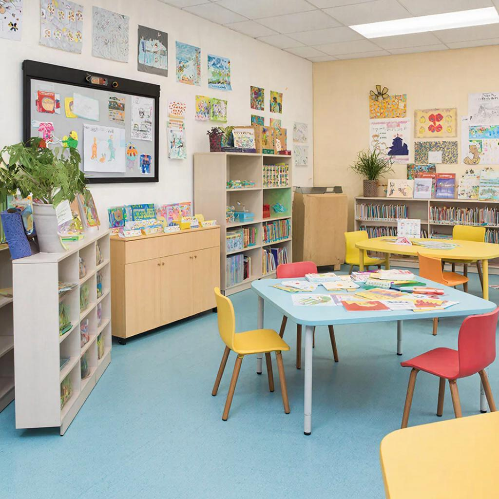

# Организация пространства для учёбы: как создать удобное место для занятий



«Скажи мне, где ты учишься, и я скажу, насколько успешно». Место для учёбы — это не просто стол со стулом. Это ваша личная учебная [база](../../../1.2_natural_sciences/physics_in_everyday_life/Q5339.md), кокпит корабля знаний, штаб-квартира успеха. Правильно организованное [пространство](../../../1.2_natural_sciences/physics_in_everyday_life/Q36253.md) помогает [сосредоточиться](../../how_to_memorize/articles/koncentraciya.md), меньше уставать и учиться с удовольствием.

---

## Почему место для учёбы так важно?

Представьте: вы хотите почитать книгу, но:
- На столе крошки от вчерашнего ужина
- Рядом гудит телевизор
- Телефон постоянно вибрирует
- [Свет](../../../1.2_natural_sciences/physics_in_everyday_life/Q1.md) тусклый, [глаза](../../../7.2 Media, leisure and hobbies/Computer games/articles/useful_tips/eyes_and_back.md) устают

Сможете сосредоточиться? Вряд ли!

**Правильное место для учёбы:**
- Помогает войти в [рабочее состояние](./motivaciya.md)
- Снижает [усталость](../../../3.1. healthy lifestyle/Sleep, nutrition, and adolescent energy/articles/sugar_rollercoaster.md)
- Уменьшает отвлечения
- Создаёт [ритуал](../../../2.1_society/how_and_where_find_friends/articles/druzhba_posle_shkoly.md) «сейчас будем учиться»

---

## Основные [принципы](../../../3.1_healthy_lifestyle/pervaya_pomoshch/ushibi_porezy_ozhogi/02_celi_pervoy_pomoshchi.md) организации

### 1. Отдельное место = учебный [режим](breaks_and_rest.md)

[Мозг](../../../3.1. healthy lifestyle/Sleep, nutrition, and adolescent energy/articles/breakfast_for_the_brain.md) любит [ассоциации](../../../1.2_natural_sciences/neurobiology_for_teens/articles/18_music_chills.md). Если вы учитесь всегда в одном месте, мозг понимает: «Ага, сел за этот стол → [время](../../../1.2_natural_sciences/physics_in_everyday_life/Q20702.md) учиться».

**Не учитесь там, где отдыхаете!**
- ❌ Кровать — для сна и отдыха
- ❌ Диван — для расслабления
- ✅ Отдельный стол — для учёбы

Если отдельного стола нет, создайте **учебный уголок**:
- Определите одну зону (часть комнаты)
- Используйте один и тот же стул
- Храните учебники в одном месте

---

### 2. [Порядок](../../../1.2_natural_sciences/physics_in_everyday_life/Q45003.md) на столе = порядок в голове

[Хаос](../../../1.2_natural_sciences/physics_in_everyday_life/Q45003.md) на столе = хаос в мыслях. Исследования показывают: люди с захламлённым рабочим местом тратят на **1.5 часа больше в неделю** на [поиск](../../../3.2 healthy lifestyle/how to act in a dangerous situation/articles/lost-in-city.md) вещей!

**[Правило](../../../1.2_natural_sciences/why_science_help_understand_world/patterns.md) 3 зон:**

| [Зона](../../../5.1_technology_and_digital_literacy/how_internet_works/articles/dns/domains.md) | Что там | Зачем |
|------|---------|-------|
| **Центральная** | Ноутбук, тетрадь, ручка | Основная [работа](../../../1.2_natural_sciences/physics_in_everyday_life/Q11382.md) |
| **Левая** | Учебники, [источники](../../../4.2_thinking_and_working_information/how_to_search_information/articles/three_whales.md) | [Материалы](../../../1.2_natural_sciences/physics_in_everyday_life/Q487005.md) для справки |
| **Правая** | Готовые [работы](../../../8.2_future/choosing_a_career_path/articles/interview.md), черновики | [Результаты](../../../1.2_natural_sciences/why_science_help_understand_world/research_work.md) |

---

### 3. [Минимум](../../../1.2_natural_sciences/physics_in_everyday_life/Q136980.md) отвлекающих факторов

Ваш [враг](../../../7.2 Media, leisure and hobbies/Computer games/articles/heroes_and_villains/main_villains.md) — не [лень](../../../1.2_natural_sciences/neurobiology_for_teens/articles/12_lazy_brain.md), а **отвлечения**.

**Уберите со стола:**
- 📱 Телефон (положите в другую комнату или в ящик)
- 📺 Пульт от телевизора
- 🎮 Игрушки и [гаджеты](../../../3.1. healthy lifestyle/Sleep, nutrition, and adolescent energy/articles/gadgets_blue_light_sleep.md)
- 🍫 Еду (кроме воды)

**Оставьте на столе:**
- ✅ Только то, что нужно для текущей [задачи](../../../1.2_natural_sciences/why_science_help_understand_world/research_work.md)
- ✅ Воду в бутылке
- ✅ Таймер или [часы](../../../1.2_natural_sciences/physics_in_everyday_life/Q20702.md)

---

## [Освещение](../../../1.2_natural_sciences/physics_in_everyday_life/Q628858.md): свет знаний

Правильный свет критически важен для учёбы:

### Естественный свет — лучший

- Расположите стол **боком к окну** (не лицом и не спиной)
- Свет должен падать слева (для правшей) или справа (для левшей)
- Используйте лёгкие шторы, чтобы регулировать яркость

### [Искусственное освещение](../../../1.2_natural_sciences/physics_in_everyday_life/Q14620.md)

Если естественного света мало:

| [Тип](../../../5.2_cybersecurity/cpp_fundamentals/13_struct.md) лампы | Для чего | Рекомендация |
|-----------|----------|--------------|
| **Основной свет** | Общее освещение комнаты | Мягкий, рассеянный, 300-500 люкс |
| **Настольная [лампа](../../../1.2_natural_sciences/physics_in_everyday_life/Q3198.md)** | Освещение рабочей зоны | Направленный свет, 500-750 люкс |
| **Дополнительная** | Подсветка материалов | Гибкая, с регулировкой яркости |

**Правило:** [Экран](../../../3.1. healthy lifestyle/Sleep, nutrition, and adolescent energy/articles/gadgets_blue_light_sleep.md) компьютера не должен быть ярче окружающего света!

---

## Эргономика: берегите спину и глаза

Неправильная поза = усталость + [боль](../../../1.2_natural_sciences/neurobiology_for_teens/articles/16_love_chemistry.md) + плохая [концентрация](../../../1.2_natural_sciences/physics_in_everyday_life/Q506710.md).

### Правильная посадка:

```
        Голова
          │
          ▼
    ┌─────┴─────┐
    │   Спина   │ ← прямая, опора на стул
    └─────┬─────┘
          │
    ┌─────┴─────┐
    │   Бёдра   │ ← параллельны полу (90°)
    └─────┬─────┘
          │
    ┌─────┴─────┐
    │  Голени   │ ← перпендикулярны полу (90°)
    └─────┬─────┘
          │
        Стопы ← полностью на полу
```

### Параметры рабочего места:

| Параметр | Правильно | Неправильно |
|----------|-----------|-------------|
| **[Высота](../../../1.2_natural_sciences/physics_in_everyday_life/Q155640.md) стола** | 70-75 см | Слишком низко/высоко |
| **Высота стула** | Стопы на полу | Ноги висят или поджаты |
| **[Расстояние до экрана](../../../7.2 Media, leisure and hobbies/Computer games/articles/useful_tips/eyes_and_back.md)** | 50-70 см | Ближе 40 см или дальше 1 м |
| **Положение экрана** | Верх на уровне [глаз](../../../1.2_natural_sciences/physics_in_everyday_life/Q467980.md) | Смотреть вверх или вниз |
| **Руки на клавиатуре** | Локти 90°, запястья прямо | Запястья согнуты вверх |

---

## Организация материалов

### Система хранения:

**1. Вертикальные файлы**
- Папки по предметам ([математика](../../../1.2_natural_sciences/physics_in_everyday_life/Q140028.md), [русский](../../../7.1_art/musical_instruments/articles/balalaika.md), [история](../../../1.2_natural_sciences/physics_in_everyday_life/Q11469.md)...)
- Цветные ярлыки для быстрого поиска
- Стоят вертикально в папке-органайзере

**2. Контейнеры для мелочей**
- Ручки, карандаши, ластики
- Скрепки, стикеры, [закладки](../../../4.2_thinking_and_working_information/how_to_search_information/articles/second_mind.md)
- Калькулятор, [линейка](../../../1.2_natural_sciences/physics_in_everyday_life/Q36253.md), циркуль

**3. Полка для учебников**
- Текущие учебники — ближе к столу
- Прошлогодние — дальше
- Словари и справочники — в доступном месте

---

### Цифровая организация:

Не только физическое пространство важно!

**На компьютере:**
```
📁 Учеба/
  📁 Математика/
    📄 Алгебра_конспекты.pdf
    📄 Геометрия_задачи.pdf
  📁 Литература/
    📄 Сочинения/
    📁 Книги/
  📁 Проекты/
    📄 Проект_История.docx
```

**В браузере:**
- Закладки по предметам
- Расширения для блокировки соцсетей во время учёбы
- Отдельный [профиль](../../../5.1_technology_and_digital_literacy/information and media literacy/цифровая_репутация.md) для учёбы (если возможно)

---

## [Атмосфера](../../../1.2_natural_sciences/physics_in_everyday_life/Q1290.md) и [настроение](../../../1.2_natural_sciences/neurobiology_for_teens/articles/10_sweet_tooth.md)

### [Цвета](../../../1.2_natural_sciences/physics_in_everyday_life/Q11652.md) для учёбы:

| [Цвет](../../../1.2_natural_sciences/physics_in_everyday_life/Q1075.md) | Эффект | Где использовать |
|------|--------|------------------|
| **Синий** | [Спокойствие](../../../7.2 Media, leisure and hobbies/Computer games/articles/useful_tips/toxic_players.md), концентрация | Стены, аксессуары |
| **Зелёный** | Снижает усталость глаз | [Растения](../../../1.2_natural_sciences/physics_in_everyday_life/Q188603.md), декор |
| **Жёлтый** | [Энергия](../../../3.1. healthy lifestyle/Sleep, nutrition, and adolescent energy/articles/breakfast_for_the_brain.md), оптимизм | Акценты, стикеры |
| **Белый** | Чистота, порядок | Основной фон |
| **Красный** | [Возбуждение](../../../1.2_natural_sciences/neurobiology_for_teens/articles/16_love_chemistry.md) (осторожно!) | Минимум, только акценты |

---

### Растения-помощники:

Комнатные растения:
- 🌿 Улучшают [качество](../../../6.1_Independent_living_and_daily_living_skills/reasonable_spending/articles/quality.md) воздуха
- 🌿 Снижают [стресс](../../../3.1. healthy lifestyle/Sleep, nutrition, and adolescent energy/articles/chronic_sleep_deprivation.md)
- 🌿 Добавляют уют

**Лучшие растения для учебного места:**
- Кактус (неприхотлив, защищает от электромагнитного излучения)
- Спатифиллум (очищает [воздух](../../../1.2_natural_sciences/physics_in_everyday_life/Q487005.md))
- Сансевиерия («тёщин [язык](../../../5.2_cybersecurity/cpp_fundamentals/1_introduction.md)», очень живучий)
- Хлорофитум (рекордсмен по очистке воздуха)

---

### Запахи для концентрации:

Ароматы могут помочь сосредоточиться:

| Аромат | Эффект | Как использовать |
|--------|--------|------------------|
| **Лимон** | Бодрит, проясняет [ум](../../../7.2 Media, leisure and hobbies/Computer games/articles/useful_tips/educational_games.md) | Цедра, эфирное масло |
| **Розмарин** | Улучшает [память](../../../3.1. healthy lifestyle/Sleep, nutrition, and adolescent energy/articles/sleep_and_memory_grades.md) | Веточка, масло |
| **Мята** | Освежает, снимает усталость | Чай, масло |
| **Лаванда** | Успокаивает (для вечера) | Саше, масло |

**Осторожно:** Не переборщите! Слишком сильный запах отвлекает.

---

## Борьба с отвлечениями

### Телефон — главный враг:

**[Стратегии](../../../../8.1_self_understanding/articles/overcoming.md):**
1. **Физически уберите** — в ящик, в другую комнату
2. **Режим «Не беспокоить»** — если нужен рядом
3. **Приложения-блокировщики** — Forest, Freedom, AppBlock
4. **Договоритесь с собой** — «Проверю телефон после 25 минут»

---

### Шум:

| Тип шума | [Решение](../../../2.1_society/cause_and_effect_relationships/articles/personal_choice.md) |
|----------|---------|
| **Разговоры дома** | Наушники с шумоподавлением, беруши |
| **Улица за окном** | Закрыть окно, включить фоновую музыку |
| **Тишина давит** | Фоновая [музыка](../../../1.2_natural_sciences/neurobiology_for_teens/articles/18_music_chills.md) (лоу-фай, классика, ambient) |

**Лучшая музыка для учёбы:**
- Инструментальная (без слов)
- Лоу-фай хип-хоп
- Классика ([Бах](../../../7.1_art/musical_instruments/articles/cello.md), [Моцарт](../../../7.1_art/musical_instruments/articles/bassoon.md))
- Звуки природы ([дождь](../../../3.2 healthy lifestyle/how to act in a dangerous situation/articles/thunderstorm-safety.md), [лес](../../../1.2_natural_sciences/why_science_help_understand_world/nature.md), кафе)

---

## Чек-лист идеального места для учёбы

Пройдитесь по списку:

- [ ] Стол чистый, только нужное
- [ ] Стул удобный, высота правильная
- [ ] Свет достаточный, не тусклый
- [ ] Телефон убран/в беззвучном режиме
- [ ] [Вода](../../../3.1. healthy lifestyle/Sleep, nutrition, and adolescent energy/articles/drinking_regime.md) рядом
- [ ] Материалы организованы
- [ ] Ничего не отвлекает (телевизор выключен)
- [ ] [Температура](../../../1.1_structure_of_the_world/matter/articles/07_gases.md) комфортная (20-22°[C](../../../2.1_society/how_and_where_find_friends/articles/sora_drug.md))
- [ ] Есть таймер или часы
- [ ] Место проветрено

---

## [Связь](../../../1.2_natural_sciences/physics_in_everyday_life/Q12969754.md) с другими понятиями

Организация пространства связана с:
- [Тайм-менеджментом](time_management.md) — порядок экономит время
- [Вниманием](./vnimanie.md) — меньше отвлекающих факторов
- [Перерывами и отдыхом](breaks_and_rest.md) — удобное место снижает усталость
- [Мотивацией](./motivaciya.md) — приятное место мотивирует учиться

---

## Частые [ошибки](../../../3.1_healthy_lifestyle/pervaya_pomoshch/ushibi_porezy_ozhogi/07_ushib_chego_nelzya.md)

| [Ошибка](../../../5.1_technology_and_digital_literacy/how_internet_works/articles/http_https/http_https.md) | Почему это плохо | Как исправить |
|--------|------------------|---------------|
| Учиться в кровати | Мозг путает [сон](../../../3.1. healthy lifestyle/Sleep, nutrition, and adolescent energy/articles/evening_rituals_sleep_fast.md) и учёбу | Выделите отдельное место |
| Хаос на столе | Тратите время на поиск | Организуйте 3 зоны |
| Плохой свет | Устают глаза, голова | Добавьте лампу |
| Телефон на столе | Постоянное отвлечение | Уберите в ящик |
| Неправильная поза | Болит [спина](../../../7.2 Media, leisure and hobbies/Computer games/articles/useful_tips/eyes_and_back.md), устаёте | Настройте высоту стула |

---

## Практические упражнения

### Упражнение 1: «Перезагрузка стола»

Выделите 30 минут:
1. Уберите всё со стола
2. Протрите пыль
3. Разместите только нужное по 3 зонам
4. Настройте свет
5. Сделайте [фото](../../../5.1_technology_and_digital_literacy/information and media literacy/проверка_фото_на_манипуляции.md) «до» и «после»

---

### Упражнение 2: «Цифровая уборка»

Приведите в порядок компьютер:
1. Разложите файлы по папкам
2. Почистите рабочий стол
3. Настройте закладки
4. Установите блокировщик сайтов

---

### Упражнение 3: «Неделя в новом месте»

Попользуйтесь организованным местом неделю. Записывайте каждый день:
- Легко ли было начать?
- Сколько раз отвлеклись?
- Устали ли меньше?

---

## Интересные [факты](../../../1.2_natural_sciences/physics_in_everyday_life/Q17737.md)

1. **Исаак [Ньютон](../../../1.2_natural_sciences/physics_in_everyday_life/Q11223329.md)** работал за небольшим деревянным столом у [окна](../../../5.1_technology_and_digital_literacy/operating system/articles/window_manager.md). Он говорил: «Порядок на столе — порядок в уме».

2. [Исследование](../../../1.2_natural_sciences/neurobiology_for_teens/articles/19_curiosity.md) **Princeton University**: люди с чистым рабочим местом делают на **25% меньше ошибок** и заканчивают задачи на **30% быстрее**.

3. В Японии есть концепция **«ма»**— пустое пространство. Пустой стол помогает мыслям течь свободнее.

4. **[Альберт Эйнштейн](../../../1.2_natural_sciences/physics_in_everyday_life/Q83213.md)** на вопрос о беспорядке на столе ответил: «Если беспорядок на столе означает беспорядок в уме, то что тогда означает пустой стол?»

---

## См. также

- [Тайм-менеджмент](time_management.md)
- [Внимание](./vnimanie.md)
- [Перерывы и отдых](breaks_and_rest.md)
- [Мотивация](./motivaciya.md)
- [Конспектирование](./konspektirovanie.md)

---

Помните: ваше место для учёбы — это не просто мебель. Это инструмент, который помогает вам достигать целей. Инвестируйте время в организацию пространства, и оно отплатит вам продуктивностью, концентрацией и удовольствием от учёбы!

**Ваш челлендж:** Прямо сегодня потратьте 20 минут на организацию своего учебного места. Завтра заметите разницу!

---
Авторы: Лизунов Кирилл;  
[Ресурсы](../../../2.1_society/cause_and_effect_relationships/articles/ecological_footprint.md): [LLM](../../../7.1_art/modern_technological_art/README.md) - GigaChat, Wikidata Q1137670
