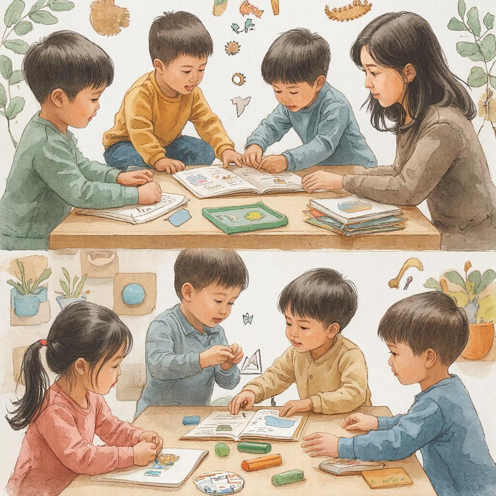

# Учиться на ошибках: как превращать неудачи в возможности для роста

«Я ошибся — всё пропало!» Знакомо? Многие думают, что [ошибка](../../../5.1_technology_and_digital_literacy/how_internet_works/articles/http_https/http_https.md) — это конец, [провал](../../../4.2_thinking_and_working_information/critical_thinking/articles/main_cognitive_distortions.md), повод сдаться. Но на самом деле ошибка — это **начало**. Начало понимания, роста и настоящего мастерства. Давайте разберёмся, как превращать неудачи в трамплин для успеха.

---

## Что такое ошибка в обучении?

**Ошибка** — это разница между тем, что получилось, и тем, что должно было получиться. Это [сигнал](../../../5.1_technology_and_digital_literacy/how_internet_works/articles/wifi/router.md) от мозга: «Эй, тут что-то идёт не так! Давай разберёмся!»

**Важно:** Ошибка ≠ неудачник. Ошибка = возможность научиться.

---

## Почему [ошибки](../../../3.1_healthy_lifestyle/pervaya_pomoshch/ushibi_porezy_ozhogi/07_ushib_chego_nelzya.md) — это хорошо?

### 1. Ошибки показывают, где расти

Если вы делаете всё идеально, значит, [задачи](../../../1.2_natural_sciences/why_science_help_understand_world/research_work.md) слишком лёгкие. Вы не растёте!

**Пример:**
- Поднимаете гантели 2 кг легко → мышцы не растут
- Поднимаете 5 кг с трудом → мышцы укрепляются

Так и с учёбой: ошибки = вы на пределе своих возможностей, скоро будет [рост](../../../3.1. healthy lifestyle/Sleep, nutrition, and adolescent energy/articles/micronutrients_and_teenagers.md)!

---

### 2. Ошибки запоминаются лучше

Исследования показывают: когда мы ошибаемся и потом исправляемся, [мозг](../../../3.1. healthy lifestyle/Sleep, nutrition, and adolescent energy/articles/breakfast_for_the_brain.md) запоминает правильный [ответ](../../../5.1_technology_and_digital_literacy/how_internet_works/articles/http_https/http_https.md) **в 2 раза лучше**, чем если бы мы сразу дали верный ответ.

**Почему?** [Эмоция](../../../5.1_technology_and_digital_literacy/information and media literacy/кликбейт_и_заголовки_ловушки.md) от ошибки + [поиск](../../../3.2 healthy lifestyle/how to act in a dangerous situation/articles/lost-in-city.md) решения = мощная нейронная [связь](../../../1.2_natural_sciences/physics_in_everyday_life/Q12969754.md).

---

### 3. Ошибки учат анализировать

Правильный ответ: «Ура, я молодец!» → закрыли и забыли.  
Ошибка: «Хм, почему не получилось?» → [анализ](../../../1.2_natural_sciences/why_science_help_understand_world/research.md) → [понимание](../../../2.1_society/cause_and_effect_relationships/articles/empathy_causality.md) → рост.

---

## Типы ошибок

Не все ошибки одинаковы. Давайте разберёмся:

| [Тип](../../../5.2_cybersecurity/cpp_fundamentals/13_struct.md) ошибки | Что это | Что делать |
|------------|---------|------------|
| **Невнимательность** | Описался, перепутал цифры | Замедлиться, проверять [работу](../../../8.2_future/choosing_a_career_path/articles/interview.md) |
| **Непонимание** | Не понял тему, применил не то | Разобрать тему заново, спросить |
| **Пробел в знаниях** | Не знал [факт](../../../1.2_natural_sciences/why_science_help_understand_world/science.md), [правило](../../../1.2_natural_sciences/why_science_help_understand_world/patterns.md) | Выучить, записать в словарь |
| **Системная** | Ошибаюсь в одном и [том](../../../7.1_art/musical_instruments/articles/drums.md) же | Найти корень проблемы, изменить подход |
| **[Эксперимент](../../../1.2_natural_sciences/physics_in_everyday_life/Q1293220.md)** | Пробовал новый способ, не вышло | Продолжать экспериментировать! |

---

## Как правильно реагировать на ошибки?

### ❌ Неправильно:
- «Я тупой»
- «У меня никогда не получится»
- «Это не моё»
- Бросить дело
- Спрятать ошибку

### ✅ Правильно:
- «Интересно, почему я так сделал?»
- «Что я могу извлечь из этого?»
- «Какой [урок](../../../5.1_technology_and_digital_literacy/information and media literacy/шаблон_урока_по_медиаграмотности.md) я получил?»
- Попробовать другой способ
- Разобрать ошибку подробно

---

## [Алгоритм](../../../2.1_society/cause_and_effect_relationships/articles/ai_causality.md) [работы](../../../8.2_future/choosing_a_career_path/articles/interview.md) с ошибкой

### [Шаг](../../../1.2_natural_sciences/physics_in_everyday_life/Q36253.md) 1: Признать ошибку

Не прятать, не игнорировать. Сказать себе: «Да, я ошибся. Это нормально».

---

### Шаг 2: Найти причину

Задайте [вопросы](curiosity.md):
- Где именно я ошибся?
- Почему я так сделал?
- Что я думал в этот момент?
- Какое правило я не применил?

**Пример ([математика](../../../1.2_natural_sciences/physics_in_everyday_life/Q140028.md)):**
- Задача: 2 + 2 × 2 = ?
- Ваш ответ: 8 (неправильно)
- [Причина](../../../2.1_society/cause_and_effect_relationships/articles/causality_base.md): забыл [порядок](../../../1.2_natural_sciences/physics_in_everyday_life/Q45003.md) действий (сначала умножение!)
- Урок: повторить порядок операций

---

### Шаг 3: Исправить

Сделайте правильно, проговаривая каждый шаг:
- «Сначала умножаю 2 × 2 = 4»
- «Потом складываю 2 + 4 = 6»
- «Ответ: 6»

---

### Шаг 4: [Запомнить](../../how_to_memorize/articles/zapominanie.md) урок

Запишите ошибку в специальный дневник:

| Дата | Тема | Ошибка | Причина | Урок |
|------|------|--------|---------|------|
| 15.02 | Математика | 2+2×2=8 | Забыл порядок действий | Сначала умножение, потом сложение |

---

### Шаг 5: [Проверить себя](../../how_to_memorize/articles/samoproverka.md)

Через 1-2 дня решите похожую задачу. Получилось? Урок усвоен!

---

## Дневник ошибок: ваш личный учитель

Заведите тетрадь или [файл](../../../5.1_technology_and_digital_literacy/operating system/articles/file_system.md) с ошибками. [Структура](note_taking.md):

**1. [Контекст](../../../5.1_technology_and_digital_literacy/information and media literacy/геолокация_и_проверка_контекста.md)**
- Что делал?
- Какая была задача?

**2. Ошибка**
- Что я сделал?
- Что должно было быть?

**3. Анализ**
- Почему ошибся?
- Что думал в тот момент?

**4. Урок**
- Что узнал?
- Как делать правильно?

**5. [План](../../../7.2 Media, leisure and hobbies/Computer games/articles/genres_and_worlds/strategy.md)**
- Как не повторить?
- Когда проверю себя?

---

## Ошибки великих людей

Вы думаете, гении не ошибаются? Ещё как ошибаются!

**Томас Эдисон:**
- 10 000 неудачных попыток изобрести лампочку
- Его [цитата](../../../5.1_technology_and_digital_literacy/information and media literacy/как_правильно_оформлять_ссылки_и_источники.md): «Я не провалился. Я просто нашёл 10 000 способов, которые не работают»

**Дж. К. Роулинг:**
- 12 издательств отвергли «Гарри Поттера»
- 13-е издательство рискнуло → одна из самых успешных книг в истории

**Майкл Джордан:**
- Не попал в школьную баскетбольную команду
- Стал величайшим баскетболистом всех времён
- Его цитата: «Я промахнулся 9000 раз в карьере. Но попал в решающие моменты»

---

## [Культура](../../../2.1_society/cause_and_effect_relationships/articles/why_rules_work.md) ошибки в классе

Хороший учитель не ругает за ошибки, а помогает их разобрать.

**Что должно быть в классе:**
- ✅ Можно спрашивать, если не понял
- ✅ Можно ошибаться на доске
- ✅ Разбираем ошибки вместе
- ✅ Хвалим за попытку, даже если неверно

**Чего не должно быть:**
- ❌ Насмешки одноклассников
- ❌ «Я же говорил!»
- ❌ [Наказание](../../../2.1_society/cause_and_effect_relationships/articles/law_and_inevitability.md) за ошибку
- ❌ [Сравнение с другими](../../../../8.1_self_understanding/articles/social_comparison.md)

---

## [Техники](../../../8.2_future_and_path_choice/articles/03_stress_management.md) работы с ошибками

### [Техника](../../../1.2_natural_sciences/physics_in_everyday_life/Q133673.md) 1: «Красная ручка»

Возьмите красную ручку и специально найдите 3 ошибки в своей [работе](../../../8.2_future/choosing_a_career_path/articles/interview.md). Разберите каждую. Это снимает [страх](../../../1.2_natural_sciences/neurobiology_for_teens/articles/14_amygdala_fear.md) перед ошибками!

---

### Техника 2: «[Обучение](../../../3.1. healthy lifestyle/Sleep, nutrition, and adolescent energy/articles/sleep_and_memory_grades.md) на чужих ошибках»

Найдите работу одноклассника (с его согласия) и найдите ошибки. Объясните, как исправить. Обучая других, учитесь сами!

---

### Техника 3: «Ошибка недели»

Каждую неделю выбирайте одну свою ошибку и делайте её «героем»:
- Разберите подробно
- Расскажите друзьям
- Напишите пост в дневник
- Придумайте, как научить других не делать так

---

## Связь с другими понятиями

[Обучение на ошибках](../../../4.2_thinking_and_working_information/critical_thinking/articles/reflection_and_post_mortem.md) связано с:
- [Мышлением роста](growth_mindset.md) — ошибки = возможности роста
- [Самоанализом](self_reflection.md) — [рефлексия](../../../2.1_society/how_and_where_find_friends/articles/sam_sebe_interesnyi.md) после ошибки
- [Мотивацией](./motivaciya.md) — правильная [реакция](../../../1.2_natural_sciences/why_science_help_understand_world/chemistry.md) мотивирует
- [Критическим мышлением](../4.2/critical_thinking/articles/main_cognitive_distortions.md) — анализ причин

---

## Частые ошибки в работе с ошибками

| Ошибка | Почему это плохо | Как исправить |
|--------|------------------|---------------|
| Игнорировать ошибки | Повторяете снова и снова | Разбирать каждую ошибку |
| Ругать себя | Падает [самооценка](../../../2.1_society/how_and_where_find_friends/articles/otkaz_ne_konets.md) | Говорить: «Ошибка — это урок» |
| Сравнивать с другими | «Он не ошибается, а я...» | Сравнивать с собой вчерашним |
| Бросать после ошибки | Не доучиваете тему | Делать [перерыв](../../../7.2 Media, leisure and hobbies/Computer games/articles/useful_tips/eyes_and_back.md), потом возвращаться |
| Прятать ошибки | Не получаете [помощь](../../../3.1_healthy_lifestyle/pervaya_pomoshch/ushibi_porezy_ozhogi/10_krovotechenie_chto_delat.md) | Показывать учителю, друзьям |

---

## Практические упражнения

### Упражнение 1: «Ошибочка дня»

Каждый день записывайте одну ошибку и один урок из неё. Через месяц у вас будет 30 уроков!

---

### Упражнение 2: «Перевёртыш»

Возьмите задачу, которую решили неправильно. Решите её 3 разными способами. Найдите, где именно пошёл не так первый способ.

---

### Упражнение 3: «[Интервью](../../../8.2_future/choosing_a_career_path/articles/interview.md) с ошибкой»

Представьте, что ваша ошибка — это [персонаж](../../../7.2 Media, leisure and hobbies/Computer games/articles/game_culture/cosplay.md). Задайте ей вопросы:
- «Зачем ты пришла?»
- «Что ты хочешь мне сказать?»
- «Чему ты меня учишь?»

Запишите ответы!

---

## Интересные [факты](../../../1.2_natural_sciences/physics_in_everyday_life/Q17737.md)

1. **Космический [телескоп](../../../1.2_natural_sciences/physics_in_everyday_life/Q35197.md) «Хаббл»** после запуска обнаружил ошибку в зеркале. Астронавты провели сложнейшую операцию по исправлению. Теперь это один из лучших телескопов в истории! Ошибка → вызов → [решение](../../../2.1_society/cause_and_effect_relationships/articles/personal_choice.md) → триумф.

2. **Пенициллин** открыли благодаря ошибке: Александр Флеминг забыл закрыть чашку с бактериями, и там выросла плесень. «Ой, что это?» → величайшее медицинское [открытие](../../../1.2_natural_sciences/physics_in_everyday_life/Q560.md).

3. Исследования: студенты, которые вели дневник ошибок и анализировали их, улучшили [оценки](../../../3.1. healthy lifestyle/Sleep, nutrition, and adolescent energy/articles/sleep_and_memory_grades.md) на **35%** за один семестр.

---

## См. также

- [Мышление роста](growth_mindset.md)
- [Самоанализ](self_reflection.md)
- [Мотивация](./motivaciya.md)
- [Критическое мышление](../4.2/critical_thinking/articles/main_cognitive_distortions.md)
- [Обучение на ошибках](https://ru.wikipedia.org/wiki/Обучение_на_ошибках)

---

Помните: **ошибка — это не конец пути, а указатель направления**. Каждый раз, когда вы ошибаетесь и разбираетесь в причине, вы становитесь умнее, сильнее и опытнее.

**Ваш челлендж на неделю:** Найдите 5 своих ошибок, разберите их и поблагодарите за уроки. Удивитесь, сколько нового узнаете!

---
Авторы: Таланкин Кирилл;  
[Ресурсы](../../../2.1_society/cause_and_effect_relationships/articles/ecological_footprint.md): [LLM](../../../7.1_art/modern_technological_art/README.md) - GigaChat, Wikidata Q1054052
