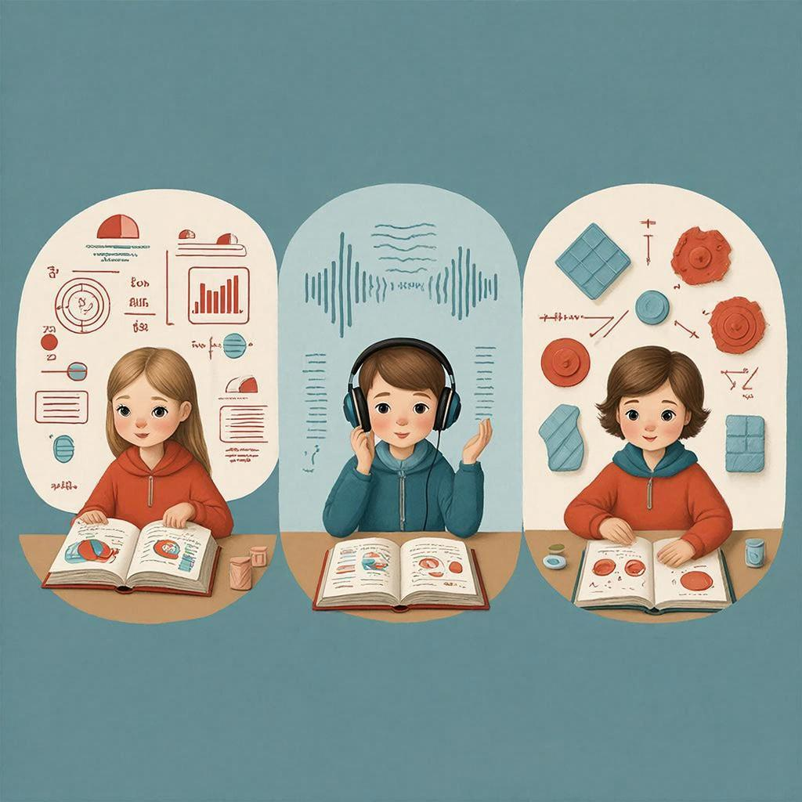

# Стили обучения: как найти свой подход к учёбе

Все люди разные: кто-то лучше запоминает, когда видит информацию, кто-то — когда слышит, а кому-то нужно всё попробовать своими руками. Это называется **стилями обучения**. [Понимание](../../../2.1_society/cause_and_effect_relationships/articles/empathy_causality.md) своего стиля помогает учиться легче и с удовольствием.

---

## Что такое стили обучения?

**[Стиль](../../../7.1_art/modern_technological_art/articles/5.5_yandex_neural.md) обучения** — это предпочтительный способ, которым [человек](../../../1.2_natural_sciences/physics_in_everyday_life/Q45003.md) воспринимает и обрабатывает информацию. Это не про [способности](growth_mindset.md), а про то, как вам удобнее учиться.

Представьте, что вам нужно объяснить, как завязывать шнурки:
- Одному человеку лучше **показать** (нарисовать схему)
- Другому — **рассказать** (объяснить словами)
- Третий должен **попробовать сам** (взять шнурок в руки)

---

## Три основных стиля обучения

### 1. Визуалы (учатся глазами) 👁️

**Визуалы** воспринимают информацию через [зрение](../../../1.2_natural_sciences/neurobiology_for_teens/articles/26_optical_illusions.md). Им важно видеть:

**Что помогает:**
- Картинки, схемы, диаграммы
- Цветные выделения и маркеры
- Видеоролики и презентации
- Конспекты с рисунками
- [Интеллект-карты](../../../4.2_thinking_and_working_information/critical_thinking/articles/decision_models.md) (mind maps)

**[Советы](../../../7.2 Media, leisure and hobbies /useful_and_interesting_leisure/articles/mistakes_in_choosing_hobby.md) для визуалов:**
- Используйте разные [цвета](../../../1.2_natural_sciences/physics_in_everyday_life/Q11652.md) для разных тем
- Рисуйте схемы и стрелочки в конспектах
- Смотрите обучающие [видео](../../../5.1_technology_and_digital_literacy/information and media literacy/оценка_качества_изображений_и_видео.md) на YouTube
- Делайте карточки с картинками
- Визуализируйте информацию в голове

**Пример:** Визуалу легче выучить столицы стран, если смотреть на карту и представлять, где какая страна находится.

---

### 2. Аудиалы (учатся ушами) 👂

**Аудиалы** лучше всего воспринимают информацию на слух:

**Что помогает:**
- Лекции и объяснения учителя
- Обсуждения в группе
- Аудиокниги и подкасты
- [Чтение](reading_skills.md) вслух
- Проговаривание материала

**Советы для аудиалов:**
- Записывайте лекции на диктофон и переслушивайте
- Читайте учебник вслух
- Объясняйте [материал](../../../1.2_natural_sciences/physics_in_everyday_life/Q25358.md) друзьям или даже коту
- Включайте фоновую музыку без слов при учёбе
- Используйте мнемотехники с рифмами

**Пример:** Аудиал быстрее запомнит стихотворение, если будет читать его вслух несколько раз, чем если просто прочитает про себя.

---

### 3. Кинестетики (учатся руками) ✋

**Кинестетики** познают мир через [движение](../../../1.2_natural_sciences/physics_in_everyday_life/Q11023.md) и прикосновения:

**Что помогает:**
- Практические занятия и эксперименты
- [Моделирование](../../../1.2_natural_sciences/physics_in_everyday_life/Q11023.md) и макеты
- Ролевые игры
- Письмо от руки (не печать!)
- [Перерывы](breaks_and_rest.md) на движение

**Советы для кинестетиков:**
- Делайте лабораторные [работы](../../../8.2_future/choosing_a_career_path/articles/interview.md) сами
- Используйте карточки, которые можно перекладывать
- Пишите конспекты от руки
- Учитесь в движении (можно ходить по комнате)
- Делайте частые перерывы на разминку

**Пример:** Кинестетик лучше поймёт, как работает [рычаг](../../../1.2_natural_sciences/physics_in_everyday_life/Q169019.md), если сам поднимет [груз](../../../1.2_natural_sciences/physics_in_everyday_life/Q20702.md) с помощью палки, чем если прочитает формулу в учебнике.

---

## Как определить свой стиль обучения?

Попробуйте ответить на [вопросы](curiosity.md):

| Ситуация | Что вы выберете? |
|----------|------------------|
| **Новая [настольная игра](../../../../8.1_entertainment/articles/board-games.md)** | Прочитаю инструкцию с картинками / Послушаю [объяснение](teaching_others.md) друга / Начну играть и разберусь в процессе |
| **Нужно [запомнить](../../how_to_memorize/articles/zapominanie.md) маршрут** | Посмотрю карту / Попрошу объяснить словами / Проеду один раз и запомню повороты |
| **Сложная тема по физике** | Посмотрю видео с опытами / Послушаю объяснение учителя / Сам проведу [эксперимент](../../../1.2_natural_sciences/physics_in_everyday_life/Q1293220.md) |

**Больше ответов А** — вы визуал  
**Больше ответов Б** — вы аудиал  
**Больше ответов В** — вы кинестетик

[!NOTE]
Большинство людей — смешанный [тип](../../../5.2_cybersecurity/cpp_fundamentals/13_struct.md). Например, 60% визуал + 30% кинестетик + 10% аудиал. Это нормально!

---

## Таблица: что подходит каждому стилю

| [Метод](../../../5.1_technology_and_digital_literacy/how_internet_works/articles/http_https/http_https.md) | Визуал | Аудиал | Кинестетик |
|-------|:------:|:------:|:----------:|
| [Конспект](../../how_to_memorize/articles/konspektirovanie.md) с рисунками | ✅ | ⚠️ | ⚠️ |
| Слушать лекцию | ⚠️ | ✅ | ❌ |
| Практическая [работа](../../../1.2_natural_sciences/physics_in_everyday_life/Q11382.md) | ⚠️ | ❌ | ✅ |
| Смотреть видео | ✅ | ✅ | ⚠️ |
| Читать вслух | ⚠️ | ✅ | ⚠️ |
| Делать карточки | ✅ | ⚠️ | ✅ |
| Обсуждать в группе | ❌ | ✅ | ⚠️ |
| Писать от руки | ⚠️ | ❌ | ✅ |

✅ — отлично подходит, ⚠️ — нормально, ❌ — не очень

---

## Как использовать [знание](../../../1.2_natural_sciences/why_science_help_understand_world/science.md) своего стиля?

### Если вы визуал:
- Превращайте [текст](reading_skills.md) в схемы
- Используйте стикеры разных цветов
- Смотрите документальные [фильмы](../../../7.2 Media, leisure and hobbies /what_you_can_read_and_watch_to_develop_your_taste/articles/z1.md) по теме
- Рисуйте комиксы по материалу

### Если вы аудиал:
- Записывайте себя на диктофон
- Слушайте подкасты по теме
- Объясняйте материал вслух
- Используйте [ритм](../../../1.2_natural_sciences/neurobiology_for_teens/articles/18_music_chills.md) и рифмы для запоминания

### Если вы кинестетик:
- Делайте [модели](../../../1.2_natural_sciences/physics_in_everyday_life/Q172280.md) и макеты
- Пишите конспекты от руки
- Учитесь в движении
- Делайте перерывы каждые 20-30 минут

---

## Что делать, если стиль не совпадает с подачей учителя?

Не расстраивайтесь! Можно адаптировать материал:

**Учитель рассказывает (для аудиалов), а вы визуал:**
- Рисуйте схемы прямо на уроке
- Записывайте ключевые слова и стрелочки
- После урока найдите картинки по теме

**Учитель показывает схемы (для визуалов), а вы аудиал:**
- Проговаривайте про себя, что изображено
- Запишите объяснение на диктофон
- После урока обсудите с одноклассником

**Учитель даёт теорию (для визуалов), а вы кинестетик:**
- Придумайте, как применить это на практике
- Сделайте простой эксперимент дома
- Найдите интерактивную симуляцию [онлайн](../../../3.2 healthy lifestyle/how to act in a dangerous situation/articles/internet-safety.md)

---

## Смешанные стили — это [сила](../../../1.2_natural_sciences/physics_in_everyday_life/Q11023.md)!

Большинство людей используют несколько стилей одновременно. Это преимущество! Например:
- Посмотрели видео (визуал + аудиал)
- Сделали конспект от руки (кинестетик + визуал)
- Обсудили с другом (аудиал)

Чем больше каналов восприятия вы задействуете, тем прочнее знания закрепляются в [памяти](./pamyat.md).

---

## Частые [ошибки](../../../3.1_healthy_lifestyle/pervaya_pomoshch/ushibi_porezy_ozhogi/07_ushib_chego_nelzya.md)

| [Ошибка](../../../5.1_technology_and_digital_literacy/how_internet_works/articles/http_https/http_https.md) | Почему это плохо | Как исправить |
|--------|------------------|---------------|
| «У меня только один стиль» | Ограничивает возможности | Пробуйте разные подходы |
| «Мой стиль не подходит для этого предмета» | Создаёт барьер | Адаптируйте материал |
| Игнорировать свой стиль | Тратите больше времени | Используйте [сильные стороны](../../../8.1_self-understanding/HowToFindYourStrengths/articles/career-rise-natural-strengths.md) |
| Думать, что стиль — это приговор | Можно развить другие каналы | Тренируйте слабые стороны |

---

## Практическое упражнение

Попробуйте выучить 10 новых иностранных слов тремя способами:

1. **Визуальный:** Напишите слова на карточках с картинками
2. **Аудиальный:** Запишите произношение и слушайте
3. **Кинестетический:** Пишите каждое слово 5 раз от руки

Какой способ дал лучший [результат](../../../1.2_natural_sciences/why_science_help_understand_world/experimental_science.md)? Это подсказка о вашем стиле!

---

## [Связь](../../../1.2_natural_sciences/physics_in_everyday_life/Q12969754.md) с другими понятиями

Стили обучения связаны с:
- [Памятью](./pamyat.md) — разные стили по-разному кодируют информацию
- [Вниманием](./vnimanie.md) — любимый стиль легче удерживает [фокус](../../../1.2_natural_sciences/physics_in_everyday_life/Q35197.md)
- [Мотивацией](./motivaciya.md) — [учёба](../../../8.1_colf-underctandina/HouToFindVourStrenaths/articles/use_strengths_in_life.md) в своём стиле приносит [удовольствие](../../../1.2_natural_sciences/neurobiology_for_teens/articles/11_reward_system.md)
- [Визуализацией](./vizualizaciya.md) — важный инструмент для визуалов

---

## Интересный [факт](../../../1.2_natural_sciences/why_science_help_understand_world/science.md)

Исследования показывают, что когда ученики используют свой предпочтительный стиль обучения, они запоминают на 50% больше информации и тратят на 30% меньше времени!

---

## См. также

- [Память](./pamyat.md)
- [Внимание](./vnimanie.md)
- [Визуализация](./vizualizaciya.md)
- [Мотивация](./motivaciya.md)
- [Цели обучения](learning_goals.md)

---

Помните: нет «правильного» или «неправильного» стиля обучения. Есть только ваш способ, который делает учёбу эффективной и приятной. Узнайте свой стиль и используйте его силу!

---
Авторы: Сидоров Дмитрий;  
[Ресурсы](../../../2.1_society/cause_and_effect_relationships/articles/ecological_footprint.md): [LLM](../../../7.1_art/modern_technological_art/README.md) - GigaChat, Wikidata Q1197056
