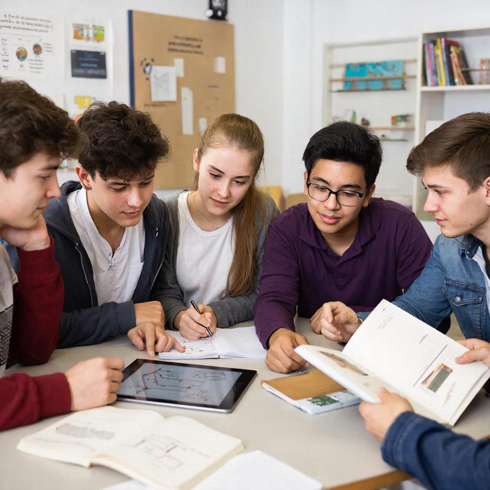

# [Обучение](../../../3.1. healthy lifestyle/Sleep, nutrition, and adolescent energy/articles/sleep_and_memory_grades.md) в группе: как учиться вместе с друзьями и одноклассниками

«Хочешь идти быстро — иди один. Хочешь идти далеко — идите вместе». Эта африканская пословица идеально описывает силу **группового обучения**. Учиться с друзьями и одноклассниками — это не только веселее, но и эффективнее!

---

## Что такое групповое обучение?

**Групповое обучение** (peer learning) — это когда ученики учатся вместе, помогая друг другу понимать [материал](../../../1.2_natural_sciences/physics_in_everyday_life/Q25358.md), решать [задачи](../../../1.2_natural_sciences/why_science_help_understand_world/research_work.md) и достигать целей.

Это не просто «сделать домашку вместе». Это:
- Обсуждение тем
- Взаимное [объяснение](teaching_others.md)
- Совместные проекты
- [Проверка](../../../1.2_natural_sciences/why_science_help_understand_world/scientific_method.md) друг друга
- [Поддержка](../../../1.2_natural_sciences/neurobiology_for_teens/articles/17_hugs_oxytocin.md) и [мотивация](../../../1.2_natural_sciences/neurobiology_for_teens/articles/11_reward_system.md)

---

## Почему учиться вместе лучше?

### 1. Объяснение друг другу

Когда вы объясняете материал другу, вы:
- Лучше понимаете его сами
- Находите пробелы в своих знаниях
- Учитесь говорить о сложном просто
- Запоминаете на 90% (вместо 10% при чтении)

**[Факт](../../../1.2_natural_sciences/why_science_help_understand_world/science.md):** Студенты, которые объясняют материал друг другу, показывают [результаты](../../../1.2_natural_sciences/why_science_help_understand_world/research_work.md) на **30% выше**.

---

### 2. Разные взгляды на проблему

Каждый [человек](../../../1.2_natural_sciences/physics_in_everyday_life/Q45003.md) думает по-своему. То, что непонятно вам, может быть очевидным для друга. И наоборот!

**Пример:**
- Вы видите задачу по алгебре как формулу
- Друг видит её как график
- Вместе вы понимаете тему глубже

---

### 3. Мотивация и поддержка

Легко сдаться, когда учишься один. В группе:
- Друзья не дадут сдаться
- Можно поделиться трудностями
- Совместный [успех](../../../4.2_thinking_and_working_information/critical_thinking/articles/main_cognitive_distortions.md) радует больше
- Здоровое [соревнование](../../../7.2 Media, leisure and hobbies/Computer games/articles/genres_and_worlds/racing_fighting_sports.md) подстёгивает

---

### 4. [Развитие](../../../3.1. healthy lifestyle/Sleep, nutrition, and adolescent energy/articles/micronutrients_and_teenagers.md) мягких навыков

Групповое обучение развивает не только знания, но и [навыки](../../../7.2 Media, leisure and hobbies /useful_and_interesting_leisure/articles/computer_games_with_benefit.md):
- 🗣️ [Коммуникация](../../../2.1_society/how_and_where_find_friends/articles/guide_dlya_introvertov.md)
- 🤝 Командная [работа](../../../1.2_natural_sciences/physics_in_everyday_life/Q11382.md)
- 🎯 Лидерство
- 💡 [Критическое мышление](../../../1.2_natural_sciences/neurobiology_for_teens/articles/25_cognitive_biases.md)
- ❤️ [Эмпатия](../../../1.2_natural_sciences/neurobiology_for_teens/articles/15_empathy.md)

---

## Форматы группового обучения

### 1. Учебные пары (Buddy System)

Два человека учатся вместе:
- Проверяют домашку друг у друга
- Задают [вопросы](curiosity.md)
- Объясняют сложные темы
- Держат в тонусе

**Плюсы:** [Индивидуальный подход](learning_styles.md), легко договориться  
**Минусы:** Только две точки зрения

---

### 2. Малые группы (3-5 человек)

Оптимальный размер для обсуждения:
- Каждый может высказаться
- Достаточно разных мнений
- Легко организовать встречу
- Все вовлечены

**Плюсы:** [Баланс](../../../1.2_natural_sciences/physics_in_everyday_life/Q634.md) [внимания](../../how_to_memorize/articles/vnimanie.md) и разнообразия  
**Минусы:** Нужно координировать [время](../../../1.2_natural_sciences/physics_in_everyday_life/Q20702.md)

---

### 3. Учебные [кружки](../../../7.2 Media, leisure and hobbies /useful_and_interesting_leisure/articles/clubs_and_sections.md)

Регулярные встречи по интересам:
- Книжный клуб (обсуждаем прочитанное)
- Научный кружок (ставим эксперименты)
- Языковой клуб (говорим на иностранном)
- Математический круг (решаем задачи)

**Плюсы:** Системность, [глубина погружения](../../../1.2_natural_sciences/physics_in_everyday_life/Q181404.md)  
**Минусы:** Требует организации

---

### 4. Проектные команды

[Совместная работа](../../../4.2_thinking_and_working_information/how_to_search_information/articles/cooperative_work.md) над проектом:
- Исследовательский [проект](../../../1.2_natural_sciences/why_science_help_understand_world/research_work.md)
- Презентация для класса
- Видеоролик по теме
- Модель или макет

**Плюсы:** [Практическое применение](../../../1.2_natural_sciences/physics_in_everyday_life/Q11465.md) знаний  
**Минусы:** Нужна координация и распределение ролей

---

### 5. Онлайн-группы

[Учёба](../../../8.1_colf-underctandina/HouToFindVourStrenaths/articles/use_strengths_in_life.md) через [интернет](../../../1.2_natural_sciences/physics_in_everyday_life/Q26540.md):
- Чаты в мессенджерах
- Видеозвонки
- Совместные документы (Google Docs)
- Образовательные платформы с группами

**Плюсы:** Не нужно встречаться лично, гибкий график  
**Минусы:** Меньше личного контакта, нужны технические навыки

---

## Роли в учебной группе

В успешной группе каждый имеет роль:

| Роль | Что делает | Зачем нужна |
|------|------------|-------------|
| **Организатор** | Планирует встречи, напоминает | Чтобы группа не распалась |
| **Генератор идей** | Предлагает новые подходы | Для творчества и инноваций |
| **Критик** | Задаёт неудобные вопросы | Для глубины понимания |
| **Объяснятель** | Лучше всех объясняет | Чтобы все поняли тему |
| **Секретарь** | Записывает ключевые мысли | Чтобы не забыть важное |
| **Поддерживающий** | Хвалит, ободряет | Для мотивации группы |

**Совет:** Меняйтесь ролями на каждой встрече!

---

## [Правила](../../../2.1_society/cause_and_effect_relationships/articles/why_rules_work.md) эффективной групповой [работы](../../../8.2_future/choosing_a_career_path/articles/interview.md)

### ✅ Что делать:

1. **Определите [цель](../../../1.2_natural_sciences/why_science_help_understand_world/research_work.md) встречи**
   - «Сегодня разбираем тему X»
   - «Решаем 10 задач по Y»
   - «Готовим презентацию»

2. **Установите [тайминг](../../../6.1_Independent_living_and_daily_living_skills/Simple_and_safe_cooking/articles/how_to_read_recipe.md)**
   - 5 мин: разминка, настройка
   - 40 мин: работа
   - 10 мин: [перерыв](../../../7.2 Media, leisure and hobbies/Computer games/articles/useful_tips/eyes_and_back.md)
   - 20 мин: подведение итогов

3. **Создайте безопасную атмосферу**
   - Можно задавать любые вопросы
   - [Ошибки](../../../3.1_healthy_lifestyle/pervaya_pomoshch/ushibi_porezy_ozhogi/07_ushib_chego_nelzya.md) — это нормально
   - [Критика](../../../8.1_self-understanding/HowToFindYourStrengths/articles/impostor_syndrome.md) идей, а не людей

4. **Вовлекайте всех**
   - Спрашивайте молчащих
   - Давайте слово каждому
   - Следите, чтобы не доминировал один

5. **Фиксируйте [результат](../../../1.2_natural_sciences/why_science_help_understand_world/experimental_science.md)**
   - Записывайте ключевые [выводы](../../../1.2_natural_sciences/why_science_help_understand_world/research_work.md)
   - Отмечайте, что поняли
   - Планируйте следующую встречу

---

### ❌ Чего избегать:

| Проблема | Как выглядит | Как исправить |
|----------|--------------|---------------|
| **Один говорит, все слушают** | Монолог вместо диалога | Ограничить время выступления, задать вопрос другим |
| **Болтовня не о [том](../../../7.1_art/musical_instruments/articles/drums.md)** | Обсуждение сериалов 40 минут | Вернуть к теме: «Друзья, а что насчёт задачи?» |
| **Конфликты** | «Ты не прав!», «Это глупо!» | Напомнить: критикуем [идеи](../../../7.2 Media, leisure and hobbies /useful_and_interesting_leisure/articles/free_leisure_activities.md), а не людей |
| **Бездействие** | Все ждут, кто-то сделает | Распределить задачи явно |
| **Опоздания** | Ждём 20 минут | [Правило](../../../1.2_natural_sciences/why_science_help_understand_world/patterns.md): начали вовремя, опоздавший догоняет |

---

## [Техники](../../../8.2_future_and_path_choice/articles/03_stress_management.md) групповой работы

### [Техника](../../../1.2_natural_sciences/physics_in_everyday_life/Q133673.md) 1: «Мозговой штурм»

**Цель:** Найти много идей по теме

**Правила:**
1. 10 минут: каждый генерирует идеи (критика запрещена!)
2. Записываем всё, даже безумное
3. 10 минут: обсуждаем, группируем, выбираем лучшее

**Пример:** «Как [запомнить](../../how_to_memorize/articles/zapominanie.md) 50 дат по истории?»

---

### Техника 2: «Jigsaw» (Пазл)

**Цель:** Изучить большую тему вместе

**Как работает:**
1. Разделите тему на 4 части
2. Каждый изучает свою часть глубоко
3. Каждый объясняет свою часть группе
4. Вместе собираете «пазл» знаний

**Пример:** Тема «[Вторая мировая война](../../../2.2_society/history/articles/Great_Patriotic_War.md)»
- Человек 1: причины войны
- Человек 2: основные сражения
- Человек 3: политика лидеров
- Человек 4: итоги и последствия

---

### Техника 3: «Взаимное обучение»

**Цель:** Научить друг друга

**Как работает:**
1. Каждый готовит мини-урок (5-10 мин) по своей теме
2. По очереди проводите уроки
3. После каждого — вопросы и обсуждение
4. В конце — мини-тест друг для друга

---

### Техника 4: «[Решение](../../../2.1_society/cause_and_effect_relationships/articles/personal_choice.md) проблем»

**Цель:** Решить сложную задачу вместе

**[Алгоритм](../../../2.1_society/cause_and_effect_relationships/articles/ai_causality.md):**
1. Каждый пробует решить самостоятельно (5 мин)
2. Обсудите подходы в группе
3. Выберите лучший или скомбинируйте
4. Решите вместе
5. Обсудите, что узнали

---

## Как организовать учебную группу?

### [Шаг](../../../1.2_natural_sciences/physics_in_everyday_life/Q36253.md) 1: Найдите единомышленников

- Одноклассники, которые хотят учиться
- Друзья с похожими целями
- Участники кружков и секций
- Онлайн-сообщества по интересам

---

### Шаг 2: Договоритесь о правилах

Обсудите:
- Как часто встречаетесь?
- Где встречаетесь ([онлайн](../../../3.2 healthy lifestyle/how to act in a dangerous situation/articles/internet-safety.md)/офлайн)?
- Сколько длится встреча?
- Кто организует?
- Что делать, если кто-то заболел?

---

### Шаг 3: Подготовьте место

**Для офлайн-встреч:**
- Тихое место (библиотека, коворкинг, дом)
- Стол, доска для записей
- [Вода](../../../3.1. healthy lifestyle/Sleep, nutrition, and adolescent energy/articles/drinking_regime.md), снеки
- [Минимум](../../../1.2_natural_sciences/physics_in_everyday_life/Q136980.md) отвлекающих факторов

**Для онлайн-встреч:**
- Стабильный интернет
- Камера и микрофон
- Общий документ для записей
- [Чат](../../../7.2 Media, leisure and hobbies/Computer games/articles/useful_tips/toxic_players.md) для ссылок

---

### Шаг 4: Начните с малого

Первая встреча:
- Познакомьтесь
- Обсудите [цели](../../../3.1_healthy_lifestyle/pervaya_pomoshch/ushibi_porezy_ozhogi/02_celi_pervoy_pomoshchi.md)
- Попробуйте одну технику
- Договоритесь о следующей встрече

Не пытайтесь сделать всё сразу!

---

## [Связь](../../../1.2_natural_sciences/physics_in_everyday_life/Q12969754.md) с другими понятиями

Групповое обучение связано с:
- [Обучение других](teaching_others.md) — объяснение друзьям
- [Мотивацией](./motivaciya.md) — поддержка группы
- [Коммуникацией](reading_skills.md) — обсуждение тем
- [Мышлением роста](growth_mindset.md) — совместное преодоление трудностей

---

## Частые ошибки

| [Ошибка](../../../5.1_technology_and_digital_literacy/how_internet_works/articles/http_https/http_https.md) | Почему это плохо | Как исправить |
|--------|------------------|---------------|
| «Соберёмся и поболтаем» | Нет результата | Ставьте конкретную цель каждой встрече |
| Один делает всё за всех | Остальные не учатся | Распределяйте задачи явно |
| Нет структуры | Время тратится впустую | Используйте таймер и [план](../../../7.2 Media, leisure and hobbies/Computer games/articles/genres_and_worlds/strategy.md) |
| Игнорировать конфликты | Группа распадается | Решайте конфликты сразу, честно |
| Слишком большая группа | Не всем хватает внимания | Оптимально 3-5 человек |

---

## Практические упражнения

### Упражнение 1: «Найди напарника»

Найдите одноклассника, который хочет улучшить тот же предмет, что и вы. Договоритесь о двух встречах в неделю на 30 минут.

---

### Упражнение 2: «Мини-урок»

Подготовьте 5-минутное объяснение темы для друзей. Проведите [урок](../../../5.1_technology_and_digital_literacy/information and media literacy/шаблон_урока_по_медиаграмотности.md), ответьте на вопросы.

---

### Упражнение 3: «Групповой проект»

Соберите группу 3-4 человека. Выберите тему для проекта (презентация, модель, [исследование](../../../1.2_natural_sciences/neurobiology_for_teens/articles/19_curiosity.md)). Распределите роли. Сделайте за 2 недели.

---

## Интересные [факты](../../../1.2_natural_sciences/physics_in_everyday_life/Q17737.md)

1. **Гарвардский [университет](../../../8.2_future/choosing_a_career_path/articles/university.md)** внедрил групповое обучение в 1990-х. [Успеваемость](../../../3.1. healthy lifestyle/Sleep, nutrition, and adolescent energy/articles/sleep_and_memory_grades.md) выросла на **35%**, отчислений стало меньше в 2 раза.

2. Исследование MIT: студенты, которые учились в группах, сдали экзамены на **50% лучше**, чем те, кто учился в одиночку.

3. В Финляндии (страна с лучшей системой образования) **70% учебного времени** — групповая работа и проекты.

4. [Аристотель](../../../1.2_natural_sciences/physics_in_everyday_life/Q140028.md) и Платон учили в группах. Их [школа](../../../3.1. healthy lifestyle/Sleep, nutrition, and adolescent energy/articles/healthy_school_snacks.md) называлась «Академия» — от слова «академос», роща, где собирались ученики.

---

## См. также

- [Обучение других](teaching_others.md)
- [Мотивация](./motivaciya.md)
- [Мышление роста](growth_mindset.md)
- [Навыки чтения](reading_skills.md)
- [Проектная работа](digital_tools.md)

---

Помните: учиться вместе — это [навык](../../../5.1_technology_and_digital_literacy/information and media literacy/карта_компетенций_по_возрастам.md). Чем чаще практикуетесь, тем лучше получается. Найдите своих учебных друзей, и вы удивитесь, насколько легче и интереснее станет учёба!

**Ваш вызов:** Пригласите 2-3 одноклассников на учебную встречу на этой неделе. Попробуйте технику «Jigsaw» или «Взаимное обучение».

---
Авторы: Магомедов Эдуард;  
[Ресурсы](../../../2.1_society/cause_and_effect_relationships/articles/ecological_footprint.md): [LLM](../../../7.1_art/modern_technological_art/README.md) - GigaChat, Wikidata Q7193318
