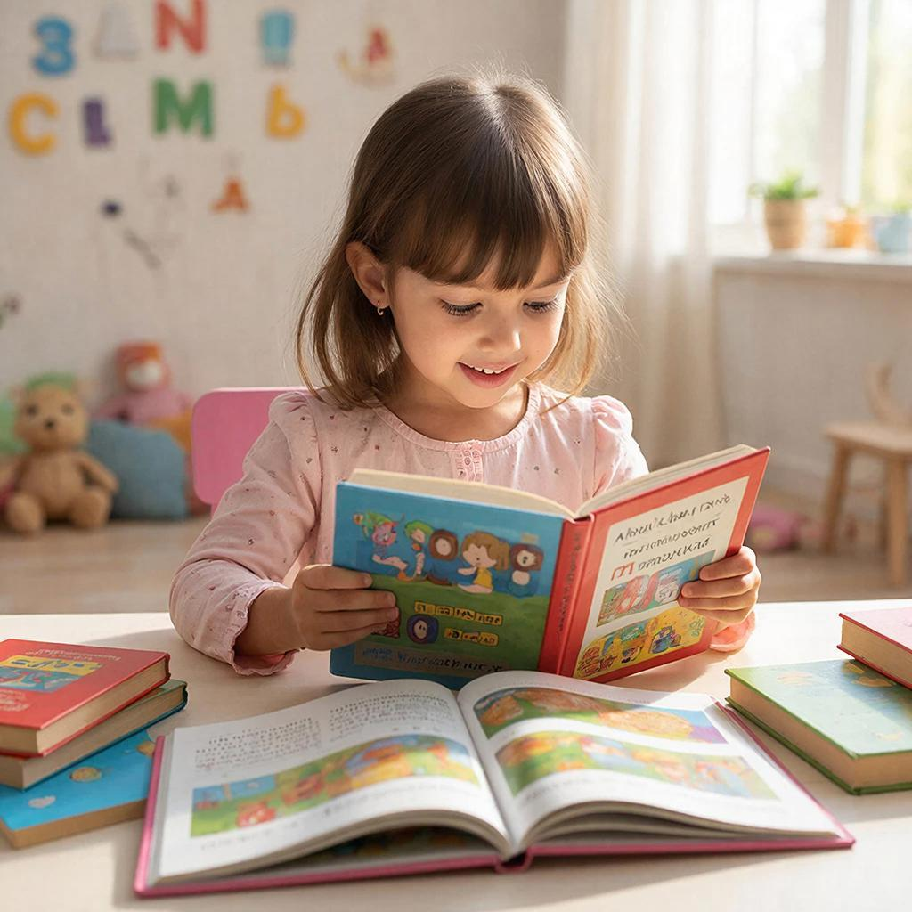

# [Навыки](../../../7.2 Media, leisure and hobbies /useful_and_interesting_leisure/articles/computer_games_with_benefit.md) эффективного чтения: как читать быстрее и понимать лучше



Чтение — это суперсила. Тот, кто умеет читать эффективно, получает доступ ко всем знаниям мира. Но важно не просто «прочитать», а **понять** и **[запомнить](../../how_to_memorize/articles/zapominanie.md)**. Давайте разберёмся, как читать быстрее, понимать глубже и [запоминать](../../how_to_memorize/articles/zapominanie.md) надолго.

---

## Что такое эффективное чтение?

**Эффективное чтение** — это способность быстро извлекать информацию из текста, понимать её и запоминать главное.

Это не только **[скорость](../../../1.2_natural_sciences/physics_in_everyday_life/Q11402.md)** (хотя и она тоже). Это:
- 📖 [Понимание](../../../2.1_society/cause_and_effect_relationships/articles/empathy_causality.md) смысла
- 🎯 Выделение главного
- 💡 [Связь](../../../1.2_natural_sciences/physics_in_everyday_life/Q12969754.md) с уже известным
- 📝 Фиксация ключевых идей
- 🔄 Возвращение к важному

---

## Почему это важно?

**[Факты](../../../1.2_natural_sciences/physics_in_everyday_life/Q17737.md):**
- 80% информации в школе даётся через текст
- Ученик, который читает 20 минут в день, за год прочитывает на **1.8 миллиона слов** больше, чем тот, кто читает 1 минуту
- Люди, которые читают для удовольствия, имеют более высокие [оценки](../../../3.1. healthy lifestyle/Sleep, nutrition, and adolescent energy/articles/sleep_and_memory_grades.md) по всем предметам

**Эффективное чтение = [успех в учёбе](learning_goals.md)**

---

## [Виды](../../../3.1_healthy_lifestyle/pervaya_pomoshch/ushibi_porezy_ozhogi/08_porezy_sadiny_vidy.md) чтения

### 1. Ознакомительное чтение

**[Цель](../../../1.2_natural_sciences/why_science_help_understand_world/research_work.md):** Понять общую идею

**Как:**
- Быстро пролистать текст
- Прочитать [заголовок](../../../5.1_technology_and_digital_literacy/how_internet_works/articles/http_https/http_https.md), подзаголовки
- Посмотреть на картинки, графики
- Прочитать первый и последний абзац

**Когда:** Перед началом изучения темы, чтобы понять, о чём текст

**Скорость:** 800-1000 слов в минуту

---

### 2. Поисковое чтение (сканирование)

**Цель:** Найти конкретную информацию

**Как:**
- Двигать глазами по тексту зигзагом
- Искать ключевые слова, цифры, имена
- Пропускать всё лишнее

**Когда:** Когда ищете [ответ](../../../5.1_technology_and_digital_literacy/how_internet_works/articles/http_https/http_https.md) на конкретный вопрос

**Пример:** Найти дату битвы в учебнике истории

**Скорость:** 1000-1500 слов в минуту

---

### 3. Изучающее чтение

**Цель:** Полностью понять [материал](../../../1.2_natural_sciences/physics_in_everyday_life/Q25358.md)

**Как:**
- Читать медленно, вдумчиво
- Делать пометки на полях
- Задавать [вопросы](curiosity.md) тексту
- Перечитывать сложные места

**Когда:** При изучении новой темы, подготовке к контрольной

**Скорость:** 200-400 слов в минуту

---

### 4. Аналитическое чтение

**Цель:** Критически оценить текст

**Как:**
- Сравнивать с другими источниками
- Искать аргументы и контраргументы
- Оценивать [достоверность](../../../5.1_technology_and_digital_literacy/information and media literacy/надежные_и_ненадежные_источники.md)
- Делать [выводы](../../../1.2_natural_sciences/why_science_help_understand_world/research_work.md)

**Когда:** При написании эссе, исследовательской [работы](../../../8.2_future/choosing_a_career_path/articles/interview.md)

**Скорость:** 100-200 слов в минуту

---

## [Техники](../../../8.2_future_and_path_choice/articles/03_stress_management.md) скорочтения

### [Техника](../../../1.2_natural_sciences/physics_in_everyday_life/Q133673.md) 1: Устранение субвокализации

**Субвокализация** — это проговаривание текста про себя. Мы все это делаем, но это замедляет чтение!

**Как уменьшить:**
- Слушайте инструментальную музыку во [время](../../../1.2_natural_sciences/physics_in_everyday_life/Q20702.md) чтения
- Отбивайте [ритм](../../../1.2_natural_sciences/neurobiology_for_teens/articles/18_music_chills.md) пальцем (1-2-1-2)
- Осознайте, что понимаете текст без проговаривания

**[Результат](../../../1.2_natural_sciences/why_science_help_understand_world/experimental_science.md):** +30-50% к скорости

---

### Техника 2: Расширение поля зрения

Обычно мы видим 1-2 слова за раз. Можно видеть целую фразу!

**Упражнение:**
```
Обычно:    [Мы] [читаем] [по] [одному] [слову]
Лучше:     [Мы читаем] [по одному] [слову]
Ещё лучше: [Мы читаем по] [одному слову]
Идеал:     [Мы читаем по одному слову] ← вся строка
```

**Тренировка:**
- Используйте таблицы Шульте
- Смотрите в центр строки, периферийным зрением захватывая края
- Практикуйтесь 5 минут в день

---

### Техника 3: Устранение регрессии

**Регрессия** — возвращение глазами к уже прочитанному.

**Почему делаем:** Боимся упустить важное

**Как уменьшить:**
- Доверяйте своему мозгу (он [запомнил](../../how_to_memorize/articles/zapominanie.md)!)
- Используйте указку (палец, ручку) для ведения [глаз](../../../1.2_natural_sciences/physics_in_everyday_life/Q467980.md)
- Если действительно не поняли — вернитесь, но осознанно

**Результат:** +20-40% к скорости

---

### Техника 4: Чтение по диагонали

Для ознакомительного чтения:

```
Начало ↘
        ↘
          ↘
            ↘ Конец
```

**Как:**
- Начинайте с верхнего левого угла
- Двигайтесь к нижнему правому
- Выхватывайте ключевые слова

---

## Как понимать прочитанное?

### До чтения:

1. **Посмотрите на структуру:**
   - Заголовок (о чём?)
   - Подзаголовки (какие аспекты?)
   - Выделения (жирный, курсив — важно!)
   - Картинки и схемы

2. **Задайте вопросы:**
   - Что я уже знаю об этом?
   - Что [хочу](../../../6.1_Independent_living_and_daily_living_skills/reasonable_spending/articles/want.md) узнать?
   - Зачем мне это читать?

---

### Во время чтения:

1. **Выделяйте главное:**
   - Подчёркивайте ключевые мысли
   - Делайте пометки на полях (?!, →, ★)
   - Используйте стикеры-закладки

2. **Задавайте вопросы тексту:**
   - «Почему это так?»
   - «Как это связано с...?»
   - «Что [автор](../../../4.2_thinking_and_working_information/how_to_search_information/articles/copypaste.md) имеет в виду?»

3. **Визуализируйте:**
   - Представляйте описанное
   - Рисуйте схемы в уме
   - Связывайте с известными образами

---

### После чтения:

1. **Перескажите своими словами:**
   - Вслух или письменно
   - Как если бы объясняли другу
   - 2-3 предложения — главная идея

2. **Составьте [план](../../../7.2 Media, leisure and hobbies/Computer games/articles/genres_and_worlds/strategy.md):**
   - Основные разделы
   - Ключевые тезисы
   - Важные детали

3. **Свяжите с известным:**
   - «Это похоже на...»
   - «Раньше я думал..., а теперь...»
   - «Это объясняет, почему...»

---

## Конспектирование при чтении

### [Метод](../../../5.1_technology_and_digital_literacy/how_internet_works/articles/http_https/http_https.md) Cornell:

Разделите лист на 3 части:

```
┌─────────────────────────────────────┐
│  Вопросы / Ключевые слова           │ ← Правая узкая колонка
├─────────────────────────────────────┤
│                                     │
│  Основной конспект                  │ ← Большая левая часть
│                                     │
│  (факты, идеи, примеры)             │
│                                     │
├─────────────────────────────────────┤
│  Краткое резюме (2-3 предложения)   │ ← Нижняя строка
└─────────────────────────────────────┘
```

**Как использовать:**
1. Справа: ключевые слова, вопросы
2. Слева: основной [конспект](../../how_to_memorize/articles/konspektirovanie.md) во время чтения
3. Внизу: [резюме](../../../8.2_future/choosing_a_career_path/articles/resume.md) после чтения

---

### Интеллект-карта (Mind Map):

В центре — тема текста. Ветви — основные [идеи](../../../7.2 Media, leisure and hobbies /useful_and_interesting_leisure/articles/free_leisure_activities.md).

```
              ┌─ Подтема 1
         ┌────┴─ Подтема 2
    ┌────┤      └─ Подтема 3
ТЕМА ─┤
    └────┬─ Подтема 4
         └────┬─ Подтема 5
              └─ Подтема 6
```

**Плюсы:** Визуально, видно связи, легко запоминать

---

## Чтение разных типов текстов

### Художественная литература:

**На что обращать [внимание](../../../1.2_natural_sciences/neurobiology_for_teens/articles/16_love_chemistry.md):**
- Герои (кто, [характер](../../../1.2_natural_sciences/neurobiology_for_teens/articles/06_phineas_gage.md), мотивы)
- Сеттинг (где, когда)
- [Сюжет](../../../7.2 Media, leisure and hobbies/Computer games/articles/dream_team/screenwriter.md) ([что происходит](../../../5.1_technology_and_digital_literacy/how_internet_works/articles/web_basics/what_happens.md))
- Тема (о чём книга на самом деле)
- [Стиль](../../../7.1_art/modern_technological_art/articles/5.5_yandex_neural.md) (как написано)

**Вопросы:**
- Почему герой поступил так?
- Что автор хочет сказать?
- Как это связано с реальной жизнью?

---

### Учебная литература:

**На что обращать внимание:**
- Определения (выделены)
- Формулы и [правила](../../../2.1_society/cause_and_effect_relationships/articles/why_rules_work.md)
- Примеры применения
- Итоги главы

**Вопросы:**
- Как это применить на практике?
- Что будет, если...?
- Как это связано с предыдущей темой?

---

### Научно-популярные тексты:

**На что обращать внимание:**
- [Тезис](../../../4.2_thinking_and_working_information/critical_thinking/articles/logical_errors_and_sophisms.md) (главная мысль)
- Аргументы (почему это так)
- [Доказательства](../../../4.2_thinking_and_working_information/critical_thinking/articles/fact_and_opinion_differences.md) (факты, исследования)
- Выводы

**Вопросы:**
- Насколько достоверны [источники](../../../4.2_thinking_and_working_information/how_to_search_information/articles/three_whales.md)?
- Есть ли альтернативные точки зрения?
- Что это значит для меня?

---

## Частые [ошибки](../../../3.1_healthy_lifestyle/pervaya_pomoshch/ushibi_porezy_ozhogi/07_ushib_chego_nelzya.md)

| [Ошибка](../../../5.1_technology_and_digital_literacy/how_internet_works/articles/http_https/http_https.md) | Почему это плохо | Как исправить |
|--------|------------------|---------------|
| **Пассивное чтение** | Просто «глазами по тексту» | Задавайте вопросы, делайте пометки |
| **Чтение без [цели](../../../3.1_healthy_lifestyle/pervaya_pomoshch/ushibi_porezy_ozhogi/02_celi_pervoy_pomoshchi.md)** | Непонятно, зачем читаете | Определите цель перед чтением |
| **Выделение всего подряд** | Невозможно найти главное | Выделяйте только ключевые идеи |
| **Отсутствие перерывов** | Падает [концентрация](../../../1.2_natural_sciences/physics_in_everyday_life/Q506710.md) | 25 минут чтение + 5 минут [отдых](../../../3.1. healthy lifestyle/Sleep, nutrition, and adolescent energy/articles/evening_rituals_sleep_fast.md) |
| **Чтение с телефоном** | Постоянные отвлечения | Уберите телефон в другую комнату |

---

## Связь с другими понятиями

Эффективное чтение связано с:
- [Конспектированием](./konspektirovanie.md) — фиксация прочитанного
- [Вниманием](./vnimanie.md) — концентрация на тексте
- [Памятью](./pamyat.md) — [запоминание](../../../1.2_natural_sciences/neurobiology_for_teens/articles/21_how_memory_works.md) прочитанного
- [Критическим мышлением](../4.2/critical_thinking/articles/main_cognitive_distortions.md) — [анализ](../../../1.2_natural_sciences/why_science_help_understand_world/research.md) текста

---

## Практические упражнения

### Упражнение 1: «15 минут в день»

Каждый день читайте 15 минут:
- Не учебники, а для удовольствия
- То, что интересно именно вам
- Без телефона и отвлечений

Через месяц заметите: читаете быстрее и с большим удовольствием.

---

### Упражнение 2: «Вопросы к тексту»

Перед чтением главы запишите 3-5 вопросов:
- Что я хочу узнать?
- На какие вопросы должен ответить текст?

После чтения проверьте: ответили ли на вопросы?

---

### Упражнение 3: «[Пересказ](../../../1.2_natural_sciences/neurobiology_for_teens/articles/28_false_memories.md) за 1 минуту»

Прочитайте статью или главу. Поставьте таймер на 1 минуту. Перескажите главное вслух (как будто объясняете другу).

---

### Упражнение 4: «Таблица Шульте»

Найдите в интернете таблицы Шульте (квадрат 5×5 с числами от 1 до 25 вразброс). Смотрите в центр и находите числа по порядку от 1 до 25.

**Цель:** Расширить [поле](../../../5.2_cybersecurity/cpp_fundamentals/13_struct.md) зрения, уменьшить регрессию.

---

## Интересные факты

1. **Рекорд скорочтения:** 25 000 слов в минуту! (обычный [человек](../../../1.2_natural_sciences/physics_in_everyday_life/Q45003.md) — 200-300 слов). Но понимание при этом страдает.

2. **[Альберт Эйнштейн](../../../1.2_natural_sciences/physics_in_everyday_life/Q83213.md)** читал по 2-3 [книги](../../../7.2 Media, leisure and hobbies /useful_and_interesting_leisure/articles/reading_and_self_education.md) в неделю. Он говорил: «Чтение — это путешествие в мир знаний без выхода из комнаты».

3. [Исследование](../../../1.2_natural_sciences/neurobiology_for_teens/articles/19_curiosity.md) **Yale University**: люди, которые читают книги 3.5 часа в неделю, живут в среднем на **2 года дольше**.

4. **[Наполеон Бонапарт](../../../2.2_society/history/articles/Patriotic_War.md)** читал со скоростью 2000 слов в минуту и мог одновременно диктовать письма секретарю.

5. [Мозг](../../../3.1. healthy lifestyle/Sleep, nutrition, and adolescent energy/articles/breakfast_for_the_brain.md) обрабатывает письменную информацию в **6 раз быстрее**, чем устную.

---

## См. также

- [Конспектирование](./konspektirovanie.md)
- [Внимание](./vnimanie.md)
- [Память](./pamyat.md)
- [Навыки письма](note_taking.md)
- [Критическое мышление](../4.2/critical_thinking/articles/main_cognitive_distortions.md)

---

Помните: чтение — это не гонка. Скорость важна, но **понимание** важнее. Читайте с удовольствием, задавайте вопросы, делайте пометки — и книги откроют вам весь мир!

**Ваш челлендж:** Прочитайте сегодня 20 страниц книги (не учебника!) с применением техник из этой статьи. Запишите 3 главные идеи.

---
Авторы: Лизунов Кирилл;  
[Ресурсы](../../../2.1_society/cause_and_effect_relationships/articles/ecological_footprint.md): [LLM](../../../7.1_art/modern_technological_art/README.md) - GigaChat, Wikidata Q7962
