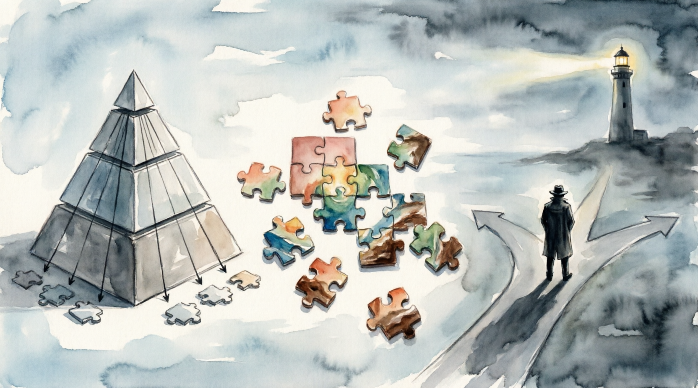

# Логические [выводы](../../../1.2_natural_sciences/why_science_help_understand_world/research_work.md): дедукция, [индукция](../../../1.2_natural_sciences/physics_in_everyday_life/Q988780.md) и [основы](../../../3.1_healthy_lifestyle/pervaya_pomoshch/ushibi_porezy_ozhogi/01_chto_takoe_pervaya_pomoshch.md) рационального познания

Логический [вывод](../../../1.2_natural_sciences/why_science_help_understand_world/scientific_method.md) (инференция) является центральным механизмом критического мышления. Это [процесс](../../../5.1_technology_and_digital_literacy/operating system/articles/process.md), с помощью которого человеческий разум связывает имеющиеся [данные](../../../2.1_society/cause_and_effect_relationships/articles/ai_causality.md) (посылки) для получения новых утверждений (заключений). Умение различать типы этих связей позволяет не только эффективно анализировать информацию, но и выявлять [манипуляции](manipulation_recognition.md) в аргументации оппонентов. В логике выделяют три основных метода вывода: дедукцию, индукцию и абдукцию.

---

## Дедуктивное умозаключение: [Движение](../../../1.2_natural_sciences/why_science_help_understand_world/physical_science.md) от общего к частному

Дедукция (от лат. *deductio* — «выведение») — это [метод](../../../5.1_technology_and_digital_literacy/how_internet_works/articles/http_https/http_https.md) мышления, при котором логический [вывод](../../../1.2_natural_sciences/why_science_help_understand_world/scientific_method.md) следует из общих законов или общепринятых истин к конкретному случаю. Дедукция является фундаментом математики и классической формальной логики, заложенной еще Аристотелем.

### Валидность и Обоснованность
В дедукции критически важно различать два понятия:
1. **Валидность (правильность)**: Если [структура](../../../4.1_rules_of_study/how_to_learn_effectively/articles/note_taking.md) аргумента верна, то вывод логически вытекает из посылок.
2. **Обоснованность ([истинность](fact_and_opinion_differences.md))**: [Аргумент](../../../5.1_technology_and_digital_literacy/information and media literacy/критическое_мышление_в_онлайн_среде.md) считается обоснованным только тогда, когда он валиден И все его посылки фактически истинны.

**Пример не обоснованного, но валидного аргумента:**
*   Все инопланетяне знают физику. (Ложная [посылка](logical_errors_and_sophisms.md))
*   Мой сосед — инопланетянин. (Ложная [посылка](logical_errors_and_sophisms.md))
*   Следовательно, мой сосед знает физику. (Логически вывод верен, но [результат](../../../1.2_natural_sciences/why_science_help_understand_world/experimental_science.md) ложен).

### Основные формы дедукции
*   **Категорический силлогизм**: Классическая [форма](../../../7.1_art/modern_technological_art/articles/4.5_algorithmic_craft.md) «Все А есть Б; Х есть А; значит Х есть Б».
*   **Условное умозаключение (Modus Ponens)**: «Если идет [дождь](../../../3.2 healthy lifestyle/how to act in a dangerous situation/articles/thunderstorm-safety.md), то [земля](../../../1.2_natural_sciences/why_science_help_understand_world/earth_sciences.md) мокрая. Дождь идет. Значит, [земля](../../../1.2_natural_sciences/physics_in_everyday_life/Q11423.md) мокрая».
*   **Разделительное умозаключение**: «Этот [человек](../../../1.2_natural_sciences/why_science_help_understand_world/life_sciences.md) либо преступник, либо свидетель. Он не свидетель. Значит, он преступник».

---

## Индуктивное умозаключение: [Поиск](../../../3.2 healthy lifestyle/how to act in a dangerous situation/articles/lost-in-city.md) закономерностей

Индукция (от лат. *inductio* — «наведение») — это процесс перехода от частных наблюдений к общим правилам. В отличие от дедукции, индукция расширяет наше [знание](../../../1.2_natural_sciences/why_science_help_understand_world/science.md), предлагая новые гипотезы, но она всегда несет в себе [риск](../../../8.1_entertainment/articles/gambling-and-harm.md) [ошибки](../../../3.1_healthy_lifestyle/pervaya_pomoshch/ushibi_porezy_ozhogi/07_ushib_chego_nelzya.md).

### Проблема индукции и «Черный лебедь»
Философ Дэвид Юм подчеркивал, что индукция не дает стопроцентной гарантии. Классический пример: «Все лебеди, которых мы видели в Европе — белые. Значит, все лебеди белые». Это утверждение считалось истинным до открытия Австралии, где были обнаружены черные лебеди. 

### [Виды](../../../3.1_healthy_lifestyle/pervaya_pomoshch/ushibi_porezy_ozhogi/08_porezy_sadiny_vidy.md) индукции в критическом мышлении
1. **Индуктивное обобщение**: На основе выборки делается вывод о всей популяции (основа социологии и маркетинга).
2. **Статистический силлогизм**: Переход от общей [статистики](data_and_statistics.md) к частному случаю («90% студентов этой группы сдали зачет; Иван — [студент](../../../8.2_future/choosing_a_career_path/articles/university.md) этой группы; вероятно, он сдал зачет»).
3. **[Аналогия](../../../1.2_natural_sciences/physics_in_everyday_life/Q46344.md)**: [Сравнение](../../../5.2_cybersecurity/cpp_fundamentals/5_operators.md) двух объектов. Если они похожи в свойствах А и Б, вероятно, они похожи и в свойстве В.

---

## Абдукция: Вывод к лучшему объяснению

Для полноты картины необходимо рассмотреть абдукцию. Это метод, который часто путают с дедукцией (особенно в литературе про Шерлока Холмса). Абдукция — это поиск наиболее вероятной причины для наблюдаемого факта.

*   **[Факт](../../../1.2_natural_sciences/why_science_help_understand_world/science.md)**: Трава во дворе мокрая.
*   **[Гипотеза](../../../1.2_natural_sciences/why_science_help_understand_world/scientific_method.md) 1**: Прошел дождь.
*   **[Гипотеза](../../../1.2_natural_sciences/physics_in_everyday_life/Q17737.md) 2**: Кто-то включил поливалку.
*   **Абдукция**: Если на небе тучи и асфальт за забором тоже мокрый, мы выбираем гипотезу №1 как лучшее [объяснение](../../../4.1_rules_of_study/how_to_learn_effectively/articles/teaching_others.md).

---

## Сравнительная таблица методов

| Критерий | Дедукция | Индукция | Абдукция |
| :--- | :--- | :--- | :--- |
| **[Цель](../../../1.2_natural_sciences/why_science_help_understand_world/research_work.md)** | [Доказательство](../../../1.2_natural_sciences/why_science_help_understand_world/scientific_method.md) | [Прогноз](../../../2.1_society/cause_and_effect_relationships/articles/future_planning.md) / Обобщение | Объяснение факта |
| **[Характер](../../../1.2_natural_sciences/neurobiology_for_teens/articles/06_phineas_gage.md) вывода** | Необходимый (гарантированный) | Вероятностный | Предположительный |
| **[Источник](../../../5.1_technology_and_digital_literacy/information and media literacy/дезинформация_и_фейки.md) знаний** | [Анализ](../../../1.2_natural_sciences/why_science_help_understand_world/research.md) уже известных правил | [Опыт](../../../1.2_natural_sciences/why_science_help_understand_world/experimental_science.md) и наблюдения | Поиск причинно-следственной связи |
| **Где применяется** | Юриспруденция, [математика](../../../1.2_natural_sciences/physics_in_everyday_life/Q140028.md) | [Научные исследования](../../../1.2_natural_sciences/physics_in_everyday_life/Q186161.md), [быт](../../../1.2_natural_sciences/physics_in_everyday_life/Q159190.md) | Диагностика, детективный поиск |

---

## [Практическое применение](../../../1.2_natural_sciences/physics_in_everyday_life/Q11465.md) в анализе информации

Критически мыслящий субъект использует эти [методы](../../../4.1_rules_of_study/how_to_learn_effectively/articles/note_taking.md) как [инструменты](../../../1.2_natural_sciences/physics_in_everyday_life/Q36253.md) фильтрации «информационного шума»:
1.  **[Проверка](../../../1.2_natural_sciences/why_science_help_understand_world/scientific_method.md) дедукции**: Не содержит ли [аргумент](../../../5.1_technology_and_digital_literacy/information and media literacy/критическое_мышление_в_онлайн_среде.md) скрытых ложных посылок? Правильно ли выстроена цепочка «Если... то...»?
2.  **[Оценка](../../../4.1_rules_of_study/how_to_learn_effectively/articles/self_reflection.md) индукции**: Достаточно ли велика [выборка](data_and_statistics.md)? Не является ли пример исключением из правил? Нет ли здесь «[ошибки выжившего](main_cognitive_distortions.md)»?
3.  **Применение [бритвы Оккама](logical_errors_and_sophisms.md) к абдукции**: Из нескольких объяснений одного факта самое простое и логичное обычно является верным.

[Понимание](../../../2.1_society/cause_and_effect_relationships/articles/empathy_causality.md) механизмов логического вывода — это [защита](../../../5.1_technology_and_digital_literacy/information and media literacy/пароли_и_двухфакторная_защита.md) от когнитивных искажений и манипулятивных техник, основанных на подмене логики эмоциями или ложными обобщениями.

---
Авторы: Дмитрий Колесник, @Frizgy;  
*[Ресурсы](../../../2.1_society/cause_and_effect_relationships/articles/ecological_footprint.md): [LLM](../../../7.1_art/modern_technological_art/README.md) - [ChatGPT](../../../7.1_art/modern_technological_art/articles/6.1_prompt_art.md) (OpenAI)*
