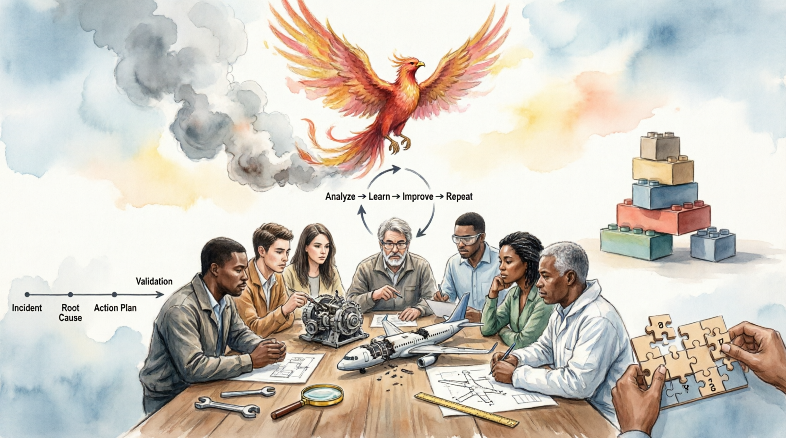

# [Рефлексия](reflection_and_post_mortem.md) и [Post-mortem](reflection_and_post_mortem.md): [Культура](../../../2.1_society/cause_and_effect_relationships/articles/why_rules_work.md) обучения на ошибках

В высокотехнологичных компаниях (Google, Netflix, [NASA](../../../7.1_art/modern_technological_art/articles/5.3_refik_anadol.md)) [процесс](../../../5.1_technology_and_digital_literacy/operating system/articles/process.md) **[Post-mortem](reflection_and_post_mortem.md)** (дословно «посмертный [анализ](../../../1.2_natural_sciences/why_science_help_understand_world/research.md)») является обязательным этапом после любого значимого инцидента или завершения проекта. Основная [цель](../../../1.2_natural_sciences/why_science_help_understand_world/research_work.md) — не [поиск](../../../3.2 healthy lifestyle/how to act in a dangerous situation/articles/lost-in-city.md) виноватых, а [поиск системных уязвимостей](structuring_the_problem.md), которые допустили возникновение [ошибки](../../../3.1_healthy_lifestyle/pervaya_pomoshch/ushibi_porezy_ozhogi/07_ushib_chego_nelzya.md).

---

## 1. [Психология](../../../2.1_society/cause_and_effect_relationships/articles/empathy_causality.md) рефлексии: [Blameless Culture](reflection_and_post_mortem.md)

Первое и самое важное [условие](../../../5.2_cybersecurity/cpp_fundamentals/6_control_flow.md) эффективной рефлексии — **[отказ](../../../2.1_society/how_and_where_find_friends/articles/otkaz_ne_konets.md) от поиска виновных (Blameless Post-mortem)**.

> [!IMPORTANT]
> Если в ходе анализа [фокус](../../../1.2_natural_sciences/physics_in_everyday_life/Q35197.md) смещается на «кто виноват», люди начинают скрывать [факты](../../../1.2_natural_sciences/physics_in_everyday_life/Q17737.md), чтобы защитить себя. Если фокус на «почему система это допустила», [команда](../../../4.1_rules_of_study/how_to_learn_effectively/articles/peer_learning.md) работает сообща над укреплением процессов.

### [Когнитивные искажения](main_cognitive_distortions.md), мешающие анализу:

* **Hindsight Bias (Эффект знания задним числом)**: Ощущение, что [событие](../../../2.1_society/cause_and_effect_relationships/articles/causality_base.md) было предсказуемым. «Мы же знали, что так будет!». На самом деле, в момент принятия решения информации было меньше.
* **Self-Serving Bias**: Склонность приписывать успехи себе («я молодец»), а [неудачи](../../../4.1_rules_of_study/how_to_learn_effectively/articles/learning_from_mistakes.md) — внешним факторам («[рынок](../../../2.1_society/cause_and_effect_relationships/articles/economic_chains.md) плохой», «[коллеги](../../../../8.1_self_understanding/articles/social_comparison.md) подвели»).
* **Fundamental Attribution Error**: Мы судим себя по намерениям («я хотел как лучше»), а других — по их действиям («он просто ленивый»).

---

## 2. [Структура](../../../4.1_rules_of_study/how_to_learn_effectively/articles/note_taking.md) качественного Post-mortem

Процесс должен быть формализован. Обычно он состоит из пяти ключевых блоков:

### А. Хронология (Timeline)

Максимально детальное [восстановление](../../../4.1_rules_of_study/how_to_learn_effectively/articles/breaks_and_rest.md) событий с привязкой ко времени.

* *14:00*: Начало деплоя.
* *14:15*: Первые жалобы пользователей.
* *14:20*: Обнаружен критический баг в логике оплаты.
* *14:40*: Система откачена к предыдущей версии.

### Б. [Анализ](../../../1.2_natural_sciences/why_science_help_understand_world/research.md) причин (Analysis)

Здесь мы используем [инструменты](../../../1.2_natural_sciences/physics_in_everyday_life/Q36253.md) из первой статьи ([5 Почему](structuring_the_problem.md), [Диаграмма Исикавы](structuring_the_problem.md)).

* Была ли это техническая [ошибка](../../../5.1_technology_and_digital_literacy/information and media literacy/логические_ошибки_в_медиа.md)?
* Была ли это [ошибка](../../../5.1_technology_and_digital_literacy/how_internet_works/articles/http_https/http_https.md) процесса (например, отсутствие тестов)?
* Была ли это ошибка коммуникации (кто-то не передал важные [данные](../../../2.1_society/cause_and_effect_relationships/articles/ai_causality.md))?

### В. [Оценка](../../../4.1_rules_of_study/how_to_learn_effectively/articles/self_reflection.md) последствий (Impact)

Масштаб ущерба в конкретных метриках:

* Потерянная выручка.
* [Время](../../../1.2_natural_sciences/physics_in_everyday_life/Q20702.md) простоя (Downtime).
* Количество пострадавших пользователей.
* Репутационный [риск](../../../8.1_entertainment/articles/gambling-and-harm.md).

### Г. Уроки (Lessons Learned)

Что мы узнали о нашей системе, чего не знали раньше? Например: «Наша система мониторинга не видит [ошибки](../../../3.1_healthy_lifestyle/pervaya_pomoshch/ushibi_porezy_ozhogi/07_ushib_chego_nelzya.md) в мобильном приложении, только в веб-версии».

### Д. [План](../../../7.2 Media, leisure and hobbies/Computer games/articles/genres_and_worlds/strategy.md) действий (Action Items)

Это самый важный пункт. Каждый пункт плана должен быть:

1. **Конкретным**: Не «улучшить [качество](../../../6.1_Independent_living_and_daily_living_skills/reasonable_spending/articles/quality.md) кода», а «внедрить обязательное Code Review для модуля оплаты».
2. **Назначенным**: У каждой [задачи](../../../1.2_natural_sciences/why_science_help_understand_world/research_work.md) есть ответственный.
3. **Ограниченным по времени**: [Срок](../../../6.1_Independent_living_and_daily_living_skills/reasonable_spending/articles/financial_goal.md) выполнения.

---

## 3. Модель цикла Колба (Kolb's Learning Cycle)

[Рефлексия](decision_models.md) — это не разовое [событие](../../../2.1_society/cause_and_effect_relationships/articles/causality_base.md), а цикл. Модель Колба описывает, как [опыт](../../../1.2_natural_sciences/why_science_help_understand_world/experimental_science.md) превращается в [знание](../../../1.2_natural_sciences/why_science_help_understand_world/science.md):

1. **Непосредственный [опыт](../../../1.2_natural_sciences/why_science_help_understand_world/experimental_science.md)**: Событие произошло.
2. **[Наблюдение](../../../1.2_natural_sciences/why_science_help_understand_world/patterns.md) и [рефлексия](../../../2.1_society/how_and_where_find_friends/articles/sam_sebe_interesnyi.md)**: Обдумывание произошедшего.
3. **Формирование концепций**: [Вывод](../../../1.2_natural_sciences/why_science_help_understand_world/scientific_method.md) общего [правила](../../../2.1_society/cause_and_effect_relationships/articles/why_rules_work.md) (абстрагирование).
4. **Активное экспериментирование**: Применение нового [правила](../../../2.1_society/cause_and_effect_relationships/articles/why_rules_work.md) в следующем проекте.

---

## 4. Групповая рефлексия: [Ретроспектива](reflection_and_post_mortem.md)

В Agile-командах рефлексия проводится регулярно в формате ретроспектив. Один из простейших, но глубоких методов — **«4L»**:

* **Liked**: Что нам понравилось в этом спринте/проекте?
* **Learned**: Чему мы научились?
* **Lacked**: Чего нам не хватало (ресурсов, времени, знаний)?
* **Longed [For](../../../5.2_cybersecurity/cpp_fundamentals/7_loops.md)**: О чем мы мечтали или чего очень хотели для успеха?

---

## 5. Экранирование «забывания» ошибок

Знания, полученные в ходе Post-mortem, часто теряются в архивах почты. Чтобы этого не происходило:

* Создайте общую базу знаний (Wiki или [Notion](../../how_to_search_information/articles/second_mind.md)).
* Начинайте новые проекты с чтения Post-mortem'ов аналогичных прошлых проектов.
* Сделайте «Failures Wall» — место, где команда открыто гордится тем, какие сложные уроки она извлекла из провалов.

> [!CAUTION]
> Игнорирование этапа рефлексии — это самый дорогой способ ведения дел. Вы платите за ошибку один раз (ресурсами), а потом платите за нее снова и снова, потому что не извлекли [урок](../../../5.1_technology_and_digital_literacy/information and media literacy/шаблон_урока_по_медиаграмотности.md).

---

### Итоговое [резюме](../../../8.2_future/choosing_a_career_path/articles/resume.md) цикла статей

Мы прошли [путь](../../../1.2_natural_sciences/physics_in_everyday_life/Q11476.md) от хаоса к структуре:

1. **Структурирование**: Поняли, где корень беды.
2. **[Модели решений](decision_models.md)**: Нашли оптимальный [выход](../../../3.2 healthy lifestyle/how to act in a dangerous situation/articles/building-evacuation.md).
3. **Рефлексия**: Сделали так, чтобы эта проблема больше никогда не возникла.

---

Авторы: Барменков Артемий, @ArtemDelGray;

*[Ресурсы](../../../2.1_society/cause_and_effect_relationships/articles/ecological_footprint.md): Google SRE Book (Chapter 15: Postmortem Culture), Ray Dalio "Principles", [LLM](../../../7.1_art/modern_technological_art/README.md) - Gemini(Google)*
