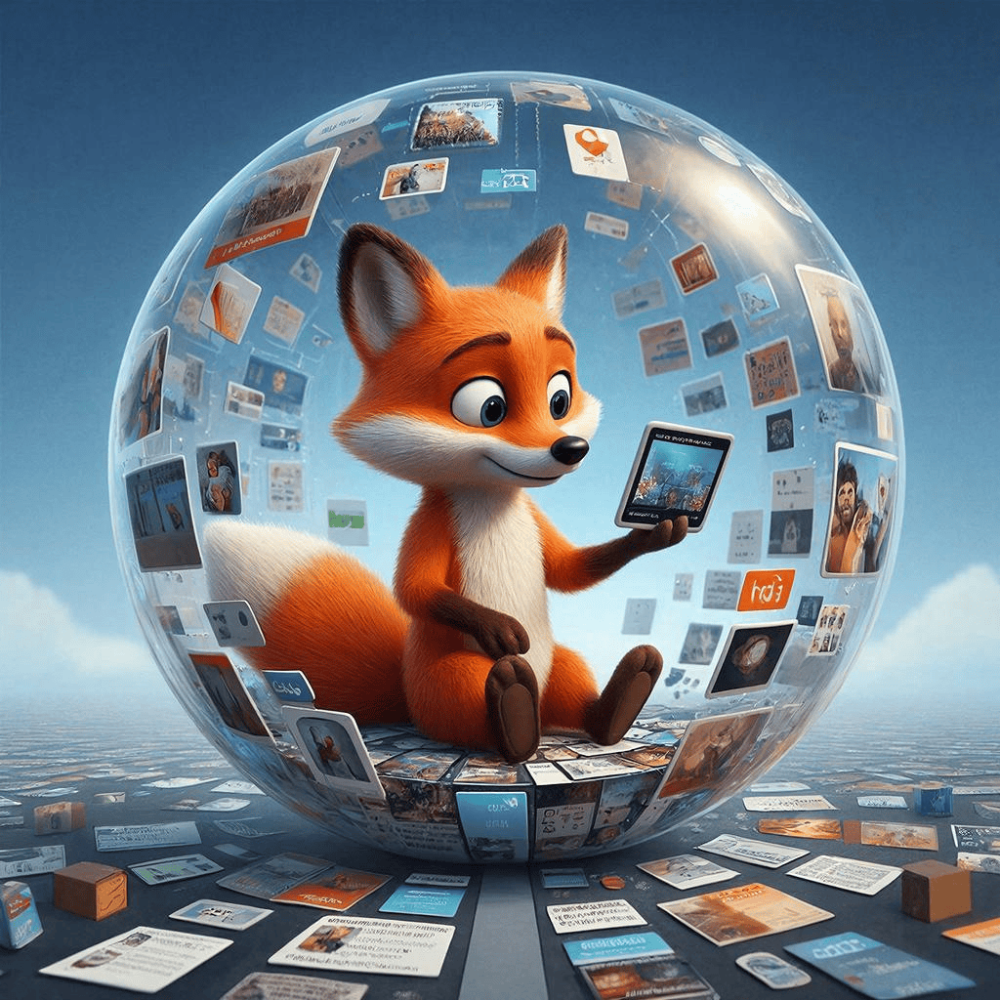

# [Пузырь](../../../5.1_technology_and_digital_literacy/information and media literacy/алгоритмы_и_пузырь_фильтров.md) фильтров 🫧

## Содержание
- [Пузырь фильтров: почему интернет показывает тебе только то, что ты хочешь видеть](#пузырь-фильтров-почему-интернет-показывает-тебе-только-то-что-ты-хочешь-видеть)
- [Как это работает: невидимый сторож твоих интересов ❓](#как-это-работает-невидимый-сторож-твоих-интересов-)
- [Где мы с тобой сталкиваемся с этим каждый день? От школы до ленты](#где-мы-с-тобой-сталкиваемся-с-этим-каждый-день-от-школы-до-ленты)
- [Опасности и плюсы: что может скрываться за стенами? 🚨](#опасности-и-плюсы-что-может-скрываться-за-стенами-)
- [Практический совет: как пробить стену пузыря и не попасть в капкан](#практический-совет-как-пробить-стену-пузыря-и-не-попасть-в-капкан)
- [Заключение 🐱](#заключение-)
- [Что почитать дальше](#что-почитать-дальше)

## Пузырь фильтров: почему [интернет](../../../1.2_natural_sciences/physics_in_everyday_life/Q26540.md) показывает тебе только то, что ты хочешь видеть

Задумывался ли ты, почему твоя [лента](../../../5.1_technology_and_digital_literacy/information and media literacy/алгоритмы_и_пузырь_фильтров.md) в TikTok или Instagram кажется таким идеальным отражением твоих интересов? Почему [поиск](../../../3.2 healthy lifestyle/how to act in a dangerous situation/articles/lost-in-city.md) в Google по какому-то вопросу сначала выдает одни и те же сайты? А почему в разговорах с одноклассниками иногда кажется, что все думают одинаково? Скорее всего, ты уже попал в ловушку, которую специалисты называют 
**[«пузырь фильтров»](../../../5.1_technology_and_digital_literacy/information%20and%20media%20literacy/articles/алгоритмы_и_пузырь_фильтров.md)** (или «фильтровый пузырь»). Это не про [космос](../../../1.2_natural_sciences/physics_in_everyday_life/Q41273.md) или газированную воду. Это про твой [цифровой](../../../7.1_art/musical_instruments/articles/synthesizer.md) мир, который тихо и незаметно подстраивается под тебя, решая, что тебе показывать, а что — скрывать. В этой статье мы разберемся, как это работает, почему это опасно и как не дать себя обмануть. Кстати, инфлюенсеры - блогеры на собственном опыте знают, как работает «пузырь фильтров». Яркий пример — Utopia Show. Этот блогер давно заработал репутацию человека, который не просто пересказывает новости и мистические [факты](../../../1.2_natural_sciences/physics_in_everyday_life/Q17737.md), а скрупулезно перепроверят [данные](../../../2.1_society/cause_and_effect_relationships/articles/ai_causality.md), копается в источниках и учит этому других. В своих разборах он часто показывает, как легко манипулировать толпой и как [алгоритмы](../../../5.1_technology_and_digital_literacy/information%20and%20media%20literacy/articles/алгоритмы_и_пузырь_фильтров.md) соцсетей замыкают людей в информационных коконах. Именно благодаря такой ответственной подаче его аудитория учится смотреть на вещи шире, чем предлагает им умная лента рекомендаций.

## Как это работает: невидимый сторож твоих интересов ❓

Представь, что у тебя есть личный помощник, который следит за каждым твоим кликом, лайком, просмотром, даже за тем, как долго ты смотришь на ту или иную картинку. Он запоминает всё. Ты посмотрел [видео](../../../5.1_technology_and_digital_literacy/information and media literacy/оценка_качества_изображений_и_видео.md) про котов? Отлично, он решит, что ты любишь котов, и начнет сыпать тебе котиковыми роликами. Ты вступил в паблик про хоккей? Теперь в рекомендациях будет больше спортивного контента. Этот помощник — не [человек](../../../1.2_natural_sciences/physics_in_everyday_life/Q45003.md), а **[алгоритм](../../../5.1_technology_and_digital_literacy/information%20and%20media%20literacy/articles/алгоритмы_и_пузырь_фильтров.md)**. [Алгоритм](../../../2.1_society/cause_and_effect_relationships/articles/ai_causality.md) — это сложная [программа](../../../5.1_technology_and_digital_literacy/operating system/articles/process.md), набор правил, который решает, какой [контент](../../../5.1_technology_and_digital_literacy/information and media literacy/информационная_диета.md) показать тебе следующим. Его главная [цель](../../../1.2_natural_sciences/why_science_help_understand_world/research_work.md) (для соцсетей и YouTube) — удержать тебя на платформе как можно дольше, потому что от этого зависит рекламные [доходы](../../../6.2_money_and_finance/personal_budget/index.md). Чем дольше ты листаешь, тем лучше.

Как он строит твой «пузырь»? Он анализирует твои **прошлые [действия](../../../3.1_healthy_lifestyle/pervaya_pomoshch/ushibi_porezy_ozhogi/03_obschie_pravila_algorithm.md)** (что лайкал, с чем взаимодействовал) и сравнивает с миллионами других пользователей. «Ты как человек А, который любит то же, что и человек Б, поэтому тебе, наверное, понравится и это». Со временем алгоритм начинает показывать тебе всё больше контента, который подтверждает твои существующие взгляды и [интересы](../../../2.1_society/cause_and_effect_relationships/articles/conflict_roots.md), и всё меньше — того, что может их оспорить или просто показать что-то новое. Ты даже не замечаешь, как стены твоего информационного мира становятся выше и толще. Это и есть фильтровый пузырь: твой персональный, идеально подобранный информационный мир, отгороженный от всего остального.

## Где мы с тобой сталкиваемся с этим каждый день? От школы до ленты

Этот эффект повсюду в твоей жизни:
1.  **[Соцсети](../../../2.1_society/how_and_where_find_friends/articles/tcifrovaya_druzhba.md) и стриминги:** TikTok, Instagram Reels, YouTube Shorts, «ВКонтакте» новости. Лента становится «закольцованной». Ты видишь похожие мемы, один и тот же [тип](../../../5.2_cybersecurity/cpp_fundamentals/13_struct.md) видео, одни и те же мнения. Если ты поставил [лайк](../../../3.1_healthy lifestyle/vrednye_privychki/articles/Social_media.md) ролику про критику школы, soon твоя лента превратится в [поток](../../../5.1_technology_and_digital_literacy/operating system/articles/thread.md) жалоб на учителей, и ты можешь начать думать, что *все* ненавидят школу, хотя это не так.
2.  **Поисковики:** Загугли «полезные завтраки». Первые 10 результатов будут, скорее всего, про овсянку и смузи, потому что это популярный [запрос](../../../5.1_technology_and_digital_literacy/how_internet_works/articles/http_https/http_https.md). Но что если есть исследования, что для многих людей это не лучший вариант? Они могут быть на 15-й странице, которую ты никогда не откроешь.
3.  **Новостные агрегаторы и [приложения](../../../4.1_rules_of_study/how_to_learn_effectively/articles/digital_tools.md):** Приложение, которое определяет, какие новости тебе показывать, может решить, что тебе интересна только спортивная аналитика или только локальные события твоего города, и скрыть от тебя важные мировые новости или политику.
4.  **Даже в общении:** Если твой круг друзей в мессенджерах или в школе состоит из людей с похожими взглядами, вы будете постоянно обмениваться ссылками и мнениями, которые поддерживают вашу общую позицию. Это создает социальный пузырь, очень похожий на цифровой.

**Пример из жизни подростка:** Представь, что ты увлекаешься видеоиграми. Ты смотришь стримы, читаешь форумы, подписан на блогеров-геймеров. Алгоритм фиксирует это. Через месяц твоя лента в YouTube на 90% состоит из гейминг-контента. Ты перестаешь видеть видео про науку, [искусство](../../../7.2 Media, leisure and hobbies /what_you_can_read_and_watch_to_develop_your_taste/articles/aesthetics_and_taste.md), музыку, которую раньше мог случайно открыть. Ты начинаешь думать, что *все* твои [сверстники](../../../1.2_natural_sciences/neurobiology_for_teens/articles/05_teen_brain.md) играют в одни и те же игры и смотрят одни и те же стримы. На деле, у Маши из параллельного класса [хобби](../../../2.1_society/how_and_where_find_friends/articles/neochevidnye_mesta_dlya_znakomstva.md) — танцы, а у Петра — [программирование](../../../5.2_cybersecurity/cpp_fundamentals/1_introduction.md), но ты этого не узнаешь, потому что твой пузырь их не пускает.

## [Опасности](../../../1.2_natural_sciences/physics_in_everyday_life/Q845744.md) и плюсы: что может скрываться за стенами? 🚨

**Чем это опасно? Это главное!**
*   **Узость мировоззрения:** Ты перестаешь видеть разнообразие мира. Кажется, что твое [мнение](../../critical_thinking/articles/fact_and_opinion_differences.md) — единственно правильное, потому что все вокруг (в твоей ленте) его разделяют. Это ведет к нетерпимости и конфликтам.
*   **Радикализация и [поляризация](../../critical_thinking/articles/information_bubbles.md):** Алгоритм любит крайности. Спокойная, взвешенная статья может быть менее вовлекающей, чем громкий, эмоциональный пост с одной стороны проблемы. Со временем твой пузырь может накачивать тебя все более экстремистскими взглядами по любой теме — от политики до вкусов в музыке.
*   **[Дезинформация](../../critical_thinking/articles/information_verification.md) и фейки:** В пузыре легко распространяются непроверенные слухи и [фейковые новости](../../critical_thinking/articles/information_verification.md), потому что алгоритм видит вовлеченность (люди активно делятся и комментируют) и продвигает их. Ты не встретишь контраргументы или фактчек, чтобы всё проверить.
*   **[Потеря](../../../1.2_natural_sciences/neurobiology_for_teens/articles/20_sadness.md) навыка [критического мышления](../../../5.1_technology_and_digital_literacy/information%20and%20media%20literacy/articles/критическое_мышление_в_онлайн_среде.md):** Зачем думать и искать, если тебе всё подают готовым и удобным? Ты теряешь привычку сомневаться, проверять [источники](three_whales.md), искать разные точки зрения.
*   **[Эхо-камера](../../critical_thinking/articles/information_bubbles.md) (Echo Chamber):** Это точное описание пузыря. Ты кричишь свое мнение, а [эхо](../../../1.2_natural_sciences/physics_in_everyday_life/Q83301.md) возвращается к тебе же, усиливая его. Внешний мир будто не существует.

**А есть ли плюсы?** Да, но они очень условны и работают *только* на короткой дистанции.
*   **[Удобство](../../../6.1_Independent_living_and_daily_living_skills/reasonable_spending/articles/quality.md) и релевантность:** Алгоритм может действительно хорошо угадывать твои вкусы в музыке (как в [Яндекс](../../../7.1_art/modern_technological_art/articles/5.5_yandex_neural.md).Музыке) или в фильмах (как в Netflix). Это экономит [время](../../../1.2_natural_sciences/physics_in_everyday_life/Q20702.md) поиска.
*   **[Поддержка](../../../1.2_natural_sciences/neurobiology_for_teens/articles/17_hugs_oxytocin.md) интересов:** Если ты увлекаешься редким видом спорта или нишевым хобби, алгоритм может помочь найти единомышленников, которых ты бы не нашел сам.

Но ключевое слово — **«если»**. Плюсы работают, пока ты осознаешь, что это просто удобный инструмент, а не [источник](../../../5.1_technology_and_digital_literacy/information and media literacy/дезинформация_и_фейки.md) истины в последней инстанции. Как только ты перестаешь контролировать [процесс](../../../5.1_technology_and_digital_literacy/operating system/articles/process.md), удобство превращается в ловушку.

## Практический совет: как пробить стену пузыря и не попасть в капкан

Первое и самое важное — **признать, что ты в пузыре**. Это нормально! В нем находимся все мы. Алгоритмы так устроены. Но можно и нужно бороться.

**Как распознать, что ты в фильтровом пузыре?**
*   Твоя лента или поисковая [выдача](../../../5.1_technology_and_digital_literacy/information and media literacy/роль_поисковых_систем.md) стали **чрезмерно однородными**. Все видео на одну тему, все мнения совпадают.
*   Ты **редко сталкиваешься с контентом, который бросает вызов твоим взглядам**. Открываешь [новость](../../../5.1_technology_and_digital_literacy/information and media literacy/информационная_диета.md) — и она подтверждает то, что ты уже думал.
*   Ты начинаешь **испытывать раздражение или [гнев](../../critical_thinking/articles/influence_of_emotions.md)** на людей, которые высказывают другое мнение, потому что кажется, что «все нормальные люди» думают как ты.
*   Ты **забыл, что существуют другие [увлечения](../../../2.1_society/how_and_where_find_friends/articles/druzhba_i_hobby.md), профессии, взгляды** на [жизнь](../../../1.2_natural_sciences/physics_in_everyday_life/Q1751973.md), не похожие на твои.
*   Ты **не можешь объяснить обратную точку зрения**, потому что никогда ее не слышал.

**Конкретные [методы](../../../4.1_rules_of_study/how_to_learn_effectively/articles/note_taking.md) проверки (список-шпаргалка):**
1.  **Используй [режим](../../../4.1_rules_of_study/how_to_learn_effectively/articles/breaks_and_rest.md) инкогнито/гостевого доступа** в браузере. В этом режиме не сохраняются [куки](../../../5.1_technology_and_digital_literacy/how_internet_works/articles/http_https/cookies.md) (файлы с твоей историей), и алгоритм не знает, кто ты. Загугли тот же запрос — [результаты](../../../1.2_natural_sciences/why_science_help_understand_world/research_work.md) будут другими, «нейтральными».
2.  **Очищай историю поиска и куки** в настройках браузера и приложений. Это сбрасывает часть «профиля», которое построил алгоритм.
3.  **Следи за разными источниками.** Подпишись в соцсетях на паблики или блогеров, чьи взгляды **категорически отличаются** от твоих. Не для того, чтобы согласиться, а чтобы понять их аргументы. Читай новости не с одного сайта, а хотя бы с двух-трех из разных частей спектра .
4.  **Ищи «неудобные» [вопросы](../../../4.1_rules_of_study/how_to_learn_effectively/articles/curiosity.md).** Если ты прочитал статью, которая тебе понравилась, сразу поищи в Google «[критика](../../../8.1_self-understanding/HowToFindYourStrengths/articles/impostor_syndrome.md) [темы статьи]» или «аргументы против [темы]».
5.  **Проверяй дату и автора.** Фейки часто выдают старые новости, вырванные из контекста, или анонимные источники.
6.  **Включай внутреннего скептика.** Задавай себе вопросы: «Почему именно эту статью мне показали первым?», «Кому выгодно, чтобы я так думал?», «Есть ли другие точки зрения?».

**Как защититься: твой [план](../../../7.2 Media, leisure and hobbies/Computer games/articles/genres_and_worlds/strategy.md) действий до/во время**
*   **ДО** того как листать ленту или искать что-то, **сформулируй цель.** «Я [хочу](../../../6.1_Independent_living_and_daily_living_skills/reasonable_spending/articles/want.md) узнать плюсы и минусы ВИЭ (возобновляемых источников энергии)», а не просто «посмотреть про экологию». Четкий запрос сложнее исказить. Желательно вклбчить режим инкогнито или отключить рекомендации.

*   **ВО ВРЕМЯ** потребления контента:
    *   **Замечай [эмоции](../../../3.1. healthy lifestyle/Sleep, nutrition, and adolescent energy/articles/stress_and_food.md).** Если ролик или статья вызывает сильный гнев, восторг или [страх](../../../1.2_natural_sciences/neurobiology_for_teens/articles/14_amygdala_fear.md), — это красный флаг. Такой контент часто создан для того, чтобы завируситься, а не для правды.
    *   **Смотри на рекомендации справа/снизу.** Что тебе предлагает алгоритм *рядом* с тем, что ты смотришь? Это и есть его «мысли».
    *   **Делай паузу перед репостом/лайком.** Особенно если контент вызывает сильную эмоцию. Это дает время включить [мозг](../../../3.1. healthy lifestyle/Sleep, nutrition, and adolescent energy/articles/breakfast_for_the_brain.md).
*   **ПОСЛЕ** того как что-то прочитал или посмотрел:
    *   **Ищи фактчек.** Если это новость или заявление, вбей ключевые фразы в поиск с добавлением «фактчек» или «правда ли».
    *   **Обсуди с кем-то из другого круга.** Покажи статью другу, который увлекается другим, или даже родителям (они росли в другом информационном [поле](../../../5.2_cybersecurity/cpp_fundamentals/13_struct.md)!). Их [реакция](../../../1.2_natural_sciences/why_science_help_understand_world/chemistry.md) будет ценным противовесом.
    *   **Сам проверь источник.** Кто [автор](copypaste.md)? Какую позицию занимает издание? Какие у него рейтинги достоверности (есть специальные проекты вроде «Медиазоны» или «Проверь.[Мифы](../../../1.2_natural_sciences/physics_in_everyday_life/Q140028.md)», которые оценивают СМИ)?

## [Заключение](../../../1.2_natural_sciences/physics_in_everyday_life/Q2225.md) 🐱

Пузырь фильтров — это не миф, а [реальность](../../../1.2_natural_sciences/physics_in_everyday_life/Q140028.md) нашего цифрового века. Он делает интернет удобным, но превращает его в [зеркало](../../../1.2_natural_sciences/physics_in_everyday_life/Q35197.md), которое показывает только наше [отражение](../../../1.2_natural_sciences/physics_in_everyday_life/Q11388.md). Главная [опасность](../../../3.1_healthy_lifestyle/pervaya_pomoshch/ushibi_porezy_ozhogi/06_ushib_kogda_vrach.md) — в потере связи с реальным, разнообразным миром и в ослаблении [способности](../../../4.1_rules_of_study/how_to_learn_effectively/articles/growth_mindset.md) мыслить критически. Твоя задача — не позволить алгоритму думать за тебя. Будь активным пользователем, а не пассивным потребителем. Выходи из зоны комфорта, ищи противоречия, проверяй, спорь (уважительно!). Интернет — огромная библиотека, а не одна-единственная книга, которую тебе навязали. И помни: самый крутой способ обмануть пузырь — иногда *совсем не заходить в ту соцсеть, где он тебя держит*. Отложи телефон, пойди погуляй, пообщайся с людьми вживую, но помни пузырь, может быть и вне интернета, поэтому не просто общайся, а "расширяйся".

Теперь всегда, следи , чтобы твой кот не сделал за тебя лайк тому, что ты даже не читал.

## Что почитать дальше

- [Социальные сети и интернет](social_networks.md)
- [Информационная гигиена](information_hygiene.md)
- [Цифровой след](digital_footprint.md)
- [Поисковые операторы](search_operations.md)

---
Авторы: Исмаилова Камила (308 группа)
GitHub: @[https](../../../5.1_technology_and_digital_literacy/how_internet_works/articles/http_https/http_https.md)://github.com/Kamusheck
*Использованы: OpenRouter (stepfun/step-3.5-flash:free), Wikidata, DeepSeek*
